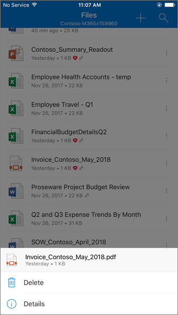

# Datos adjuntos seguros para SharePoint, OneDrive y Microsoft Teams

[!INCLUDE [Microsoft 365 Defender rebranding](../includes/microsoft-defender-for-office.md)]

**Se aplica a**
- [Plan 1 y Plan 2 de Microsoft Defender para Office 365](defender-for-office-365.md)
- [Microsoft 365 Defender](../defender/microsoft-365-defender.md)

Caja fuerte Los datos adjuntos para SharePoint, OneDrive y Microsoft Teams en [Microsoft Defender para Office 365](whats-new-in-defender-for-office-365.md) proporcionan una capa adicional de protección para los archivos que ya han sido examinados asincrónicamente por el motor de detección de virus común en [Microsoft 365](virus-detection-in-spo.md). Caja fuerte Los datos adjuntos SharePoint, OneDrive y Microsoft Teams ayudan a detectar y bloquear archivos existentes que se identifican como malintencionados en sitios de grupo y bibliotecas de documentos.

Caja fuerte Los datos adjuntos SharePoint, OneDrive y Microsoft Teams no están habilitados de forma predeterminada. Para activarlo, vea [Turn on Caja fuerte Attachments for SharePoint, OneDrive y Microsoft Teams](turn-on-mdo-for-spo-odb-and-teams.md).

## Cómo Caja fuerte datos adjuntos para SharePoint, OneDrive y Microsoft Teams funciona

Cuando Caja fuerte datos adjuntos de SharePoint, OneDrive y Microsoft Teams está habilitado e identifica un archivo como malintencionado, el archivo se bloquea mediante la integración directa con los almacenes de archivos. La imagen siguiente muestra un ejemplo de un archivo malintencionado detectado en una biblioteca.

Aunque el archivo bloqueado todavía se muestra en la biblioteca de documentos y en aplicaciones web, móviles o de escritorio, las personas no pueden abrir, copiar, mover o compartir el archivo. Pero pueden eliminar el archivo bloqueado.

Este es un ejemplo de cómo es un archivo bloqueado en un dispositivo móvil:

De forma predeterminada, los usuarios pueden descargar un archivo bloqueado. Este es el aspecto que tiene la descarga de un archivo bloqueado en un dispositivo móvil:

SharePoint Los administradores en línea pueden impedir que los usuarios descarguen archivos malintencionados. Para obtener instrucciones, vea [Use SharePoint Online PowerShell to prevent users from downloading malicious files](turn-on-mdo-for-spo-odb-and-teams.md#step-2-recommended-use-sharepoint-online-powershell-to-prevent-users-from-downloading-malicious-files).

Para obtener más información acerca de la experiencia del usuario cuando se ha detectado un archivo como malintencionado, vea What [to do when a malicious file is found in SharePoint Online, OneDrive, or Microsoft Teams](https://support.microsoft.com/office/01e902ad-a903-4e0f-b093-1e1ac0c37ad2).

## Ver información sobre archivos malintencionados detectados por Caja fuerte datos adjuntos para SharePoint, OneDrive y Microsoft Teams

Los archivos identificados como malintencionados por Caja fuerte Attachments for SharePoint, OneDrive y Microsoft Teams aparecerán en informes de [Microsoft Defender](view-reports-for-mdo.md) para Office 365 y en el Explorador (y detecciones en tiempo [real).](threat-explorer.md)

A partir de mayo de 2018, cuando un archivo se identifica como malintencionado por los datos adjuntos de Caja fuerte para SharePoint, OneDrive y Microsoft Teams, el archivo también está disponible en cuarentena. Para obtener más información, vea [Manage quarantined files in Defender for Office 365](manage-quarantined-messages-and-files.md#use-the-microsoft-365-defender-portal-to-manage-quarantined-files-in-defender-for-office-365).

## Tenga en cuenta estos puntos

- Defender for Office 365 no examinará todos los archivos de SharePoint Online, OneDrive para la Empresa o Microsoft Teams. Esto es así por motivos de diseño. Los archivos se examinan de forma asincrónica. El proceso usa eventos de actividad de invitado y uso compartido junto con heurística inteligente y señales de amenaza para identificar archivos malintencionados.

- Asegúrese de que los SharePoint están configurados para usar la [experiencia moderna](/sharepoint/guide-to-sharepoint-modern-experience). Defender para Office 365 se aplica si se usa la experiencia moderna o la vista clásica; sin embargo, los indicadores visuales de que un archivo está bloqueado solo están disponibles en la experiencia moderna.

- Caja fuerte Los datos adjuntos de SharePoint, OneDrive y Microsoft Teams forman parte de la estrategia general de protección contra amenazas de su organización, que incluye protección contra correo no deseado y antimalware en Exchange Online Protection (EOP), así como vínculos de Caja fuerte y datos adjuntos de Caja fuerte en Microsoft Defender para Office 365. Para obtener más información, vea [Proteger contra amenazas en Office 365](protect-against-threats.md).
