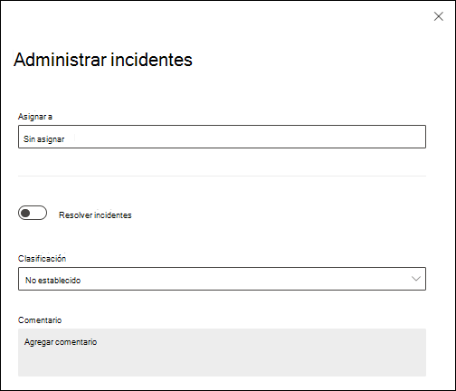

# Administrar incidentes y alertas desde Microsoft Defender para Office 365 en Microsoft 365 Defender

Un [incidente](/microsoft-365/security/defender/incidents-overview) en Microsoft 365 Defender es una colección de alertas correlacionadas y datos asociados que definen la historia completa de un ataque. Defender para Office 365 [alertas](/microsoft-365/compliance/alert-policies#default-alert-policies), [investigación y respuesta automatizadas (AIR)](office-365-air.md#the-overall-flow-of-air) y el resultado de las investigaciones se integran y correlacionan de forma nativa en la página **Incidentes** de Microsoft 365 Defender en <https://security.microsoft.com/incidents-queue>. Nos referiremos a esta página como la _cola incidentes_.

Las alertas se crean cuando una actividad malintencionada o sospechosa afecta a una entidad (por ejemplo, correo electrónico, usuarios o buzones). Las alertas proporcionan información valiosa sobre los ataques en curso o completados. Sin embargo, un ataque en curso puede afectar a varias entidades, lo que da lugar a varias alertas de orígenes diferentes. Algunas alertas integradas desencadenarán automáticamente cuadernos de estrategias de AIR. Estos cuadernos de estrategias realizan una serie de pasos de investigación para buscar otras entidades afectadas o actividades sospechosas.

Defender para Office 365 alertas, investigaciones y sus datos se correlacionan automáticamente. Cuando se determina una relación, el sistema crea un incidente para proporcionar a los equipos de seguridad visibilidad de todo el ataque.

Se recomienda encarecidamente que los equipos de SecOps administren incidentes y alertas de Defender para Office 365 en la cola incidentes en <https://security.microsoft.com/incidents-queue>. Este enfoque tiene las siguientes ventajas:

- Varias opciones para [la administración](/microsoft-365/security/defender/manage-incidents):
  - Priorización
  - Filtrado
  - Clasificación
  - Administración de etiquetas

  Puede tomar incidentes directamente desde la cola o asignarlos a alguien. Los comentarios y el historial de comentarios pueden ayudar a realizar un seguimiento del progreso.

- Si el ataque afecta a otras cargas de trabajo protegidas por Microsoft Defender\*, las alertas, las investigaciones y sus datos relacionados también se correlacionan con el mismo incidente.

  \*Microsoft Defender para punto de conexión, Microsoft Defender for Identity y Microsoft Defender for Cloud Apps.

- La lógica de correlación compleja no es necesaria, porque el sistema proporciona la lógica.

- Si la lógica de correlación no satisface por completo sus necesidades, puede agregar alertas a incidentes existentes o crear nuevos incidentes.

- Las alertas de Defender para Office 365 relacionadas, las investigaciones de AIR y las acciones pendientes de las investigaciones se agregan automáticamente a los incidentes.

- Si la investigación de AIR no encuentra ninguna amenaza, el sistema resuelve automáticamente las alertas relacionadas. Si se resuelven todas las alertas dentro de un incidente, el estado del incidente también cambia a **Resuelto**.

- Las acciones relacionadas de evidencia y respuesta se agregan automáticamente en la pestaña **Evidencia y respuesta** del incidente.

- Los miembros del equipo de seguridad pueden realizar acciones de respuesta directamente desde los incidentes. Por ejemplo, pueden eliminar temporalmente el correo electrónico en buzones o quitar reglas sospechosas de bandeja de entrada de los buzones.

- Las acciones de correo electrónico recomendadas solo se crean cuando la ubicación de entrega más reciente de un correo electrónico malintencionado es un buzón de correo en la nube.

- Las acciones de correo electrónico pendientes se actualizan en función de la ubicación de entrega más reciente. Si el correo electrónico ya se ha corregido mediante una acción manual, el estado lo reflejará.

- Las acciones recomendadas solo se crean para clústeres de correo electrónico y correo electrónico que se determinan como las amenazas más críticas:
  - Malware
  - Phishing de alta confianza
  - Direcciones URL malintencionadas
  - Archivos malintencionados

> [!NOTE]
> Los incidentes no solo representan eventos estáticos. También representan historias de ataque que ocurren con el tiempo. A medida que avanza el ataque, las nuevas alertas de Defender para Office 365, las investigaciones de AIR y sus datos se agregan continuamente al incidente existente.

Administrar incidentes en la página **Incidentes** del portal de Microsoft 365 Defender en <https://security.microsoft.com/incidents-queue>:

Administrar incidentes en la página **Incidentes** de Microsoft Sentinel en <https://portal.azure.com/#blade/HubsExtension/BrowseResource/resourceType/microsoft.securityinsightsarg%2Fsentinel>:

## Acciones de respuesta que se van a realizar

Los equipos de seguridad pueden realizar una amplia variedad de acciones de respuesta en el correo electrónico mediante Defender para Office 365 herramientas:

- Puede eliminar mensajes, pero también puede realizar las siguientes acciones en el correo electrónico:
  - Mover a la bandeja de entrada
  - Mover a correo no deseado
  - Mover a Elementos eliminados
  - Eliminar temporalmente
  - Eliminación rígida.

  Puede realizar estas acciones desde las siguientes ubicaciones:

  - La pestaña **Evidencia y respuesta** de los detalles del incidente en la página **Incidentes** ** en <https://security.microsoft.com/incidents-queue> (recomendado).
  - **Explorador de amenazas** en <https://security.microsoft.com/threatexplorer>.
  - Centro **de acciones** unificado en  <https://security.microsoft.com/action-center/pending>.

- Puede iniciar un cuaderno de estrategias de AIR manualmente en cualquier mensaje de correo electrónico mediante la acción **Desencadenar investigación** en el Explorador de amenazas.

- Puede notificar detecciones de falsos positivos o falsos negativos directamente a Microsoft mediante el [Explorador de amenazas](threat-explorer.md) o [los envíos de administrador](admin-submission.md).

- Puede bloquear archivos malintencionados, direcciones URL o remitentes no detectados mediante la [lista de permitidos o bloqueados de inquilinos](tenant-allow-block-list.md).

Defender para Office 365 acciones se integran sin problemas en las experiencias de búsqueda y el historial de acciones se ve en la pestaña **Historial** del **Centro de acciones** unificado en <https://security.microsoft.com/action-center/history>.

La manera más eficaz de tomar medidas es usar la integración integrada con Incidentes en Microsoft 365 Defender. Simplemente puede aprobar las acciones recomendadas por AIR en Defender para Office 365 en la pestaña [Evidencia y respuesta](/microsoft-365/security/defender/investigate-incidents#evidence-and-response) de un incidente en Microsoft 365 Defender. Este método de acción de tacking se recomienda por los siguientes motivos:

- Investigas la historia completa de ataques.
- Se beneficia de la correlación integrada con otras cargas de trabajo: Microsoft Defender para punto de conexión, Microsoft Defender for Identity y Microsoft Defender for Cloud Apps.
- Realiza acciones en el correo electrónico desde un solo lugar.

Usted toma medidas en el correo electrónico en función del resultado de una investigación manual o una actividad de búsqueda. [El Explorador de amenazas](threat-explorer.md) permite que los miembros del equipo de seguridad tomen medidas en los mensajes de correo electrónico que puedan seguir existiendo en los buzones de correo en la nube. Pueden tomar medidas en los mensajes dentro de la organización que se enviaron entre los usuarios de la organización. Los datos del Explorador de amenazas están disponibles durante los últimos 30 días.
