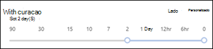
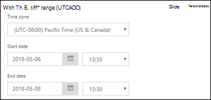

# Seguimiento de mensajes en el Centro de seguridad y cumplimiento

[!INCLUDE [Microsoft 365 Defender rebranding](../includes/microsoft-defender-for-office.md)]

**Se aplica a**
- [Exchange Online Protection](exchange-online-protection-overview.md)
- [Plan 1 y Plan 2 de Microsoft Defender para Office 365](defender-for-office-365.md)
- [Microsoft 365 Defender](../defender/microsoft-365-defender.md)

El seguimiento de mensajes en el Centro de seguridad & cumplimiento sigue los mensajes de correo electrónico a medida que se desplazan por la Exchange Online organización. Puede determinar si el servicio recibió, rechazó, aplazó o entregó un mensaje. También muestra qué acciones se realizaron en el mensaje antes de alcanzar su estado final.

Puede usar la información del seguimiento de mensajes para responder eficazmente a las preguntas del usuario sobre lo que ocurrió con los mensajes, solucionar problemas de flujo de correo y validar los cambios de directiva.

## ¿Qué necesita saber antes de comenzar?

- Debe ser miembro de los grupos de  roles **Administración** de  la **organización,** Administración de cumplimiento o Servicio de Exchange Online para usar el seguimiento de mensajes. Para obtener más información, consulte los [permisos en Exchange Online](/exchange/permissions-exo/permissions-exo).

  **Notas:** La pertenencia al rol Azure Active Directory correspondiente en el Centro de administración de Microsoft 365 proporciona a los usuarios los permisos y permisos necesarios para _otras_ características de Microsoft 365. Para obtener más información, vea [Sobre los roles de administrador](../../admin/add-users/about-admin-roles.md).

- El número máximo de mensajes que se muestran en los resultados de un seguimiento de mensajes depende del tipo de informe seleccionado (vea la sección Elegir tipo [de](#choose-report-type) informe para obtener más información). El cmdlet [Get-HistoricalSearch de](/powershell/module/exchange/get-historicalsearch) Exchange Online PowerShell o PowerShell independiente de EOP devuelve todos los mensajes de los resultados.

## Seguimiento de mensajes abierto

Abra el Centro de seguridad & cumplimiento en y, a <https://protection.office.com/> continuación, vaya a Flujo **de** correo Seguimiento \> **de mensajes**.

Para ir directamente a la **página Seguimiento de** mensajes, abra <https://protection.office.com/messagetrace> .

## Página de seguimiento de mensajes

Desde aquí puede iniciar un nuevo seguimiento predeterminado haciendo clic en **el botón Iniciar un** seguimiento. Esto buscará todos los mensajes de todos los remitentes y destinatarios durante los dos últimos días. También puede usar una de las consultas almacenadas de las categorías de consulta disponibles y ejecutarlas tal como están o usarlas como puntos de partida para sus propias consultas:

- **Consultas predeterminadas:** consultas integradas proporcionadas por Microsoft 365.
- **Consultas personalizadas:** consultas guardadas por los administradores de la organización para su uso futuro.
- **Consultas autoguardadas:** las últimas diez consultas de ejecución más recientes. Esta lista hace que sea sencillo retogar donde lo dejó.

También en esta página hay una sección **de** informes descargables para las solicitudes que ha enviado, así como los propios informes cuando hay disponibles para su descarga.

## Opciones para un nuevo seguimiento de mensajes

### Filtrar por remitentes y destinatarios

Los valores predeterminados son **Todos los remitentes** y **Todos los** destinatarios, pero puede usar los siguientes campos para filtrar los resultados:

- **Por estas personas:** haga clic en este campo para seleccionar uno o más remitentes de su organización. También puede empezar a escribir un nombre y los elementos de la lista se filtrarán según lo que haya especificado, de forma muy parecido al comportamiento de una página de búsqueda.
- **Para estas personas:** haga clic en este campo para seleccionar uno o más destinatarios de la organización.

> [!NOTE]
>
> - También puede escribir las direcciones de correo electrónico de remitentes y destinatarios externos. Se admiten caracteres comodín (por ejemplo, ), pero no se pueden usar varias entradas comodín en el mismo campo `*@contoso.com` al mismo tiempo.
> - Puede pegar varias listas de remitentes o destinatarios separadas por punto y coma ( `;` ). spaces ( `\s` ), el carro devuelve ( ), o las siguientes líneas ( `\r` `\n` ).

### Intervalo de tiempo

El valor predeterminado es **2 días,** pero puede especificar intervalos de fecha y hora de hasta 90 días. Cuando use intervalos de fecha y hora, tenga en cuenta estos problemas:

- De forma predeterminada, selecciona el intervalo de tiempo en **la vista Control** deslizante mediante una línea de tiempo. Solo puede seleccionar la configuración de día u hora que se muestra. Al intentar seleccionar un valor entre dos, la burbuja de inicio y finalización se ajustará a la configuración mostrada más cercana.

  

  Pero también puede cambiar a la vista Personalizada,  donde puede especificar los valores Fecha de  inicio y Fecha de finalización (incluidas las horas) y también puede seleccionar la zona horaria para el intervalo de fecha y hora.   Tenga en cuenta que **la configuración de zona** horaria se aplica tanto a las entradas de consulta como a los resultados de la consulta.

  

  Durante 10 días o menos, los resultados están disponibles al instante como **un informe de** resumen. Si especifica un intervalo de tiempo que incluso es ligeramente superior a 10 días, los resultados se retrasarán, ya que solo están disponibles como un archivo CSV descargable **(resumen** mejorado o informes **extendidos).**

  Para obtener más información acerca de los diferentes tipos de informe, vea la [sección Elegir tipo de](#choose-report-type) informe de este artículo.

  > [!NOTE]
  > Los informes ampliados y de resumen mejorados se preparan con datos de seguimiento de mensajes archivados y pueden tardar hasta varias horas antes de que el informe esté disponible para su descarga. Dependiendo del número de administradores que también han enviado solicitudes de informe al mismo tiempo, es posible que también observe un retraso antes de que se inicie el procesamiento de la solicitud en cola.

- Guardar una consulta en **la vista Slider** guarda el intervalo de tiempo relativo (por ejemplo, 3 días a partir de hoy). Guardar una consulta en la **vista** personalizada guarda el intervalo de fecha y hora absoluto (por ejemplo, 2018-05-06 de 13:00 a 2018-05-08 18:00).

### Más opciones de búsqueda

#### Estado de entrega

Puede dejar el valor predeterminado **All** seleccionado o puede seleccionar uno de los siguientes valores para filtrar los resultados:

- **Entregado:** el mensaje se entregó correctamente al destino previsto.
- **Pendiente:** se está intentando o intentando volver a intentar la entrega del mensaje.
- **Expandido:** se expandió un destinatario de grupo de distribución antes de la entrega a los miembros individuales del grupo.
- **Error:** el mensaje no se entregó.
- **En cuarentena:** el mensaje se ha puesto en cuarentena (como correo no deseado, correo masivo o suplantación de identidad). Para obtener más información, vea [Quarantined email messages in EOP](quarantine-email-messages.md).
- **Filtrado como correo no** deseado: el mensaje se identificó como correo no deseado y se rechazó o bloqueó (no se ha puesto en cuarentena).
- **Obtener el estado:** El mensaje fue recibido recientemente por Microsoft 365, pero aún no hay otros datos de estado disponibles. Vuelva en unos minutos.

> [!NOTE]
> Los valores **Pending,** **Quarantined** y **Filter as spam** solo están disponibles para búsquedas de menos de 10 días. Además, puede haber un retraso de 5 a 10 minutos entre el estado de entrega real e notificado.

#### Id. de mensaje

Este es el identificador de mensaje de Internet (también conocido como id. de cliente) que se encuentra en el campo de encabezado **Message-ID:** en el encabezado del mensaje. Los usuarios pueden darle este valor para investigar mensajes específicos.

Este valor es constante mientras dura el mensaje. Para los mensajes creados Microsoft 365 o Exchange, el valor tiene el formato , incluidos los `<GUID@ServerFQDN>` corchetes angulares ( \< \> ). Por ejemplo, `<d9683b4c-127b-413a-ae2e-fa7dfb32c69d@DM3NAM06BG401.Eop-nam06.prod.protection.outlook.com>`. Otros sistemas de mensajería pueden usar diferentes sintaxis o valores. Se supone que este valor es único, pero no todos los sistemas de correo electrónico siguen estrictamente este requisito. Si el **campo de encabezado Message-ID:** no existe o está en blanco para los mensajes entrantes de orígenes externos, se asigna un valor arbitrario.

Cuando use el **identificador de mensaje** para filtrar los resultados, asegúrese de incluir la cadena completa, incluidos los corchetes angulares.

#### Dirección

Puede dejar el valor predeterminado **Todo** seleccionado o seleccionar Entrante **(mensajes** enviados a destinatarios de la organización) o Saliente **(mensajes** enviados desde usuarios de la organización) para filtrar los resultados.

#### Dirección IP del cliente original

Puede presentar los resultados por dirección IP de cliente para investigar equipos pirateados que envían grandes cantidades de correo no deseado o malware. Aunque los mensajes pueden parecer procedentes de varios remitentes, es probable que el mismo equipo esté generando todos los mensajes.

> [!NOTE]
> La información de la dirección IP del cliente solo está  disponible durante  10 días y solo está disponible en el resumen mejorado o en los informes extendidos (archivos CSV descargables).

### Elegir tipo de informe

Los tipos de informe disponibles son:

- **Resumen:** disponible si el intervalo de tiempo es inferior a 10 días y no requiere opciones de filtrado adicionales. Los resultados están disponibles casi inmediatamente después de hacer clic en **Buscar**. El informe devuelve hasta 20000 resultados.
- **Resumen** mejorado o **Extendido:** estos informes solo están disponibles como archivos CSV descargables y requieren una o varias de las siguientes opciones de filtrado independientemente del intervalo de **tiempo:** Por estas personas **,** Para estas personas o Id. de mensaje **.** Puede usar caracteres comodín para los remitentes o los destinatarios (por ejemplo, \* @contoso.com). El informe de resumen mejorado devuelve hasta 50000 resultados. El informe extendido devuelve hasta 1000 resultados.

> [!NOTE]
>
> - Los informes ampliados y de resumen mejorados se preparan con datos de seguimiento de mensajes archivados y pueden tardar hasta varias horas antes de que el informe esté disponible para su descarga. Dependiendo del número de administradores que también han enviado solicitudes de informe al mismo tiempo, es posible que también observe un retraso antes de que comience a procesarse la solicitud en cola.
> - Aunque puede seleccionar un resumen mejorado o un informe extendido para cualquier intervalo de fecha y hora, normalmente las últimas cuatro horas de datos archivados todavía no estarán disponibles para estos dos tipos de informes.
> - El tamaño máximo de un informe descargable es de 500 MB. Si un informe descargable supera los 500 MB, no puede abrir el informe en Excel o Bloc de notas.

Al hacer clic en **Siguiente,** se le muestra una página de resumen que enumera las opciones de filtrado que seleccionó, un título único (editable) para el informe y la dirección de correo electrónico que recibe la notificación cuando se completa el seguimiento del mensaje (también editable y debe estar en uno de los dominios aceptados de la organización). Haga **clic en Preparar informe** para enviar el seguimiento del mensaje. En la página **de seguimiento de mensajes** principal, puede ver el estado del informe en la sección Informes **descargables.**

Para obtener más información acerca de la información que se devuelve en los distintos tipos de informe, vea la sección siguiente.

## Resultados de seguimiento de mensajes

Los distintos tipos de informe devuelven diferentes niveles de información. La información disponible en los diferentes informes se describe en las secciones siguientes.

### Resultado del informe de resumen

Después de ejecutar el seguimiento del mensaje, los resultados se mostrarán, ordenados por fecha y hora descendentes (la primera más reciente).

El informe de resumen contiene la siguiente información:

- **Fecha:** la fecha y hora en que el servicio recibió el mensaje mediante la zona horaria UTC configurada.
- **Remitente:** la dirección de correo electrónico del remitente (*dominio alias* @ ).
- **Destinatario:** la dirección de correo electrónico del destinatario o los destinatarios. Para un mensaje enviado a varios destinatarios, hay una línea por destinatario. Si el destinatario es un grupo de distribución, un grupo de distribución dinámico o un grupo de seguridad habilitado para correo, el grupo será el primer destinatario y, a continuación, cada miembro del grupo estará en una línea independiente.
- **Asunto:** los primeros 256 caracteres del campo **Asunto: del** mensaje.
- **Estado:** estos valores se describen en la [sección Estado de](#delivery-status) entrega.

De forma predeterminada, los primeros 250 resultados se cargan y están disponibles fácilmente. Cuando se desplaza hacia abajo, hay una pequeña pausa a medida que se carga el siguiente lote de resultados. En lugar de desplazarse, puede hacer clic en **Cargar** todo para cargar todos los resultados hasta un máximo de 10 000.

Puede hacer clic en los encabezados de columna para ordenar los resultados por los valores de esa columna en orden ascendente o descendente.

Puede hacer clic **en Filtrar resultados** para filtrar los resultados por una o más columnas.

Puede exportar los resultados después de seleccionar una  o más filas haciendo clic en Exportar resultados y, a continuación, **seleccionando** Exportar todos los resultados , Exportar **resultados** cargados o **Exportar seleccionado**.

#### Buscar registros relacionados para este mensaje

Los registros de mensajes relacionados son registros que han compartido el mismo identificador de mensaje. Recuerde que incluso un solo mensaje enviado entre dos personas puede generar varios registros. El número de registros aumenta cuando el mensaje se ve afectado por la expansión del grupo de distribución, el reenvío, las reglas de flujo de correo (también conocidas como reglas de transporte), etc.

Después de seleccionar la casilla de verificación de una fila,  puede encontrar registros relacionados para  el mensaje haciendo clic en el botón Buscar relacionado que aparece o seleccionando Más opciones Más buscar registros relacionados para  \> **mensaje**).

Para obtener más información acerca del identificador de mensaje, vea la sección Id. de mensaje anterior en este artículo.

#### Detalles del seguimiento de mensajes

En el resultado del informe de resumen, puede ver detalles sobre un mensaje mediante cualquiera de los siguientes métodos:

- Seleccione la fila (haga clic en cualquier lugar de la fila excepto en la casilla).
- Active la casilla de verificación de la fila y haga clic en **Más opciones** Más  \> **mensaje**.

   

Los detalles de seguimiento de mensajes contienen la siguiente información adicional que no está presente en el informe de resumen:

- **Eventos de** mensaje: esta sección contiene clasificaciones que ayudan a clasificar las acciones que realiza el servicio en los mensajes. **Algunos de los eventos más interesantes** que se pueden encontrar son:
  - **Recepción:** el servicio recibió el mensaje.
  - **Enviar:** el servicio envió el mensaje.
  - **Error:** no se pudo entregar el mensaje.
  - **Entregar:** el mensaje se entregó a un buzón.
  - **Expand:** el mensaje se envió a un grupo de distribución que se expandió.
  - **Transferencia:** los destinatarios se movieron a un mensaje bifurcado debido a la conversión de contenido, los límites de destinatarios de mensajes o los agentes.
  - **Aplazar:** la entrega de mensajes se pospuso y podría volver a intentarse más adelante.
  - **Resuelto:** el mensaje se redirija a una nueva dirección de destinatario basada en una búsqueda de Active Directory. Cuando esto ocurre, la dirección del destinatario original aparece en una fila diferente en la información de seguimiento del mensaje junto con el estado de entrega final del mensaje.

  > [!NOTE]
  >
  > - Un mensaje sin incidentes que se entregue correctamente generará varias entradas **de** evento en el seguimiento del mensaje.
  > - Esta lista no está pensada para ser exhaustiva. Para obtener descripciones de más eventos, vea [Tipos de eventos en el registro de seguimiento de mensajes.](/Exchange/mail-flow/transport-logs/message-tracking#event-types-in-the-message-tracking-log) Tenga en cuenta que este vínculo es Exchange Server tema (Exchange local).

- **Más información:** Esta sección contiene los siguientes detalles:
  - **Id. de** mensaje: este valor se describe en la sección [Id. de](#message-id) mensaje anterior de este artículo. Por ejemplo, `<d9683b4c-127b-413a-ae2e-fa7dfb32c69d@DM3NAM06BG401.Eop-nam06.prod.protection.outlook.com>`.
  - **Tamaño del mensaje**
  - **Desde IP:** la dirección IP del equipo que envió el mensaje. Para los mensajes salientes enviados desde Exchange Online, este valor está en blanco.
  - **A IP:** la dirección IP o las direcciones en las que el servicio intentó entregar el mensaje. Si el mensaje tiene varios destinatarios, se muestran. Para los mensajes entrantes enviados a Exchange Online, este valor está en blanco.

### Informes de resumen mejorados

Los informes de resumen mejorados disponibles (completados) están disponibles en la sección Informes **descargables** en el seguimiento del mensaje inicial. La siguiente información está disponible en el informe:

- **origin_timestamp:** la fecha y la hora en que el servicio recibió inicialmente el mensaje mediante la zona horaria * UTC configurada.
- **sender_address:** la dirección de correo electrónico del remitente (*dominio* @ *alias*).
- **Recipient_status:** el estado de la entrega del mensaje al destinatario. Si el mensaje se envió a varios destinatarios, se mostrarán todos los destinatarios y el estado correspondiente para cada uno, con el formato: \<*email address*\> ## \<*status*\> . Por ejemplo:
  - **##Receive, Enviar** significa que el servicio recibió el mensaje y se envió al destino previsto.
  - **##Receive, Fail** significa que el servicio recibió el mensaje, pero la entrega al destino previsto falló.
  - **##Receive, Deliver significa** que el servicio recibió el mensaje y se entregó al buzón del destinatario.
- **message_subject:** los primeros 256 caracteres del campo **Asunto** del mensaje.
- **total_bytes:** el tamaño del mensaje en bytes, incluidos los datos adjuntos.
- **message_id:** este valor se describe en la sección [Id. de](#message-id) mensaje anterior de este artículo. Por ejemplo, `<d9683b4c-127b-413a-ae2e-fa7dfb32c69d@DM3NAM06BG401.Eop-nam06.prod.protection.outlook.com>`.
- **network_message_id:** un valor de identificador de mensaje único que persiste en todas las copias del mensaje que podrían crearse debido a la bifurcación o a la expansión del grupo de distribución. Un valor de ejemplo es `1341ac7b13fb42ab4d4408cf7f55890f` .
- **original_client_ip:** la dirección IP del cliente del remitente.
- **direccionalidad:** indica si el mensaje se envió de entrada (1) a la organización o si se envió saliente (2) desde la organización.
- **connector_id:** el nombre del conector de origen o de destino. Para obtener más información acerca de los conectores de Exchange Online, vea [Configure mail flow using connectors in Office 365](/Exchange/mail-flow-best-practices/use-connectors-to-configure-mail-flow/use-connectors-to-configure-mail-flow).
- **delivery_priority:** * si el mensaje se envió con **prioridad Alta,** Baja o **Normal.**

* Estas propiedades solo están disponibles en informes de resumen mejorados.

### Informes extendidos

Los informes extendidos disponibles (completados) están disponibles en la sección Informes **descargables** al principio del seguimiento de mensajes. Prácticamente toda la información de un informe de resumen mejorado está disponible en un informe extendido (a excepción de **origin_timestamp** y **delivery_priority**). La siguiente información adicional solo está disponible en un informe extendido:

- **client_ip:** la dirección IP del servidor de correo electrónico o cliente de mensajería que envió el mensaje.
- **client_hostname:** nombre de host o FQDN del servidor de correo electrónico o cliente de mensajería que envió el mensaje.
- **server_ip:** la dirección IP del servidor de origen o de destino.
- **server_hostname:** nombre de host o FQDN del servidor de destino.
- **source_context:** información adicional asociada al **campo de** origen. Por ejemplo:
  - `Protocol Filter Agent`
  - `3489061114359050000`
- **source:** el Exchange Online que es responsable del evento. Por ejemplo:
  - `AGENT`
  - `MAILBOXRULE`
  - `SMTP`
- **event_id:** se corresponden con los **valores** de evento Message que se explican en la sección Buscar registros [relacionados para este](#find-related-records-for-this-message) mensaje.
- **internal_message_id:** identificador de mensaje asignado por el servidor Exchange Online que procesa actualmente el mensaje.
- **recipient_address:** las direcciones de correo electrónico de los destinatarios del mensaje. Si hay varias direcciones de correo electrónico, se separan por punto y coma (;).
- **recipient_count:** el número total de destinatarios del mensaje.
- **related_recipient_address**: Se usa con , y eventos para mostrar otras direcciones de correo electrónico de `EXPAND` `REDIRECT` destinatarios `RESOLVE` asociadas con el mensaje.
- **referencia:** este campo contiene información adicional para tipos específicos de eventos. Por ejemplo:
  - **DSN:** contiene el vínculo de informe, que es el valor message_id de la notificación de estado de entrega asociada (también conocido como DSN, informe de no entrega, NDR o mensaje de desasocución) si se genera un DSN posterior **a** este evento. Si se trata de un mensaje DSN, este campo contiene el message_id **del** mensaje original para el que se generó el DSN.
  - **EXPAND**: contiene el **related_recipient_address** de los mensajes relacionados.
  - **RECEIVE:** puede contener el **message_id** del mensaje relacionado si el mensaje fue generado por otros procesos (por ejemplo, reglas de bandeja de entrada).
  - **SEND:** contiene el **internal_message_id** de los mensajes DSN.
  - **TRANSFER:** contiene el **internal_message_id** del mensaje que se bifurca (por ejemplo, por conversión de contenido, límites de destinatarios de mensajes o agentes).
  - **MAILBOXRULE:** contiene el **internal_message_id** del mensaje entrante que hizo que la regla bandeja de entrada generara el mensaje saliente. Para otros tipos de eventos, este campo suele estar en blanco.
- **return_path:** la dirección de correo electrónico de devolución especificada por el comando **MAIL FROM** que envió el mensaje. Aunque este campo nunca está vacío, puede tener el valor de dirección del remitente nulo representado como `<>` .
- **message_info:** información adicional sobre el mensaje. Por ejemplo:
  - Fecha y hora de origen del mensaje en UTC y `DELIVER` `SEND` eventos. La fecha y hora de origen es la hora en que el mensaje entró por primera vez en la Exchange Online organización. La fecha y hora UTC se representa en el formato de fecha y hora ISO 8601: , donde = año, = mes, = día, indica el principio del componente de `yyyy-mm-ddThh:mm:ss.fffZ` `yyyy` `mm` `dd` `T` hora, `hh` = hora, `mm` = minuto, = `ss` segundo, = fracciones `fff` `Z` `Zulu` de un segundo y significa , que es otra forma de indicar UTC.
  - Errores de autenticación. Por ejemplo, es posible que vea el valor y el tipo de autenticación `11a` que se usó cuando se produjo el error de autenticación.
- **tenant_id:** un valor GUID que representa la Exchange Online organización (por ejemplo, `39238e87-b5ab-4ef6-a559-af54c6b07b42` ).
- **original_server_ip:** la dirección IP del servidor original.
- **custom_data:** contiene datos relacionados con tipos de eventos específicos. Para obtener más información, consulte las secciones siguientes.

#### custom_data valores

El **custom_data** para un evento lo usan varios agentes Exchange Online `AGENTINFO` para registrar detalles de procesamiento de mensajes. Algunos de los agentes más interesantes se describen en las secciones siguientes.

#### Agente de filtro de correo no deseado

Un **custom_data** que empieza `S:SFA` por es del agente de filtro de correo no deseado. Los detalles clave se describen en la tabla siguiente:

 

****

|Valor|Descripción|
|---|---|
|`SFV=NSPM`|El mensaje se marcó como correo seguro y se envió a los destinatarios correspondientes.|
|`SFV=SPM`|El mensaje se marcó como correo no deseado mediante el filtrado contra correo no deseado (también conocido como filtrado de contenido).|
|`SFV=BLK`|Se omitió el filtrado y se bloqueó el mensaje porque proviene de un remitente bloqueado.|
|`SFV=SKS`|El mensaje se marcó como correo no deseado antes de ser procesado por el filtrado contra correo no deseado. Esto incluye los mensajes que coincidan con una regla de flujo de correo (también conocida como regla de transporte), la cual marca el mensaje automáticamente como correo no deseado y omite otros tipos de filtros.|
|`SCL=<number>`|Para más información sobre los distintos valores SCL y su significado, vea [Niveles de confianza de correo no deseado](spam-confidence-levels.md).|
|`PCL=<number>`|Valor de nivel de confianza de protección antiphishing (PCL) del mensaje. Se puede interpretar del mismo modo que los valores de SCL descritos en [Niveles de confianza de correo no deseado](spam-confidence-levels.md).  |
|`DI=SB`|Se bloqueó el remitente del mensaje.|
|`DI=SQ`|El mensaje se puso en cuarentena.|
|`DI=SD`|El mensaje se eliminó.|
|`DI=SJ`|El mensaje se envió a la carpeta de correo no deseado del destinatario.|
|`DI=SN`|El mensaje se enrutó a través del grupo de entrega saliente normal.|
|`DI=SO`|El mensaje se enrutó a través del grupo de entrega de mayor riesgo. Para más información, consulte [Grupo de entrega de alto riesgo para mensajes salientes](high-risk-delivery-pool-for-outbound-messages.md).|
|`SFS=[a]|SFS=[b]`|Indica que se coincidió con reglas de correo no deseado.|
|`IPV=CAL`|El mensaje se permitió a través de los filtros de correo no deseado porque la dirección IP estaba incluida en una lista de direcciones IP permitidas en el filtro de conexión.|
|`H=<EHLOstring>`|Cadenas HELO o EHLO del servidor de correo de conexión.|
|`PTR=<ReverseDNS>`|Registro PTR de la dirección IP de envío, también denominado dirección DNS inversa.|
|

Un ejemplo **custom_data** valor de un mensaje filtrado para correo no deseado como este:

`S:SFA=SUM|SFV=SPM|IPV=CAL|SRV=BULK|SFS=470454002|SFS=349001|SCL=9|SCORE=-1|LIST=0|DI=SN|RD=ftmail.inc.com|H=ftmail.inc.com|CIP=98.129.140.74|SFP=1501|ASF=1|CTRY=US|CLTCTRY=|LANG=en|LAT=287|LAT=260|LAT=18;`

#### Agente de filtro de malware

Un **custom_data** que empieza `S:AMA` por es del agente de filtro de malware. Los detalles clave se describen en la tabla siguiente:

 

****

|Valor|Descripción|
|---|---|
|`AMA=SUM|v=1|` o `AMA=EV|v=1`|Se determinó que el mensaje contiene malware. `SUM` indica que el malware podría haber sido detectado por cualquier número de motores. `EV` indica que un motor específico detectó el malware. Cuando un motor detecta el malware, se activan las acciones siguientes.|
|`Action=r`|El mensaje se reemplazó.|
|`Action=p`|El mensaje se omitió.|
|`Action=d`|El mensaje se difirió.|
|`Action=s`|El mensaje se eliminó.|
|`Action=st`|El mensaje se omitió.|
|`Action=sy`|El mensaje se omitió.|
|`Action=ni`|El mensaje se rechazó.|
|`Action=ne`|El mensaje se rechazó.|
|`Action=b`|El mensaje se bloqueó.|
|`Name=<malware>`|Se detectó el nombre del malware.|
|`File=<filename>`|El nombre del archivo que contiene el malware.|
|

Un ejemplo **custom_data** valor de un mensaje que contiene malware tiene este aspecto:

`S:AMA=SUM|v=1|action=b|error=|atch=1;S:AMA=EV|engine=M|v=1|sig=1.155.974.0|name=DOS/Test_File|file=filename;S:AMA=EV|engine=A|v=1|sig=201707282038|name=Test_File|file=filename`

#### Agente de regla de transporte

Un **custom_data** que empieza por es del agente de regla de transporte para las reglas de flujo de correo `S:TRA` (también conocidas como reglas de transporte). Los detalles clave se describen en la tabla siguiente:

 

****

|Valor|Descripción|
|---|---|
|`ETR|ruleId=<guid>`|El identificador de regla coincidente.|
|`St=<datetime>`|La fecha y hora en UTC cuando se produjo la coincidencia de reglas.|
|`Action=<ActionDefinition>`|La acción que se aplicó. Para obtener una lista de acciones disponibles, vea [Acciones de regla de flujo](/exchange/security-and-compliance/mail-flow-rules/mail-flow-rule-actions)de correo en Exchange Online .|
|`Mode=<Mode>`|El modo de la regla. Los valores admitidos son:<ul><li>**Exigir:** se aplicarán todas las acciones de la regla.</li><li>**Pruebe con la directiva Sugerencias:**: se enviarán las acciones de sugerencia de directiva, pero no se actuarán otras acciones de aplicación.</li><li>**Probar sin directiva Sugerencias:** las acciones aparecerán en un archivo de registro, pero los remitentes no recibirán ninguna notificación y las acciones de cumplimiento no se actuarán.</li></ul>|
|

Un ejemplo **custom_data** valor de un mensaje que coincide con las condiciones de una regla de flujo de correo tiene este aspecto:

`S:TRA=ETR|ruleId=19a25eb2-3e43-4896-ad9e-47b6c359779d|st=7/17/2017 12:31:25 AM|action=ApplyHtmlDisclaimer|sev=1|mode=Enforce`
