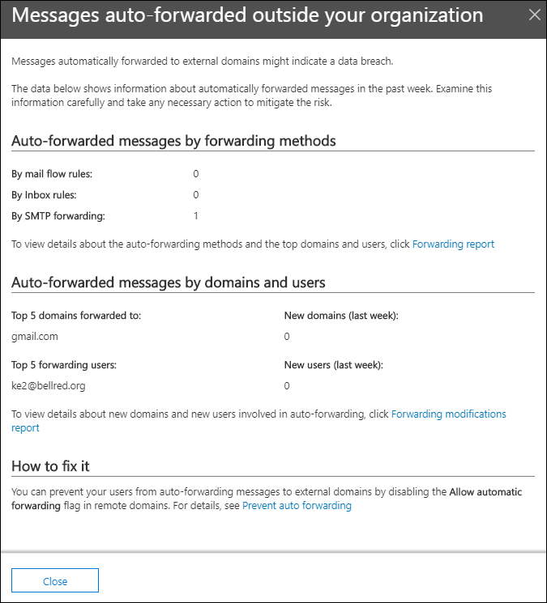

# Mensajes reenviados automáticamente información sobre el centro de seguridad & cumplimiento

La introducción a los **mensajes reenviados automáticamente** del [Panel flujo de correo](mail-flow-insights-v2.md) del centro de seguridad & cumplimiento muestra información acerca de los mensajes que se reenvían automáticamente desde la organización a los destinatarios de dominios externos.

## Detalles de los mensajes reenviados automáticamente

Al hacer clic en el número de mensajes del widget, aparece un panel de control flotante que muestra más información sobre los mensajes reenviados automáticamente:

- Mensajes reenviados **automáticamente mediante métodos de reenvío**:

  - **Por reglas de flujo de correo**
  - **Por reglas de la bandeja de entrada**
  - **Por el reenvío SMTP**
  - Un vínculo al [Informe de reenvío](view-mail-flow-reports.md#forwarding-report) para obtener más información.

- **Mensajes reenviados automáticamente por dominios y usuarios**:

  - **Los 5 primeros dominios se reenvían a**
  - **Nuevos dominios (última semana)**
  - **5 principales usuarios de reenvío**
  - **Nuevos usuarios (última semana)**
  - Un vínculo al [Informe de modificaciones de reenvío](mfi-new-users-forwarding-email.md#forwarding-modifications-report) para obtener más información.

## Información

Se generan dos perspectivas en función de los datos del informe:

- [Reenviar correo electrónico a los nuevos usuarios](mfi-new-users-forwarding-email.md)
- [Nuevos dominios que se reenvían correo electrónico](mfi-new-domains-being-forwarded-email.md)

## Consulte también

Para obtener información sobre otras informaciones del panel de flujo de correo, consulte [mail Flow Insights en el centro de seguridad & cumplimiento](mail-flow-insights-v2.md).
