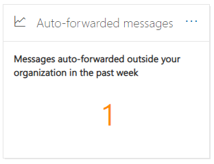

# Información sobre mensajes reenviados automáticamente en el Centro de & cumplimiento

[!INCLUDE [Microsoft 365 Defender rebranding](../includes/microsoft-defender-for-office.md)]

La **información de** mensajes reenviados automáticamente en el panel flujo de correo del Centro de seguridad y cumplimiento de [&](https://protection.office.com) muestra información sobre los mensajes que se reenvía automáticamente de la organización a los destinatarios de dominios externos. 

## Detalles de mensajes reenviados automáticamente

Al hacer clic en el número de mensajes del widget, aparece un panel flotante que muestra más información sobre los mensajes reenviados automáticamente:

- **Mensajes reenviados automáticamente mediante métodos de reenvío:**

  - **Por reglas de flujo de correo**
  - **Por reglas de bandeja de entrada**
  - **Mediante el reenvío SMTP:** este método indica el reenvío automático que los administradores pueden configurar en un buzón como se describe en Configurar el reenvío de correo [electrónico para un buzón.](https://docs.microsoft.com/Exchange/recipients-in-exchange-online/manage-user-mailboxes/configure-email-forwarding)
  - Un vínculo al informe [de reenvío](view-mail-flow-reports.md#forwarding-report) para obtener más información.

- **Mensajes reenviados automáticamente por dominios y usuarios:**

  - **Los 5 dominios principales reenviados a**
  - **Nuevos dominios (la semana pasada)**
  - **Principales 5 usuarios de reenvío**
  - **Nuevos usuarios (la semana pasada)**
  - Un vínculo al informe [de modificaciones de reenvío](mfi-new-users-forwarding-email.md#forwarding-modifications-report) para obtener más información.

## Insights

Se generan dos perspectivas en función de los datos del informe:

- [Nuevos usuarios reenviando correo electrónico](mfi-new-users-forwarding-email.md)
- [Nuevos dominios que se reenván de correo electrónico](mfi-new-domains-being-forwarded-email.md)

## Consulta también

Para obtener información acerca de otras perspectivas en el panel de flujo de correo, vea Información sobre el flujo de correo en el Centro de [& cumplimiento.](mail-flow-insights-v2.md)
