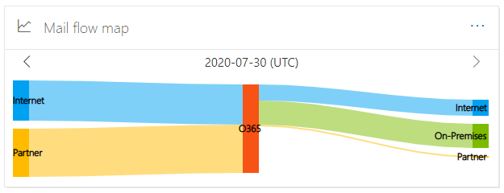

# Mapa de flujo de correo en el Centro de seguridad & cumplimiento

[!INCLUDE [Microsoft 365 Defender rebranding](../includes/microsoft-defender-for-office.md)]

**Se aplica a**
- [Exchange Online Protection](exchange-online-protection-overview.md)
- [Plan 1 y Plan 2 de Microsoft Defender para Office 365](defender-for-office-365.md)
- [Microsoft 365 Defender](../defender/microsoft-365-defender.md)

El **mapa de flujo de correo** en el panel [Flujo](mail-flow-insights-v2.md) de correo del Centro de seguridad [& cumplimiento](https://protection.office.com) proporciona información sobre cómo fluye el correo a través de la organización. Puede usar esta información para aprender patrones, identificar anomalías y solucionar problemas a medida que se producen.

De forma predeterminada, el widget muestra el patrón de flujo de correo del día anterior en un gráfico conocido como diagrama *de Sankey.* Puede usar la flecha izquierda flecha izquierda y flecha derecha flecha   días. Cada color diferente representa el flujo de correo sobre un conector entrante o saliente diferente (o sin conectores). Si mantiene el mouse sobre un color específico, se muestra el número de mensajes para ese tipo de conector.

## Vista Informe para el mapa de flujo de correo

Hacer clic en el widget **Mapa de flujo de** correo le llevará al informe de mapa de flujo **de** correo.

Los gráficos siguientes están disponibles en la vista informe:

- **Mostrar datos para: Información general:** Se trata básicamente de una vista más grande del widget. Si mantiene el mouse sobre un color específico, se muestra el número de mensajes para ese tipo de conector.

  

- **Mostrar datos para: Detalle:** esta vista muestra detalles sobre los conectores y los dominios de destino. Los dominios principales de remitente y destinatario se enumeran y el resto se ponen en **Otros**. Si mantiene el mouse sobre un color y una sección específicos, se muestra el número de mensajes.

  

Si hace clic **en Filtros** en una vista de informe, puede especificar un intervalo de fechas con Fecha **de inicio** y Fecha **de finalización.**

Para enviar por correo electrónico el informe de un intervalo de fechas específico a uno o varios destinatarios, haga clic en **Solicitar descarga**.

Los conocimientos relacionados se muestran debajo del mapa de flujo de correo si están disponibles (por ejemplo, [fix possible mail loop insight](mfi-mail-loop-insight.md)).

## Vista de tabla Detalles para el mapa de flujo de correo

Si hace clic **en Ver tabla de detalles** en una vista de informe, se muestra la siguiente información:

- **Fecha**
- **Categoría**
- **Conector /proveedor de servicios de terceros**
- **Dominio de remitente/destinatario**
- **Recuento de mensajes**

Si hace clic **en Filtros en** una vista de tabla de detalles, puede especificar un intervalo de fechas con Fecha de **inicio** y Fecha **de finalización.**

Si selecciona una fila, se muestran detalles similares en un menú desplegable:

Para enviar por correo electrónico el informe de un intervalo de fechas específico a uno o varios destinatarios, haga clic en **Solicitar descarga**.

Para volver a la vista informes, haga clic **en Ver informe**.

## Consulte también

Para obtener información acerca de otras perspectivas en el panel flujo de correo, vea [Mail flow insights in the Security & Compliance Center](mail-flow-insights-v2.md).
