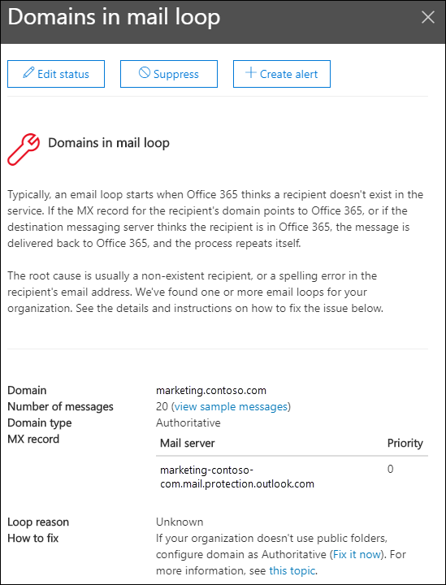

# Corregir la posible información del bucle de correo en el Centro de seguridad & cumplimiento

[!INCLUDE [Microsoft 365 Defender rebranding](../includes/microsoft-defender-for-office.md)]

**Se aplica a**
- [Exchange Online Protection](https://go.microsoft.com/fwlink/?linkid=2148611)
- [Microsoft Defender para Office 365 plan 1 y plan 2](https://go.microsoft.com/fwlink/?linkid=2148715)
- [Microsoft 365 Defender](https://go.microsoft.com/fwlink/?linkid=2118804)

Los bucles de correo son malos porque:

- Desperdician recursos del sistema.
- Consumen la cuota de volumen de correo de su organización.
- Envían informes de no entrega confusos (también conocidos como NDRs o mensajes de de rebote) a los remitentes del mensaje original.

La información **de** corrección  de posibles  bucles de correo en el área Recomendado para usted del panel de flujo de correo del Centro de seguridad y cumplimiento de [&](https://protection.office.com) le notifica cuándo se detecta un bucle de correo en su organización.

Esta información aparece solo después de que se detecte la condición (si no tiene bucles de correo, no verá la información).

Al hacer clic **en Ver detalles** en el widget, aparece un control flotante con más información:

- **Dominio**
- **Número de mensajes:**  puede hacer clic  en Ver mensajes de ejemplo para ver los resultados del seguimiento de mensajes de una muestra de los mensajes que se vieron afectados por el bucle.
- **Tipo de dominio**" Por ejemplo, autoritativo o no autoritativo.
- **Registro MX:** el host (**servidor de correo)** y los valores **de** prioridad del registro MX para el dominio.
- **Motivo del** bucle **y cómo corregir:** identificaremos los escenarios de bucle de correo más comunes y proporcionaremos las acciones recomendadas para corregir el bucle.

## Recursos adicionales

Para obtener información acerca de otras perspectivas en el panel de flujo de correo, vea Información sobre el flujo de correo en el Centro de [& cumplimiento.](mail-flow-insights-v2.md)
