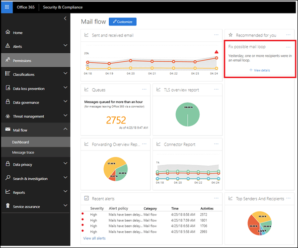

# Reporte de bucle de correo

Un bucle de correo es incorrecto porque desperdicia recursos del sistema, consume la cuota del volumen de correo de su organización y envía informes de no entrega confusos (también conocidos como NDR o mensajes de devolución) a los remitentes originales. Esta visión informa cuando se encuentra un bucle de correo en la organización, los dominios de correo electrónico que participan en el bucle y el número de mensajes del día anterior que estaban en el bucle.

Puede hacer clic en **Ver detalles** para ver los detalles en un panel de control flotante. También se identifican los escenarios de bucle más comunes y se proporcionan las acciones recomendadas (si están disponibles) para corregir el bucle.

## Vea también

Para obtener más información acerca de otras indicaciones del flujo de correo en el panel de flujo de correo, consulte [mail Flow Insights en el centro de seguridad & cumplimiento](mail-flow-insights-v2.md).
