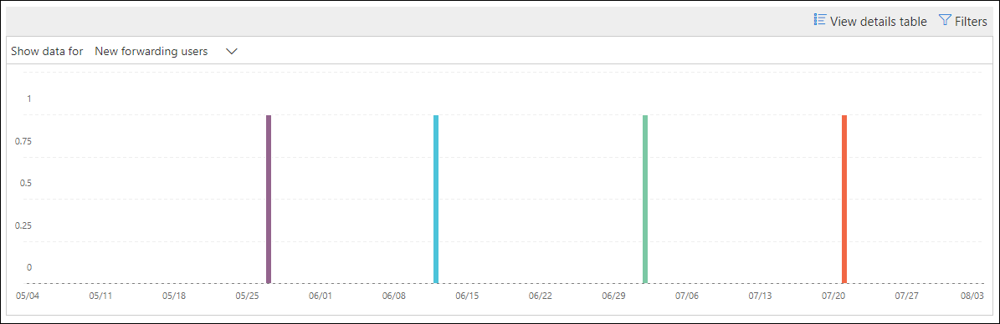

# Nuevos usuarios reenviar información de correo electrónico en el Centro de seguridad & cumplimientoNew users forwarding email insight in the Security & Compliance Center

[!INCLUDE [Microsoft 365 Defender rebranding](../includes/microsoft-defender-for-office.md)]

**Se aplica a****Applies to**
- [Exchange Online ProtectionExchange Online Protection](exchange-online-protection-overview.md)
- [Plan 1 y Plan 2 de Microsoft Defender para Office 365Microsoft Defender for Office 365 plan 1 and plan 2](defender-for-office-365.md)
- [Microsoft 365 DefenderMicrosoft 365 Defender](../defender/microsoft-365-defender.md)

Es sospechoso cuando las nuevas cuentas de usuario de la organización comienzan de repente a reenviar mensajes de correo electrónico a dominios externos.It's suspicious when new user accounts in your organization suddenly start forwarding email messages to external domains.

La **información sobre nuevos** dominios que se reenvía de correo electrónico en el Centro de seguridad y cumplimiento de [&](https://protection.office.com) le notifica cuándo los usuarios recién creados de su organización reenvía mensajes a dominios externos.The **New domains being forwarded email** insight in the [Security & Compliance Center](https://protection.office.com) notifies you when newly-created users in your organization are forwarding messages to external domains. Esta condición podría indicar que se usaron cuentas de administrador comprometidas para crear los nuevos usuarios.This condition could indicate compromised admin accounts were used to create the new users. Si sospecha que las cuentas se han visto comprometidas, consulte [Responder a una cuenta de correo electrónico comprometida.](responding-to-a-compromised-email-account.md)If you suspect the accounts have been compromised, see [Responding to a compromised email account](responding-to-a-compromised-email-account.md).

Esta información solo aparece cuando se detecta el problema y aparece en la página [Informe de reenvío.](view-mail-flow-reports.md#forwarding-report)This insight appears only when the issue is detected, and it appears on the [Forwarding report](view-mail-flow-reports.md#forwarding-report) page.

Al hacer clic en el widget, aparece un control flotante donde puede encontrar más  detalles sobre los mensajes reenviados, incluido un vínculo al informe de modificaciones de reenvío, tal como se describe más adelante en este artículo.When you click on the widget, a flyout appears where you can find more details about the forwarded messages, including a link to the [Forwarding modifications report](#forwarding-modifications-report) as described later in this article.

También puede acceder a esta página de detalles  al seleccionar la información después de hacer clic en Ver todo en el área Información **principal & recomendaciones** en (**Panel** de informes \>  o <https://protection.office.com/insightdashboard> ).You can also get to this details page when you select the insight after you click **View all** in the **Top insights & recommendations** area on (**Reports** \> **Dashboard** or <https://protection.office.com/insightdashboard>).

Puede hacer clic en el **vínculo Ver informe asociado a insight** para ir al informe de modificaciones **de** reenvío, tal como se describe en la sección siguiente.You can click the **See report associated with insight** link to go to the **Forwarding modifications report** as described in the next section.

## Informe de modificaciones de reenvíoForwarding modifications report

El **informe de modificaciones de reenvío** muestra detalles sobre los mensajes que se reenvía automáticamente de remitentes de la organización:The **Forwarding modifications report** shows details about messages that are being automatically forwarded from senders in your organization:

- Cuentas recién creadas que reenvía mensajes a dominios externos.Newly-created accounts that are forwarding messages to external domains.
- Cuentas que reenvía mensajes a dominios externos que nunca han sido reenviados por otros remitentes de la organización.Accounts that are forwarding messages to external domains that have never been forwarded to by other senders in your organization.

Estos tipos de mensajes reenviados pueden suponer un riesgo de seguridad o cumplimiento, y pueden indicar cuentas comprometidas.These types of forwarded messages can pose a security or compliance risk, and might indicate compromised accounts.

El informe contiene datos de hasta 90 días.The report contains data for up to 90 days. De forma predeterminada, el informe muestra los datos de los últimos 7 días.By default, the report shows data for the last 7 days.

Este informe no está disponible directamente en el panel flujo de [correo](mail-flow-insights-v2.md) ni en el [panel Informes.](view-mail-flow-reports.md)This report isn't directly available in the [Mail flow dashboard](mail-flow-insights-v2.md) or in the [Reports dashboard](view-mail-flow-reports.md). Además de hacer clic en el vínculo **Ver informe asociado a insight** en el vínculo **Nuevos** usuarios que reenvía la información de correo electrónico, puede obtener acceso al informe mediante:In addition to clicking the **See report associated with insight** link in the **New users forwarding email** insight, you get to the report by:

- Haga clic **en el vínculo Informe de notificaciones de reenvío** en los detalles de los nuevos dominios que se [reenvía la](mfi-new-domains-being-forwarded-email.md)información de correo electrónico .Clicking the **Forwarding notifications report** link in the details of the [New domains being forwarded email insight](mfi-new-domains-being-forwarded-email.md).
- Abrir <https://protection.office.com/reportv2?id=MailFlowNewForwarding> .Opening <https://protection.office.com/reportv2?id=MailFlowNewForwarding>.

### Vista Informe para el informe de modificaciones de reenvíoReport view for the Forwarding modifications report

Los gráficos siguientes están disponibles en la vista informe:The following charts are available in the report view:

- **Mostrar datos para: Nuevos usuarios de reenvío:****Show data for: New forwarding users**:

  

- **Mostrar datos para: Nuevos dominios de reenvío:****Show data for: New forwarding domains**:

  

Si hace clic **en Filtros** en una vista de informe, puede especificar un intervalo de fechas con Fecha **de inicio** y Fecha **de finalización.**If you click **Filters** in a report view, you can specify a date range with **Start date** and **End date**.

### Vista de tabla Detalles para el informe de modificaciones de reenvíoDetails table view for the Forwarding modifications report

Si hace clic **en Ver tabla de detalles,** la información que se muestra depende del gráfico que estaba mirando:If you click **View details table**, the information that's shown depends on the chart you were looking at:

- **Mostrar datos para: Nuevos usuarios de reenvío:****Show data for: New forwarding users**:

  - **Nombre:** la dirección de correo electrónico del remitente.**Name**: The email address of the sender.
  - **Tipo de reenvío****Forwarding type**
  - **Dirección de destinatario****Recipient address**
  - **Detalles****Details**
  - **Count****Count**
  - **Primera fecha de reenvío****First forward date**

- **Mostrar datos para: Nuevos dominios de reenvío:****Show data for: New forwarding domains**:

  - **Nombre:** el dominio de correo electrónico del remitente.**Name**: The email domain of the sender.
  - **Tipo de reenvío****Forwarding type**
  - **Dirección de destinatario****Recipient address**
  - **Detalles****Details**
  - **Count****Count**
  - **Primera fecha de reenvío****First forward date**

Si hace clic **en Filtros en** una vista de tabla de detalles, puede especificar un intervalo de fechas con Fecha de **inicio** y Fecha **de finalización.**If you click **Filters** in a details table view, you can specify a date range with **Start date** and **End date**.

Si selecciona una fila de la tabla, **aparecerá** un menú desplegable Detalles con la siguiente información:If you select a row from the table, a **Details** flyout appears with the following information:

- **Nombre:** esta es la dirección de correo electrónico del remitente (desde Mostrar datos **para: Vista** Nuevos usuarios de reenvío) o el dominio de correo electrónico del remitente (desde Mostrar datos **para:** Vista Nuevos dominios de reenvío).**Name**: This is either the sender's email address (from **Show data for: New forwarding users** view) or the sender's email domain (from **Show data for: New forwarding domains** view).
- **Tipo de reenvío****Forwarding type**
- **Recipient****Recipient**
- **Detalles****Details**
- **Count****Count**
- **Fecha de comienzo****Start date**
- **Recomendación:** Desde aquí, puede hacer clic en el vínculo para administrar el usuario en el Centro de administración de Microsoft 365.**Recommendation**: From here, you can click the link to manage the user in the Microsoft 365 admin center.

Para volver a la vista informes, haga clic **en Ver informe**.To go back to the reports view, click **View report**.

## Temas relacionadosRelated topics

Para obtener información acerca de otras perspectivas en el panel flujo de correo, vea [Mail flow insights in the Security & Compliance Center](mail-flow-insights-v2.md).For information about other insights in the Mail flow dashboard, see [Mail flow insights in the Security & Compliance Center](mail-flow-insights-v2.md).
