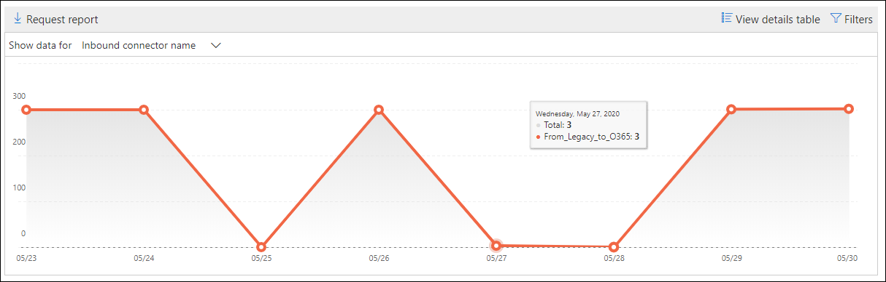

# Informe de dominio no aceptado en el centro de seguridad & cumplimientoNon-accepted domain report in the Security & Compliance Center

El informe de **dominio no aceptado** del [Panel de flujo de correo](mail-flow-insights-v2.md) en el centro de [seguridad & cumplimiento](https://protection.office.com) muestra información sobre los mensajes de la organización de correo electrónico local donde el dominio del remitente no está configurado como un dominio aceptado en la organización de Microsoft 365.The **Non-accepted domain** report in the [Mail flow dashboard](mail-flow-insights-v2.md) in the [Security & Compliance Center](https://protection.office.com) displays information about messages from your on-premises email organization where the sender's domain isn't configured as an accepted domain in your Microsoft 365 organization.

Microsoft 365 puede limitar estos mensajes si tenemos datos para probar que la intención de estos mensajes es malintencionada.Microsoft 365 might throttle these messages if we have data to prove that the intent of these messages is malicious. Por lo tanto, es importante que comprenda lo que está sucediendo y que solucione el problema.Therefore, it's important for you to understand what's happening and to fix the issue.

## Vista informes para el informe de dominio no aceptadoReport view for the Non-accepted domain report

Al hacer clic en el gráfico en el widget de **dominio no aceptado** , irá al informe de **dominio no aceptado** .Clicking the chart on the **Non-accepted domain** widget will take you to the **Non-accepted domain** report.

De forma predeterminada, se muestra la actividad de todos los conectores afectados.By default, the activity for all affected connectors is shown. Si hace clic en **Mostrar datos de**, puede seleccionar un conector específico en la lista desplegable.If you click **Show data for**, you can select a specific connector from the dropdown.

Si desplaza el puntero sobre un punto de datos (día) del gráfico, verá el número total de mensajes para el conector.If you hover over a data point (day) in the chart, you'll see the total number of messages for the connector.

## Vista de tabla de detalles para el informe de dominio no aceptadoDetails table view for the Non-accepted domain report

Si hace clic en **ver tabla de detalles** en una vista de informe, se mostrará la siguiente información:If you click **View details table** in a report view, the following information is shown:

- **Fecha****Date**
- **Nombre del conector de entrada****Inbound connector name**
- **Dominio del remitente****Sender domain**
- **Número de mensajes****Message count**
- **Mensajes de ejemplo**: los identificadores de mensaje de una muestra de mensajes afectados.**Sample messages**: The message IDs of a sample of affected messages.

Si hace clic en **filtros** en una vista de tabla de detalles, puede especificar un intervalo de fechas con **fecha de inicio** y fecha de **finalización**.If you click **Filters** in a details table view, you can specify a date range with **Start date** and **End date**.

Para enviar por correo electrónico el informe de un intervalo de fechas específico a uno o más destinatarios, haga clic en **solicitar descarga**.To email the report for a specific date range to one or more recipients, click **Request download**.

Cuando se selecciona una fila de la tabla, aparece un control flotante con la siguiente información:When you select a row in the table, a flyout appears with the following information:

- **Fecha****Date**
- **Nombre del conector de entrada****Inbound connector name**
- **Dominio del remitente****Sender domain**
- **Número de mensajes****Message count**
- **Mensajes de ejemplo**: puede hacer clic en **Ver mensajes de muestra** para ver los resultados de [seguimiento de mensajes](message-trace-scc.md) para obtener una muestra de los mensajes afectados.**Sample messages**: You can click **View sample messages** to see the [message trace](message-trace-scc.md) results for a sample of the affected messages.

Para volver a la vista informes, haga clic en **Ver informe**.To go back to the reports view, click **View report**.

## Temas relacionadosRelated topics

Para obtener información sobre otras informaciones del panel de flujo de correo, consulte [mail Flow Insights en el centro de seguridad & cumplimiento](mail-flow-insights-v2.md).For information about other insights in the Mail flow dashboard, see [Mail flow insights in the Security & Compliance Center](mail-flow-insights-v2.md).
