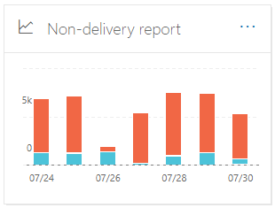
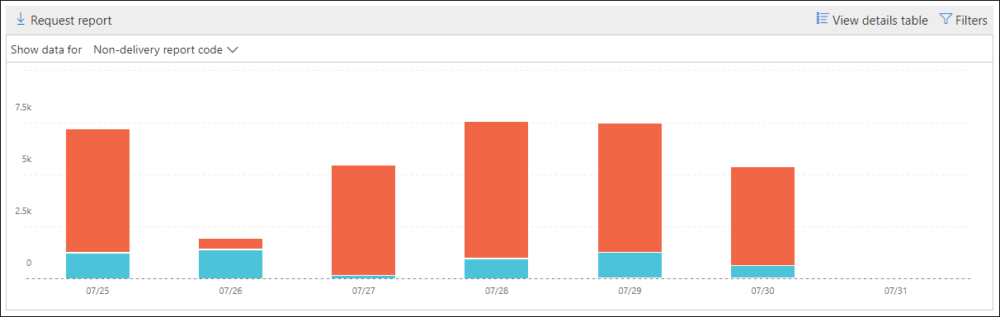

# Informe de no entrega en el centro de seguridad & cumplimiento

El **Informe de no entrega** del [Panel de flujo de correo](mail-flow-insights-v2.md) del [centro de seguridad & cumplimiento](https://protection.office.com) muestra los códigos de error más encontrados en los informes de no entrega (también conocidos como NDR o mensajes de devolución) para los usuarios de la organización. Este informe muestra los detalles de NDR para que pueda solucionar problemas de entrega de correo electrónico.

## Vista informes para el informe de no entrega

Al hacer clic en el widget **Informe de no entrega** , irá al **Informe de no entrega**.

De forma predeterminada, se muestra la actividad de todos los códigos de error. Si hace clic en **Mostrar datos de**, puede seleccionar un código de error específico en la lista desplegable.

Si desplaza el puntero sobre un color específico (código de error) en un día específico del gráfico, verá el número total de mensajes para el error.

## Vista de tabla de detalles para el informe de no entrega

Si hace clic en **ver tabla de detalles** en una vista de informe, se mostrará la siguiente información:

- **Fecha**
- **Código de informe de no entrega**
- **Count**
- **Mensajes de ejemplo**: los identificadores de mensaje de una muestra de mensajes afectados.

Si hace clic en **filtros** en una vista de tabla de detalles, puede especificar un intervalo de fechas con **fecha de inicio** y fecha de **finalización**.

Para enviar por correo electrónico el informe de un intervalo de fechas específico a uno o más destinatarios, haga clic en **solicitar descarga**.

Cuando se selecciona una fila de la tabla, aparece un control flotante con la siguiente información:

- **Fecha**
- Código de error de **Informe de no entrega**: puede hacer clic en el vínculo para buscar más información sobre las causas y soluciones para el código de error específico.
- **Count**
- **Mensajes de ejemplo**: puede hacer clic en **Ver mensajes de muestra** para ver los resultados de [seguimiento de mensajes](message-trace-scc.md) para obtener una muestra de los mensajes afectados.

## Temas relacionados

Para obtener información sobre otras informaciones del panel de flujo de correo, consulte [mail Flow Insights en el centro de seguridad & cumplimiento](mail-flow-insights-v2.md).
