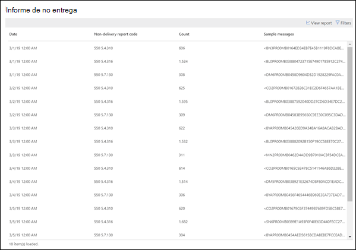
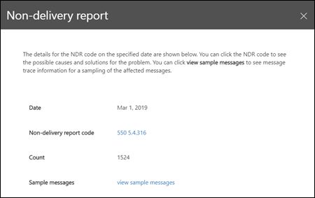

# Informe de no entrega

El **Informe de no entrega** muestra los códigos de error más encontrados en los informes de no entrega (también conocidos como NDR o mensajes de devolución) para los usuarios de su organización. Este informe tiene como objetivo mostrar los detalles de NDR, de modo que pueda solucionar problemas.

Puede mostrar información de todos los códigos NDR o de un código específico haciendo clic en **Mostrar datos de**. También puede hacer clic en **ver tabla de detalles** para ver una vista más detallada como se muestra en el siguiente diagrama:

Cuando selecciona una fila en la tabla para ver los detalles del NDR específico, puede usar la información detallada para solucionar los problemas y realizar las acciones necesarias.

## Temas relacionados

Para obtener más información acerca de otras indicaciones del flujo de correo en el panel de flujo de correo, consulte [mail Flow Insights en el centro de seguridad & cumplimiento](mail-flow-insights-v2.md).
