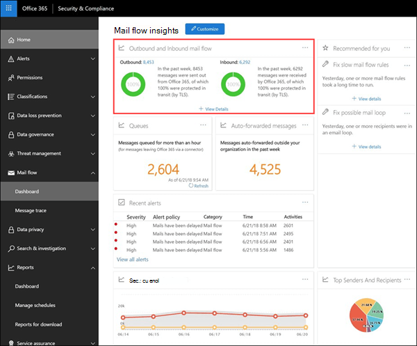

# Flujo de correo entrante y salienteOutbound and inbound mail flow

El widget de **flujo de correo entrante y** saliente combina la información del **Informe de conector** y el anterior **Informe de información general de TLS** en un único punto.The **Outbound and inbound mail flow** widget combines the information from the **Connector Report** and the former **TLS Overview Report** in one place.

La información del widget está relacionada con los conectores y la protección de mensajes TLS en Office 365.The information in the widget is related to connectors and TLS message protection in Office 365. Para obtener más información, vea estos temas:For more information, see these topics:

- [Configure mail flow using connectors in Office 365Configure mail flow using connectors in Office 365](https://docs.microsoft.com/exchange/mail-flow-best-practices/use-connectors-to-configure-mail-flow/use-connectors-to-configure-mail-flow)

- [Cómo Exchange Online usa TLS para proteger las conexiones de correo electrónico en Office 365How Exchange Online uses TLS to secure email connections in Office 365](https://docs.microsoft.com/microsoft-365/compliance/exchange-online-uses-tls-to-secure-email-connections)

## Mensaje protegido en tránsito (por TLS)Message protected in transit (by TLS)

El widget de **flujo de correo entrante y** saliente muestra el cifrado TLS que se usa para la conexión cuando los mensajes se entregan a la organización y desde ella.The **Outbound and inbound mail flow** widget displays the TLS encryption that's used for the connection when messages are delivered to and from your organization. Las conexiones que se establecen con otros servicios de correo electrónico se cifran mediante TLS cuando se ofrece TLS por ambas partes.The connections that are established with other email services are encrypted by TLS when TLS is offered by both sides. El widget ofrece una instantánea de la última semana del flujo de correo.The widget offers a snapshot of the last week of mail flow. Al hacer clic en **Ver detalles**, el control flotante de **mensaje protegido en tránsito (por TLS)** muestra la protección de TLS para los mensajes que entran y salen de la organización.When you click **View Details**, the **Message protected in transit (by TLS)** flyout shows you the TLS protection for messages entering and leaving your organization.

Actualmente, TLS 1,2 es la versión más segura de TLS que ofrece Office 365.Currently, TLS 1.2 is the most secure version of TLS that's offered by Office 365. A menudo, necesitará conocer el cifrado de TLS que se usa para las auditorías de cumplimiento.Often, you'll need to know the TLS encryption that's being used for compliance audits. Probablemente no tiene una relación directa con la mayoría de los servidores de correo electrónico de origen y de destino (no es propietario de ellos, ni tampoco Microsoft), por lo que no tiene muchas opciones para mejorar el cifrado de TLS que usan dichos servidores.You probably don't have a direct relationship with most of the source and destination email servers (you don't own them, and neither does Microsoft), so you don't have many options to improve the TLS encryption that's used by those servers.

Sin embargo, puede usar [conectores](https://docs.microsoft.com/exchange/mail-flow-best-practices/use-connectors-to-configure-mail-flow/use-connectors-to-configure-mail-flow) para garantizar la mejor protección de TLS disponible para los mensajes que se envían entre los servidores de correo electrónico y Office 365.But, you can use [connectors](https://docs.microsoft.com/exchange/mail-flow-best-practices/use-connectors-to-configure-mail-flow/use-connectors-to-configure-mail-flow) to ensure the best available TLS protection for messages that are sent between your email servers and Office 365. El flujo de correo entre Microsoft 365 y sus propios servidores de correo electrónico o servidores que pertenecen a sus socios suele ser más importante y sensible que los mensajes normales, por lo que querrá aplicar seguridad y vigilancia adicionales a dichos mensajes.Mail flow between Microsoft 365 and your own email servers or servers that belong to your partners is often more important and sensitive than regular messages, so you'll want to apply extra security and vigilance to those messages. Puede actualizar o arreglar sus propios servidores de correo electrónico para mejorar el cifrado TLS que se está usando o llegar a sus asociados para hacer lo mismo.You can upgrade or fix your own email servers to improve the TLS encryption that's being used, or reach out to your partners to do the same. El **Informe de conectores** muestra el volumen del flujo de correo y el cifrado TLS para los mensajes que usan los conectores 365 de Microsoft.The **Connector Report** displays both mail flow volume and TLS encryption for messages that use your Microsoft 365 connectors.

## Informe de conectorConnector report

Al hacer clic en el vínculo del **Informe del conector** desde el control flotante **protegido en tránsito (por TLS)** , el informe muestra información acerca de los mensajes que se entregan a la organización y desde ella mediante conectores.When you click on the **Connector Report** link from the **Message protected in transit (by TLS)** flyout, the report displays information about messages that are delivered to and from your organization using connectors. Los conectores se usan entre sus propios servidores de correo electrónico y los servidores de Microsoft 365 o sus asociados y Office 365.You use connectors between your own email servers and Microsoft 365 or your partner's servers and Office 365. El volumen del mensaje para cada conector y el cifrado TLS para la conexión está disponible.The message volume for each connector and the TLS encryption for the connection is available. Además, también puede ver los datos de los mensajes enviados o recibidos en Microsoft 365 sin usar un conector.In addition, you can also view data for messages that were sent or received in Microsoft 365 without using a connector.

La vista de **flujo de correo** muestra el volumen de mensajes a través del conector de la semana pasada.The **Mail Flow** view shows the volume of messages through the connector for the past week. Puede cambiar el intervalo de fechas seleccionando **filtro** , donde puede aumentar el intervalo a un máximo de 30 días.You can change the date range by selecting **Filter** where you can increase the range to a maximum of 30 days. La vista **todo el flujo de correo** muestra todo el flujo de correo hacia y desde la organización a través de todos los conectores.The **All Mail Flow** view shows all mail flow to and from your organization through all connectors. Puede seleccionar un conector específico por nombre en el menú desplegable.You can select a specific connector by name in the drop down menu.

Puede seleccionar la vista de **uso de TLS** de la lista desplegable para ver el desglose de la protección TLS para los mensajes a través del conector.You can select the **TLS usage** view from the drop down to see the breakdown of TLS protection for messages through the connector. Al igual que con el informe de **Informe General de TLS** , esta vista muestra el porcentaje de las diferentes versiones de TLS.As with the **TLS Overview Report** report, this view shows the percentage of the different TLS versions. Para las conexiones TLS 1,0, es necesario que el servidor de correo electrónico o el servidor de su compañero se actualice o se corrija para evitar problemas cuando la compatibilidad con TLS 1,0 está en desuso en Office 365.For TLS 1.0 connections, you really need to get your email server or your partner's server upgraded or fixed to avoid any issues when TLS 1.0 support is eventually deprecated in Office 365. Para obtener más información, vea [información de referencia técnica sobre el cifrado en Office 365](https://docs.microsoft.com/microsoft-365/compliance/technical-reference-details-about-encryption).For more information, see [Technical reference details about encryption in Office 365](https://docs.microsoft.com/microsoft-365/compliance/technical-reference-details-about-encryption).

La información apunta a los conectores para ayudar a atraer la atención sobre posibles problemas de cifrado de TLS para el conector.Insights point to connectors to help draw your attention to potential TLS encryption problems for the connector. La información es: **ningún TLS es superior al 25%** o **TLS 1,0 es superior al 50%**.The insights are: **No TLS is over 25%** or **TLS 1.0 is above 50%**. Si ve esta información, debe investigar los servidores de correo electrónico que están asociados con el conector o ponerse en contacto con la organización asociada.If you see these insights, you need to investigate your email servers that are associated with the connector, or reach out to your partner organization.

## Vea tambiénSee also

Para obtener más información acerca de otras indicaciones del flujo de correo en el panel de flujo de correo, consulte [mail Flow Insights en el centro de seguridad & cumplimiento](mail-flow-insights-v2.md).For more information about other mail flow insights in the mail flow dashboard, see [Mail flow insights in the Security & Compliance Center](mail-flow-insights-v2.md).
