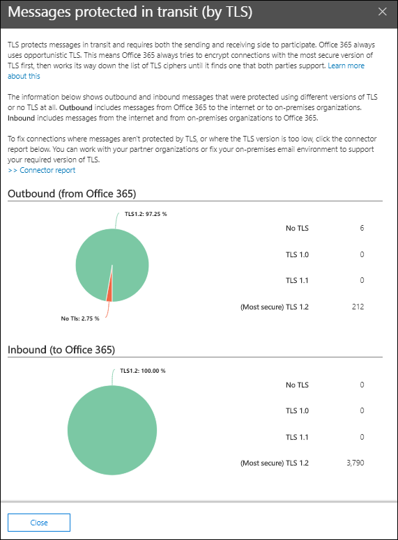

# Visión del flujo de correo entrante y saliente en el centro de seguridad & cumplimiento

La introducción al **flujo de correo entrante y** saliente del [Panel de flujo de correo](mail-flow-insights-v2.md) del centro de seguridad & cumplimiento combina la información del [Informe de conector](view-mail-flow-reports.md#connector-report) y del antiguo Informe de **información general de TLS** en un único punto.

El widget muestra el cifrado TLS que se usa para la conexión cuando los mensajes se entregan a la organización y desde ella. Las conexiones que se establecen con otros servicios de correo electrónico se cifran mediante TLS cuando se ofrece TLS por ambas partes. El widget ofrece una instantánea de la última semana del flujo de correo.

La información del widget está relacionada con los conectores y la protección de mensajes TLS en Microsoft 365. Para obtener más información, vea estos temas:

- [Configurar el flujo de correo mediante conectores](https://docs.microsoft.com/exchange/mail-flow-best-practices/use-connectors-to-configure-mail-flow/use-connectors-to-configure-mail-flow)
- [Uso de TLS por Exchange Online para proteger las conexiones de correo electrónico](https://docs.microsoft.com/microsoft-365/compliance/exchange-online-uses-tls-to-secure-email-connections)
- [Detalles de referencia técnica sobre el cifrado en Microsoft 365](https://docs.microsoft.com/microsoft-365/compliance/technical-reference-details-about-encryption)

## Mensaje protegido en tránsito (por TLS)

Al hacer clic en **Ver detalles** en el widget, el control flotante de **mensaje protegido en tránsito (por TLS)** muestra la protección de TLS para los mensajes que entran y salen de la organización.

Actualmente, TLS 1,2 es la versión más segura de TLS que ofrece Microsoft 365. A menudo, necesitará conocer el cifrado de TLS que se usa para las auditorías de cumplimiento. Probablemente no tiene una relación directa con la mayoría de los servidores de correo electrónico de origen y de destino (no es propietario de ellos, ni tampoco Microsoft), por lo que no tiene muchas opciones para mejorar el cifrado de TLS que usan dichos servidores.

Sin embargo, puede usar [conectores](https://docs.microsoft.com/exchange/mail-flow-best-practices/use-connectors-to-configure-mail-flow/use-connectors-to-configure-mail-flow) para garantizar la mejor protección de TLS disponible para los mensajes que se envían entre los servidores de correo electrónico y Microsoft 365. El flujo de correo entre Microsoft 365 y sus propios servidores de correo electrónico o servidores que pertenecen a sus socios suele ser más importante y sensible que los mensajes normales, por lo que querrá aplicar seguridad y vigilancia adicionales a dichos mensajes.

Puede actualizar o arreglar sus propios servidores de correo electrónico para mejorar el cifrado TLS que se está usando o llegar a sus asociados para hacer lo mismo. El **Informe de conectores** muestra el volumen del flujo de correo y el cifrado TLS para los mensajes que usan los conectores 365 de Microsoft.

Puede hacer clic en el vínculo de **Informe de conector** para ir al [Informe de conector](view-mail-flow-reports.md#connector-report). La siguiente información puede estar disponible en la página de **Informe de conector** si se ha detectado la condición asociada:

- **Conector del asociado de entrada que ve un flujo de correo de TLS 1.0 importante**
- **Conector local de entrada que ve un flujo de correo de TLS 1.0 importante**

Para las conexiones TLS 1,0, es necesario que el servidor de correo electrónico o el servidor de su compañero se actualice o se corrija para evitar problemas cuando la compatibilidad con TLS 1,0 está en desuso en Microsoft 365.

## Vea también

Para obtener información sobre otras informaciones del panel de flujo de correo, consulte [mail Flow Insights en el centro de seguridad & cumplimiento](mail-flow-insights-v2.md).
