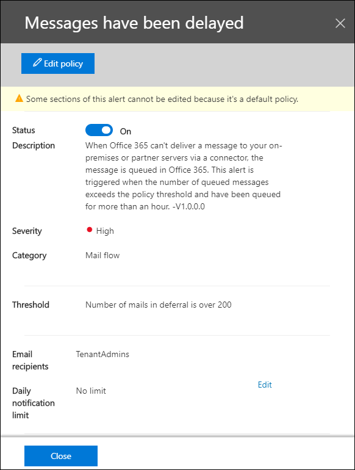

# Pone en cola información en el centro de seguridad & cumplimientoQueues insight in the Security & Compliance Center

Cuando los mensajes no se pueden enviar desde la organización a los servidores de correo electrónico locales o asociados mediante conectores, los mensajes se colocan en la cola de Microsoft 365.When messages can't be sent from your organization to your on-premises or partner email servers using connectors, the messages are queued in Microsoft 365. Algunos ejemplos comunes que causan esta condición son:Common examples that cause this condition are:

- El conector está configurado incorrectamente.The connector is incorrectly configured.
- Ha habido cambios en la red o en el firewall en su entorno local.There have been networking or firewall changes in your on-premises environment.

Microsoft 365 seguirá reintentando la entrega durante 24 horas.Microsoft 365 will continue to retry to delivery for 24 hours. Transcurridas las 24 horas, los mensajes expirarán y se devolverán a los remitentes en informes de no entrega (también conocidos como NDR o mensajes de devolución).After 24 hours, the messages will expire and will be returned to the senders in non-delivery reports (also known as a NDRs or bounce messages).

Si el volumen de correo electrónico en cola supera el umbral predefinido (el valor predeterminado es de 200 mensajes), la información está disponible en las siguientes ubicaciones:If the queued email volume exceeds the pre-defined threshold (the default value is 200 messages), the information is available in the following locations:

- Las **colas** profundizan en el [panel del flujo de correo](mail-flow-insights-v2.md) en el [centro de seguridad & cumplimiento](https://protection.office.com).The **Queues** insight in the [Mail flow dashboard](mail-flow-insights-v2.md) in the [Security & Compliance Center](https://protection.office.com). Para obtener más información, vea la información [sobre las colas en la sección panel de flujo de correo](#queues-insight-in-the-mail-flow-dashboard) de este tema.For more information, see the [Queues insight in the Mail flow dashboard](#queues-insight-in-the-mail-flow-dashboard) section in this topic.
  
- Se muestra una alerta en el panel de alertas del centro de [seguridad & cumplimiento](https://protection.office.com) (panel de**alertas** o) en **Alerts recents** \> **Dashboard** <https://protection.office.com/alertsdashboard> .An alert is displayed in **Recent alerts** the Alerts dashboard in the [Security & Compliance Center](https://protection.office.com) (**Alerts** \> **Dashboard** or <https://protection.office.com/alertsdashboard>).

  

- Los administradores recibirán una notificación de correo electrónico basada en la configuración de la Directiva de alertas predeterminada denominada **mensajes que se han retrasado**.Admins will receive an email notification based on the configuration of the default alert policy named **Messages have been delayed**. Para establecer la configuración de las notificaciones para esta alerta, consulte la siguiente sección.To configure the notification settings for this alert, see the next section.

  Para obtener más información acerca de las directivas de alertas, consulte [directivas de alerta en el centro de seguridad & cumplimiento](../../compliance/alert-policies.md).For more information about alert policies, see [Alert policies in the Security & Compliance Center](../../compliance/alert-policies.md).

## Personalizar alertas de colaCustomize queue alerts

1. En el [centro de seguridad & cumplimiento](https://protection.office.com), vaya a directivas de alerta de **alertas** \> **Alert policies** o abrir <https://protection.office.com/alertpolicies> .In the [Security & Compliance Center](https://protection.office.com), go to **Alerts** \> **Alert policies** or open <https://protection.office.com/alertpolicies>.

2. En la página **directivas de alerta** , busque y seleccione la Directiva denominada **mensajes que se han retrasado**.On the **Alert policies** page, find and select the policy named **Messages have been delayed**.

3. En el **mensaje se ha retrasado** el control flotante que se abre, puede activar o desactivar la alerta y configurar las opciones de notificación.In the **Message have been delayed** flyout that opens, you can turn the alert on or off and configure the notification settings.

   

   - **Estado**: puede activar o desactivar la alerta.**Status**: You can toggle the alert on or off.

   - **Destinatarios de correo electrónico** y **límite de notificaciones diarias**: haga clic en **Editar** para configurar las opciones siguientes:**Email recipients** and **Daily notification limit**: Click **Edit** to configure the following settings:

4. Para establecer la configuración de las notificaciones, haga clic en **Editar**.To configure the notification settings, click **Edit**. En el control flotante **Editar Directiva** que aparece, configure las siguientes opciones:In the **Edit policy** flyout that appears, configure the following settings:

   - **Enviar notificaciones por correo electrónico**: el valor predeterminado es activado.**Send email notifications**: The default value is on.
   - **Destinatarios de correo electrónico**: el valor predeterminado es **TenantAdmins**.**Email recipients**: The default value is **TenantAdmins**.
   - **Límite de notificación diario**: el valor predeterminado es **sin límite**.**Daily notification limit**: The default value is **No limit**.
   - **Umbral**: el valor predeterminado es 200.**Threshold**: The default value is 200.

   

5. Cuando haya terminado, haga clic en **Guardar** y **cerrar**.When you're finished, click **Save** and **Close**.

## Pone en cola información en el panel de flujo de correoQueues insight in the Mail flow dashboard

Incluso si el volumen de mensajes en cola no ha superado el umbral y ha generado una alerta, puede usar la información de las **colas** del [panel del flujo de correo](mail-flow-insights-v2.md) para ver los mensajes que se han puesto en cola durante más de una hora y emprender acciones antes de que el número de mensajes en cola sea demasiado grande.Even if the queued message volume hasn't exceeded the threshold and generated an alert, you can still use the **Queues** insight in the [Mail flow dashboard](mail-flow-insights-v2.md) to see messages that have been queued for more than one hour, and take action before the number of queued messages becomes too large.

Si hace clic en el número de mensajes del widget, aparece un control flotante **en cola de mensajes** con la siguiente información:If you click the number of messages on the widget, a **Messages queued** flyout appears with the following information:

- **Número de mensajes en cola****Number of queued messages**
- **Nombre del conector**: haga clic en el nombre del conector para administrar el conector en el centro de administración de Exchange (EAC).**Connector name**: Click on the connector name to manage the connector in the Exchange admin center (EAC).
- **Tiempo de inicio de la cola****Queue started time**
- **Los mensajes más antiguos expiraron****Oldest messages expired**
- **Servidor de destino****Destination server**
- **Última dirección IP****Last IP address**
- **Último error****Last error**
- **Procedimiento para la corrección**: hay disponibles problemas y soluciones comunes.**How to fix**: Common issues and solutions are available. Si es un vínculo **arreglar ahora** está disponible, haga clic en él para solucionar el problema.If is a **Fix it now** link is available, click it to fix the problem. De lo contrario, haga clic en los vínculos disponibles para obtener más información sobre el error y las posibles soluciones.Otherwise, click on any available links for more information about the error and possible solutions.

Se muestra el mismo control flotante después de hacer clic en **Ver cola** en los detalles de los **mensajes se han retrasado** la alerta.The same flyout is displayed after you click **View queue** in the details of a **Messages have been delayed** alert.

## Recursos adicionalesSee also

Para obtener información sobre otras informaciones del panel de flujo de correo, consulte [mail Flow Insights en el centro de seguridad & cumplimiento](mail-flow-insights-v2.md).For information about other insights in the Mail flow dashboard, see [Mail flow insights in the Security & Compliance Center](mail-flow-insights-v2.md).
