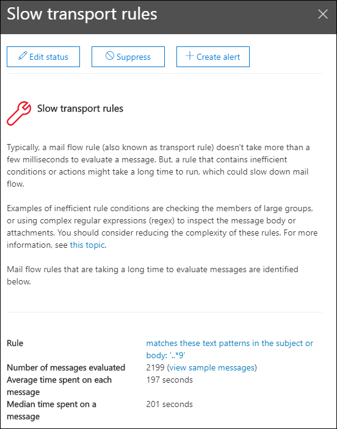

# Corrección de las reglas de flujo de correo lenta información del centro de seguridad & cumplimientoFix slow mail flow rules insight in the Security & Compliance Center

[!INCLUDE [Microsoft 365 Defender rebranding](../includes/microsoft-defender-for-office.md)]

Las reglas de flujo de correo ineficiente (también conocidas como reglas de transporte) pueden llevar a retrasos en el flujo de correo de la organización.Inefficient mail flow rules (also known as transport rules) can lead to mail flow delays for your organization. Esta visión informa de las reglas de flujo de correo que afectan al flujo de correo de su organización.This insight reports mail flow rules that have an impact on your organization's mail flow. Algunos ejemplos de estos tipos de reglas son:Examples of these types of rules include:

- Condiciones que usan **son miembros de** grupos grandes.Conditions that use **Is member of** for large groups.
- Condiciones que usan la coincidencia de patrón de expresiones regulares complejas (regex).Conditions that use complex regular expression (regex) pattern matching.
- Condiciones que usan la comprobación de contenido en datos adjuntos.Conditions that use content checking in attachments.

La opción para **corregir reglas de flujo de correo con lentitud** en el área **recomendada para** el [panel del flujo de correo](mail-flow-insights-v2.md) en el centro de [seguridad & cumplimiento](https://protection.office.com) le avisa cuando una regla de flujo de correo tarda mucho tiempo en completarse.The **Fix slow mail flow rules** insight in the **Recommended for you** area of the [Mail flow dashboard](mail-flow-insights-v2.md) in the [Security & Compliance Center](https://protection.office.com) notifies you when a mail flow rule is taking too long to complete. Esta información sólo aparece cuando se detecta la condición (si no tiene bucles de correo, no verá la información).This insight appears only after the condition is detected (if you don't have any mail loops, you won't see the insight).

Puede usar esta notificación para ayudarle a identificar y ajustar las reglas de flujo de correo para ayudar a reducir los retrasos del flujo de correo.You can use this notification to help you to identify and fine-tune mail flow rules to help reduce mail flow delays.

Al hacer clic en **Ver detalles** en el widget, aparece un control flotante con más información:When you click **View details** on the widget, a flyout appears with more information:

- **Regla** : puede desplazar el mouse sobre el resumen para ver todas las condiciones, excepciones y acciones de la regla.**Rule** : You can hover over the summary to see all of the conditions, exceptions, and actions of the rule. Puede hacer clic en el resumen para editar la regla en el centro de administración de Exchange (EAC).You can click on the summary to edit the rule in the Exchange admin center (EAC).
- **Número de mensajes evaluados** : puede hacer clic en **Ver mensajes de ejemplo** para ver los resultados del [seguimiento de mensajes](message-trace-scc.md) para obtener una muestra de los mensajes afectados por la regla.**Number of messages evaluated** : You can click **View sample messages** to see the [message trace](message-trace-scc.md) results for a sample of the messages that were affected by the rule.
- **Tiempo promedio invertido en cada mensaje****Average time spent on each message**
- **Tiempo medio invertido en un mensaje** : el valor medio que separa la mitad superior de la mitad inferior de los datos de tiempo.**Median time spent on a message** : The middle value that separates the upper half from the lower half of time data.

Para obtener más información acerca de las condiciones y excepciones de las reglas de flujo de correo en Exchange Online, consulte [mail Flow Rule conditions and Exceptions (Predicates) in Exchange Online](https://docs.microsoft.com/Exchange/security-and-compliance/mail-flow-rules/conditions-and-exceptions).For more information about conditions and exceptions in mail flow rules in Exchange Online, see [Mail flow rule conditions and exceptions (predicates) in Exchange Online](https://docs.microsoft.com/Exchange/security-and-compliance/mail-flow-rules/conditions-and-exceptions).

## Temas relacionadosRelated topics

Para obtener información sobre otras informaciones del panel de flujo de correo, consulte [mail Flow Insights en el centro de seguridad & cumplimiento](mail-flow-insights-v2.md).For information about other insights in the Mail flow dashboard, see [Mail flow insights in the Security & Compliance Center](mail-flow-insights-v2.md).
