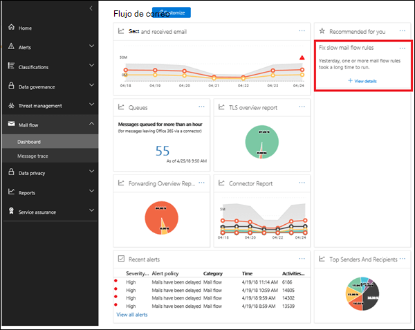

# Reporte de reglas de flujo de correo lentoSlow mail flow rules insight

Las reglas de flujo de correo ineficiente (también conocidas como reglas de transporte) pueden llevar a retrasos en el flujo de correo de la organización.Inefficient mail flow rules (also known as transport rules) can lead to mail flow delays for your organization. Esta visión informa de las reglas de flujo de correo que afectan al flujo de correo de su organización.This insight reports mail flow rules that have an impact on your organization's mail flow. Algunos ejemplos de estos tipos de reglas son:Examples of these types of rules are:

- Condiciones que usan **son miembros de** grupos grandes.Conditions that use **Is member of** for large groups.

- Condiciones que usan la coincidencia de patrón de expresiones regulares complejas (regex).Conditions that use complex regular expression (regex) pattern matching.

- Condiciones que usan la comprobación de contenido en datos adjuntos.Conditions that use content checking in attachments.

La información le ayudará a identificar y ajustar las reglas de flujo de correo para ayudar a reducir los retrasos del flujo de correo.The insight will help you to identify and fine-tune mail flow rules to help reduce mail flow delays.

Al hacer clic en **Ver detalles**, aparece un panel flotante donde puede revisar la regla.When you click **View details**, a flyout pane appears where you can review the rule. En el panel de flotante, también puede hacer clic en **Ver mensajes de muestra** para ver el tipo de mensajes que se ven afectados por la regla.In the flyout pane, can also click **view sample messages** to see what kind of messages are impacted by the rule.

## Temas relacionadosRelated topics

Para obtener más información acerca de otras indicaciones del flujo de correo en el panel de flujo de correo, consulte [mail Flow Insights en el centro de seguridad & cumplimiento](mail-flow-insights-v2.md).For more information about other mail flow insights in the mail flow dashboard, see [Mail flow insights in the Security & Compliance Center](mail-flow-insights-v2.md).
