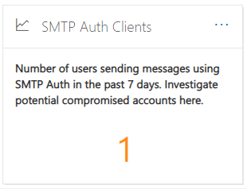
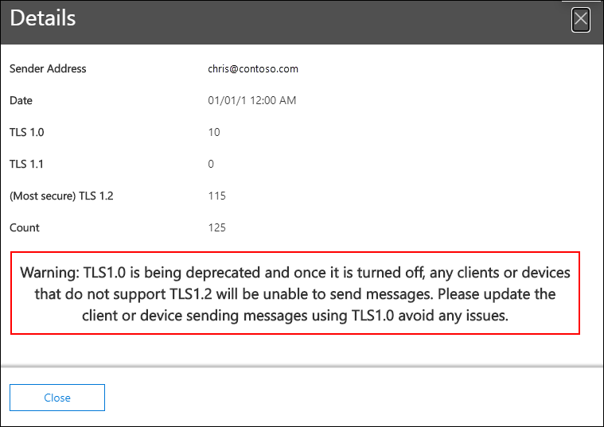

# Información e informes de clientes de autenticación SMTP en el Centro de & cumplimiento

[!INCLUDE [Microsoft 365 Defender rebranding](../includes/microsoft-defender-for-office.md)]

**Se aplica a**
- [Exchange Online Protection](https://go.microsoft.com/fwlink/?linkid=2148611)
- [Microsoft Defender para Office 365 plan 1 y plan 2](https://go.microsoft.com/fwlink/?linkid=2148715)
- [Microsoft 365 Defender](https://go.microsoft.com/fwlink/?linkid=2118804)

La información de los  clientes de autenticación **SMTP** en el panel de flujo de correo y el informe de clientes de autenticación [SMTP](#smtp-auth-clients-report) asociados en el Centro de seguridad y cumplimiento de [&](https://protection.office.com) resaltan el uso del protocolo de envío de cliente AUTH SMTP por parte de los usuarios o cuentas del sistema de su organización. Este protocolo heredado (que usa el punto de conexión smtp.office365.com) solo ofrece autenticación básica y es susceptible de ser usado por cuentas comprometidas para enviar correo electrónico. La información y el informe le permiten comprobar si hay actividad inusual en los envíos de correo electrónico SMTP AUTH. También muestra los datos de uso de TLS para clientes o dispositivos que usan SMTP AUTH.

El widget indica el número de usuarios o cuentas de servicio que han usado el protocolo de autenticación SMTP en los últimos 7 días.

Si hace clic en el número de mensajes del widget, aparecerá un control flotante de clientes de autenticación **SMTP.** El menú desplegable proporciona una vista agregada del uso de TLS y los volúmenes de la última semana.

Puede hacer clic en el vínculo del informe de **clientes de** autenticación SMTP para ir al informe de clientes de autenticación SMTP, tal como se describe en la sección siguiente.

## Informe de clientes de autenticación SMTP

### Vista de informes para el informe de clientes de autenticación SMTP

De forma predeterminada, el informe muestra los datos de los últimos 7 días, pero los datos están disponibles para los últimos 90 días.

La sección de información general contiene los siguientes gráficos:

- **Ver datos por:** Volumen de envío: De forma predeterminada, el gráfico muestra el número de mensajes de cliente de autenticación SMTP que se enviaron desde todos los dominios ( Mostrar datos **para:** Todos los dominios de remitente está seleccionado de forma predeterminada). Puede filtrar los resultados a un  dominio de remitente específico haciendo clic en Mostrar datos para y seleccionando el dominio del remitente en la lista desplegable. Si mantiene el puntero sobre un punto de datos específico (día), se muestra el número de mensajes.

  

- **Ver datos por: Uso de TLS:** el gráfico muestra el porcentaje de uso de TLS para todos los mensajes de cliente de autenticación SMTP durante el período de tiempo seleccionado. Este gráfico le permite identificar y tomar medidas en usuarios y cuentas del sistema que siguen usando versiones anteriores de TLS.

  

Si hace clic **en Filtros** en una vista de informe, puede especificar un intervalo de fechas con fecha **de inicio** y fecha **de finalización.**

Haga **clic en Solicitar** informe para recibir una versión más detallada del informe en un mensaje de correo electrónico. Puede especificar el intervalo de fechas y los destinatarios para recibir el informe.

### Vista de tabla de detalles para el informe de clientes de autenticación SMTP

Si hace clic **en Ver tabla de detalles,** la información que se muestra depende del gráfico que estaba viendo:

- **Ver datos por: Volumen de envío:** en una tabla se muestra la siguiente información:

  - **Dirección del remitente**
  - **Recuento de mensajes**

  Si seleccionas una fila, se muestran los mismos detalles en un menú desplegable.

- **Ver datos por: Uso de TLS:** en una tabla se muestra la siguiente información:

  - **Dirección del remitente**
  - **TLS1,0%**\*
  - **TLS1,1%**\*
  - **TLS1,2%**\*
  - **Recuento de mensajes**

  \* Esta columna muestra el porcentaje y el número de mensajes del remitente.

Si hace clic **en Filtros en** una vista de tabla de detalles, puede especificar un intervalo de fechas con fecha de **inicio** y fecha **de finalización.**

Si seleccionas una fila, se muestran detalles similares en un menú desplegable:

Haga **clic en Solicitar** informe para recibir una versión más detallada del informe en un mensaje de correo electrónico. Puede especificar el intervalo de fechas y los destinatarios para recibir el informe.

Para volver a la vista informes, haga clic **en Ver informe.**

## Temas relacionados

Para obtener información acerca de otras perspectivas en el panel de flujo de correo, vea Información sobre el flujo de correo en el Centro de [& cumplimiento.](mail-flow-insights-v2.md)
