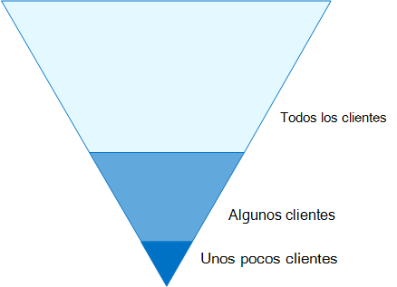
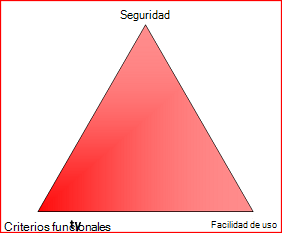
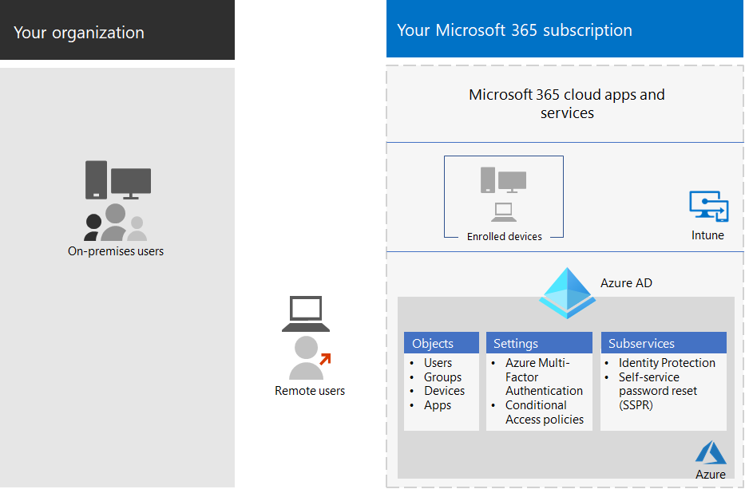

# Configuraciones de acceso a dispositivos e identidades

**Se aplica a**
- [Exchange Online Protection](https://go.microsoft.com/fwlink/?linkid=2148611)
- [Plan 1 y Plan 2 de Microsoft Defender para Office 365](https://go.microsoft.com/fwlink/?linkid=2148715)

El perímetro de seguridad moderno de la organización ahora se extiende más allá de la red para incluir a los usuarios que acceden a aplicaciones basadas en la nube desde cualquier ubicación con una variedad de dispositivos. La infraestructura de seguridad debe determinar si se debe conceder una solicitud de acceso determinada y en qué condiciones.

Esta determinación debe basarse en la cuenta de usuario del inicio de sesión, el dispositivo que se usa, la aplicación que usa el usuario para el acceso, la ubicación desde la que se realiza la solicitud de acceso y una evaluación del riesgo de la solicitud. Esta funcionalidad le permite garantizar que solo los usuarios y dispositivos aprobados puedan acceder a los recursos críticos.

En esta serie de artículos se describe un conjunto de configuraciones de requisitos previos de acceso a dispositivos e identidades y un conjunto de acceso condicional de Azure Active Directory (Azure AD), Microsoft Intune y otras directivas para proteger el acceso a Microsoft 365 para servicios y aplicaciones en la nube empresariales, otros servicios SaaS y aplicaciones locales publicados con el Proxy de aplicación de Azure AD.

La configuración y las directivas de acceso a dispositivos e identidades se recomiendan en tres niveles: protección de línea base, protección confidencial y protección para entornos con datos altamente regulados o clasificados. Estos niveles y sus configuraciones correspondientes proporcionan niveles de protección coherentes en los datos, las identidades y los dispositivos.

Estas funcionalidades y sus recomendaciones:

- Son compatibles con Microsoft 365 E3 y Microsoft 365 E5.
- Se alinean con [la puntuación de seguridad de Microsoft,](https://docs.microsoft.com/microsoft-365/security/mtp/microsoft-secure-score) así como con la [puntuación de identidad](https://docs.microsoft.com/azure/active-directory/fundamentals/identity-secure-score)en Azure AD, y aumentarán estas puntuaciones para su organización.
- Le ayudará a implementar estos [cinco pasos para proteger su infraestructura de identidad.](https://docs.microsoft.com/azure/security/azure-ad-secure-steps)

Si su organización tiene requisitos o complejidades de entorno únicos, use estas recomendaciones como punto de partida. Sin embargo, la mayoría de las organizaciones pueden implementar estas recomendaciones según lo indicado.

Vea este vídeo para obtener una introducción rápida a las configuraciones de acceso a dispositivos e identidades de Microsoft 365 para empresas.
 
 
> [!VIDEO https://www.microsoft.com/videoplayer/embed/RWxEDQ]

> [!NOTE]
> Microsoft también vende licencias de Enterprise Mobility + Security (EMS) para suscripciones de Office 365. Las capacidades de EMS E3 y EMS E5 son equivalentes a las de Microsoft 365 E3 y Microsoft 365 E5. Consulte [los planes de EMS](https://www.microsoft.com/microsoft-365/enterprise-mobility-security/compare-plans-and-pricing) para obtener más información.

## Público objetivo

Estas recomendaciones están dirigidas a arquitectos empresariales y profesionales de TI familiarizados con los servicios de productividad y seguridad de la nube de Microsoft 365, que incluye Azure AD (identidad), Microsoft Intune (administración de dispositivos) y Azure Information Protection (protección de datos).

### Entorno del cliente

Las directivas recomendadas se aplican a las organizaciones empresariales que operan completamente en la nube de Microsoft y a los clientes con infraestructura de identidad híbrida, que es un bosque local de Servicios de dominio de Active Directory (AD DS) que se sincroniza con un inquilino de Azure AD.

Muchas de las recomendaciones proporcionadas se basan en los servicios disponibles solo con las licencias de Microsoft 365 E5, Microsoft 365 E3 con la identidad & Threat Protection, EMS E5 o Azure Premium P2.

Para las organizaciones que no tienen estas licencias, Microsoft le recomienda al menos implementar valores predeterminados de [seguridad,](https://docs.microsoft.com/azure/active-directory/fundamentals/concept-fundamentals-security-defaults)que se incluyen en todos los planes de Microsoft 365.

### Advertencias

Su organización puede estar sujeta a requisitos normativos u otros requisitos de cumplimiento, incluidas recomendaciones específicas que pueden requerir que aplique directivas que difieren de estas configuraciones recomendadas. Estas configuraciones recomiendan controles de uso que históricamente no han estado disponibles. Recomendamos estos controles porque creemos que representan un equilibrio entre la seguridad y la productividad.

Hemos hecho todo lo posible para tener en cuenta una amplia variedad de requisitos de protección de la organización, pero no podemos tener en cuenta todos los requisitos posibles ni todos los aspectos únicos de su organización.

## Tres niveles de protección

La mayoría de las organizaciones tienen requisitos concretos relacionados con la seguridad y la protección de datos. Estos requisitos varían dentro de las organizaciones según el segmento sectorial y las funciones de trabajo. Por ejemplo, es posible que el departamento legal y los administradores requieran controles de seguridad y protección de la información adicionales en torno a su correspondencia de correo electrónico que no sean necesarios para otras unidades de negocio.

Cada sector además tiene su propio conjunto de normas especializadas. En lugar de proporcionar una lista de todas las opciones de seguridad posibles o una recomendación por segmento del sector o función de trabajo, se han proporcionado recomendaciones para tres niveles diferentes de seguridad y protección que se pueden aplicar en función de la granularidad de sus necesidades.

- **Protección de línea** base: se recomienda establecer un estándar mínimo para proteger los datos, así como las identidades y los dispositivos que acceden a los datos. Puede seguir estas recomendaciones de línea base para proporcionar una protección segura predeterminada que satisfaga las necesidades de muchas organizaciones.
- **Protección confidencial:** algunos clientes tienen un subconjunto de datos que deben protegerse en niveles superiores, o pueden requerir que todos los datos estén protegidos en un nivel superior. Puede aplicar una mayor protección a todos los conjuntos de datos o a conjuntos de datos específicos de su entorno de Microsoft 365. Se recomienda proteger las identidades y los dispositivos que acceden a información confidencial con niveles de seguridad comparables.
- **Altamente regulado:** algunas organizaciones pueden tener una pequeña cantidad de datos altamente clasificados, constituyen secretos comerciales o son datos regulados. Microsoft proporciona capacidades para ayudar a las organizaciones a cumplir estos requisitos, incluida protección adicional para identidades y dispositivos.

En esta guía se muestra cómo implementar la protección de identidades y dispositivos para cada uno de estos niveles de protección. Use esta guía como punto de partida para su organización y ajuste las directivas para satisfacer los requisitos específicos de su organización.

Es importante usar niveles coherentes de protección en los datos, identidades y dispositivos. Por ejemplo, si implementa esta guía, asegúrese de proteger los datos en niveles comparables.

El modelo de protección de identidades y dispositivos para la arquitectura de **Microsoft 365** muestra qué capacidades son comparables.

   [Ver como pdf](../../downloads/MSFT_cloud_architecture_identity&device_protection.pdf) \| [Descargar como PDF](https://github.com/MicrosoftDocs/microsoft-365-docs/raw/public/microsoft-365/downloads/MSFT_cloud_architecture_identity&device_protection.pdf) \| [Descargar como visio](https://github.com/MicrosoftDocs/microsoft-365-docs/raw/public/microsoft-365/downloads/MSFT_cloud_architecture_identity&device_protection.vsdx)  

Además, vea la solución Implementar la protección [de la información para las](../../solutions/information-protection-deploy.md) regulaciones de privacidad de datos para proteger la información almacenada en Microsoft 365.

## Equilibrio entre seguridad y productividad

La implementación de cualquier estrategia de seguridad requiere equilibrios entre la seguridad y la productividad. Es útil evaluar cómo afecta cada decisión al equilibrio de seguridad, funcionalidad y facilidad de uso.

Las recomendaciones proporcionadas se basan en los siguientes principios:

- Conozca a los usuarios y sea flexible a sus requisitos funcionales y de seguridad.
- Aplique una directiva de seguridad justo a tiempo y asegúrese de que sea significativa.

## Servicios y conceptos para la protección de acceso a dispositivos e identidades

Microsoft 365 para empresas está diseñado para organizaciones grandes con el objetivo de que todos puedan ser creativos y trabajar juntos de forma segura.

En esta sección se proporciona información general sobre los servicios y funcionalidades de Microsoft 365 que son importantes para el acceso a dispositivos e identidades.

### Azure AD

Azure AD proporciona un conjunto completo de funcionalidades de administración de identidades. Se recomienda usar estas funcionalidades para proteger el acceso.

|Funcionalidad o característica|Description|Licencias|
|---|---|---|
|[Autenticación multifactor (MFA)](/azure/active-directory/authentication/concept-mfa-howitworks)|MFA requiere que los usuarios proporcionen dos formas de verificación, como una contraseña de usuario más una notificación de la aplicación Microsoft Authenticator o una llamada telefónica. MFA reduce en gran medida el riesgo de que se puedan usar credenciales robadas para acceder a su entorno. Microsoft 365 usa el servicio Multi-Factor Authentication de Azure AD para inicios de sesión basados en MFA.|Microsoft 365 E3 o E5|
|[Acceso condicional](/azure/active-directory/conditional-access/overview)|Azure AD evalúa las condiciones del inicio de sesión del usuario y usa directivas de acceso condicional para determinar el acceso permitido. Por ejemplo, en esta guía le mostramos cómo crear una directiva de acceso condicional para requerir el cumplimiento del dispositivo para obtener acceso a datos confidenciales. Esto reduce en gran medida el riesgo de que un hacker con su propio dispositivo y credenciales robadas pueda acceder a los datos confidenciales. También protege los datos confidenciales de los dispositivos, ya que los dispositivos deben cumplir requisitos específicos de seguridad y estado.|Microsoft 365 E3 o E5|
|[Grupos de Azure AD](/azure/active-directory/fundamentals/active-directory-manage-groups)|Las directivas de acceso condicional, la administración de dispositivos con Intune e incluso los permisos para archivos y sitios de la organización dependen de la asignación a cuentas de usuario o grupos de Azure AD. Te recomendamos que crees grupos de Azure AD que se correspondan con los niveles de protección que estás implementando. Por ejemplo, es probable que el personal ejecutivo sea objetivo de mayor valor para los hackers. Por lo tanto, tiene sentido agregar las cuentas de usuario de estos empleados a un grupo de Azure AD y asignar este grupo a directivas de acceso condicional y otras directivas que aplican un mayor nivel de protección para el acceso.|Microsoft 365 E3 o E5|
|[Inscripción de dispositivos](/azure/active-directory/devices/overview)|Inscribe un dispositivo en Azure AD para crear una identidad para el dispositivo. Esta identidad se usa para autenticar el dispositivo cuando un usuario inicia sesión y para aplicar directivas de acceso condicional que requieren equipos unidos a un dominio o compatibles. Para esta guía, usamos la inscripción de dispositivos para inscribir automáticamente equipos Windows unidos a un dominio. La inscripción de dispositivos es un requisito previo para administrar dispositivos con Intune.|Microsoft 365 E3 o E5|
|[Azure AD Identity Protection](/azure/active-directory/identity-protection/overview)|Permite detectar posibles vulnerabilidades que afectan a las identidades de su organización y configurar una directiva de corrección automatizada en riesgo de inicio de sesión bajo, medio y alto y riesgo de usuario. Esta guía se basa en esta evaluación de riesgos para aplicar directivas de acceso condicional para la autenticación multifactor. Esta guía también incluye una directiva de acceso condicional que requiere que los usuarios cambien su contraseña si se detecta actividad de alto riesgo para su cuenta.|Licencias de Microsoft 365 E5, Microsoft 365 E3 con la identidad & Threat Protection, EMS E5 o Azure Premium P2|
|[Autoservicio de restablecimiento de contraseña (SSPR)](/azure/active-directory/authentication/concept-sspr-howitworks)|Permitir que los usuarios restablezcan sus contraseñas de forma segura y sin intervención del servicio de asistencia, proporcionando la comprobación de varios métodos de autenticación que el administrador puede controlar.|Microsoft 365 E3 o E5|
|[Protección con contraseña de Azure AD](https://docs.microsoft.com/azure/active-directory/authentication/concept-password-ban-bad)|Detectar y bloquear contraseñas débiles conocidas y sus variantes y términos débiles adicionales específicos de su organización. Las listas de contraseñas desvetadas global predeterminada se aplican automáticamente a todos los usuarios de un inquilino de Azure AD. Se puede definir entradas adicionales en una lista personalizada de contraseñas prohibidas. Cuando los usuarios cambien o restablezcan sus contraseñas, estas listas de contraseñas prohibidas se comprueban para exigir el uso de contraseñas seguras.|Microsoft 365 E3 o E5|
|

Estos son los componentes del acceso a dispositivos e identidades, incluidos los objetos, la configuración y los subservicios de Intune y Azure AD.

### Microsoft Intune

[Intune](https://docs.microsoft.com/intune/introduction-intune) es el servicio de administración de dispositivos móviles basado en la nube de Microsoft. Esta guía recomienda la administración de dispositivos de equipos Windows con Intune y recomienda configuraciones de directivas de cumplimiento de dispositivos. Intune determina si los dispositivos son compatibles y envía estos datos a Azure AD para usarlos al aplicar directivas de acceso condicional.

#### Protección de aplicaciones de Intune

[Las directivas de protección de](https://docs.microsoft.com/intune/app-protection-policy) aplicaciones de Intune se pueden usar para proteger los datos de la organización en aplicaciones móviles, con o sin inscribir dispositivos en la administración. Intune ayuda a proteger la información, garantizar que los empleados puedan seguir siendo productivos y evitar la pérdida de datos. Al implementar directivas de nivel de aplicación, puede restringir el acceso a los recursos de la empresa y mantener los datos bajo el control de su departamento de TI.

En esta guía se muestra cómo crear directivas recomendadas para aplicar el uso de aplicaciones aprobadas y determinar cómo se pueden usar estas aplicaciones con los datos empresariales.

### Microsoft 365

En esta guía se muestra cómo implementar un conjunto de directivas para proteger el acceso a los servicios en la nube de Microsoft 365, incluidos Microsoft Teams, Exchange Online, SharePoint Online y OneDrive para la Empresa. Además de implementar estas directivas, le recomendamos que también suba el nivel de protección de su espacio empresarial con estos recursos:

- [Configurar su espacio empresarial para aumentar la seguridad](tenant-wide-setup-for-increased-security.md)

  Recomendaciones que se aplican a la seguridad de línea base para su espacio empresarial.

- [Mapa de ruta de seguridad: principales prioridades para los primeros 30 días, 90 días y posteriores](security-roadmap.md)

  Recomendaciones que incluyen registro, gobierno de datos, acceso de administradores y protección contra amenazas.

### Aplicaciones de Microsoft 365 para empresas y Windows 10

Windows 10 con Aplicaciones de Microsoft 365 para empresas es el entorno de cliente recomendado para equipos. Te recomendamos Windows 10 porque Azure está diseñado para proporcionar la experiencia más fluida posible tanto para el entorno local como para Azure AD. Windows 10 también incluye funcionalidades de seguridad avanzadas que se pueden administrar a través de Intune. Aplicaciones de Microsoft 365 para empresas incluye las últimas versiones de las aplicaciones de Office. Usan la autenticación moderna, que es más segura y un requisito para el acceso condicional. Estas aplicaciones también incluyen herramientas de seguridad y cumplimiento mejoradas.

## Aplicar estas funcionalidades en los tres niveles de protección

En la tabla siguiente se resumen las recomendaciones para usar estas funcionalidades en los tres niveles de protección.

|Mecanismo de protección|Línea base|Confidencial|Extremadamente regulado|
|---|---|---|---|
|**Exigir MFA**|En riesgo de inicio de sesión medio o superior|En riesgo de inicio de sesión bajo o superior|En todas las sesiones nuevas|
|**Exigir el cambio de contraseña**|Para usuarios de alto riesgo|Para usuarios de alto riesgo|Para usuarios de alto riesgo|
|**Exigir la protección de aplicaciones de Intune**|Sí|Sí|Sí|
|**Exigir la inscripción de Intune para dispositivos propiedad de la organización**|Requerir un equipo compatible o unido a un dominio, pero permitir teléfonos y tabletas Bring Your Own Devices (BYOD)|Requerir un dispositivo compatible o unido a un dominio|Requerir un dispositivo compatible o unido a un dominio|
|

## Propiedad del dispositivo

En la tabla anterior se refleja la tendencia de muchas organizaciones a admitir una combinación de dispositivos propiedad de la organización, así como byods o personales para permitir la productividad móvil en todo el personal. Las directivas de protección de aplicaciones de Intune garantizan que el correo electrónico esté protegido contra la filtración fuera de la aplicación móvil de Outlook y otras aplicaciones móviles de Office, tanto en dispositivos propiedad de la organización como en BYOD.

Recomendamos que Intune administre los dispositivos propiedad de la organización o que se unan a un dominio para aplicar protecciones y controles adicionales. Según la confidencialidad de los datos, su organización puede optar por no permitir byods para determinadas poblaciones de usuarios o aplicaciones específicas.

## Implementación y aplicaciones

Antes de configurar e implementar la configuración de acceso a dispositivos e identidades para las aplicaciones integradas en Azure AD, debe:

- Decide qué aplicaciones se usan en la organización que quieres proteger.
- Analiza esta lista de aplicaciones para determinar los conjuntos de directivas que proporcionan los niveles de protección adecuados.

  No debes crear conjuntos de directivas independientes para cada aplicación, ya que su administración puede resultar engorrosa. Microsoft recomienda agrupar las aplicaciones que tienen los mismos requisitos de protección para los mismos usuarios.

  Por ejemplo, puede tener un conjunto de directivas que incluyan todas las aplicaciones de Microsoft 365 para todos los usuarios para la protección de línea base y un segundo conjunto de directivas para todas las aplicaciones confidenciales, como las que usan los departamentos de recursos humanos o finanzas, y aplicarlas a esos grupos.

Una vez que haya determinado el conjunto de directivas para las aplicaciones que desea proteger, revierte las directivas a los usuarios de forma incremental, lo que solucionará los problemas en el camino.

Por ejemplo, configure las directivas que se usarán para todas las aplicaciones de Microsoft 365 solo para Exchange Online con los cambios adicionales para Exchange. Roll these policies out to your users and work through any issues. A continuación, agregue Teams con sus cambios adicionales y revierte esto a los usuarios. A continuación, agregue SharePoint con sus cambios adicionales. Continúe agregando el resto de las aplicaciones hasta que pueda configurar con confianza estas directivas de línea base para incluir todas las aplicaciones de Microsoft 365.

De forma similar, para las aplicaciones confidenciales, crea el conjunto de directivas y agrega una aplicación a la vez y trabaja con cualquier problema hasta que se incluyan todas en el conjunto de directivas de aplicaciones confidenciales.

Microsoft recomienda no crear conjuntos de directivas que se apliquen a todas las aplicaciones porque puede dar lugar a algunas configuraciones no deseadas. Por ejemplo, las directivas que bloquean todas las aplicaciones podrían bloquear a los administradores fuera de Azure Portal y las exclusiones no se pueden configurar para puntos de conexión importantes como Microsoft Graph.

## Pasos en el proceso de configuración del acceso a dispositivos e identidades

1. Configure las características de identidad de los requisitos previos y su configuración.
2. Configure las directivas comunes de acceso y identidad de acceso condicional.
3. Configurar directivas de acceso condicional para usuarios invitados y externos.
4. Configurar directivas de acceso condicional para aplicaciones en la nube de Microsoft 365 como Microsoft Teams, Exchange Online y SharePoint.

Después de configurar el acceso a dispositivos e identidades, consulta la guía de implementación de características de [Azure AD](https://docs.microsoft.com/azure/active-directory/fundamentals/active-directory-deployment-checklist-p2) para obtener una lista de comprobación por fases de características adicionales que se deben tener en cuenta y azure AD [Identity Governance](https://docs.microsoft.com/azure/active-directory/governance/) para proteger, supervisar y auditar el acceso.

## Paso siguiente

[Trabajo de requisitos previos para implementar directivas de acceso a dispositivos e identidades](identity-access-prerequisites.md)
