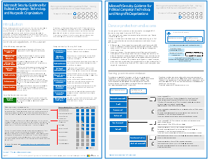

# Guía de seguridad de Microsoft para campañas políticas, ONG y otras organizaciones ágilesMicrosoft Security Guidance for Political Campaigns, Nonprofits, and Other Agile Organizations

 **Resumen:** instrucciones de planeamiento e implementación para organizaciones rápidas con un mayor perfil de amenaza.**Summary:** Planning and implementation guidance for fast-moving organizations that have an increased threat profile.

Si su organización es ágil, tiene un pequeño equipo de TI y el perfil de amenaza es superior a la media, estas instrucciones están diseñadas para usted. Esta solución muestra cómo compilar rápidamente un entorno con servicios de nube esenciales que incluyen controles seguros desde el principio. Estas instrucciones incluyen recomendaciones de seguridad prescriptivas para proteger los datos, las identidades, el correo electrónico y el acceso desde dispositivos móviles.If your organization is agile, you have a small IT team, and your threat profile is higher than average, this guidance is designed for you. This solution demonstrates how to quickly build an environment with essential cloud services that include secure controls from the start. This guidance includes prescriptive security recommendations for protecting data, identities, email, and access from mobile devices.

## Instrucciones de solución de seguridadSecurity solution guidance

Estas instrucciones explican cómo implementar un entorno de nube seguro. Las instrucciones de solución se pueden usar en cualquier organización. Incluyen ayuda adicional para organizaciones ágiles con cuentas de acceso BYOD e invitado. Puede usarlas como un punto de partida para diseñar un entorno propio. Agradecemos sus comentarios en [CloudAdopt@microsoft.com](mailto:CloudAdopt@microsoft.com).This guidance describes how to implement a secure cloud environment. The solution guidance can be used by any organization. It includes extra help for agile organizations with BYOD access and guest accounts. You can use this guidance as a starting-point for designing your own environment. We welcome your feedback at [CloudAdopt@microsoft.com](mailto:CloudAdopt@microsoft.com).

****

|ElementoItem|DescripciónDescription|
|---|---|
|**Guía de seguridad de Microsoft para campañas políticas****Microsoft Security Guidance for Political Campaigns**      [PDF](https://download.microsoft.com/download/B/4/D/B4D520C3-4D0C-4B4D-BFB9-09F0651C2775/MSFT_Cloud_architecture_security%20for%20political%20campaigns.pdf)  \| [Visio](https://download.microsoft.com/download/B/4/D/B4D520C3-4D0C-4B4D-BFB9-09F0651C2775/MSFT_Cloud_architecture_security%20for%20political%20campaigns.vsdx)[PDF](https://download.microsoft.com/download/B/4/D/B4D520C3-4D0C-4B4D-BFB9-09F0651C2775/MSFT_Cloud_architecture_security%20for%20political%20campaigns.pdf)  \| [Visio](https://download.microsoft.com/download/B/4/D/B4D520C3-4D0C-4B4D-BFB9-09F0651C2775/MSFT_Cloud_architecture_security%20for%20political%20campaigns.vsdx)|En esta guía, se usa una organización de campaña política como ejemplo. Use esta guía como punto inicial para cualquier entorno.This guidance uses a political campaign organization as an example. Use this guidance as a starting point for any environment.|
|**Guía de seguridad de Microsoft para ONG****Microsoft Security Guidance for Nonprofits**      [PDF](https://download.microsoft.com/download/9/4/3/94389612-C679-4061-8DF2-D9A15D72B65F/Microsoft_Cloud%20Architecture_Security%20for%20Nonprofits.pdf)  \| [Visio](https://download.microsoft.com/download/9/4/3/94389612-C679-4061-8DF2-D9A15D72B65F/Microsoft_Cloud%20Architecture_Security%20for%20Nonprofits.vsdx)[PDF](https://download.microsoft.com/download/9/4/3/94389612-C679-4061-8DF2-D9A15D72B65F/Microsoft_Cloud%20Architecture_Security%20for%20Nonprofits.pdf)  \| [Visio](https://download.microsoft.com/download/9/4/3/94389612-C679-4061-8DF2-D9A15D72B65F/Microsoft_Cloud%20Architecture_Security%20for%20Nonprofits.vsdx)|Estas Instrucciones se han modificado ligeramente para las organizaciones sin ánimo de lucro. Por ejemplo, hacen referencia a los planes sin ánimo de lucro de Office 365. Las instrucciones técnicas son las mismas que las de campaña política.This guide is slightly revised for nonprofit organizations. For example, it references Office 365 Nonprofit plans. The technical guidance is the same as the political campaign solution guide.|
|

## Guías del entorno de pruebasTest Lab Guides

Para crear un entorno de desarrollo y pruebas para esta solución, siga estas guías del entorno de pruebas:To create a dev/test environment for this solution, use the following test lab guides:

- [Configurar grupos y usuarios en un entorno de desarrollo y pruebas de campaña políticaConfigure groups and users for a political campaign dev/test environment](configure-groups-and-users-for-a-political-campaign-dev-test-environment.md)

  Cree suscripciones de prueba para Office 365 y EMS y, después, cree grupos y usuarios para una campaña política de un representante.Create trial subscriptions for Office 365 and EMS and then create groups and users for a representative political campaign.

- [Crear sitios de grupo en un entorno de desarrollo y pruebas de campaña políticaCreate team sites in a political campaign dev/test environment](create-team-sites-in-a-political-campaign-dev-test-environment.md)

  Cree cuatro sitios de grupo de SharePoint Online con niveles de seguridad “Interno”, “Privado”, “Confidencial” y “Altamente confidencial”.Create four SharePoint Online team sites with Internal, Private, Sensitive, and Highly Confidential levels of security.

Para obtener características de seguridad adicionales como demostración o prueba de concepto, vea [Guías del entorno de pruebas de Office 365](https://aka.ms/o365tlgs).For additional security features for demonstration or proof of concept, see [Office 365 Test Lab Guides](https://aka.ms/o365tlgs).

## Vea tambiénSee Also

[Guías del entorno de pruebas de adopción de la nube (TLG)Cloud adoption Test Lab Guides (TLGs)](https://docs.microsoft.com/microsoft-365/enterprise/cloud-adoption-test-lab-guides-tlgs)

[Recursos de arquitectura de TI de Microsoft CloudMicrosoft Cloud IT architecture resources](https://docs.microsoft.com/microsoft-365/solutions/cloud-architecture-models)
