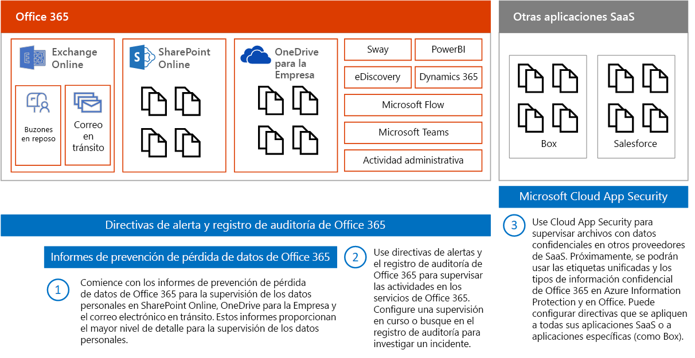
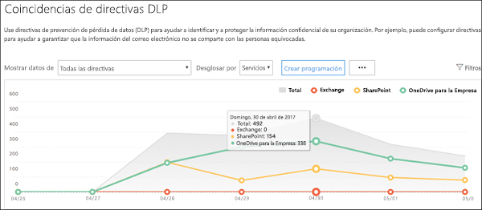
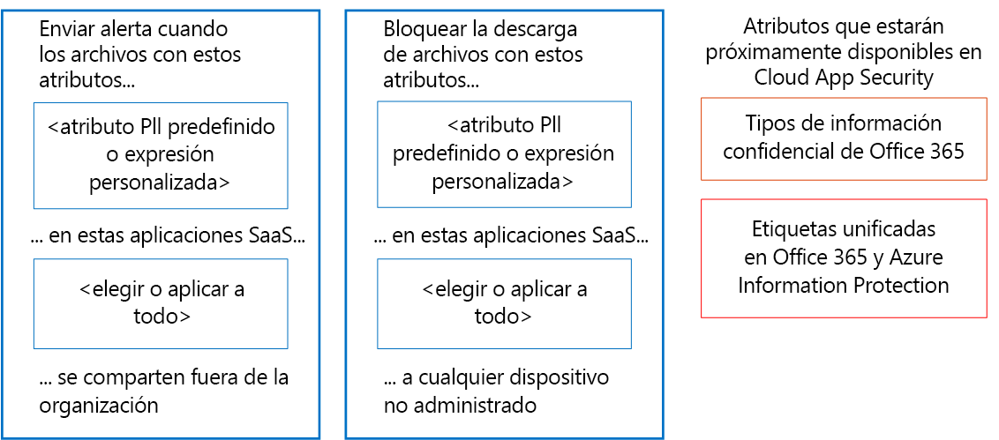
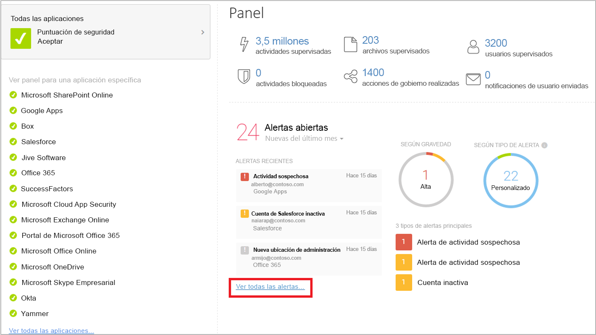

# Supervisar pérdidas de datos personales

[!INCLUDE [Microsoft 365 Defender rebranding](../includes/microsoft-defender-for-office.md)]

Existen muchas herramientas que pueden usarse para supervisar el uso y transporte de datos personales. En este tema se describen tres herramientas que funcionan bien.

En la ilustración:

- Comience con los informes de prevención de pérdida de datos de Microsoft 365 para supervisar datos personales en SharePoint Online, OneDrive para la Empresa y correo electrónico en tránsito. Estos informes proporcionan mayor nivel de detalle de supervisión de datos personales. No obstante, estos informes no incluyen todos los servicios de Office 365.

- Después, use directivas de alerta y el registro de auditoría para supervisar la actividad de los servicios. Configure la supervisión continua o busque el registro de auditoría para investigar un incidente. El registro de auditoría funciona en todos los servicios: Sway, Power BI, eDiscovery, Dynamics 365, Microsoft Flow, Microsoft Teams, actividad administrativa, OneDrive para la Empresa, SharePoint Online, correo electrónico en tránsito, y buzones de correo en reposo. Las conversaciones de Skype se incluyen en los buzones en reposo.

- Por último, use Microsoft Cloud App Security para supervisar los archivos con datos confidenciales de otros proveedores SaaS. Próximamente, se podrán usar los tipos de información confidencial y las etiquetas unificadas en Azure Information Protection y Office con Cloud App Security. Puede configurar directivas que se apliquen a todas las aplicaciones específicas (como Box) o a aplicaciones SaaS. Cloud App Security no busca archivos en Exchange Online, incluidos los archivos adjuntos de correo electrónico.

## Informes de prevención de pérdida de datos

Después de crear las directivas de prevención de pérdida de datos (DLP), deberá comprobar que su funcionamiento es el deseado y que le ayudan a cumplir las normativas. Con los informes DLP en Office 365, puede ver rápidamente el número de coincidencias de directivas DLP, reemplazos o falsos positivos; comprobar si la tendencia es ascendente o descendente a lo largo del tiempo; filtrar el informe de maneras diferentes; y ver más detalles seleccionando un punto en una línea del gráfico.

Puede usar los informes DLP para lo siguiente:

- Centrarse en períodos de tiempo específicos y comprender las causas de los picos y las tendencias.

- Descubrir los procesos de negocio que infringen las directivas DLP de su organización.

- Comprender cualquier impacto de negocio de las directivas DLP.

- Ver las justificaciones enviadas por los usuarios cuando resuelven una sugerencia de directiva reemplazando la directiva o informando de un falso positivo.

- Comprobar el cumplimiento de una directiva DLP específica mostrando las coincidencias de dicha directiva.

- Ver una lista de los archivos con datos confidenciales que coincida con las directivas DLP en el panel de detalles.

Además, puede usar los informes DLP para ajustar las directivas DLP a medida que las ejecuta en modo de prueba.

Los informes DLP están en el centro de seguridad y el centro de cumplimiento. Vaya a Informes \> Ver informes. En Prevención de pérdida de datos (DLP), elija Coincidencias de regla y directiva DLP o Falsos positivos y reemplazos de DLP.

Para obtener más información, consulte [Ver los informes de prevención de pérdida de datos](../../compliance/view-the-dlp-reports.md).

## Directivas de alerta y registro de auditoría

El registro de auditoría contiene eventos de Exchange Online, SharePoint Online, OneDrive para la Empresa, Azure Active Directory, Microsoft Teams, Power BI, Sway y otros servicios.

El centro de seguridad y el centro de cumplimiento ofrecen dos formas de supervisar e informar en el registro de auditoría:

- Configurar directivas de alerta, ver alertas y supervisar tendencias: Use la directiva de alerta y las herramientas del panel de alertas en el centro de seguridad o el centro de cumplimiento.

- Buscar el registro de auditoría directamente: Busque todos los eventos en un intervalo de fechas definido, o filtre los resultados basándose en criterios específicos, como la acción, el usuario que la realizó o el objeto de destino.

Los equipos de seguridad y cumplimiento de información pueden usar estas herramientas para revisar proactivamente las actividades realizadas por los usuarios finales y los administradores en los servicios. Pueden configurarse alertas automáticas para enviar notificaciones por correo electrónico cuando se producen ciertas actividades en colecciones de sitios específicos, por ejemplo, cuando se comparte el contenido de los sitios que se sabe que contienen información relacionada con RGPD. Esto permite que los equipos contacten con usuarios para asegurarse de que se siguen directivas de seguridad corporativa, o que proporcionen aprendizaje adicional.

Los equipos de seguridad de información también pueden buscar en el registro de auditoría para investigar las posibles infracciones de datos y determinar la causa raíz y la extensión de la infracción. Esta función integrada facilita el cumplimiento de los artículos 33 y 34 del RGPD, que requieren que se proporcionen notificaciones a la autoridad de control del RGPD y a los propietarios de los datos sujetos a una infracción en un período de tiempo determinado. Las entradas del registro de auditoría solo se conservan durante 90 días en el servicio, por lo que a menudo se recomienda, y muchas organizaciones lo requieren, que estos registros se conserven durante largos períodos de tiempo.

Existen soluciones que se adhieren a los Registros de auditoría unificados mediante la API de actividad de administración de Microsoft y pueden almacenar entradas de registro según sea necesario, y proporcionar paneles avanzados y alertas. Un ejemplo es el [Microsoft Operations Management Suite (OMS)](https://docs.microsoft.com/azure/operations-management-suite/oms-solution-office-365).

Más información sobre las directivas de alerta y buscar en el registro de auditoría:

- [Directivas de alerta en los centros de seguridad y cumplimiento de Microsoft 365](../../compliance/alert-policies.md)

- [Buscar en el registro de auditoría de actividad de usuario y administración de Office 365](../../compliance/search-the-audit-log-in-security-and-compliance.md) (introducción)

- [Activar o desactivar la búsqueda de registros de auditoría](../../compliance/turn-audit-log-search-on-or-off.md)

- [Buscar en el registro de auditoría](../../compliance/search-the-audit-log-in-security-and-compliance.md)

- [Search-UnifiedAuditLog](https://docs.microsoft.com/powershell/module/exchange/search-unifiedauditlog) (cmdlet)

- [Propiedades detalladas del registro de auditoría](../../compliance/detailed-properties-in-the-office-365-audit-log.md)

## Microsoft Cloud App Security

Microsoft Cloud App Security le ayuda a descubrir otras aplicaciones SaaS en uso en las redes y los datos confidenciales que se envían a estas aplicaciones y desde las mismas.

Microsoft Cloud App Security es un servicio completo que proporciona mayor visibilidad, controles pormenorizados y protección contra amenazas mejorada para las aplicaciones en la nube. Identifica más de 15 000 aplicaciones en la nube en la red de todos los dispositivos, y le proporciona puntuación de riesgo y análisis y evaluación continuos de riesgos. No se requieren agentes: la información se recopila de los firewalls y servidores proxy para proporcionarle visibilidad completa y un contexto de uso en la nube y shadow IT.

Para entender mejor su entorno de nube, la característica de investigación de Cloud App Security proporciona visibilidad detallada de todas las actividades, archivos y cuentas para las aplicaciones administradas y autorizadas. Puede obtener información detallada a nivel del archivo y descubrir a dónde se transfieren los datos en las aplicaciones en la nube.

Para obtener ejemplos, la siguiente ilustración muestra dos directivas Cloud App Security que pueden ayudarle con el RGPD.

Las primera directiva envía una alerta cuando se comparten archivos con un atributo DCP predefinido o una expresión personalizada que elija fuera de la organización desde las aplicaciones SaaS que elija.

La segunda directiva bloquea las descargas de archivos en cualquier dispositivo no administrado. Usted elige los atributos de los archivos que se buscarán y las aplicaciones SaaS a las que desee que se aplique la directiva.

Estos tipos de atributo estarán pronto disponibles en Cloud App Security:

- Tipos de información confidencial
- Etiquetas unificadas en Microsoft 365 y Azure Information Protection

### Panel de Cloud App Security

Si aún no empezó a usar Cloud App Security, inícielo. Para obtener acceso a Cloud App Security: <https://portal.cloudappsecurity.com>.

Nota: No olvide habilitar "Analizar automáticamente archivos de etiquetas de clasificación de Azure Information Protection" (en la configuración General) al comenzar a usar Cloud App Security o antes de asignar etiquetas. Tras la configuración, Cloud App Security no vuelve a examinar los archivos existentes hasta que se modifican.

Más información:

- [Implementar Cloud App Security](https://docs.microsoft.com/cloud-app-security/getting-started-with-cloud-app-security)

- [Más información sobre Microsoft Cloud App Security](https://www.microsoft.com/cloud-platform/cloud-app-security)

- [Bloqueo de descargas de información confidencial con el proxy de Microsoft Cloud App Security](https://docs.microsoft.com/cloud-app-security/use-case-proxy-block-session-aad)

## Directivas de archivo y actividad de ejemplo para detectar el uso compartido de datos personales

### Detectar el uso compartido de archivos que contengan DCP: número de tarjeta de crédito

Envíe una alerta cuando se comparte un archivo que contiene un número de tarjeta de crédito desde una aplicación de nube autorizada.

****

|Control|Configuración|
|---|---|
|Tipo de directiva|Directiva de archivo|
|Plantilla de directiva|Sin plantilla|
|Gravedad de directiva|Alta|
|Categoría|DLP|
|Configuración del filtro|Nivel de acceso = público (Internet), público, externo 
 Aplicación = \<select apps\> (use esta opción si desea limitar la supervisión a aplicaciones SaaS específicas)|
|Aplicar a|Todos los archivos, todos los propietarios|
|Control de contenido|Incluye los archivos que coinciden con una expresión actual: Todos los países: Finanzas: Número de tarjeta de crédito 
 No requerir contexto relevante: desactivado (esto coincidirá con palabras clave, así como regex) 
 Incluir archivos con al menos 1 coincidencia 
 Quitar máscara de los últimos 4 caracteres de la infracción: activada|
|Alertas|Crear una alerta para cada archivo coincidente: activada 
 Límite de alertas diario: 1000 
 Seleccionar una alerta como correo electrónico: activada 
 Para: infosec@contoso.com|
|Gobierno|Microsoft OneDrive para la Empresa 
 Hacer privado: comprobar Quitar usuarios externos 
 Resto de opciones: desactivadas 
 Microsoft SharePoint Online 
 Hacer privado: comprobar Quitar usuarios externos 
 Resto de opciones: desactivadas|
|

Directivas similares:

- Detectar el uso compartido de archivos que contengan DCP: dirección de correo electrónico
- Detectar el uso compartido de archivos que contengan DCP: número de pasaporte

### Detectar Datos de recursos humanos o Datos de cliente en Box o OneDrive para la Empresa

Envía una alerta cuando se carga un archivo etiquetado como Datos de recursos humanos o Datos de cliente en OneDrive para la Empresa o Box.

Notas:

- La supervisión de Box requiere un conector configurado con el SDK API Connector.
- Esta directiva requiere funcionalidades que actualmente están en versión preliminar privada.

****

|Control|Configuración|
|---|---|
|Tipo de directiva|Directiva de actividad|
|Plantilla de directiva|Sin plantilla|
|Gravedad de directiva|Alta|
|Categoría|Control de uso compartido|
|Actúa en|Actividad única|
|Configuración del filtro|Tipo de actividad = cargar archivo 
 Aplicación = Microsoft OneDrive para la Empresa y Box 
 Etiqueta de clasificación (actualmente en versión preliminar privada): Azure Information Protection = datos del cliente, recursos humanos (datos de salario, recursos humanos), datos de empleado|
|Alertas|Crear una alerta: activada 
 Límite de alertas diario: 1000 
 Seleccionar una alerta como correo electrónico: activada 
 Para: infosec@contoso.com|
|Gobierno|Todas las aplicaciones 
 Poner el usuario en cuarentena: comprobar 
 Resto de opciones: desactivadas 
 Office 365 
 Poner el usuario en cuarentena: comprobar 
 Resto de opciones: desactivadas|
|

Directivas similares:

- Detectar descargas grandes de datos de clientes o datos de recursos humanos: Envía una alerta cuando se detecta que un solo usuario está descargando un gran número de archivos que contienen datos de recursos humanos o de clientes en un breve período de tiempo.
- Detectar el uso compartido de datos de clientes y datos de recursos humanos: Envía una alerta cuando se comparten archivos con datos de clientes o de recursos humanos.
