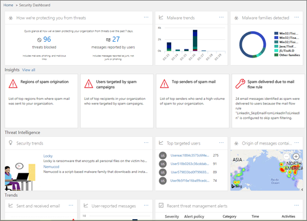

# Investigación y respuesta de amenazas

[!INCLUDE [Microsoft 365 Defender rebranding](../includes/microsoft-defender-for-office.md)]

La investigación de amenazas y las capacidades de respuesta de [Microsoft defender para Office 365](office-365-atp.md) ayudan a los analistas de seguridad y los administradores a proteger los usuarios de Microsoft 365 para su organización a los usuarios de la empresa por:

- Facilitar la identificación, el seguimiento y la comprensión de cyberattacks
- Ayuda para solucionar rápidamente amenazas en Exchange Online, SharePoint Online, OneDrive para la empresa y Microsoft Teams
- Proporciona información y conocimientos para ayudar a las operaciones de seguridad a evitar cyberattacks contra su organización
- Uso de [investigación y respuesta automatizadas en Office 365](automated-investigation-response-office.md) para amenazas críticas basadas en correo electrónico

Las capacidades de investigación y respuesta de amenazas proporcionan información sobre amenazas y acciones de respuesta relacionadas que están disponibles en el centro de seguridad & cumplimiento. Esta información puede ayudar al equipo de seguridad de su organización a proteger a los usuarios de ataques basados en archivos o en correo electrónico. Las capacidades ayudan a supervisar las señales y recopilar datos de varios orígenes, como la actividad de los usuarios, la autenticación, el correo electrónico, los equipos comprometidos y los incidentes de seguridad. Los responsables de la toma de decisiones empresariales y el equipo de operaciones de seguridad pueden usar esta información para comprender y responder a las amenazas contra su organización y proteger su propiedad intelectual.

## Familiarizarse con las herramientas de investigación y respuesta de amenazas

La exposición de amenazas y las capacidades de respuesta del centro de seguridad & cumplimiento, como un conjunto de herramientas y flujos de trabajo de respuesta, incluidos los siguientes:

- [Panel de amenazas](#threat-dashboard)
- [Explorador](#threat-explorer)
- [Incidentes](#incidents)
- [Simulador de ataque](#attack-simulator)
- [Investigación y respuesta automatizadas](automated-investigation-response-office.md)

### Panel de amenazas

Use el panel de amenazas (también se conoce como el [Panel de seguridad](security-dashboard.md)) para ver rápidamente las amenazas que se han tratado y como forma visual de informar a los responsables de las decisiones empresariales sobre cómo los servicios de Microsoft 365 protegen su empresa.

Para ver y usar este panel, en el centro de seguridad & cumplimiento, vaya a panel de **Administración de amenazas** \> **Dashboard**.

### Explorador de amenazas

Use el [Explorador de amenazas (y las detecciones en tiempo real)](threat-explorer.md) para analizar las amenazas, ver el volumen de ataques a lo largo del tiempo y analizar los datos por familias de amenazas, la infraestructura del atacante, etc. El explorador de amenazas (también conocido como explorador) es el punto de partida del flujo de trabajo de la investigación del analista de seguridad.

Para ver y usar este informe, en el centro de seguridad & cumplimiento, vaya a **Threat Management** \> **Explorer**.

### Incidentes

Use la lista incidentes (también denominada investigaciones) para ver una lista de los incidentes de seguridad de vuelo. Los incidentes se usan para realizar un seguimiento de las amenazas como los mensajes de correo electrónico sospechosos y para llevar a cabo una mayor investigación y corrección.

Para ver la lista de incidentes actuales de su organización, en el centro de seguridad & cumplimiento, vaya a incidentes de revisión de **Administración de amenazas** \> **Review** \> **Incidents**.

### Simulador de ataque

Use el simulador de ataque para configurar y ejecutar cyberattacks realistas en su organización e identifique a las personas vulnerables antes de que un ciberataque real afecte a su empresa. Para obtener más información, vea [simulador de ataque en Office 365](attack-simulator.md).

### Investigación y respuesta automatizada

Use las capacidades de investigación y respuesta automatizadas (AIR) para ahorrar tiempo y esfuerzo relacionando el contenido, los dispositivos y las personas con el riesgo de amenazas de la organización. Los procesos de aire pueden iniciarse siempre que se desencadenen determinados avisos o cuando el equipo de operaciones de seguridad lo inicie. Para obtener más información, consulte [investigación automatizada y respuesta en Office 365](automated-investigation-response-office.md).

## Widgets de inteligencia sobre amenazas

Como parte de la oferta de Microsoft defender para Office 365 plan 2, los analistas de seguridad pueden revisar los detalles sobre una amenaza conocida. Esto es útil para determinar si hay pasos o medidas preventivas adicionales que se pueden llevar a cabo para mantener a los usuarios seguros.

## ¿Cómo obtenemos estas capacidades?

Las capacidades de investigación y respuesta de amenazas de Microsoft 365 se incluyen en Microsoft defender para Office 365 plan 2, que se incluye en Enterprise E5 o como un complemento para determinadas suscripciones. Para obtener más información, vea [defender para Office 365 plan 1 y plan 2](office-365-atp.md#microsoft-defender-for-office-365-plan-1-and-plan-2).

## Permisos y roles necesarios

Microsoft defender para Office 365 usa el control de acceso basado en roles. Los permisos se asignan a través de determinados roles en Azure Active Directory, el centro de administración de Microsoft 365 o el centro de seguridad & cumplimiento.

> [!TIP]
> Aunque algunos roles, como el administrador de seguridad, se pueden asignar en el centro de seguridad & cumplimiento, considere la posibilidad de usar el centro de administración de Microsoft 365 o bien Azure Active Directory en su lugar. Para obtener información acerca de los roles, grupos de roles y permisos, vea los siguientes recursos:
>
> - [Permisos en el Centro de seguridad y cumplimiento ](permissions-in-the-security-and-compliance-center.md)
>
> - [Permisos de roles de administrador en Azure Active Directory](https://docs.microsoft.com/azure/active-directory/users-groups-roles/directory-assign-admin-roles)

****

|Actividad|Roles y permisos|
|---|---|
|Usar el panel de amenazas (o el nuevo [Panel de seguridad](security-dashboard.md))   Ver información acerca de las amenazas recientes o actuales|Uno de los siguientes:  - **Administrador global**    - **Administrador de seguridad**  - **Lector de seguridad**    Estos roles se pueden asignar en Azure Active Directory ( [https://portal.azure.com](https://portal.azure.com) ) o en el centro de administración de 365 de Microsoft ( [https://admin.microsoft.com](https://admin.microsoft.com) ).|
|Usar [el explorador de amenazas (y detecciones en tiempo real)](threat-explorer.md) para analizar las amenazas|Uno de los siguientes:  - **Administrador global**    - **Administrador de seguridad**  - **Lector de seguridad**    Estos roles se pueden asignar en Azure Active Directory ( [https://portal.azure.com](https://portal.azure.com) ) o en el centro de administración de 365 de Microsoft ( [https://admin.microsoft.com](https://admin.microsoft.com) ).|
|Ver incidentes (también conocidos como investigaciones)   Agregar mensajes de correo electrónico a un incidente|Uno de los siguientes:  - **Administrador global**    - **Administrador de seguridad**  - **Lector de seguridad**    Estos roles se pueden asignar en Azure Active Directory ( [https://portal.azure.com](https://portal.azure.com) ) o en el centro de administración de 365 de Microsoft ( [https://admin.microsoft.com](https://admin.microsoft.com) ).|
|Desencadenar acciones de correo electrónico en un incidente     Buscar y eliminar mensajes de correo electrónico sospechosos|Uno de los siguientes:  - **Administrador global**    - **Administrador de seguridad** , además de la función de **búsqueda y depuración**  Los roles de administrador **global** y **Administrador de seguridad** se pueden asignar en Azure Active Directory ( [https://portal.azure.com](https://portal.azure.com) ) o en el centro de administración de 365 de Microsoft ( [https://admin.microsoft.com](https://admin.microsoft.com) ).   La función de **búsqueda y depuración** debe asignarse en el centro de seguridad & cumplimiento ( [https://protection.office.com](https://protection.office.com) ).|
|Integración de Microsoft defender para Office 365 plan 2 con Microsoft defender para el punto de conexión     Integración de Microsoft defender para Office 365 plan 2 con un servidor SIEM|El **administrador global** o el rol de **Administrador de seguridad** asignado en Azure Active Directory ( [https://portal.azure.com](https://portal.azure.com) ) o en el centro de administración de 365 de Microsoft ( [https://admin.microsoft.com](https://admin.microsoft.com) ). --- **Asimismo** --- Una función adecuada asignada en aplicaciones adicionales (como el [centro de seguridad de Microsoft defender](https://docs.microsoft.com/windows/security/threat-protection/microsoft-defender-atp/user-roles) o el servidor de Siem)|
|

## Pasos siguientes

- [Obtenga información sobre los rastreadores de amenazas: nuevos y dignos](threat-trackers.md)

- [Buscar e investigar correo electrónico malintencionado entregado (respuesta y investigación de amenazas de Office 365)](investigate-malicious-email-that-was-delivered.md)

- [Integración de Office 365 de investigación de amenazas y respuesta con Microsoft defender para el punto de conexión](integrate-office-365-ti-with-wdatp.md)

- [Información sobre el simulador de ataques](attack-simulator.md)
