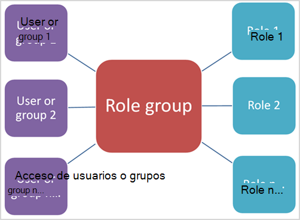

# Permisos en el Centro de seguridad y cumplimientoPermissions in the Security & Compliance Center

[!INCLUDE [Microsoft 365 Defender rebranding](../includes/microsoft-defender-for-office.md)]

El centro de seguridad & cumplimiento le permite conceder permisos a personas que realizan tareas de cumplimiento como la administración de dispositivos, la prevención de pérdida de datos, la exhibición de documentos electrónicos, la retención, etc.The Security & Compliance Center lets you grant permissions to people who perform compliance tasks like device management, data loss prevention, eDiscovery, retention, and so on. Estas personas solo pueden realizar las tareas a las que les dé acceso explícitamente.These people can perform only the tasks that you explicitly grant them access to. Para obtener acceso al centro de seguridad & cumplimiento, los usuarios deben ser administrador global o miembro de uno o varios grupos de roles del centro de cumplimiento de & de seguridad.To access the Security & Compliance Center, users need to be a global administrator or a member of one or more Security & Compliance Center role groups.

Los permisos del centro de seguridad & cumplimiento se basan en el modelo de permisos de control de acceso basado en roles (RBAC).Permissions in the Security & Compliance Center are based on the role-based access control (RBAC) permissions model. RBAC es el mismo modelo de permisos que usa Exchange, por lo que si está familiarizado con Exchange, conceder permisos en el centro de seguridad & cumplimiento será muy similar.RBAC is the same permissions model that's used by Exchange, so if you're familiar with Exchange, granting permissions in the Security & Compliance Center will be very similar. Sin embargo, es importante recordar que los grupos de roles de Exchange y los grupos de roles del centro de seguridad & cumplimiento no comparten los permisos o la pertenencia.It's important to remember, however, that Exchange role groups and Security & Compliance Center role groups don't share membership or permissions. Aunque ambos tienen un grupo de roles de administración de la organización, no son iguales.While both have an Organization Management role group, they aren't the same. Los permisos que conceden y los miembros de los grupos de roles son diferentes.The permissions they grant, and the members of the role groups, are different. A continuación se incluye una lista de los grupos de roles del centro de cumplimiento & cumplimiento.There's a list of Security & Compliance Center role groups below.

## Relación de los miembros, los roles y los grupos de rolesRelationship of members, roles, and role groups

Un **rol** concede permisos para realizar un conjunto de tareas; por ejemplo, el rol de administración de casos permite trabajar con casos de exhibición de documentos electrónicos.A **role** grants permissions to do a set of tasks; for example, the Case Management role lets people work with eDiscovery cases.

Un **grupo de roles** es un conjunto de roles que permite que los usuarios realicen su trabajo en el centro de seguridad & cumplimiento.A **role group** is a set of roles that lets people perform their job across the Security & Compliance Center. Por ejemplo, el grupo de roles de administrador de cumplimiento incluye (entre otros roles) los roles para la administración de casos, la búsqueda de contenido y la configuración de la organización (además de otros) porque un usuario que es un administrador de cumplimiento necesitará los permisos para esas tareas para realizar su trabajo.For example, the Compliance Administrator role group includes (among other roles) the roles for Case Management, Content Search, and Organization Configuration (plus others) because someone who's a compliance admin will need the permissions for those tasks to do their job.

El centro de seguridad & cumplimiento incluye grupos de roles predeterminados para las tareas y funciones más comunes que necesitará asignar a los usuarios.The Security & Compliance Center includes default role groups for the most common tasks and functions that you'll need to assign people to. Le recomendamos que agregue simplemente usuarios individuales como **miembros** a los grupos de roles predeterminados.We recommend simply adding individual users as **members** to the default role groups.

## Permisos necesarios para usar características del centro de seguridad & cumplimientoPermissions needed to use features in the Security & Compliance Center

En la siguiente tabla se enumeran los grupos de funciones predeterminados que están disponibles en el centro de seguridad & cumplimiento y los roles asignados a los grupos de roles de forma predeterminada.The following table lists the default role groups that are available in the Security & Compliance Center, and the roles that are assigned to the role groups by default. Para conceder permisos a un usuario para que realice una tarea de cumplimiento, agréguelos al grupo de funciones del centro de cumplimiento de & de seguridad correspondiente.To grant permissions to a user to perform a compliance task, add them to the appropriate Security & Compliance Center role group.

La administración de permisos en el centro de seguridad & cumplimiento solo proporciona a los usuarios acceso a las características de cumplimiento que están disponibles en el propio centro de seguridad & cumplimiento.Managing permissions in the Security & Compliance Center only gives users access to the compliance features that are available within the Security & Compliance Center itself. Si desea conceder permisos a otras características de cumplimiento que no se encuentren en el centro de seguridad & cumplimiento, como reglas de flujo de correo de Exchange (también conocidas como reglas de transporte), debe usar el centro de administración de Exchange.If you want to grant permissions to other compliance features that aren't in the Security & Compliance Center, such as Exchange mail flow rules (also known as transport rules), you need to use the Exchange admin center.

Para ver cómo conceder acceso al centro de seguridad & cumplimiento, consulte [proporcionar a los usuarios acceso al centro de administración de cumplimiento de Microsoft 365](grant-access-to-the-security-and-compliance-center.md).To see how to grant access to the Security & Compliance Center, check out [Give users access to Microsoft 365 Compliance admin center](grant-access-to-the-security-and-compliance-center.md).

****

|Grupo de funcionesRole group|DescripciónDescription|Roles predeterminados asignadosDefault roles assigned|
|---|---|---|
|**Administrador de cumplimiento**1**Compliance Administrator**1|Los miembros pueden administrar la configuración de la administración de dispositivos, la prevención de pérdida de datos, los informes y la conservación.Members can manage settings for device management, data loss prevention, reports, and preservation.|Administración de casosCase Management 
 Administrador de cumplimiento de comunicacionesCommunication Compliance Admin 
 Análisis de cumplimiento de comunicacionesCommunication Compliance Analysis 
 Administración de casos de cumplimiento de comunicacionesCommunication Compliance Case Management 
 Investigación de cumplimiento en la comunicaciónCommunication Compliance Investigation 
 Visor de cumplimiento de comunicacionesCommunication Compliance Viewer 
 Proveedor de comentarios de clasificación de datosData Classification Feedback Provider 
 Revisor de comentarios de clasificación de datosData Classification Feedback Reviewer 
 Administración de la investigación de datosData Investigation Management 
 Administrador de cumplimientoCompliance Administrator 
 Búsqueda de cumplimientoCompliance Search 
 Administración de dispositivosDevice Management 
 Administración de disposiciónDisposition Management 
 Administración de cumplimiento de DLPDLP Compliance Management 
 HoldHold 
 IB Compliance ManagementIB Compliance Management 
 Administrar alertasManage Alerts 
 Configuración de la organizaciónOrganization Configuration 
 RecordManagementRecordManagement 
 Administración de retenciónRetention Management 
 View-Only registros de auditoríaView-Only Audit Logs 
 Administración de dispositivos View-OnlyView-Only Device Management 
 View-Only la administración de cumplimiento de DLPView-Only DLP Compliance Management 
 View-Only IB Compliance ManagementView-Only IB Compliance Management 
 View-Only administrar alertasView-Only Manage Alerts 
 Destinatarios con permiso de vistaView-Only Recipients 
 Administración de registros de View-OnlyView-Only Record Management 
 Administración de la retención de View-OnlyView-Only Retention Management|
|**Administrador de datos de cumplimiento****Compliance Data Administrator**|Los miembros pueden administrar la configuración de la administración de dispositivos, la protección de datos, la prevención de pérdida de datos, los informes y la conservación.Members can manage settings for device management, data protection, data loss prevention, reports, and preservation.|Administrador de cumplimientoCompliance Administrator 
 Búsqueda de cumplimientoCompliance Search 
 Administración de dispositivosDevice Management 
 Administración de cumplimiento de DLPDLP Compliance Management 
 Administración de disposiciónDisposition Management 
 IB Compliance ManagementIB Compliance Management 
 Administrar alertasManage Alerts 
 Configuración de la organizaciónOrganization Configuration 
 RecordManagementRecordManagement 
 Administración de retenciónRetention Management 
 Administrador de la etiqueta de confidencialidadSensitivity Label Administrator 
 View-Only registros de auditoríaView-Only Audit Logs 
 Administración de dispositivos View-OnlyView-Only Device Management 
 View-Only la administración de cumplimiento de DLPView-Only DLP Compliance Management 
 View-Only IB Compliance ManagementView-Only IB Compliance Management 
 View-Only administrar alertasView-Only Manage Alerts 
 Destinatarios con permiso de vistaView-Only Recipients 
 Administración de registros de View-OnlyView-Only Record Management 
 Administración de la retención de View-OnlyView-Only Retention Management|
|**Visor de contenido del explorador de contenido****Content Explorer Content Viewer**|Ver los archivos de contenido en el explorador de contenido.View the contents files in Content explorer.|Visor de contenido de clasificación de datosData Classification Content Viewer|
|**Visor de listas del explorador de contenido****Content Explorer List Viewer**|Ver todos los elementos del explorador de contenido en solo formato de lista.View all items in Content explorer in list format only.|Visor de lista de clasificación de datosData Classification List Viewer|
|**Investigador de datos****Data Investigator**|Los miembros pueden realizar búsquedas en buzones de correo, sitios de SharePoint y cuentas de OneDrive.Members can perform searches on mailboxes, SharePoint sites, and OneDrive accounts.|ComunicaciónCommunication 
 Búsqueda de cumplimientoCompliance Search 
 CustodianCustodian 
 Administración de la investigación de datosData Investigation Management 
 ExportarExport
 PreviewPreview 
 Descifrado de RMSRMS Decrypt 
 RevisarReview
 Búsqueda y depuraciónSearch And Purge|
|**Administrador de exhibición de documentos electrónicos****eDiscovery Manager**|Los miembros pueden realizar búsquedas y aplicar retenciones en buzones de correo, sitios de SharePoint Online y ubicaciones de OneDrive para la Empresa.Members can perform searches and place holds on mailboxes, SharePoint Online sites, and OneDrive for Business locations. Los miembros también pueden crear y administrar casos de eDiscovery, agregar y quitar miembros de un caso, crear y editar búsquedas de contenido asociadas a un caso y obtener acceso a datos de caso en eDiscovery avanzado.Members can also create and manage eDiscovery cases, add and remove members to a case, create and edit Content Searches associated with a case, and access case data in Advanced eDiscovery. 
 Un administrador de exhibición de documentos electrónicos es un miembro del grupo de roles de administrador de exhibición de documentos electrónicos al que se ha asignado permisos adicionales.An eDiscovery Administrator is a member of the eDiscovery Manager role group who has been assigned additional permissions. Además de las tareas que puede realizar un administrador de exhibición de documentos electrónicos, un administrador de eDiscovery puede:In addition to the tasks that an eDiscovery Manager can perform, an eDiscovery Administrator can:<ul><li>Ver todos los casos de exhibición de documentos electrónicos de la organización.View all eDiscovery cases in the organization.</li><li>Administrar cualquier caso de exhibición de documentos electrónicos después de que se agreguen como miembro del caso.Manage any eDiscovery case after they add themselves as a member of the case.</li></ul> 
 La principal diferencia entre un administrador de eDiscovery y un administrador de exhibición de documentos electrónicos es que un administrador de eDiscovery puede tener acceso a todos los casos que se enumeran en la página **casos de eDiscovery** del centro de seguridad & cumplimiento.The primary difference between an eDiscovery Manager and an eDiscovery Administrator is that an eDiscovery Administrator can access all cases that are listed on the **eDiscovery cases** page in the Security & Compliance Center. Un administrador de exhibición de documentos electrónicos solo puede tener acceso a los casos que han creado o los casos de los que son miembros.An eDiscovery manager can only access the cases they created or cases they are a member of. Para obtener más información sobre cómo convertir un usuario en Administrador de exhibición de documentos electrónicos, vea [asignar permisos de exhibición de documentos electrónicos en el centro de seguridad & cumplimiento](../../compliance/assign-ediscovery-permissions.md).For more information about making a user an eDiscovery Administrator, see [Assign eDiscovery permissions in the Security & Compliance Center](../../compliance/assign-ediscovery-permissions.md).|Administración de casosCase Management 
 ComunicaciónCommunication 
 Búsqueda de cumplimientoCompliance Search 
 CustodianCustodian 
 ExportarExport 
 HoldHold 
 PreviewPreview 
 Descifrado de RMSRMS Decrypt 
 RevisarReview|
|**Lector global****Global Reader**|Los miembros tienen acceso de solo lectura a los informes, alertas y pueden ver toda la configuración y la configuración.Members have read-only access to reports, alerts, and can see all the configuration and settings.
 La principal diferencia entre el lector global y el lector de seguridad es que un lector global puede tener acceso a la **configuración y la configuración**.The primary difference between Global Reader and Security Reader is that a Global Reader can access **configuration and settings**.|Lector de seguridadSecurity Reader 
 Lector de etiquetas de sensibilidadSensitivity Label Reader 
 Vista de garantía del servicioService Assurance View 
 View-Only registros de auditoríaView-Only Audit Logs 
 Administración de dispositivos View-OnlyView-Only Device Management 
 View-Only la administración de cumplimiento de DLPView-Only DLP Compliance Management 
 View-Only IB Compliance ManagementView-Only IB Compliance Management 
 View-Only administrar alertasView-Only Manage Alerts 
 Destinatarios con permiso de vistaView-Only Recipients 
 Administración de registros de View-OnlyView-Only Record Management 
 Administración de la retención de View-OnlyView-Only Retention Management|
|**Administración de riesgos de Insider****Insider Risk Management**|Use este grupo de roles para administrar la administración de riesgos de internación para su organización en un único grupo.Use this role group to manage insider risk management for your organization in a single group. Al agregar todas las cuentas de usuario para los administradores, analistas e investigadores designados, puede configurar los permisos de administración de riesgos de Insider en un único grupo.By adding all user accounts for designated administrators, analysts, and investigators, you can configure insider risk management permissions in a single group. Este grupo de roles contiene todos los roles de permisos de administración de riesgos de Insider.This role group contains all the insider risk management permission roles. Esta es la forma más sencilla de empezar rápidamente con la administración de riesgos de Insider y es una buena opción para las organizaciones que no necesitan permisos separados definidos para grupos de usuarios independientes.This is the easiest way to quickly get started with insider risk management and is a good fit for organizations that do not need separate permissions defined for separate groups of users.|Administración de casosCase Management 
 Administrador de administración de riesgos de InsiderInsider Risk Management Admin 
 Análisis de administración de riesgos de InsiderInsider Risk Management Analysis 
 Investigación de administración de riesgos de InsiderInsider Risk Management Investigation 
 Contribución temporal de administración de riesgos de InsidersInsider Risk Management Temporary contribution|
|**Administradores de administración de riesgos de Insider****Insider Risk Management Admins**|Use este grupo de roles para configurar inicialmente la administración de riesgos de Insiders y más adelante para separar los administradores de riesgos de Insider en un grupo definido.Use this role group to initially configure insider risk management and later to segregate insider risk administrators into a defined group. Los usuarios de este grupo de roles pueden crear, leer, actualizar y eliminar directivas de administración de riesgos de Insider, la configuración global y las asignaciones de grupos de roles.Users in this role group can create, read, update, and delete insider risk management policies, global settings, and role group assignments.|Administración de casosCase Management 
 Administrador de administración de riesgos de InsiderInsider Risk Management Admin|
|**Analistas de administración de riesgos de Insider****Insider Risk Management Analysts**|Use este grupo para asignar permisos a los usuarios que actuarán como analistas de casos de riesgo de Insider.Use this group to assign permissions to users that will act as insider risk case analysts. Los usuarios de este grupo de roles pueden tener acceso a todas las plantillas de alertas, casos y notificaciones de administración de riesgos de Insider.Users in this role group can access all insider risk management alerts, cases, and notices templates. No pueden acceder al explorador de contenido de riesgo de Insider.They cannot access the insider risk Content Explorer.|Administración de casosCase Management 
 Análisis de administración de riesgos de InsiderInsider Risk Management Analysis|
|**Investigadores de administración de riesgos de Insider****Insider Risk Management Investigators**|Use este grupo para asignar permisos a los usuarios que actuarán como investigadores de datos de riesgo de Insider.Use this group to assign permissions to users that will act as insider risk data investigators. Los usuarios de este grupo de roles pueden tener acceso a todas las alertas de administración de riesgos de Insider, casos, plantillas de avisos y el explorador de contenido para todos los casos.Users in this role group can access all insider risk management alerts, cases, notices templates, and the Content Explorer for all cases.|Administración de casosCase Management 
 Investigación de administración de riesgos de InsiderInsider Risk Management Investigation|
|**Colaboradores de IRM****IRM Contributors**|Este grupo de roles está visible, pero solo lo usan los servicios en segundo plano.This role group is visible, but is used by background services only.|Contribución temporal de administración de riesgos de InsidersInsider Risk Management Temporary contribution|
|**Administrador de flujo de flujo****MailFlow Administrator**|Los miembros pueden supervisar y ver información de flujo de correo e informes en el centro de seguridad & cumplimiento.Members can monitor and view mail flow insights and reports in the Security & Compliance Center. Los administradores globales pueden agregar usuarios normales a este grupo, pero si el usuario no es miembro del grupo de administración de Exchange, el usuario no tendrá acceso a las tareas relacionadas con el administrador de Exchange.Global admins can add ordinary users to this group, but, if the user isn't a member of the Exchange Admin group, the user will not have access to Exchange admin-related tasks.|Destinatarios con permiso de vistaView-Only Recipients|
|**Administración de la organización**1**Organization Management**1|Los miembros pueden controlar los permisos para obtener acceso a las características en el centro de seguridad & cumplimiento y también para administrar la configuración de la administración de dispositivos, la prevención de pérdida de datos, los informes y la conservación.Members can control permissions for accessing features in the Security & Compliance Center, and also manage settings for device management, data loss prevention, reports, and preservation. 
 Los usuarios que no son administradores globales deben ser administradores de Exchange para ver y realizar acciones en dispositivos administrados por la movilidad y la seguridad básica de Microsoft 365 (anteriormente conocido como administración de dispositivos móviles o MDM).Users who are not global administrators must be Exchange administrators to see and take action on devices that are managed by Basic Mobility and Security for Microsoft 365 (formerly known as Mobile Device Management or MDM). 
 Los administradores globales se agregan automáticamente como miembros de este grupo de roles.Global admins are automatically added as members of this role group.|Registros de auditoríaAudit Logs 
 Administración de casosCase Management 
 Administrador de cumplimientoCompliance Administrator 
 Búsqueda de cumplimientoCompliance Search 
 Administración de dispositivosDevice Management 
 Administración de cumplimiento de DLPDLP Compliance Management 
 HoldHold 
 IB Compliance ManagementIB Compliance Management 
 Administrar alertasManage Alerts 
 Configuración de la organizaciónOrganization Configuration 
 CuarentenaQuarantine 
 RecordManagementRecordManagement 
 Administración de retenciónRetention Management 
 Administración de funcionesRole Management 
 Búsqueda y depuraciónSearch And Purge 
 Administrador de seguridadSecurity Administrator 
 Lector de seguridadSecurity Reader 
 Administrador de la etiqueta de confidencialidadSensitivity Label Administrator 
 Lector de etiquetas de sensibilidadSensitivity Label Reader 
 Vista de garantía del servicioService Assurance View 
 View-Only registros de auditoríaView-Only Audit Logs 
 Administración de dispositivos View-OnlyView-Only Device Management 
 View-Only la administración de cumplimiento de DLPView-Only DLP Compliance Management 
 View-Only IB Compliance ManagementView-Only IB Compliance Management 
 View-Only administrar alertasView-Only Manage Alerts 
 Destinatarios con permiso de vistaView-Only Recipients 
 Administración de registros de View-OnlyView-Only Record Management 
 Administración de la retención de View-OnlyView-Only Retention Management|
|**Administrador de cuarentena****Quarantine Administrator**|Los miembros pueden acceder a todas las acciones de cuarentena.Members can access all Quarantine actions. Para obtener más información, consulte [administrar mensajes en cuarentena y archivos como un administrador en EOP](manage-quarantined-messages-and-files.md) .For more information, see [Manage quarantined messages and files as an admin in EOP](manage-quarantined-messages-and-files.md)|CuarentenaQuarantine|
|**Administración de registros****Records Management**|Los miembros pueden administrar y eliminar contenido de registros.Members can manage and dispose record content.|RecordManagementRecordManagement|
|**Reviewer****Reviewer**|Los miembros solo pueden ver la lista de casos en la página casos de exhibición de documentos electrónicos en el centro de seguridad & cumplimiento.Members can only view the list of cases on the eDiscovery cases page in the Security & Compliance Center. No pueden crear, abrir o administrar un caso de exhibición de documentos electrónicos.They can't create, open, or manage an eDiscovery case. El objetivo principal de este grupo de roles es permitir a los miembros ver y obtener acceso a los datos de caso en [eDiscovery avanzado (](../../compliance/office-365-advanced-ediscovery.md) también conocido como *eDiscovery avanzado v1*).The primary purpose of this role group is to allow members to view and access case data in [Advanced eDiscovery (classic)](../../compliance/office-365-advanced-ediscovery.md) (also known as *Advanced eDiscovery v1*). 
 Este grupo de roles tiene los permisos más restrictivos relacionados con la exhibición de documentos electrónicos.This role group has the most restrictive eDiscovery-related permissions.
**Nota:** En este momento, los usuarios que son miembros del grupo de roles Reviewer no pueden tener acceso a los datos de [eDiscovery avanzado en Microsoft 365](../../compliance/overview-ediscovery-20.md) (también conocido como *eDiscovery avanzado V2*).**Note:** At this time, users who are a member of the Reviewer role group can't access data in [Advanced eDiscovery in Microsoft 365](../../compliance/overview-ediscovery-20.md) (also known as *Advanced eDiscovery v2*). Para agregar miembros a un caso en eDiscovery avanzado v2 para que puedan revisar los datos de caso, un usuario debe ser miembro del grupo de roles eDiscovery Manager.To add members to a case in Advanced eDiscovery v2 so that they can review case data, a user must be a member of the eDiscovery Manager role group.|RevisarReview|
|**Administrador de seguridad****Security Administrator**|Los miembros tienen acceso a una serie de características de seguridad del centro de protección de identidad, la administración de identidades privilegiada, el estado del servicio Microsoft 365 y el centro de seguridad & cumplimiento.Members have access to a number of security features of Identity Protection Center, Privileged Identity Management, Monitor Microsoft 365 Service Health, and Security & Compliance Center. 
 De forma predeterminada, es posible que este grupo de roles no muestre ningún miembro.By default, this role group may not appear to have any members. Sin embargo, el rol de administrador de seguridad de Azure Active Directory se asigna a este grupo de roles.However, the Security Administrator role from Azure Active Directory is assigned to this role group. Por lo tanto, este grupo de roles hereda las capacidades y la pertenencia del rol de administrador de seguridad de Azure Active Directory.Therefore, this role group inherits the capabilities and membership of the Security Administrator role from Azure Active Directory. 
 Para administrar los permisos de forma centralizada, agregue y quite miembros del grupo en el centro de administración de Azure Active Directory.To manage permissions centrally, add and remove group members in the Azure Active Directory admin center. Para obtener más información, vea [permisos de roles de administrador en Azure Active Directory](https://docs.microsoft.com/azure/active-directory/users-groups-roles/directory-assign-admin-roles).For more information, see [Administrator role permissions in Azure Active Directory](https://docs.microsoft.com/azure/active-directory/users-groups-roles/directory-assign-admin-roles). Si edita este grupo de roles en el centro de seguridad & cumplimiento (pertenencia o roles), dichos cambios sólo se aplican al centro de seguridad & cumplimiento y no a otros servicios.If you edit this role group in the Security & Compliance Center (membership or roles), those changes apply only to the Security & Compliance Center and not to any other services. 
 Este grupo de funciones incluye todos los permisos de solo lectura de la función lector de seguridad, además de varios permisos administrativos adicionales para los mismos servicios: Azure Information Protection, centro de protección de identidad, administración de identidades privilegiada, supervisar el estado del servicio de Microsoft 365 y el centro de seguridad & cumplimiento.This role group includes all of the read-only permissions of the Security reader role, plus a number of additional administrative permissions for the same services: Azure Information Protection, Identity Protection Center, Privileged Identity Management, Monitor Microsoft 365 Service Health, and Security & Compliance Center.|Registros de auditoríaAudit Logs 
 Administración de dispositivosDevice Management 
 Administración de cumplimiento de DLPDLP Compliance Management 
 IB Compliance ManagementIB Compliance Management 
 Administrar alertasManage Alerts 
 CuarentenaQuarantine 
 Administrador de seguridadSecurity Administrator 
 Administrador de la etiqueta de confidencialidadSensitivity Label Administrator 
 View-Only registros de auditoríaView-Only Audit Logs 
 Administración de dispositivos View-OnlyView-Only Device Management 
 View-Only la administración de cumplimiento de DLPView-Only DLP Compliance Management 
 View-Only IB Compliance ManagementView-Only IB Compliance Management 
 View-Only administrar alertasView-Only Manage Alerts|
|**Operador de seguridad****Security Operator**|Los miembros pueden administrar las alertas de seguridad y también ver los informes y la configuración de las características de seguridad.Members can manage security alerts, and also view reports and settings of security features.|Búsqueda de cumplimientoCompliance Search 
 Administrar alertasManage Alerts 
 Lector de seguridadSecurity Reader 
 View-Only registros de auditoríaView-Only Audit Logs 
 Administración de dispositivos View-OnlyView-Only Device Management 
 View-Only la administración de cumplimiento de DLPView-Only DLP Compliance Management 
 View-Only IB Compliance ManagementView-Only IB Compliance Management 
 View-Only administrar alertasView-Only Manage Alerts|
|**Lector de seguridad****Security Reader**|Los miembros tienen acceso de solo lectura a varias características de seguridad del centro de protección de identidad, la administración de identidad con privilegios, el estado del servicio de Microsoft 365 y el centro de seguridad & cumplimiento.Members have read-only access to a number of security features of Identity Protection Center, Privileged Identity Management, Monitor Microsoft 365 Service Health, and Security & Compliance Center. 
 De forma predeterminada, es posible que este grupo de roles no muestre ningún miembro.By default, this role group may not appear to have any members. Sin embargo, el rol de lector de seguridad de Azure Active Directory se asigna a este grupo de roles.However, the Security Reader role from Azure Active Directory is assigned to this role group. Por lo tanto, este grupo de roles hereda las capacidades y la pertenencia del rol de lector de seguridad de Azure Active Directory.Therefore, this role group inherits the capabilities and membership of the Security Reader role from Azure Active Directory. 
 Para administrar los permisos de forma centralizada, agregue y quite miembros del grupo en el centro de administración de Azure Active Directory.To manage permissions centrally, add and remove group members in the Azure Active Directory admin center. Para obtener más información, vea [permisos de roles de administrador en Azure Active Directory](https://docs.microsoft.com/azure/active-directory/users-groups-roles/directory-assign-admin-roles).For more information, see [Administrator role permissions in Azure Active Directory](https://docs.microsoft.com/azure/active-directory/users-groups-roles/directory-assign-admin-roles). Si edita este grupo de roles en el centro de seguridad & cumplimiento (pertenencia o roles), dichos cambios sólo se aplican al centro de seguridad & cumplimiento y no a otros servicios.If you edit this role group in the Security & Compliance Center (membership or roles), those changes apply only to the Security & Compliance Center and not to any other services.|Lector de seguridadSecurity Reader 
 Lector de etiquetas de sensibilidadSensitivity Label Reader 
 Administración de dispositivos View-OnlyView-Only Device Management 
 View-Only la administración de cumplimiento de DLPView-Only DLP Compliance Management 
 View-Only IB Compliance ManagementView-Only IB Compliance Management 
 View-Only administrar alertasView-Only Manage Alerts|
|**Usuario de garantía de servicio****Service Assurance User**|Los miembros pueden acceder a la sección Garantía del servicio en el centro de seguridad & cumplimiento.Members can access the Service assurance section in the Security & Compliance Center. Garantía del servicio proporciona informes y documentos que describen los procedimientos de seguridad de Microsoft para los datos de clientes almacenados en Microsoft 365.Service assurance provides reports and documents that describe Microsoft's security practices for customer data that's stored in Microsoft 365. También se proporcionan informes independientes de auditoría de terceros en Microsoft 365.It also provides independent third-party audit reports on Microsoft 365. Para obtener más información, consulte [garantía del servicio en el centro de seguridad & cumplimiento](https://docs.microsoft.com/microsoft-365/compliance/service-assurance).For more information, see [Service assurance in the Security & Compliance Center](https://docs.microsoft.com/microsoft-365/compliance/service-assurance).|Vista de garantía del servicioService Assurance View|
|**Revisión de supervisión****Supervisory Review**|Los miembros pueden crear y administrar las directivas que definen qué comunicaciones están vinculadas a revisión en una organización.Members can create and manage the policies that define which communications are subject to review in an organization. Para obtener más información, vea [Configure Communication Compliance Policies for your Organization](../../compliance/communication-compliance-configure.md).For more information, see [Configure communication compliance policies for your organization](../../compliance/communication-compliance-configure.md).|Administrador de revisión de supervisiónSupervisory Review Administrator|
|

> [!NOTE]
> 1 este grupo de roles no asigna a los miembros los permisos necesarios para buscar en el registro de auditoría o usar los informes que puedan incluir datos de Exchange, como los informes DLP o defender para Office 365.1 This role group doesn't assign members the permissions necessary to search the audit log or to use any reports that might include Exchange data, such as the DLP or Defender for Office 365 reports. Para buscar en el registro de auditoría o para ver todos los informes, se debe asignar a un usuario permisos en Exchange Online.To search the audit log or to view all reports, a user has to be assigned permissions in Exchange Online. Esto se debe a que el cmdlet subyacente que se usa para buscar en el registro de auditoría es un cmdlet Exchange en línea.This is because the underlying cmdlet used to search the audit log is an Exchange Online cmdlet. Los administradores globales pueden buscar en el registro de auditoría y ver todos los informes porque se agregan automáticamente como miembros del grupo de roles de administración de la organización en Exchange Online.Global admins can search the audit log and view all reports because they're automatically added as members of the Organization Management role group in Exchange Online. Para obtener más información, vea [Buscar en el registro de auditoría del centro de seguridad & cumplimiento](https://docs.microsoft.com/microsoft-365/compliance/search-the-audit-log-in-security-and-compliance).For more information, see [Search the audit log in the Security & Compliance Center](https://docs.microsoft.com/microsoft-365/compliance/search-the-audit-log-in-security-and-compliance).

## Roles del centro de seguridad & cumplimientoRoles in the Security & Compliance Center

En la siguiente tabla se enumeran los roles disponibles y los grupos de roles a los que están asignados de forma predeterminada.The following table lists the available roles and the role groups that they're assigned to by default.

Tenga en cuenta que los siguientes roles no se asignan al grupo de roles administración de la organización de forma predeterminada:Note that the following roles aren't assigned to the Organization Management role group by default:

- ComunicaciónCommunication
- Administrador de cumplimiento de comunicacionesCommunication Compliance Admin
- Análisis de cumplimiento de comunicacionesCommunication Compliance Analysis
- Administración de casos de cumplimiento de comunicacionesCommunication Compliance Case Management
- Investigación de cumplimiento en la comunicaciónCommunication Compliance Investigation
- Visor de cumplimiento de comunicacionesCommunication Compliance Viewer
- CustodianCustodian
- Visor de contenido de clasificación de datosData Classification Content Viewer
- Proveedor de comentarios de clasificación de datosData Classification Feedback Provider
- Revisor de comentarios de clasificación de datosData Classification Feedback Reviewer
- Visor de lista de clasificación de datosData Classification List Viewer
- Administración de la investigación de datosData Investigation Management
- Administración de disposiciónDisposition Management
- ExportarExport
- Administrador de administración de riesgos de InsiderInsider Risk Management Admin
- Análisis de administración de riesgos de InsiderInsider Risk Management Analysis
- Investigación de administración de riesgos de InsiderInsider Risk Management Investigation
- Contribución temporal de administración de riesgos de InsidersInsider Risk Management Temporary contribution
- PreviewPreview
- RevisarReview
- Descifrado de RMSRMS Decrypt
- Administrador de revisión de supervisiónSupervisory Review Administrator

****

|RoleRole|DescripciónDescription|Asignaciones de grupo de roles predeterminadasDefault role group assignments|
|---|---|---|
|**Registros de auditoría****Audit Logs**|Active y configure la auditoría de la organización, vea los informes de auditoría de la organización y, a continuación, exporte estos informes a un archivo.Turn on and configure auditing for the organization, view the organization's audit reports, and then export these reports to a file.|Administración de la organizaciónOrganization Management 
 Administrador de seguridadSecurity Administrator|
|**Administración de casos****Case Management**|Crear, editar, eliminar y controlar el acceso a casos de eDiscovery.Create, edit, delete, and control access to eDiscovery cases.|Administrador de cumplimientoCompliance Administrator 
 Administrador de exhibición de documentos electrónicoseDiscovery Manager 
 Administración de riesgos de InsiderInsider Risk Management 
 Administradores de administración de riesgos de InsiderInsider Risk Management Admins 
 Analistas de administración de riesgos de InsiderInsider Risk Management Analysts 
 Investigadores de administración de riesgos de InsiderInsider Risk Management Investigators 
 Administración de la organizaciónOrganization Management|
|**Comunicación****Communication**|Administre todas las comunicaciones con los custodios identificados en un caso de exhibición avanzada de documentos electrónicos.Manage all communications with the custodians identified in an Advanced eDiscovery case.  Cree notificaciones de retención, recordatorios de retención y escalamientos a la administración.Create hold notifications, hold reminders, and escalations to management. Realice un seguimiento de la confirmación del custodio de las notificaciones de retención y administre el acceso al portal de custodios que usa cada custodio en un caso para realizar un seguimiento de las comunicaciones para los casos en los que se identificaron como custodio.Track custodian acknowledgment of hold notifications and manage access to the custodian portal that is used by each custodian in a case to track communications for the cases where they were identified as a custodian.|Administrador de exhibición de documentos electrónicoseDiscovery Manager|
|**Administrador de cumplimiento de comunicaciones****Communication Compliance Admin**|Se usa para administrar directivas en la característica de cumplimiento de la comunicación.Used to manage policies in the Communication Compliance feature.|Administrador de cumplimientoCompliance Administrator|
|**Análisis de cumplimiento de comunicaciones****Communication Compliance Analysis**|Se usa para realizar la investigación, corrección de las infracciones de mensajes en la característica de cumplimiento de la comunicación.Used to perform investigation, remediation of the message violations in the Communication Compliance feature. Solo se pueden ver metadatos de mensajes.Can only view message meta data.|Administrador de cumplimientoCompliance Administrator|
|**Administración de casos de cumplimiento de comunicaciones****Communication Compliance Case Management**|Se usa para acceder a casos de cumplimiento de comunicación.Used to access Communication Compliance cases.|Administrador de cumplimientoCompliance Administrator|
|**Investigación de cumplimiento en la comunicación****Communication Compliance Investigation**|Se usa para realizar infracciones de mensajes de investigación, corrección y revisión en la característica de cumplimiento de la comunicación.Used to perform investigation, remediation, and review message violations in the Communication Compliance feature. Puede ver los metadatos y el mensaje del mensaje.Can view message meta data and message.|Administrador de cumplimientoCompliance Administrator|
|**Visor de cumplimiento de comunicaciones****Communication Compliance Viewer**|Se usa para tener acceso a los informes y widgets en la característica de cumplimiento de comunicaciones.Used to access reports and widgets in the Communication Compliance feature.||
|**Administrador de cumplimiento****Compliance Administrator**|Ver y editar la configuración y los informes de las características de cumplimiento.View and edit settings and reports for compliance features.|Administrador de cumplimientoCompliance Administrator 
 Administrador de datos de cumplimientoCompliance Data Administrator 
 Administración de la organizaciónOrganization Management|
|**Búsqueda de cumplimiento****Compliance Search**|Realizar búsquedas en los buzones de correo y obtener una estimación de los resultados.Perform searches across mailboxes and get an estimate of the results.|Administrador de cumplimientoCompliance Administrator 
 Administrador de datos de cumplimientoCompliance Data Administrator 
 Administrador de exhibición de documentos electrónicoseDiscovery Manager 
 Administración de la organizaciónOrganization Management 
 Operador de seguridadSecurity Operator|
|**Custodian****Custodian**|Identifique y administre los custodios para casos de eDiscovery avanzados y use la información de Azure Active Directory y otros orígenes para buscar orígenes de datos asociados con los custodios.Identify and manage custodians for Advanced eDiscovery cases and use the information from Azure Active Directory and other sources to find data sources associated with custodians. Asociar otros orígenes de datos como buzones de correo, sitios de SharePoint y equipos con custodios en un caso.Associate other data sources such as mailboxes, SharePoint sites, and Teams with custodians in a case.  Coloque una retención legal en los orígenes de datos asociados con los custodios para conservar el contenido en el contexto de un caso.Place a legal hold on the data sources associated with custodians to preserve content in the context of a case.|Administrador de exhibición de documentos electrónicoseDiscovery Manager|
|**Visor de contenido de clasificación de datos****Data Classification Content Viewer**|Ver la representación local de los archivos en el explorador de contenido.View in-place rendering of files in Content explorer.|Visor de contenido del explorador de contenidoContent Explorer Content Viewer|
|**Proveedor de comentarios de clasificación de datos****Data Classification Feedback Provider**|Permite proporcionar comentarios a los clasificadores en el explorador de contenido.Allows providing feedback to classifiers in content explorer.|Administrador de cumplimientoCompliance Administrator|
|**Revisor de comentarios de clasificación de datos****Data Classification Feedback Reviewer**|Permite revisar los comentarios de los clasificadores en el explorador de comentarios.Allows reviewing feedback from classifiers in feedback explorer.|Administrador de cumplimientoCompliance Administrator|
|**Visor de lista de clasificación de datos****Data Classification List Viewer**|Ver la lista de archivos en el explorador de contenido.View the list of files in content explorer.|Visor de listas del explorador de contenidoContent Explorer List Viewer|
|**Administración de la investigación de datos****Data Investigation Management**|Crear, editar, eliminar y controlar el acceso a las investigaciones de datos.Create, edit, delete, and control access to data investigations.|Administrador de cumplimientoCompliance Administrator 
 Investigador de datosData Investigator|
|**Administración de dispositivos****Device Management**|Ver y editar la configuración y los informes de las características de administración de dispositivos.View and edit settings and reports for device management features.|Administrador de cumplimientoCompliance Administrator 
 Administrador de datos de cumplimientoCompliance Data Administrator 
 Administración de la organizaciónOrganization Management 
 Administrador de seguridadSecurity Administrator|
|**Administración de disposición****Disposition Management**|Controlar los permisos para obtener acceso a la disposición manual en el centro de seguridad & cumplimiento.Control permissions for accessing Manual Disposition in the Security & Compliance Center.|Administrador de cumplimientoCompliance Administrator 
 Administrador de datos de cumplimientoCompliance Data Administrator|
|**Administración de cumplimiento de DLP****DLP Compliance Management**|Ver y editar la configuración y los informes de las directivas de prevención de pérdida de datos (DLP).View and edit settings and reports for data loss prevention (DLP) policies.|Administrador de cumplimientoCompliance Administrator 
 Administrador de datos de cumplimientoCompliance Data Administrator 
 Administración de la organizaciónOrganization Management 
 Administrador de seguridadSecurity Administrator|
|**Export****Export**|Exporte el buzón y el contenido de sitio que se devuelven de las búsquedas.Export mailbox and site content that's returned from searches.|Administrador de exhibición de documentos electrónicoseDiscovery Manager|
|**Hold****Hold**|Poner en suspensión el contenido de los buzones de correo, los sitios y las carpetas públicas.Place content in mailboxes, sites, and public folders on hold. Cuando está en espera, se almacena una copia del contenido en una ubicación segura.When on hold, a copy of the content is stored in a secure location. Los propietarios de contenido seguirán pudiendo modificar o eliminar el contenido original.Content owners will still be able to modify or delete the original content.|Administrador de cumplimientoCompliance Administrator 
 Administrador de exhibición de documentos electrónicoseDiscovery Manager 
 Administración de la organizaciónOrganization Management|
|**IB Compliance Management****IB Compliance Management**|Ver, crear, quitar, modificar y probar directivas de barrera de información.View, create, remove, modify, and test Information Barrier policies.|Administrador de cumplimientoCompliance Administrator 
 Administrador de datos de cumplimientoCompliance Data Administrator 
 Administración de la organizaciónOrganization Management 
 Administrador de seguridadSecurity Administrator|
|**Administrador de administración de riesgos de Insider****Insider Risk Management Admin**|Crear, editar, eliminar y controlar el acceso a la característica de administración de riesgos de Insider.Create, edit, delete, and control access to Insider Risk Management feature.|Administración de riesgos de InsiderInsider Risk Management 
 Administradores de administración de riesgos de InsiderInsider Risk Management Admins|
|**Análisis de administración de riesgos de Insider****Insider Risk Management Analysis**|Obtenga acceso a todas las plantillas de alertas, casos y avisos de administración de riesgos de Insider.Access all insider risk management alerts, cases, and notices templates.|Administración de riesgos de InsiderInsider Risk Management 
 Analistas de administración de riesgos de InsiderInsider Risk Management Analysts|
|**Investigación de administración de riesgos de Insider****Insider Risk Management Investigation**|Obtenga acceso a todas las alertas de administración de riesgos de Insider, casos, plantillas y el explorador de contenido para todos los casos.Access all insider risk management alerts, cases, notices templates, and the Content Explorer for all cases.|Administración de riesgos de InsiderInsider Risk Management 
 Investigadores de administración de riesgos de InsiderInsider Risk Management Investigators|
|**Contribución temporal de administración de riesgos de Insiders****Insider Risk Management Temporary contribution**|Este grupo de roles está visible, pero solo lo usan los servicios en segundo plano.This role group is visible, but is used by background services only.|Colaboradores de IRMIRM Contributors|
|**Administrar alertas****Manage Alerts**|Ver y editar la configuración y los informes de las alertas.View and edit settings and reports for alerts.|Administrador de cumplimientoCompliance Administrator 
 Administrador de datos de cumplimientoCompliance Data Administrator 
 Administración de la organizaciónOrganization Management 
 Administrador de seguridadSecurity Administrator 
 Operador de seguridadSecurity Operator|
|**Configuración de la organización****Organization Configuration**|Ejecute, vea y exporte informes de auditoría y administre directivas de cumplimiento para DLP, dispositivos y conservación.Run, view, and export audit reports and manage compliance policies for DLP, devices, and preservation.|Administrador de cumplimientoCompliance Administrator 
 Administrador de datos de cumplimientoCompliance Data Administrator 
 Administración de la organizaciónOrganization Management|
|**Versión preliminar****Preview**|Ver una lista de los elementos que se devuelven en las búsquedas de contenido y abrir cada elemento de la lista para ver su contenido.View a list of items that are returned from content searches, and open each item from the list to view its contents.|Administrador de exhibición de documentos electrónicoseDiscovery Manager|
|**Cuarentena****Quarantine**|Permite ver y liberar correo electrónico en cuarentena.Allows viewing and releasing quarantined email.|Administrador de cuarentenaQuarantine Administrator 
 Administrador de seguridadSecurity Administrator 
 Administración de la organizaciónOrganization Management|
|**RecordManagement****RecordManagement**|Ver y editar la configuración y los informes de la característica de administración de registros.View and edit the configuration and reports for the Record Management feature.|Administrador de cumplimientoCompliance Administrator 
 Administrador de datos de cumplimientoCompliance Data Administrator 
 Administración de la organizaciónOrganization Management 
 Records ManagementRecords Management|
|**Administración de retención****Retention Management**|Administrar directivas de retención.Manage retention policies.|Administrador de cumplimientoCompliance Administrator 
 Administrador de datos de cumplimientoCompliance Data Administrator 
 Administración de la organizaciónOrganization Management|
|**Revisar****Review**|Use la exhibición avanzada de documentos electrónicos para realizar un seguimiento, etiquetar, analizar y probar los documentos que tienen asignados.Use Advanced eDiscovery to track, tag, analyze, and test documents that are assigned to them.|Administrador de exhibición de documentos electrónicoseDiscovery Manager 
 ReviewerReviewer|
|**Descifrado de RMS****RMS Decrypt**|Descifrar el contenido protegido por RMS al exportar resultados de búsqueda.Decrypt RMS-protected content when exporting search results.|Administrador de exhibición de documentos electrónicoseDiscovery Manager|
|**Administración de funciones****Role Management**|Administre la pertenencia al grupo de roles y cree o elimine grupos de roles personalizados.Manage role group membership and create or delete custom role groups.|Administración de la organizaciónOrganization Management|
|**Búsqueda y depuración****Search And Purge**|Permite a los usuarios quitar en masa datos que coincidan con los criterios de una búsqueda de contenido.Lets people bulk-remove data that matches the criteria of a content search.|Administración de la organizaciónOrganization Management|
|**Administrador de seguridad****Security Administrator**|Ver y editar la configuración y los informes de las características de seguridad.View and edit the configuration and reports for Security features.|Administración de la organizaciónOrganization Management 
 Administrador de seguridadSecurity Administrator|
|**Lector de seguridad****Security Reader**|Ver la configuración y los informes de las características de seguridad.View the configuration and reports for Security features.|Administración de la organizaciónOrganization Management 
 Operador de seguridadSecurity Operator 
 Lector de seguridadSecurity Reader|
|**Administrador de la etiqueta de confidencialidad****Sensitivity Label Administrator**|Permite ver, crear, modificar y quitar las etiquetas de confidencialidad.View, create, modify, and remove sensitivity labels.|Administrador de datos de cumplimientoCompliance Data Administrator 
 Administración de la organizaciónOrganization Management 
 Administrador de seguridadSecurity Administrator|
|**Lector de etiquetas de sensibilidad****Sensitivity Label Reader**|Ver la configuración y el uso de las etiquetas de confidencialidad.View the configuration and usage of sensitivity labels.|Lector globalGlobal Reader 
 Administración de la organizaciónOrganization Management 
 Lector de seguridadSecurity Reader|
|**Vista de garantía del servicio****Service Assurance View**|Descargue los documentos disponibles en la sección Garantía del servicio.Download the available documents from the Service Assurance section. El contenido incluye la auditoría independiente, la documentación de cumplimiento y una guía relacionada con confianza para usar las características de Microsoft 365 para administrar los riesgos de seguridad y cumplimiento normativo.Content includes independent auditing, compliance documentation, and trust-related guidance for using Microsoft 365 features to manage regulatory compliance and security risks.|Usuario de garantía de servicioService Assurance User 
 Administración de la organizaciónOrganization Management|
|**Administrador de revisión de supervisión****Supervisory Review Administrator**|Administrar directivas de revisión de supervisión, incluidas las comunicaciones que se van a revisar y quién debe realizar la revisión.Manage supervisory review policies, including which communications to review and who should perform the review.|Revisión de supervisiónSupervisory Review|
|**Registros de auditoría de solo vista****View-Only Audit Logs**|Ver y exportar informes de auditoría.View and export audit reports. Como estos informes pueden contener información confidencial, solo debe asignar este rol a los usuarios con una necesidad explícita de ver esta información.Because these reports might contain sensitive information, you should only assign this role to people with an explicit need to view this information.|Administrador de cumplimientoCompliance Administrator 
 Administrador de datos de cumplimientoCompliance Data Administrator 
 Administración de la organizaciónOrganization Management 
 Administrador de seguridadSecurity Administrator 
 Operador de seguridadSecurity Operator|
|**Administración de dispositivos de solo vista****View-Only Device Management**|Ver la configuración y los informes de la característica de administración de dispositivos.View the configuration and reports for the Device Management feature.|Administrador de cumplimientoCompliance Administrator 
 Administrador de datos de cumplimientoCompliance Data Administrator 
 Administración de la organizaciónOrganization Management 
 Administrador de seguridadSecurity Administrator 
 Operador de seguridadSecurity Operator 
 Lector de seguridadSecurity Reader|
|**Administración de cumplimiento de DLP de solo vista****View-Only DLP Compliance Management**|Vea la configuración y los informes de las directivas de prevención de pérdida de datos (DLP).View the settings and reports for data loss prevention (DLP) policies.|Administrador de cumplimientoCompliance Administrator 
 Administrador de datos de cumplimientoCompliance Data Administrator 
 Administración de la organizaciónOrganization Management 
 Administrador de seguridadSecurity Administrator 
 Operador de seguridadSecurity Operator 
 Lector de seguridadSecurity Reader|
|**View-Only IB Compliance Management****View-Only IB Compliance Management**|Vea la configuración y los informes de la característica de barreras de información.View the configuration and reports for the Information Barriers feature.|Administrador de cumplimientoCompliance Administrator 
 Administrador de datos de cumplimientoCompliance Data Administrator 
 Administración de la organizaciónOrganization Management 
 Administrador de seguridadSecurity Administrator 
 Operador de seguridadSecurity Operator 
 Lector de seguridadSecurity Reader|
|**Ver-solo administrar alertas****View-Only Manage Alerts**|Vea la configuración y los informes de la característica administrar alertas.View the configuration and reports for the Manage Alerts feature.|Administrador de seguridadSecurity Administrator 
 Operador de seguridadSecurity Operator 
 Lector de seguridadSecurity Reader 
 Administrador de cumplimientoCompliance Administrator 
 Administrador de datos de cumplimientoCompliance Data Administrator 
 Administración de la organizaciónOrganization Management|
|**Destinatarios con permiso de vista****View-Only Recipients**|Permite ver información acerca de los usuarios y grupos.View information about users and groups.|Administrador de flujo de flujoMailFlow Administrator 
 Administrador de cumplimientoCompliance Administrator 
 Administrador de datos de cumplimientoCompliance Data Administrator 
 Administración de la organizaciónOrganization Management|
|**Administración de registros de solo vista****View-Only Record Management**|Ver la configuración y los informes de la característica de administración de registros.View the configuration and reports for the Record Management feature.|Administrador de cumplimientoCompliance Administrator 
 Administrador de datos de cumplimientoCompliance Data Administrator 
 Administración de la organizaciónOrganization Management|
|**View-Only Retention Management****View-Only Retention Management**|Vea la configuración y los informes para la característica de administración de retención.View the configuration and reports for the Retention Management feature.|Administrador de datos de cumplimientoCompliance Data Administrator 
 Administración de la organizaciónOrganization Management 
 Administrador de cumplimientoCompliance Administrator|
|
