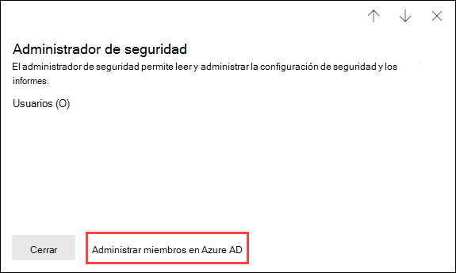
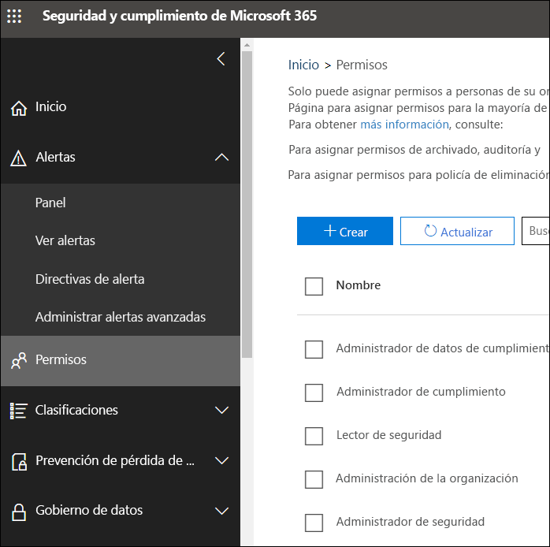

# Permisos en el Centro de cumplimiento de Microsoft 365 y el Centro de seguridad de Microsoft 365

[!INCLUDE [Microsoft 365 Defender rebranding](../includes/microsoft-defender-for-office.md)]

Su organización necesita administrar los escenarios de seguridad y cumplimiento que se extienden a todos los servicios de Microsoft 365. Por lo que necesita la flexibilidad para dar los permisos de administrador adecuados a las personas adecuadas en el grupo de TI de su organización. Usando el Centro de cumplimiento de Microsoft 365 o el Centro de seguridad de Microsoft 365, puede administrar los permisos de forma centralizada para todas las tareas relacionadas con la seguridad y el cumplimiento.

Después de que un administrador global agrega usuarios a esos roles de administrador, los administradores tienen acceso a características y datos que abarcan todos los servicios de Microsoft 365, como el Centro de seguridad de Microsoft 365, el Centro de cumplimiento de Microsoft 365, Azure, Office 365 y Enterprise Mobility + Security.

## Lo que son los roles de Microsoft 365

Los roles que aparecen en el Centro de cumplimiento de Microsoft 365 y en el Centro de seguridad de Microsoft 365 son roles de Azure Active Directory. Estos roles están diseñados para alinearse con las funciones de trabajo en el grupo de TI de su organización, lo que facilita otorgar a una persona todos los permisos necesarios para realizar su trabajo.

****

|Función|Descripción|
|---|---|
|**Administrador global**|Acceso a todas las características administrativas en todos los servicios de Microsoft 365. Los administradores globales son los únicos que pueden asignar otros roles de administrador. Para más información, consulte [Administrador global / Administrador de empresa](https://docs.microsoft.com/azure/active-directory/roles/permissions-reference#global-administrator--company-administrator).|
|**Administrador de datos de cumplimiento**|Realizar un seguimiento de los datos de su organización a través de Microsoft 365, asegurarse de que están protegidos y obtener información sobre los problemas para ayudar a reducir los riesgos. Para obtener más información, consulte [Administrador de datos de cumplimiento](https://docs.microsoft.com/azure/active-directory/roles/permissions-reference#compliance-data-administrator).|
|**Administrador de cumplimiento**|Ayudar a que su organización cumpla con los requisitos normativos, administrar casos de eDiscovery y mantener directivas de gobierno de datos en todas las ubicaciones, identidades y aplicaciones de Microsoft 365. Para obtener más información, consulte [Administrador de cumplimiento](https://docs.microsoft.com/azure/active-directory/roles/permissions-reference#compliance-administrator).|
|**Operador de seguridad**|Ver, investigar y responder a las amenazas activas a usuarios, dispositivos y contenido de Microsoft 365. Para obtener más información, vea [Operador de seguridad de seguridad](https://docs.microsoft.com/azure/active-directory/roles/permissions-reference#security-operator).|
|**Lector de seguridad**|Ver e investigar amenazas activas a usuarios, dispositivos y contenido de Microsoft 365, pero, a diferencia del operador de seguridad, no tienen permisos para responder realizando una acción. Para obtener más información, vea [Lector de seguridad](https://docs.microsoft.com/azure/active-directory/roles/permissions-reference#security-reader).|
|**Administrador de seguridad**|Controlar la seguridad global de la organización mediante la administración de directivas de seguridad, la revisión de análisis de seguridad y los informes en los productos de Microsoft 365, así como mantenerse al día con el panorama de amenazas. Para obtener más información, vea [Administrador de seguridad](https://docs.microsoft.com/azure/active-directory/roles/permissions-reference#security-administrator).|
|**Lector global**|La versión de solo lectura del rol de **Administrador global**. Ver todas las configuraciones e información administrativa en Microsoft 365. Para más información, vea [Lector global](https://docs.microsoft.com/azure/active-directory/roles/permissions-reference#global-reader).|
|

## Los administradores globales pueden administrar roles en Azure Active Directory

Cuando selecciona un rol en el Centro de cumplimiento de Microsoft 365 y en el Centro de seguridad de Microsoft 365, puede ver sus tareas. Pero para administrar esas tareas, tiene que ir a Azure Active Directory.

Para más información, consulte [Visualización y asignación de roles de administrador en Azure Active Directory](https://docs.microsoft.com/azure/active-directory/users-groups-roles/directory-manage-roles-portal).

## Administrar roles en un servicio en lugar de Azure Active Directory

Los roles que aparecen en el Centro de cumplimiento de Microsoft 365 y en el Centro de seguridad de Microsoft 365 también aparecen en los servicios en los que tienen permisos. Por ejemplo, puede ver estos roles en el Centro de seguridad y cumplimiento.

Para obtener más información sobre cómo se usan estos roles en el Centro de seguridad y cumplimiento, consulte [Permisos en el Centro de seguridad y cumplimiento](permissions-in-the-security-and-compliance-center.md).

### Interrumpir herencia

Es importante comprender que cuando administra estos roles en Azure Active Directory, lo hace de manera centralizada para **todos** los servicios de Microsoft 365. Sin embargo, cuando administra un rol en un servicio específico, como el Centro de seguridad y cumplimiento, está administrando el rol **solo** para ese servicio específico. Las asignaciones y permisos para un rol en un servicio reemplazan los permisos concedidos al rol de Azure Active Directory.

Esto puede resultar útil. Por ejemplo, si se asigna a un usuario el rol de Administrador de seguridad, no tiene permisos para administrar los incidentes. Sin embargo, puede usar los permisos de Microsoft Defender para punto de conexión para proporcionar los permisos específicos para administrar el incidente en ese servicio.

## Dónde encontrar información de roles para cada servicio de Microsoft 365

Al asignar un usuario a uno de los roles de administrador de seguridad y cumplimiento de Microsoft 365, adquiere permisos a un conjunto de servicios de Microsoft 365. Use los vínculos siguientes para obtener más información sobre los permisos específicos para un rol en cada servicio.

****

|Servicio de Microsoft 365|Información del rol|
|---|---|
|Roles de administrador de los planes de negocios de Office 365 y Microsoft 365|[Roles de administración de Microsoft 365](https://docs.microsoft.com/microsoft-365/admin/add-users/about-admin-roles)|
|Azure Active Directory (Azure AD) y Azure AD Identity Protection|[Roles de administrador de Azure AD](https://docs.microsoft.com/azure/active-directory/users-groups-roles/directory-assign-admin-roles)|
|Microsoft Defender for Identity|[Grupos de roles de Microsoft Defender for Identity](https://docs.microsoft.com/azure-advanced-threat-protection/atp-role-groups)|
|Azure Information Protection|[Roles de administrador de Azure AD](https://docs.microsoft.com/azure/active-directory/users-groups-roles/directory-assign-admin-roles)|
|Administrador de cumplimiento|[Administrador de cumplimiento](https://docs.microsoft.com/microsoft-365/compliance/compliance-manager-setup#set-user-permissions-and-assign-roles)|
|Exchange Online|[Control de acceso basado en roles de Exchange](https://docs.microsoft.com/exchange/understanding-role-based-access-control-exchange-2013-help)|
|Intune|[Control de acceso basado en roles de Intune](https://docs.microsoft.com/intune/role-based-access-control)|
|Escritorio administrado|[Roles de administrador de Azure AD](https://docs.microsoft.com/azure/active-directory/users-groups-roles/directory-assign-admin-roles)|
|Microsoft Cloud App Security|[Control de acceso basado en roles](https://docs.microsoft.com/cloud-app-security/manage-admins)|
|Centro de seguridad y cumplimiento|[Roles de administración de Microsoft 365](permissions-in-the-security-and-compliance-center.md)|
|Privileged Identity Management|[Roles de administrador de Azure AD](https://docs.microsoft.com/azure/active-directory/users-groups-roles/directory-assign-admin-roles)|
|Puntuación de seguridad|[Roles de administrador de Azure AD](https://docs.microsoft.com/azure/active-directory/users-groups-roles/directory-assign-admin-roles)|
|SharePoint Online|[Roles de administrador de Azure AD](https://docs.microsoft.com/azure/active-directory/users-groups-roles/directory-assign-admin-roles) 
 [Acerca del rol de administrador de SharePoint en Office 365](https://docs.microsoft.com/sharepoint/sharepoint-admin-role)|
|Teams/Skype Empresarial|[Roles de administrador de Azure AD](https://docs.microsoft.com/azure/active-directory/users-groups-roles/directory-assign-admin-roles)|
|Microsoft Defender para punto de conexión|[Control de acceso basado en roles de Microsoft Defender para punto de conexión](https://docs.microsoft.com/windows/security/threat-protection/windows-defender-atp/rbac-windows-defender-advanced-threat-protection)|
|

## Próximamente

Aún estamos trabajando en los permisos en el Centro de cumplimiento de Microsoft 365 y el Centro de seguridad de Microsoft 365 Por ejemplo, actualmente estamos trabajando en soporte técnico para:

- Los roles que aparecen en el Centro de cumplimiento de Microsoft 365 y en el Centro de seguridad de Microsoft 365, en lugar de ir Azure Active Directory.
- Personalizar roles agregando o quitando permisos específicos.
- Crear roles personalizados con los permisos que elija.
