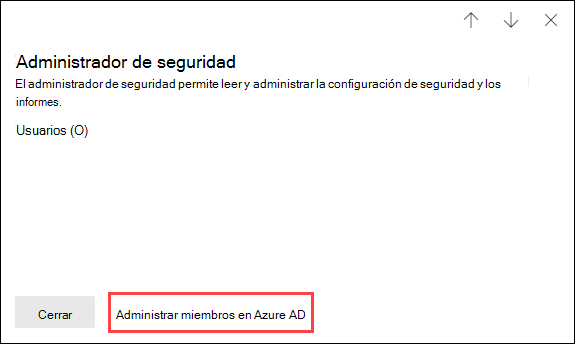

# Permisos en el portal de Microsoft 365 DefenderPermissions in the Microsoft 365 Defender portal

[!INCLUDE [Microsoft 365 Defender rebranding](../includes/microsoft-defender-for-office.md)]

**Se aplica a****Applies to**
- [Exchange Online ProtectionExchange Online Protection](exchange-online-protection-overview.md)
- [Plan 1 y Plan 2 de Microsoft Defender para Office 365Microsoft Defender for Office 365 plan 1 and plan 2](defender-for-office-365.md)
- [Microsoft 365 DefenderMicrosoft 365 Defender](../defender/microsoft-365-defender.md)

Necesita administrar escenarios de seguridad que abarcan todos los servicios de Microsoft 365.You need to manage security scenarios that span all the Microsoft 365 services. Y necesita la flexibilidad para dar los permisos de administrador adecuados a las personas adecuadas en su organización.And you need the flexibility to give the right admin permissions to the right people in your organization.

El portal de Microsoft 365 Defender en <https://security.microsoft.com> admite la administración directa de permisos para los usuarios que realizan tareas de seguridad en Microsoft 365.The Microsoft 365 Defender portal at <https://security.microsoft.com> supports directly managing permissions for users who perform security tasks in Microsoft 365. Al usar el portal de Microsoft 365 Defender para administrar los permisos, puede administrar los permisos de forma centralizada para todas las tareas relacionadas con la seguridad.By using the Microsoft 365 Defender portal to manage permissions, you can manage permissions centrally for all tasks related to security.

Para administrar permisos en el portal de Microsoft 365 Defender, vaya a **Permisos y roles** o <https://security.microsoft.com/securitypermissions>.To manage permissions in the Microsoft 365 Defender portal, go to **Permissions & roles** or <https://security.microsoft.com/securitypermissions>. Debe ser **administrador global** o un miembro del grupo de roles de **Administración de la organización** en el portal de Microsoft 365 Defender.You need to be a **global administrator** or a member of the **Organization Management** role group in the Microsoft 365 Defender portal. En concreto, el rol de **Administración de roles** permite a los usuarios ver, crear y modificar grupos de roles en el portal de Microsoft 365 Defender y, de forma predeterminada, ese rol solo se asigna al grupo de roles **Administración de la organización**.Specifically, the **Role Management** role allows users to view, create, and modify role groups in the Microsoft 365 Defender portal, and by default, that role is assigned only to the **Organization Management** role group.

> [!NOTE]
> Para obtener información sobre los permisos en el Centro de cumplimiento de Microsoft 365, consulte [Permisos en el Centro de cumplimiento de Microsoft 365](../../compliance/microsoft-365-compliance-center-permissions.md).For information about permissions in the Microsoft 365 compliance center, see [Permissions in the Microsoft 365 compliance center](../../compliance/microsoft-365-compliance-center-permissions.md).

## Relación de los miembros, los roles y los grupos de rolesRelationship of members, roles, and role groups

Los permisos del portal de Microsoft 365 Defender se basan en el modelo de permisos de control de acceso basado en roles (RBAC).Permissions in the Microsoft 365 Defender portal are based on the role-based access control (RBAC) permissions model. RBAC es el mismo modelo de permisos que se usa en la mayoría de los servicios de Microsoft 365, por lo que si está familiarizado con la estructura de permisos de estos servicios, le resultará sencillo conceder permisos en el portal de Microsoft 365 Defender.RBAC is the same permissions model that's used by most Microsoft 365 services, so if you're familiar with the permission structure in these services, granting permissions in the Microsoft 365 Defender portal will be very familiar.

Un **rol** concede permisos para realizar un conjunto de tareas.A **role** grants the permissions to do a set of tasks.

Un **grupo de roles** es un conjunto de roles que permite a las personas hacer su trabajo en el portal de Microsoft 365 Defender.A **role group** is a set of roles that lets people do their jobs in the Microsoft 365 Defender portal. Por ejemplo, el grupo de roles Administradores de simulador de ataques incluye el rol de Administrador de simulador de ataques para crear y administrar todos los aspectos del aprendizaje de simulación de ataques.For example, the Attack Simulator Administrators role group includes the Attack Simulator Admin role to create and manage all aspects of attack simulation training.

El portal de Microsoft 365 Defender incluye grupos de roles predeterminados para las tareas y funciones más comunes que debe asignar.The Microsoft 365 Defender portal includes default role groups for the most common tasks and functions that you'll need to assign. Por lo general, le recomendamos que simplemente agregue usuarios individuales como **miembros** a los grupos de roles predeterminados.Generally, we recommend simply adding individual users as **members** to the default role groups.

## Roles y grupos de roles en el portal de Microsoft 365 DefenderRoles and role groups in the Microsoft 365 Defender portal

Los siguientes tipos de roles y grupos de roles están disponibles en **Permisos y roles** en el portal de Microsoft 365 Defender:The following types of roles and role groups are available in **Permissions & roles** in the Microsoft 365 Defender portalr:

- **Roles de Azure AD**: puede ver los roles y los usuarios asignados, pero no puede administrarlos directamente en el portal de Microsoft 365 Defender.**Azure AD roles**: You can view the roles and assigned users, but you can't manage them directly in the Microsoft 365 Defender portal. Los roles de Azure AD son roles centrales que asignan permisos para **todos** los servicios de Microsoft 365.Azure AD roles are central roles that assign permissions for **all** Microsoft 365 services.

- **Roles de colaboración y correo electrónico**: son los mismos grupos de roles que están disponibles en el Centro de seguridad y cumplimiento, pero puede administrarlos directamente en el portal de Microsoft 365 Defender.**Email & collaboration roles**: These are the same role groups that are available in the Security & Compliance Center, but you can manage them directly in the Microsoft 365 Defender portal. Los permisos que asigna aquí son específicos del portal de Microsoft 365 Defender, el Centro de cumplimiento de Microsoft 365 y el Centro de seguridad y cumplimiento, y no cubren todos los permisos necesarios en otras cargas de trabajo de Microsoft 365.The permissions that you assign here are specific to the Microsoft 365 Defender portal, the Microsoft 365 compliance center, and the Security & Compliance Center, and don't cover all of the permissions that are needed in other Microsoft 365 workloads.

### Roles de Azure AD en el portal de Microsoft 365 DefenderAzure AD roles in the Microsoft 365 Defender portal

Si va a **Roles de colaboración y correo electrónico** \> **Permisos y roles** \> **Roles de Azure AD** \> **Roles** (o directamente a <https://security.microsoft.com/aadpermissions>) verá los roles de Azure AD que se describen en esta sección.When you go **Email & collaboration roles** \> **Permissions & roles** \> **Azure AD roles** \> **Roles** (or directly to <https://security.microsoft.com/aadpermissions>) you'll see the Azure AD roles that are described in this section.

Al seleccionar un rol, se muestra un desplegable con detalles que contiene la descripción del rol y las asignaciones de usuario.When you select a role, a details flyout that contains the description of the role and the user assignments appears. Para administrar esas asignaciones, debe hacer clic en **Administrar miembros en Azure AD** en el desplegable de detalles.But to manage those assignments, you need to click **Manage members in Azure AD** in the details flyout.

Para más información, consulte [Visualización y asignación de roles de administrador en Azure Active Directory](/azure/active-directory/users-groups-roles/directory-manage-roles-portal).For more information, see [View and assign administrator roles in Azure Active Directory](/azure/active-directory/users-groups-roles/directory-manage-roles-portal).

 

****

|FunciónRole|DescripciónDescription|
|---|---|
|**Administrador global****Global administrator**|Acceso a todas las características administrativas en todos los servicios de Microsoft 365.Access to all administrative features in all Microsoft 365 services. Los administradores globales son los únicos que pueden asignar otros roles de administrador.Only global administrators can assign other administrator roles. Para más información, consulte [Administrador global / Administrador de empresa](/azure/active-directory/roles/permissions-reference#global-administrator--company-administrator).For more information, see [Global Administrator / Company Administrator](/azure/active-directory/roles/permissions-reference#global-administrator--company-administrator).|
|**Administrador de datos de cumplimiento****Compliance data administrator**|Realizar un seguimiento de los datos de su organización a través de Microsoft 365, asegurarse de que están protegidos y obtener información sobre los problemas para ayudar a reducir los riesgos.Keep track of your organization's data across Microsoft 365, make sure it's protected, and get insights into any issues to help mitigate risks. Para obtener más información, consulte [Administrador de datos de cumplimiento](/azure/active-directory/roles/permissions-reference#compliance-data-administrator).For more information, see [Compliance Data Administrator](/azure/active-directory/roles/permissions-reference#compliance-data-administrator).|
|**Administrador de cumplimiento****Compliance administrator**|Ayudar a que su organización cumpla con los requisitos normativos, administrar casos de eDiscovery y mantener directivas de gobierno de datos en todas las ubicaciones, identidades y aplicaciones de Microsoft 365.Help your organization stay compliant with any regulatory requirements, manage eDiscovery cases, and maintain data governance policies across Microsoft 365 locations, identities, and apps. Para obtener más información, consulte [Administrador de cumplimiento](/azure/active-directory/roles/permissions-reference#compliance-administrator).For more information, see [Compliance Administrator](/azure/active-directory/roles/permissions-reference#compliance-administrator).|
|**Operador de seguridad****Security operator**|Ver, investigar y responder a las amenazas activas a usuarios, dispositivos y contenido de Microsoft 365.View, investigate, and respond to active threats to your Microsoft 365 users, devices, and content. Para obtener más información, vea [Operador de seguridad de seguridad](/azure/active-directory/roles/permissions-reference#security-operator).For more information, see [Security Operator](/azure/active-directory/roles/permissions-reference#security-operator).|
|**Lector de seguridad****Security reader**|Ver e investigar amenazas activas a usuarios, dispositivos y contenido de Microsoft 365, pero, a diferencia del operador de seguridad, no tienen permisos para responder realizando una acción.View and investigate active threats to your Microsoft 365 users, devices, and content, but (unlike the Security operator) they do not have permissions to respond by taking action. Para obtener más información, vea [Lector de seguridad](/azure/active-directory/roles/permissions-reference#security-reader).For more information, see [Security Reader](/azure/active-directory/roles/permissions-reference#security-reader).|
|**Administrador de seguridad****Security administrator**|Controlar la seguridad global de la organización mediante la administración de directivas de seguridad, la revisión de análisis de seguridad y los informes en los productos de Microsoft 365, así como mantenerse al día con el panorama de amenazas.Control your organization's overall security by managing security policies, reviewing security analytics and reports across Microsoft 365 products, and staying up-to-speed on the threat landscape. Para obtener más información, vea [Administrador de seguridad](/azure/active-directory/roles/permissions-reference#security-administrator).For more information, see [Security Administrator](/azure/active-directory/roles/permissions-reference#security-administrator).|
|**Lector global****Global reader**|La versión de solo lectura del rol de **Administrador global**.The read-only version of the **Global administrator** role. Ver todas las configuraciones e información administrativa en Microsoft 365.View all settings and administrative information across Microsoft 365. Para más información, vea [Lector global](/azure/active-directory/roles/permissions-reference#global-reader).For more information, see [Global Reader](/azure/active-directory/roles/permissions-reference#global-reader).|
|**Administrador de simulación de ataque****Attack simulation administrator**|Crea y administra todos los aspectos de la creación de [simulación de ataques](attack-simulation-training.md), el lanzamiento o la programación de la simulación y la revisión de los resultados de la misma.Create and manage all aspects of [attack simulation](attack-simulation-training.md) creation, launch/scheduling of a simulation, and the review of simulation results. Para más información, consulte [Administrador de simulación de ataque](/azure/active-directory/roles/permissions-reference#attack-simulation-administrator).For more information, see [Attack Simulation Administrator](/azure/active-directory/roles/permissions-reference#attack-simulation-administrator).|
|**Autor de carga de ataque****Attack payload author**|Crea cargas de ataques pero no las inicia ni programa.Create attack payloads but not actually launch or schedule them. Para más información, consulte [Autor de carga de ataques](/azure/active-directory/roles/permissions-reference#attack-payload-author).For more information, see [Attack Payload Author](/azure/active-directory/roles/permissions-reference#attack-payload-author).|
|

### Roles de colaboración y correo electrónico en el portal de Microsoft 365 DefenderEmail & collaboration roles in the Microsoft 365 Defender portal

Si va a **Roles de colaboración y correo electrónico** \> **Permisos y roles** \> **Roles de colaboración y correo electrónico** \> **Roles** (o directamente a <https://security.microsoft.com/emailandcollabpermissions>) verá los mismos grupos de roles que están disponibles en el Centro de seguridad y cumplimiento.When you go to **Email & collaboration roles** \> **Permissions & roles** \> **Email & collaboration roles** \> **Roles** (or directly to <https://security.microsoft.com/emailandcollabpermissions>) you'll see the same role groups that are available in the Security & Compliance Center.

Para ver la información completa sobre estos grupos de roles, vea [Permisos en el Centro de seguridad y cumplimiento](permissions-in-the-security-and-compliance-center.md).For complete information about these role groups, see [Permissions in the Security & Compliance Center](permissions-in-the-security-and-compliance-center.md)

#### Modificar la suscripción del rol de colaboración y correo electrónico en el portal de Microsoft 365 DefenderModify Email & collaboration role membership in the Microsoft 365 Defender portal

1. En el portal de Microsoft 365 Defender, vaya a **Roles de colaboración y correo electrónico** \> **Permisos y roles** \> **Roles de colaboración y correo electrónico** \> **Roles**.In the Microsoft 365 Defender portal, go to **Email & collaboration roles** \> **Permissions & roles** \> **Email & collaboration roles** \> **Roles**.

2. En la página de **Permisos** que aparece, seleccione en la lista el grupo de roles que quiere modificar.In the **Permissions** page that opens, select the role group that you want to modify from the list. Puede seleccionar el encabezado de columna **Nombre** para ordenar la lista por nombre o **Búsqueda**  para buscar el grupo de roles.You can click on the **Name** column header to sort the list by name, or you can click **Search**  to find the role group.

3. En el desplegable de detalles del grupo de roles que aparece, seleccione **Editar** en la sección **Miembros**.In the role group details flyout that appears, click **Edit** in the **Members** section.

4. En la página **Editar Elegir miembros** que aparece, siga uno de estos pasos:In the **Editing choose members** page that appears, do one of the following steps:
   - Si no hay ningún miembro del grupo de roles, seleccione **Elegir miembros**.If there are no role group members, click **Choose members**.
   - Si hay miembros en el grupo de roles, seleccione **Editar**.If there are existing role group members, click **Edit**

5. En el desplegable **Elegir miembros** que aparece, siga uno de estos pasos:In the **Choose members** flyout that appears, do one of the following steps:

   - Seleccione **Agregar**.Click **Add**. En la lista de usuarios que aparece, seleccione uno o más usuarios.In the list of users that appears, select one or more users. O bien, puede seleccionar **Búsqueda** para buscar y seleccionar usuarios.Or, you can click **Search**  to find and select users.

     Cuando haya seleccionado los usuarios que quiera, seleccione **Agregar**.When you've selected the users that you want to add, click **Add**.

   - Seleccione **Quitar**.Click **Remove**. Seleccione uno o varios de los miembros existentes.Select one or more of the existing members. O bien, puede seleccionar **Búsqueda** para buscar y seleccionar miembros.Or, you can click **Search**  to find and select members.

     Después de seleccionar los usuarios que quiera, seleccione **Quitar**.When you've selected the users that you want to remove, click **Remove**.

6. En el desplegable **Elegir miembros**, seleccione **Listo**.Back on the **Choose members** flyout, click **Done**.

7. En la página **Editar Elegir miembros**, seleccione **Guardar**.Back on the **Editing choose members** page, click **Save**.

8. En el desplegable de detalles del grupo de roles, seleccione **Listo**.Back on the role group details flyout, click **Done**.
