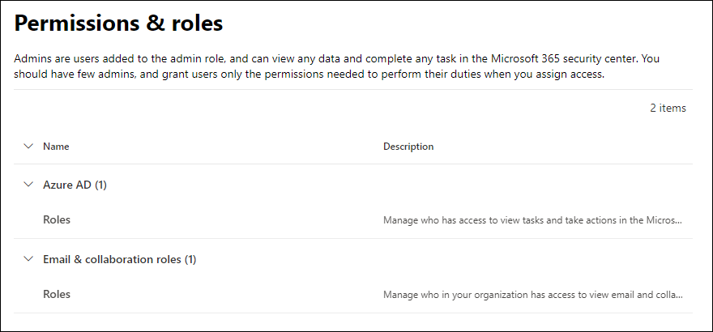

# Permisos en el portal de Microsoft 365 Defender

[!INCLUDE [Microsoft 365 Defender rebranding](../includes/microsoft-defender-for-office.md)]

**Se aplica a**
- [Exchange Online Protection](exchange-online-protection-overview.md)
- [Plan 1 y Plan 2 de Microsoft Defender para Office 365](defender-for-office-365.md)
- [Microsoft 365 Defender](../defender/microsoft-365-defender.md)

Necesita administrar escenarios de seguridad que abarcan todos los servicios de Microsoft 365. Y necesita la flexibilidad para dar los permisos de administrador adecuados a las personas adecuadas en su organización.

El portal de Microsoft 365 Defender en <https://security.microsoft.com> admite la administración directa de permisos para los usuarios que realizan tareas de seguridad en Microsoft 365. Al usar el portal de Microsoft 365 Defender para administrar los permisos, puede administrar los permisos de forma centralizada para todas las tareas relacionadas con la seguridad.

Para administrar permisos en el portal de Microsoft 365 Defender, vaya a **Permisos y roles** o <https://security.microsoft.com/securitypermissions>. Debe ser **administrador global** o un miembro del grupo de roles de **Administración de la organización** en el portal de Microsoft 365 Defender. En concreto, el rol de **Administración de roles** permite a los usuarios ver, crear y modificar grupos de roles en el portal de Microsoft 365 Defender y, de forma predeterminada, ese rol solo se asigna al grupo de roles **Administración de la organización**.

> [!NOTE]
> Para obtener información sobre los permisos en el Centro de cumplimiento de Microsoft 365, consulte [Permisos en el Centro de cumplimiento de Microsoft 365](../../compliance/microsoft-365-compliance-center-permissions.md).

## Relación de los miembros, los roles y los grupos de roles

Los permisos del portal de Microsoft 365 Defender se basan en el modelo de permisos de control de acceso basado en roles (RBAC). RBAC es el mismo modelo de permisos que se usa en la mayoría de los servicios de Microsoft 365, por lo que si está familiarizado con la estructura de permisos de estos servicios, le resultará sencillo conceder permisos en el portal de Microsoft 365 Defender.

Un **rol** concede permisos para realizar un conjunto de tareas.

Un **grupo de roles** es un conjunto de roles que permite a las personas hacer su trabajo en el portal de Microsoft 365 Defender. Por ejemplo, el grupo de roles Administradores de simulador de ataques incluye el rol de Administrador de simulador de ataques para crear y administrar todos los aspectos del aprendizaje de simulación de ataques.

El portal de Microsoft 365 Defender incluye grupos de roles predeterminados para las tareas y funciones más comunes que debe asignar. Por lo general, le recomendamos que simplemente agregue usuarios individuales como **miembros** a los grupos de roles predeterminados.

## Roles y grupos de roles en el portal de Microsoft 365 Defender

Los siguientes tipos de roles y grupos de roles están disponibles en **Permisos y roles** en el portal de Microsoft 365 Defender:

- **Roles de Azure AD**: puede ver los roles y los usuarios asignados, pero no puede administrarlos directamente en el portal de Microsoft 365 Defender. Los roles de Azure AD son roles centrales que asignan permisos para **todos** los servicios de Microsoft 365.

- **Roles de colaboración y correo electrónico**: son los mismos grupos de roles que están disponibles en el Centro de seguridad y cumplimiento, pero puede administrarlos directamente en el portal de Microsoft 365 Defender. Los permisos que asigna aquí son específicos del portal de Microsoft 365 Defender, el Centro de cumplimiento de Microsoft 365 y el Centro de seguridad y cumplimiento, y no cubren todos los permisos necesarios en otras cargas de trabajo de Microsoft 365.

### Roles de Azure AD en el portal de Microsoft 365 Defender

Si va a **Roles de colaboración y correo electrónico** \> **Permisos y roles** \> **Roles de Azure AD** \> **Roles** (o directamente a <https://security.microsoft.com/aadpermissions>) verá los roles de Azure AD que se describen en esta sección.

Al seleccionar un rol, se muestra un desplegable con detalles que contiene la descripción del rol y las asignaciones de usuario. Para administrar esas asignaciones, debe hacer clic en **Administrar miembros en Azure AD** en el desplegable de detalles.

Para más información, consulte [Visualización y asignación de roles de administrador en Azure Active Directory](/azure/active-directory/users-groups-roles/directory-manage-roles-portal).

 

****

|Función|Descripción|
|---|---|
|**Administrador global**|Acceso a todas las características administrativas en todos los servicios de Microsoft 365. Los administradores globales son los únicos que pueden asignar otros roles de administrador. Para más información, consulte [Administrador global / Administrador de empresa](/azure/active-directory/roles/permissions-reference#global-administrator--company-administrator).|
|**Administrador de datos de cumplimiento**|Realizar un seguimiento de los datos de su organización a través de Microsoft 365, asegurarse de que están protegidos y obtener información sobre los problemas para ayudar a reducir los riesgos. Para obtener más información, consulte [Administrador de datos de cumplimiento](/azure/active-directory/roles/permissions-reference#compliance-data-administrator).|
|**Administrador de cumplimiento**|Ayudar a que su organización cumpla con los requisitos normativos, administrar casos de eDiscovery y mantener directivas de gobierno de datos en todas las ubicaciones, identidades y aplicaciones de Microsoft 365. Para obtener más información, consulte [Administrador de cumplimiento](/azure/active-directory/roles/permissions-reference#compliance-administrator).|
|**Operador de seguridad**|Ver, investigar y responder a las amenazas activas a usuarios, dispositivos y contenido de Microsoft 365. Para obtener más información, vea [Operador de seguridad de seguridad](/azure/active-directory/roles/permissions-reference#security-operator).|
|**Lector de seguridad**|Ver e investigar amenazas activas a usuarios, dispositivos y contenido de Microsoft 365, pero, a diferencia del operador de seguridad, no tienen permisos para responder realizando una acción. Para obtener más información, vea [Lector de seguridad](/azure/active-directory/roles/permissions-reference#security-reader).|
|**Administrador de seguridad**|Controlar la seguridad global de la organización mediante la administración de directivas de seguridad, la revisión de análisis de seguridad y los informes en los productos de Microsoft 365, así como mantenerse al día con el panorama de amenazas. Para obtener más información, vea [Administrador de seguridad](/azure/active-directory/roles/permissions-reference#security-administrator).|
|**Lector global**|La versión de solo lectura del rol de **Administrador global**. Ver todas las configuraciones e información administrativa en Microsoft 365. Para más información, vea [Lector global](/azure/active-directory/roles/permissions-reference#global-reader).|
|**Administrador de simulación de ataque**|Crea y administra todos los aspectos de la creación de [simulación de ataques](attack-simulation-training.md), el lanzamiento o la programación de la simulación y la revisión de los resultados de la misma. Para más información, consulte [Administrador de simulación de ataque](/azure/active-directory/roles/permissions-reference#attack-simulation-administrator).|
|**Autor de carga de ataque**|Crea cargas de ataques pero no las inicia ni programa. Para más información, consulte [Autor de carga de ataques](/azure/active-directory/roles/permissions-reference#attack-payload-author).|
|

### Roles de colaboración y correo electrónico en el portal de Microsoft 365 Defender

Si va a **Roles de colaboración y correo electrónico** \> **Permisos y roles** \> **Roles de colaboración y correo electrónico** \> **Roles** (o directamente a <https://security.microsoft.com/emailandcollabpermissions>) verá los mismos grupos de roles que están disponibles en el Centro de seguridad y cumplimiento.

Para ver la información completa sobre estos grupos de roles, vea [Permisos en el Centro de seguridad y cumplimiento](permissions-in-the-security-and-compliance-center.md).

#### Modificar la suscripción del rol de colaboración y correo electrónico en el portal de Microsoft 365 Defender

1. En el portal de Microsoft 365 Defender, vaya a **Roles de colaboración y correo electrónico** \> **Permisos y roles** \> **Roles de colaboración y correo electrónico** \> **Roles**.

2. En la página de **Permisos** que aparece, seleccione en la lista el grupo de roles que quiere modificar. Puede seleccionar el encabezado de columna **Nombre** para ordenar la lista por nombre o **Búsqueda**  para buscar el grupo de roles.

3. En el desplegable de detalles del grupo de roles que aparece, seleccione **Editar** en la sección **Miembros**.

4. En la página **Editar Elegir miembros** que aparece, siga uno de estos pasos:
   - Si no hay ningún miembro del grupo de roles, seleccione **Elegir miembros**.
   - Si hay miembros en el grupo de roles, seleccione **Editar**.

5. En el desplegable **Elegir miembros** que aparece, siga uno de estos pasos:

   - Seleccione **Agregar**. En la lista de usuarios que aparece, seleccione uno o más usuarios. O bien, puede seleccionar **Búsqueda** para buscar y seleccionar usuarios.

     Cuando haya seleccionado los usuarios que quiera, seleccione **Agregar**.

   - Seleccione **Quitar**. Seleccione uno o varios de los miembros existentes. O bien, puede seleccionar **Búsqueda** para buscar y seleccionar miembros.

     Después de seleccionar los usuarios que quiera, seleccione **Quitar**.

6. En el desplegable **Elegir miembros**, seleccione **Listo**.

7. En la página **Editar Elegir miembros**, seleccione **Guardar**.

8. En el desplegable de detalles del grupo de roles, seleccione **Listo**.
