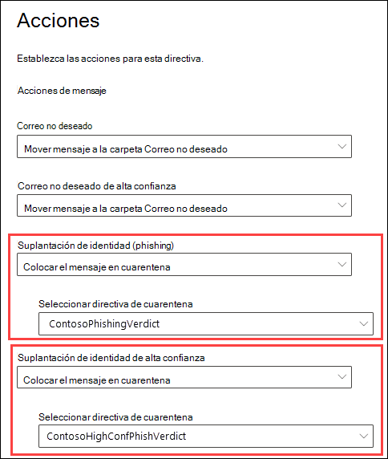
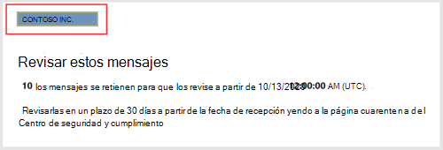
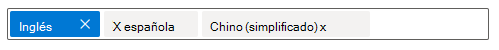
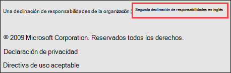
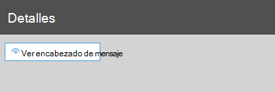
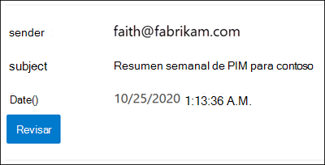
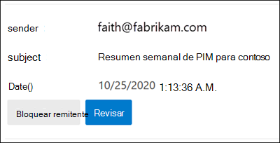
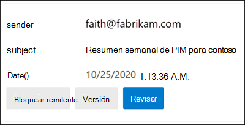

# <a name="quarantine-tags"></a><span data-ttu-id="7986b-103">Etiquetas en cuarentena</span><span class="sxs-lookup"><span data-stu-id="7986b-103">Quarantine tags</span></span>

> [!NOTE]
> <span data-ttu-id="7986b-104">Las características que se describen en este artículo están actualmente en Versión preliminar, no están disponibles para todos y están sujetas a cambios.</span><span class="sxs-lookup"><span data-stu-id="7986b-104">The features that are described in this article are currently in Preview, aren't available to everyone, and are subject to change.</span></span>

<span data-ttu-id="7986b-105">Las etiquetas de cuarentena en Exchange Online Protection (EOP) permiten a los administradores controlar lo que los usuarios pueden hacer con sus mensajes en cuarentena en función de cómo el mensaje llegó a la cuarentena.</span><span class="sxs-lookup"><span data-stu-id="7986b-105">Quarantine tags in Exchange Online Protection (EOP) allow admins to control what users are able to do to their quarantined messages based on how the message arrived in quarantine.</span></span>

<span data-ttu-id="7986b-106">Tradicionalmente, EOP ha permitido o impedido [](find-and-release-quarantined-messages-as-a-user.md) ciertos niveles de interactividad para los mensajes en cuarentena y en las notificaciones de [correo no deseado del usuario final.](use-spam-notifications-to-release-and-report-quarantined-messages.md)</span><span class="sxs-lookup"><span data-stu-id="7986b-106">EOP has traditionally allowed or prevented certain levels of interactivity for messages in [quarantine](find-and-release-quarantined-messages-as-a-user.md) and in [end-user spam notifications](use-spam-notifications-to-release-and-report-quarantined-messages.md).</span></span> <span data-ttu-id="7986b-107">Por ejemplo, los usuarios finales pueden ver y liberar mensajes que fueron puestos en cuarentena por el filtrado contra correo no deseado como correo no deseado o masivo, pero no pueden ver ni liberar mensajes que se han puesto en cuarentena como suplantación de identidad de elevada confianza.</span><span class="sxs-lookup"><span data-stu-id="7986b-107">For example, end-users can view and release messages that were quarantined by anti-spam filtering as spam or bulk, but they can't view or release messages that were quarantined as high confidence phishing.</span></span>

<span data-ttu-id="7986b-108">Para [las características](#step-2-assign-a-quarantine-tag-to-supported-features)de protección admitidas, las etiquetas de cuarentena especifican lo que los usuarios pueden hacer en los mensajes de notificación de correo no deseado del usuario final y en sus mensajes en cuarentena en cuarentena (mensajes donde el usuario es un destinatario).</span><span class="sxs-lookup"><span data-stu-id="7986b-108">For [supported protection features](#step-2-assign-a-quarantine-tag-to-supported-features), quarantine tags specify what users are allowed to do in end-user spam notification messages and in their quarantined messages in quarantine (messages where the user is a recipient).</span></span> <span data-ttu-id="7986b-109">Las etiquetas de cuarentena predeterminadas se asignan automáticamente para exigir las capacidades históricas de los usuarios finales en los mensajes en cuarentena.</span><span class="sxs-lookup"><span data-stu-id="7986b-109">Default quarantine tags are automatically assigned to enforce the historical capabilities for end-users on quarantined messages.</span></span> <span data-ttu-id="7986b-110">O bien, puede crear y asignar etiquetas de cuarentena personalizadas para permitir o impedir que los usuarios finales realicen acciones específicas en mensajes en cuarentena.</span><span class="sxs-lookup"><span data-stu-id="7986b-110">Or, you can create and assign custom quarantine tags to allow or prevent end-users from performing specific actions on quarantined messages.</span></span>

<span data-ttu-id="7986b-111">Los permisos individuales se combinan en los siguientes grupos de permisos preestablecidos:</span><span class="sxs-lookup"><span data-stu-id="7986b-111">The individual permissions are combined into the following preset permission groups:</span></span>

- <span data-ttu-id="7986b-112">Sin acceso</span><span class="sxs-lookup"><span data-stu-id="7986b-112">No access</span></span>
- <span data-ttu-id="7986b-113">Acceso limitado</span><span class="sxs-lookup"><span data-stu-id="7986b-113">Limited access</span></span>
- <span data-ttu-id="7986b-114">Acceso completo</span><span class="sxs-lookup"><span data-stu-id="7986b-114">Full access</span></span>

<span data-ttu-id="7986b-115">Los permisos individuales disponibles y lo que se incluye o no en los grupos de permisos preestablecidos se describen en la tabla siguiente:</span><span class="sxs-lookup"><span data-stu-id="7986b-115">The available individual permissions and what's included or not included in the preset permission groups are described in the following table:</span></span>

|<span data-ttu-id="7986b-116">Permiso</span><span class="sxs-lookup"><span data-stu-id="7986b-116">Permission</span></span>|<span data-ttu-id="7986b-117">Sin acceso</span><span class="sxs-lookup"><span data-stu-id="7986b-117">No access</span></span>|<span data-ttu-id="7986b-118">Acceso limitado</span><span class="sxs-lookup"><span data-stu-id="7986b-118">Limited access</span></span>|<span data-ttu-id="7986b-119">Acceso completo</span><span class="sxs-lookup"><span data-stu-id="7986b-119">Full access</span></span>|
|---|:---:|:---:|:---:|
|<span data-ttu-id="7986b-120">**Permitir remitente** (_PermissionToAllowSender_)</span><span class="sxs-lookup"><span data-stu-id="7986b-120">**Allow sender** (_PermissionToAllowSender_)</span></span>||||
|<span data-ttu-id="7986b-122">**Bloquear remitente** (_PermissionToBlockSender_)</span><span class="sxs-lookup"><span data-stu-id="7986b-122">**Block sender** (_PermissionToBlockSender_)</span></span>||||
|<span data-ttu-id="7986b-125">**Delete** (_PermissionToDelete_)</span><span class="sxs-lookup"><span data-stu-id="7986b-125">**Delete** (_PermissionToDelete_)</span></span>||||
|<span data-ttu-id="7986b-128">**Vista** previa (_PermissionToPreview_)</span><span class="sxs-lookup"><span data-stu-id="7986b-128">**Preview** (_PermissionToPreview_)</span></span>||||
|<span data-ttu-id="7986b-131">**Permitir que los destinatarios liberen un mensaje de cuarentena** (_PermissionToRelease_)</span><span class="sxs-lookup"><span data-stu-id="7986b-131">**Allow recipients to release a message from quarantine** (_PermissionToRelease_)</span></span>||||
|<span data-ttu-id="7986b-133">**Permitir que los destinatarios soliciten la puesta en** cuarentena de un mensaje (_PermissionToRequestRelease_)</span><span class="sxs-lookup"><span data-stu-id="7986b-133">**Allow recipients to request a message to be released from quarantine** (_PermissionToRequestRelease_)</span></span>||||
|

<span data-ttu-id="7986b-135">Si no le gustan los permisos predeterminados en los grupos de permisos preestablecidos, puede usar permisos personalizados al crear o modificar etiquetas de cuarentena personalizadas.</span><span class="sxs-lookup"><span data-stu-id="7986b-135">If you don't like the default permissions in the preset permission groups, you can use custom permissions when you create or modify custom quarantine tags.</span></span> <span data-ttu-id="7986b-136">Para obtener más información acerca de lo que hace cada permiso, vea la sección Detalles del permiso de etiqueta de [cuarentena](#quarantine-tag-permission-details) más adelante en este artículo.</span><span class="sxs-lookup"><span data-stu-id="7986b-136">For more information about what each permission does, see the [Quarantine tag permission details](#quarantine-tag-permission-details) section later in this article.</span></span>

<span data-ttu-id="7986b-137">Puede crear y asignar etiquetas de cuarentena en el Centro de seguridad y cumplimiento de & o en PowerShell (Exchange Online PowerShell para organizaciones de Microsoft 365 con buzones de Exchange Online; PowerShell de EOP independiente en organizaciones EOP sin buzones de Exchange Online).</span><span class="sxs-lookup"><span data-stu-id="7986b-137">You create and assign quarantine tags in the Security & Compliance Center or in PowerShell (Exchange Online PowerShell for Microsoft 365 organizations with Exchange Online Mailboxes; standalone EOP PowerShell in EOP organizations without Exchange Online mailboxes).</span></span>

## <a name="what-do-you-need-to-know-before-you-begin"></a><span data-ttu-id="7986b-138">¿Qué necesita saber antes de comenzar?</span><span class="sxs-lookup"><span data-stu-id="7986b-138">What do you need to know before you begin?</span></span>

- <span data-ttu-id="7986b-139">Abra el Centro de seguridad y cumplimiento en <https://protection.office.com/>.</span><span class="sxs-lookup"><span data-stu-id="7986b-139">You open the Security & Compliance Center at <https://protection.office.com/>.</span></span> <span data-ttu-id="7986b-140">Para ir directamente a la página **Etiquetas de cuarentena,** abra <https://protection.office.com/quarantineTags> .</span><span class="sxs-lookup"><span data-stu-id="7986b-140">To go directly to the **Quarantine tags** page, open <https://protection.office.com/quarantineTags>.</span></span>

- <span data-ttu-id="7986b-141">Para conectarse al PowerShell de Exchange Online, consulte [Conexión a Exchange Online PowerShell](/powershell/exchange/connect-to-exchange-online-powershell).</span><span class="sxs-lookup"><span data-stu-id="7986b-141">To connect to Exchange Online PowerShell, see [Connect to Exchange Online PowerShell](/powershell/exchange/connect-to-exchange-online-powershell).</span></span> <span data-ttu-id="7986b-142">Para conectarse a EOP PowerShell independiente, consulte [Connect to Exchange Online Protection PowerShell](/powershell/exchange/connect-to-exchange-online-protection-powershell) (Conexión a Exchange Online Protection PowerShell).</span><span class="sxs-lookup"><span data-stu-id="7986b-142">To connect to standalone EOP PowerShell, see [Connect to Exchange Online Protection PowerShell](/powershell/exchange/connect-to-exchange-online-protection-powershell).</span></span>

- <span data-ttu-id="7986b-143">Para ver, crear, modificar o quitar etiquetas de cuarentena, debe  ser miembro de los roles Administración de la organización o Administrador de seguridad en el Centro de [seguridad & cumplimiento](permissions-in-the-security-and-compliance-center.md). </span><span class="sxs-lookup"><span data-stu-id="7986b-143">To view, create, modify, or remove quarantine tags, you need to be a member of the **Organization Management** or **Security Administrator** roles in the [Security & Compliance Center](permissions-in-the-security-and-compliance-center.md).</span></span>

## <a name="step-1-create-quarantine-tags-in-the-security--compliance-center"></a><span data-ttu-id="7986b-144">Paso 1: Crear etiquetas de cuarentena en el Centro de seguridad & cumplimiento</span><span class="sxs-lookup"><span data-stu-id="7986b-144">Step 1: Create quarantine tags in the Security & Compliance Center</span></span>

1. <span data-ttu-id="7986b-145">En el Centro de & cumplimiento, vaya a **Directiva de administración de** amenazas y, a continuación, seleccione \>  **Etiquetas de cuarentena.**</span><span class="sxs-lookup"><span data-stu-id="7986b-145">In the Security & Compliance Center, go to **Threat management** \> **Policy** and then select **Quarantine tags**.</span></span>

2. <span data-ttu-id="7986b-146">En la **página Etiquetas de cuarentena,** seleccione **Agregar etiqueta personalizada**.</span><span class="sxs-lookup"><span data-stu-id="7986b-146">On the **Quarantine tags** page, select **Add custom tag**.</span></span>

3. <span data-ttu-id="7986b-147">Se **abrirá el Asistente para nueva** etiqueta.</span><span class="sxs-lookup"><span data-stu-id="7986b-147">The **New tag** wizard opens.</span></span> <span data-ttu-id="7986b-148">En la **página Nombre de** etiqueta, escriba un nombre breve pero único en el campo Nombre **de** etiqueta.</span><span class="sxs-lookup"><span data-stu-id="7986b-148">On the **Tag name** page, enter a brief but unique name in the **Tag name** field.</span></span> <span data-ttu-id="7986b-149">Deberá identificar y seleccionar la etiqueta por su nombre en los próximos pasos.</span><span class="sxs-lookup"><span data-stu-id="7986b-149">You'll need to identify and select the tag by name in upcoming steps.</span></span> <span data-ttu-id="7986b-150">Cuando termine, haga clic en **Siguiente**.</span><span class="sxs-lookup"><span data-stu-id="7986b-150">When you're finished, click **Next**.</span></span>

4. <span data-ttu-id="7986b-151">En la **página Acceso a mensajes de** destinatario, seleccione uno de los siguientes valores:</span><span class="sxs-lookup"><span data-stu-id="7986b-151">On the **Recipient message access** page, select one of the following values:</span></span>
   - <span data-ttu-id="7986b-152">**Sin acceso**</span><span class="sxs-lookup"><span data-stu-id="7986b-152">**No access**</span></span>
   - <span data-ttu-id="7986b-153">**Acceso limitado**</span><span class="sxs-lookup"><span data-stu-id="7986b-153">**Limited access**</span></span>
   - <span data-ttu-id="7986b-154">**Acceso completo**</span><span class="sxs-lookup"><span data-stu-id="7986b-154">**Full access**</span></span>

   <span data-ttu-id="7986b-155">Los permisos individuales que se incluyen en estos grupos de permisos se describen anteriormente en este artículo.</span><span class="sxs-lookup"><span data-stu-id="7986b-155">The individual permissions that are included in these permission groups are described earlier in this article.</span></span>

   <span data-ttu-id="7986b-156">Para especificar permisos personalizados, seleccione **Establecer acceso específico (Avanzado)** y configure las siguientes opciones:</span><span class="sxs-lookup"><span data-stu-id="7986b-156">To specify custom permissions, select **Set specific access (Advanced)** and configure the following settings:</span></span>

     - <span data-ttu-id="7986b-157">**Seleccionar preferencia de acción de lanzamiento:** seleccione uno de los siguientes valores:</span><span class="sxs-lookup"><span data-stu-id="7986b-157">**Select release action preference**: Select one of the following values:</span></span>
       - <span data-ttu-id="7986b-158">**Sin acción de lanzamiento:** este es el valor predeterminado.</span><span class="sxs-lookup"><span data-stu-id="7986b-158">**No release action**: This is the default value.</span></span>
       - <span data-ttu-id="7986b-159">**Permitir que los destinatarios liberen un mensaje de cuarentena**</span><span class="sxs-lookup"><span data-stu-id="7986b-159">**Allow recipients to release a message from quarantine**</span></span>
       - <span data-ttu-id="7986b-160">**Permitir que los destinatarios soliciten un mensaje que se liberará de la cuarentena**</span><span class="sxs-lookup"><span data-stu-id="7986b-160">**Allow recipients to request a message to be released from quarantine**</span></span>

     - <span data-ttu-id="7986b-161">**Seleccionar acciones adicionales que los** destinatarios pueden realizar en mensajes en cuarentena: seleccione algunos, todos o ninguno de los siguientes valores:</span><span class="sxs-lookup"><span data-stu-id="7986b-161">**Select additional actions recipients can take on quarantined messages**: Select some, all, or none of the following values:</span></span>
       - <span data-ttu-id="7986b-162">**Eliminar**</span><span class="sxs-lookup"><span data-stu-id="7986b-162">**Delete**</span></span>
       - <span data-ttu-id="7986b-163">**Versión preliminar**</span><span class="sxs-lookup"><span data-stu-id="7986b-163">**Preview**</span></span>
       - <span data-ttu-id="7986b-164">**Permitir remitente**</span><span class="sxs-lookup"><span data-stu-id="7986b-164">**Allow sender**</span></span>
       - <span data-ttu-id="7986b-165">**Bloquear remitente**</span><span class="sxs-lookup"><span data-stu-id="7986b-165">**Block sender**</span></span>

   <span data-ttu-id="7986b-166">Estos permisos y su efecto en los mensajes en cuarentena y en las notificaciones de correo no deseado del usuario final se describen en la sección [Detalles](#quarantine-tag-permission-details) de permisos de etiqueta de cuarentena más adelante en este artículo.</span><span class="sxs-lookup"><span data-stu-id="7986b-166">These permissions and their effect on quarantined messages and in end-user spam notifications are described in the [Quarantine tag permission details](#quarantine-tag-permission-details) section later in this article.</span></span>

   <span data-ttu-id="7986b-167">Cuando termine, haga clic en **Siguiente**.</span><span class="sxs-lookup"><span data-stu-id="7986b-167">When you're finished, click **Next**.</span></span>

5. <span data-ttu-id="7986b-168">En la **página Resumen** que aparece, revisa la configuración.</span><span class="sxs-lookup"><span data-stu-id="7986b-168">On the **Summary** page that appears, review your settings.</span></span> <span data-ttu-id="7986b-169">Puede hacer clic **en Editar** en cada configuración para modificarla.</span><span class="sxs-lookup"><span data-stu-id="7986b-169">You can click **Edit** on each setting to modify it.</span></span>

   <span data-ttu-id="7986b-170">Cuando haya terminado, haga clic en **Enviar**.</span><span class="sxs-lookup"><span data-stu-id="7986b-170">When you're finished, click **Submit**.</span></span>

6. <span data-ttu-id="7986b-171">Haga **clic en Listo** en la página de confirmación que aparece.</span><span class="sxs-lookup"><span data-stu-id="7986b-171">Click **Done** on the confirmation page that appears.</span></span>

<span data-ttu-id="7986b-172">Ahora ya está listo para asignar la etiqueta de cuarentena a una característica de cuarentena, tal como se describe en la [sección Paso 2.](#step-2-assign-a-quarantine-tag-to-supported-features)</span><span class="sxs-lookup"><span data-stu-id="7986b-172">Now you are ready to assign the quarantine tag to a quarantine feature as described in the [Step 2](#step-2-assign-a-quarantine-tag-to-supported-features) section.</span></span>

### <a name="create-quarantine-tags-in-powershell"></a><span data-ttu-id="7986b-173">Crear etiquetas de cuarentena en PowerShell</span><span class="sxs-lookup"><span data-stu-id="7986b-173">Create quarantine tags in PowerShell</span></span>

<span data-ttu-id="7986b-174">Si prefiere usar PowerShell para crear etiquetas de cuarentena, conéctese a Exchange Online PowerShell o Exchange Online Protection PowerShell y use el cmdlet **New-QuarantineTag.**</span><span class="sxs-lookup"><span data-stu-id="7986b-174">If you'd rather use PowerShell to create quarantine tags, connect to Exchange Online PowerShell or Exchange Online Protection PowerShell and use the **New-QuarantineTag** cmdlet.</span></span> <span data-ttu-id="7986b-175">Tiene dos métodos diferentes entre los que elegir:</span><span class="sxs-lookup"><span data-stu-id="7986b-175">You have two different methods to choose from:</span></span>

- <span data-ttu-id="7986b-176">Use el _parámetro EndUserQuarantinePermissionsValue._</span><span class="sxs-lookup"><span data-stu-id="7986b-176">Use the _EndUserQuarantinePermissionsValue_ parameter.</span></span>
- <span data-ttu-id="7986b-177">Use el _parámetro EndUserQuarantinePermissions._</span><span class="sxs-lookup"><span data-stu-id="7986b-177">Use the _EndUserQuarantinePermissions_ parameter.</span></span>

<span data-ttu-id="7986b-178">Estos métodos se describen en las secciones siguientes.</span><span class="sxs-lookup"><span data-stu-id="7986b-178">These methods are described in the following sections.</span></span>

#### <a name="use-the-enduserquarantinepermissionsvalue-parameter"></a><span data-ttu-id="7986b-179">Usar el parámetro EndUserQuarantinePermissionsValue</span><span class="sxs-lookup"><span data-stu-id="7986b-179">Use the EndUserQuarantinePermissionsValue parameter</span></span>

<span data-ttu-id="7986b-180">Para crear una etiqueta en cuarentena con el _parámetro EndUserQuarantinePermissionsValue,_ use la sintaxis siguiente:</span><span class="sxs-lookup"><span data-stu-id="7986b-180">To create a quarantine tag using the _EndUserQuarantinePermissionsValue_ parameter, use the following syntax:</span></span>

```powershell
New-QuarantineTag -Name "<UniqueName>" -EndUserQuarantinePermissionsValue <0 to 236>
```

<span data-ttu-id="7986b-181">El _parámetro EndUserQuarantinePermissionsValue_ usa un valor decimal que se convierte a partir de un valor binario.</span><span class="sxs-lookup"><span data-stu-id="7986b-181">The _EndUserQuarantinePermissionsValue_ parameter uses a decimal value that's converted from a binary value.</span></span> <span data-ttu-id="7986b-182">El valor binario corresponde a los permisos de cuarentena de usuario final disponibles en un orden específico.</span><span class="sxs-lookup"><span data-stu-id="7986b-182">The binary value corresponds to the available end-user quarantine permissions in a specific order.</span></span> <span data-ttu-id="7986b-183">Para cada permiso, el valor 1 es True y el valor 0 es False.</span><span class="sxs-lookup"><span data-stu-id="7986b-183">For each permission, the value 1 equals True and the value 0 equals False.</span></span>

<span data-ttu-id="7986b-184">El orden y los valores necesarios para cada permiso individual en grupos de permisos preestablecidos se describen en la tabla siguiente:</span><span class="sxs-lookup"><span data-stu-id="7986b-184">The required order and values for each individual permission in preset permission groups are described in the following table:</span></span>

****

|<span data-ttu-id="7986b-185">Permiso</span><span class="sxs-lookup"><span data-stu-id="7986b-185">Permission</span></span>|<span data-ttu-id="7986b-186">Sin acceso</span><span class="sxs-lookup"><span data-stu-id="7986b-186">No access</span></span>|<span data-ttu-id="7986b-187">Acceso limitado</span><span class="sxs-lookup"><span data-stu-id="7986b-187">Limited access</span></span>|<span data-ttu-id="7986b-188">Acceso completo</span><span class="sxs-lookup"><span data-stu-id="7986b-188">Full access</span></span>|
|---|:---:|:---:|:---:|
|<span data-ttu-id="7986b-189">PermissionToAllowSender</span><span class="sxs-lookup"><span data-stu-id="7986b-189">PermissionToAllowSender</span></span>|<span data-ttu-id="7986b-190">0</span><span class="sxs-lookup"><span data-stu-id="7986b-190">0</span></span>|<span data-ttu-id="7986b-191">0</span><span class="sxs-lookup"><span data-stu-id="7986b-191">0</span></span>|<span data-ttu-id="7986b-192">1</span><span class="sxs-lookup"><span data-stu-id="7986b-192">1</span></span>|
|<span data-ttu-id="7986b-193">PermissionToBlockSender</span><span class="sxs-lookup"><span data-stu-id="7986b-193">PermissionToBlockSender</span></span>|<span data-ttu-id="7986b-194">0</span><span class="sxs-lookup"><span data-stu-id="7986b-194">0</span></span>|<span data-ttu-id="7986b-195">1</span><span class="sxs-lookup"><span data-stu-id="7986b-195">1</span></span>|<span data-ttu-id="7986b-196">1</span><span class="sxs-lookup"><span data-stu-id="7986b-196">1</span></span>|
|<span data-ttu-id="7986b-197">PermissionToDelete</span><span class="sxs-lookup"><span data-stu-id="7986b-197">PermissionToDelete</span></span>|<span data-ttu-id="7986b-198">0</span><span class="sxs-lookup"><span data-stu-id="7986b-198">0</span></span>|<span data-ttu-id="7986b-199">1</span><span class="sxs-lookup"><span data-stu-id="7986b-199">1</span></span>|<span data-ttu-id="7986b-200">1</span><span class="sxs-lookup"><span data-stu-id="7986b-200">1</span></span>|
|<span data-ttu-id="7986b-201">PermissionToDownload<sup>\*</sup></span><span class="sxs-lookup"><span data-stu-id="7986b-201">PermissionToDownload<sup>\*</sup></span></span>|<span data-ttu-id="7986b-202">0</span><span class="sxs-lookup"><span data-stu-id="7986b-202">0</span></span>|<span data-ttu-id="7986b-203">0</span><span class="sxs-lookup"><span data-stu-id="7986b-203">0</span></span>|<span data-ttu-id="7986b-204">0</span><span class="sxs-lookup"><span data-stu-id="7986b-204">0</span></span>|
|<span data-ttu-id="7986b-205">PermissionToPreview</span><span class="sxs-lookup"><span data-stu-id="7986b-205">PermissionToPreview</span></span>|<span data-ttu-id="7986b-206">0</span><span class="sxs-lookup"><span data-stu-id="7986b-206">0</span></span>|<span data-ttu-id="7986b-207">1</span><span class="sxs-lookup"><span data-stu-id="7986b-207">1</span></span>|<span data-ttu-id="7986b-208">1</span><span class="sxs-lookup"><span data-stu-id="7986b-208">1</span></span>|
|<span data-ttu-id="7986b-209">PermissionToRelease<sup>\*\*</sup></span><span class="sxs-lookup"><span data-stu-id="7986b-209">PermissionToRelease<sup>\*\*</sup></span></span>|<span data-ttu-id="7986b-210">0</span><span class="sxs-lookup"><span data-stu-id="7986b-210">0</span></span>|<span data-ttu-id="7986b-211">0</span><span class="sxs-lookup"><span data-stu-id="7986b-211">0</span></span>|<span data-ttu-id="7986b-212">1</span><span class="sxs-lookup"><span data-stu-id="7986b-212">1</span></span>|
|<span data-ttu-id="7986b-213">PermissionToRequestRelease<sup>\*\*</sup></span><span class="sxs-lookup"><span data-stu-id="7986b-213">PermissionToRequestRelease<sup>\*\*</sup></span></span>|<span data-ttu-id="7986b-214">0</span><span class="sxs-lookup"><span data-stu-id="7986b-214">0</span></span>|<span data-ttu-id="7986b-215">1</span><span class="sxs-lookup"><span data-stu-id="7986b-215">1</span></span>|<span data-ttu-id="7986b-216">0</span><span class="sxs-lookup"><span data-stu-id="7986b-216">0</span></span>|
|<span data-ttu-id="7986b-217">PermissionToViewHeader<sup>\*</sup></span><span class="sxs-lookup"><span data-stu-id="7986b-217">PermissionToViewHeader<sup>\*</sup></span></span>|<span data-ttu-id="7986b-218">0</span><span class="sxs-lookup"><span data-stu-id="7986b-218">0</span></span>|<span data-ttu-id="7986b-219">0</span><span class="sxs-lookup"><span data-stu-id="7986b-219">0</span></span>|<span data-ttu-id="7986b-220">0</span><span class="sxs-lookup"><span data-stu-id="7986b-220">0</span></span>|
|<span data-ttu-id="7986b-221">Valor binario</span><span class="sxs-lookup"><span data-stu-id="7986b-221">Binary value</span></span>|<span data-ttu-id="7986b-222">00000000</span><span class="sxs-lookup"><span data-stu-id="7986b-222">00000000</span></span>|<span data-ttu-id="7986b-223">01101010</span><span class="sxs-lookup"><span data-stu-id="7986b-223">01101010</span></span>|<span data-ttu-id="7986b-224">11101100</span><span class="sxs-lookup"><span data-stu-id="7986b-224">11101100</span></span>|
|<span data-ttu-id="7986b-225">Valor decimal que se usará</span><span class="sxs-lookup"><span data-stu-id="7986b-225">Decimal value to use</span></span>|<span data-ttu-id="7986b-226">0</span><span class="sxs-lookup"><span data-stu-id="7986b-226">0</span></span>|<span data-ttu-id="7986b-227">106</span><span class="sxs-lookup"><span data-stu-id="7986b-227">106</span></span>|<span data-ttu-id="7986b-228">236</span><span class="sxs-lookup"><span data-stu-id="7986b-228">236</span></span>|

<span data-ttu-id="7986b-229"><sup>\*</sup> Actualmente, este valor es siempre 0.</span><span class="sxs-lookup"><span data-stu-id="7986b-229"><sup>\*</sup> Currently, this value is always 0.</span></span> <span data-ttu-id="7986b-230">Para PermissionToViewHeader, el valor 0  no oculta el botón Ver encabezado del mensaje en los detalles del mensaje en cuarentena (el botón siempre está disponible).</span><span class="sxs-lookup"><span data-stu-id="7986b-230">For PermissionToViewHeader, the value 0 doesn't hide the **View message header** button in the details of the quarantined message (the button is always available).</span></span>

<span data-ttu-id="7986b-231"><sup>\*\*</sup> No establezca ambos valores en 1.</span><span class="sxs-lookup"><span data-stu-id="7986b-231"><sup>\*\*</sup> Don't set both of these values to 1.</span></span> <span data-ttu-id="7986b-232">Establezca uno en 1 y el otro en 0, o establezca ambos en 0.</span><span class="sxs-lookup"><span data-stu-id="7986b-232">Set one to 1 and the other to 0, or set both to 0.</span></span>

<span data-ttu-id="7986b-233">En este ejemplo se crea un nuevo nombre de etiqueta de cuarentena NoAccess que asigna los permisos Sin acceso, tal como se describe en la tabla anterior.</span><span class="sxs-lookup"><span data-stu-id="7986b-233">This example creates a new quarantine tag name NoAccess that assigns the No access permissions as described in the previous table.</span></span>

```powershell
New-QuarantineTag -Name NoAccess -EndUserQuarantinePermissionsValue 0
```

<span data-ttu-id="7986b-234">Para permisos de acceso limitado, use el valor 106.</span><span class="sxs-lookup"><span data-stu-id="7986b-234">For Limited access permissions, use the value 106.</span></span> <span data-ttu-id="7986b-235">Para obtener permisos de acceso completo, use el valor 236.</span><span class="sxs-lookup"><span data-stu-id="7986b-235">For Full access permissions, use the value 236.</span></span>

<span data-ttu-id="7986b-236">Para los permisos personalizados, use la tabla anterior para obtener el valor binario que corresponde a los permisos que desea.</span><span class="sxs-lookup"><span data-stu-id="7986b-236">For custom permissions, use the previous table to get the binary value that corresponds to the permissions you want.</span></span> <span data-ttu-id="7986b-237">Convierta el valor binario en un valor decimal y use el valor decimal para el parámetro _EndUserQuarantinePermissionsValue._</span><span class="sxs-lookup"><span data-stu-id="7986b-237">Convert the binary value to a decimal value and use the decimal value for the _EndUserQuarantinePermissionsValue_ parameter.</span></span>

<span data-ttu-id="7986b-238">Para obtener información detallada sobre la sintaxis y los parámetros, [vea New-QuarantineTag](/powershell/module/exchange/new-quarantinetag).</span><span class="sxs-lookup"><span data-stu-id="7986b-238">For detailed syntax and parameter information, see [New-QuarantineTag](/powershell/module/exchange/new-quarantinetag).</span></span>

#### <a name="use-the-enduserquarantinepermissions-parameter"></a><span data-ttu-id="7986b-239">Usar el parámetro EndUserQuarantinePermissions</span><span class="sxs-lookup"><span data-stu-id="7986b-239">Use the EndUserQuarantinePermissions parameter</span></span>

<span data-ttu-id="7986b-240">Para crear una etiqueta en cuarentena con el _parámetro EndUserQuarantinePermissionsValue,_ siga estos pasos:</span><span class="sxs-lookup"><span data-stu-id="7986b-240">To create a quarantine tag using the _EndUserQuarantinePermissionsValue_ parameter, do the following steps:</span></span>

<span data-ttu-id="7986b-241">A.</span><span class="sxs-lookup"><span data-stu-id="7986b-241">A.</span></span> <span data-ttu-id="7986b-242">Almacene un objeto de permisos de cuarentena en una variable mediante el cmdlet **New-QuarantinePermissions.**</span><span class="sxs-lookup"><span data-stu-id="7986b-242">Store a quarantine permissions object in a variable using the **New-QuarantinePermissions** cmdlet.</span></span>

<p>

<span data-ttu-id="7986b-243">B.</span><span class="sxs-lookup"><span data-stu-id="7986b-243">B.</span></span> <span data-ttu-id="7986b-244">Use la variable como el _valor EndUserQuarantinePermissions_ en el **comando New-QuarantineTag.**</span><span class="sxs-lookup"><span data-stu-id="7986b-244">Use the variable as the _EndUserQuarantinePermissions_ value in the **New-QuarantineTag** command.</span></span>

##### <a name="step-a-store-a-quarantine-permissions-object-in-a-variable"></a><span data-ttu-id="7986b-245">Paso A: Almacenar un objeto de permisos de cuarentena en una variable</span><span class="sxs-lookup"><span data-stu-id="7986b-245">Step A: Store a quarantine permissions object in a variable</span></span>

<span data-ttu-id="7986b-246">Utilice la siguiente sintaxis:</span><span class="sxs-lookup"><span data-stu-id="7986b-246">Use the following syntax:</span></span>

```powershell
$<VariableName> = New-QuarantinePermissions [-PermissionToAllowSender <$true | $False>] [-PermissionToBlockSender <$true | $False>] [-PermissionToDelete <$true | $False>] [-PermissionToPreview <$true | $False>] [-PermissionToRelease <$true | $False>] [-PermissionToRequestRelease <$true | $False>]
```

<span data-ttu-id="7986b-247">El valor predeterminado de los parámetros no usados es , por lo que solo necesita usar los parámetros donde desea establecer `$false` el valor en `$true` .</span><span class="sxs-lookup"><span data-stu-id="7986b-247">The default value for any unused parameters is `$false`, so you only need to use the parameters where you want to set value to `$true`.</span></span>

<span data-ttu-id="7986b-248">En los ejemplos siguientes se muestra cómo crear objetos de permisos que corresponden a los grupos de permisos preestablecidos:</span><span class="sxs-lookup"><span data-stu-id="7986b-248">The following examples show how to create permission objects that correspond to the preset permissions groups:</span></span>

- <span data-ttu-id="7986b-249">**Sin acceso**:</span><span class="sxs-lookup"><span data-stu-id="7986b-249">**No access**:</span></span>

  ```powershell
  $NoAccess = New-QuarantinePermissions
  ```

- <span data-ttu-id="7986b-250">**Acceso limitado:**</span><span class="sxs-lookup"><span data-stu-id="7986b-250">**Limited access**:</span></span>

  ```powershell
  $LimitedAccess = New-QuarantinePermissions -PermissionToBlockSender $true -PermissionToDelete $true -PermissionToPreview $true -PermissionToRequestRelease $true
  ```

- <span data-ttu-id="7986b-251">**Acceso completo:**</span><span class="sxs-lookup"><span data-stu-id="7986b-251">**Full access**:</span></span>

  ```powershell
  $FullAccess = New-QuarantinePermissions -PermissionToAllowSender $true -PermissionToBlockSender $true -PermissionToDelete $true -PermissionToPreview $true -PermissionToRelease $true
  ```

<span data-ttu-id="7986b-252">Para ver los valores que ha establecido, ejecute el nombre de la variable como un comando (por ejemplo, ejecute el comando `$NoAccess` ).</span><span class="sxs-lookup"><span data-stu-id="7986b-252">To see the values that you've set, run the variable name as a command (for example, run the command `$NoAccess`).</span></span>

<span data-ttu-id="7986b-253">Para los permisos personalizados, no establezca los parámetros _PermissionToRelease_ y _PermissionToRequestRelease en_ `$true` .</span><span class="sxs-lookup"><span data-stu-id="7986b-253">For custom permissions, don't set both the _PermissionToRelease_ and _PermissionToRequestRelease_ parameters to `$true`.</span></span> <span data-ttu-id="7986b-254">Establezca uno en `$true` y deje el otro como , o deje ambos como `$false` `$false` .</span><span class="sxs-lookup"><span data-stu-id="7986b-254">Set one to `$true` and leave the other as `$false`, or leave both as `$false`.</span></span>

<span data-ttu-id="7986b-255">También puede modificar una variable de objeto permissions existente después de crearla, pero antes de usarla mediante el cmdlet **Set-QuarantinePermissions.**</span><span class="sxs-lookup"><span data-stu-id="7986b-255">You can also modify an existing permissions object variable after you create but before you use it by using the **Set-QuarantinePermissions** cmdlet.</span></span>

<span data-ttu-id="7986b-256">Para obtener información detallada sobre la sintaxis y los parámetros, [vea New-QuarantinePermissions](/powershell/module/exchange/new-quarantinepermissions) y [Set-QuarantinePermissions](/powershell/module/exchange/set-quarantinepermissions).</span><span class="sxs-lookup"><span data-stu-id="7986b-256">For detailed syntax and parameter information, see [New-QuarantinePermissions](/powershell/module/exchange/new-quarantinepermissions) and [Set-QuarantinePermissions](/powershell/module/exchange/set-quarantinepermissions).</span></span>

##### <a name="step-b-use-the-variable-in-the-new-quarantinetag-command"></a><span data-ttu-id="7986b-257">Paso B: Usar la variable en el New-QuarantineTag comando</span><span class="sxs-lookup"><span data-stu-id="7986b-257">Step B: Use the variable in the New-QuarantineTag command</span></span>

<span data-ttu-id="7986b-258">Después de crear y almacenar el objeto permissions en una variable, use la variable para el valor del parámetro _EndUserQuarantinePermission_ en el siguiente comando **New-QuarantineTag:**</span><span class="sxs-lookup"><span data-stu-id="7986b-258">After you've created and stored the permissions object in a variable, use the variable for the _EndUserQuarantinePermission_ parameter value in the following **New-QuarantineTag** command:</span></span>

```powershell
New-QuarantineTag -Name "<UniqueName>" -EndUserQuarantinePermissions $<VariableName>
```

<span data-ttu-id="7986b-259">En este ejemplo se crea una nueva etiqueta de cuarentena denominada LimitedAccess mediante el objeto permissions que se describió y `$LimitedAccess` creó en el paso anterior.</span><span class="sxs-lookup"><span data-stu-id="7986b-259">This example creates a new quarantine tag named LimitedAccess using the `$LimitedAccess` permissions object that was described and created in the previous step.</span></span>

```powershell
New-QuarantineTag -Name LimitedAccess -EndUserQuarantinePermissions $LimitedAccess
```

<span data-ttu-id="7986b-260">Para obtener información detallada sobre la sintaxis y los parámetros, [vea New-QuarantineTag](/powershell/module/exchange/new-quarantinetag).</span><span class="sxs-lookup"><span data-stu-id="7986b-260">For detailed syntax and parameter information, see [New-QuarantineTag](/powershell/module/exchange/new-quarantinetag).</span></span>

## <a name="step-2-assign-a-quarantine-tag-to-supported-features"></a><span data-ttu-id="7986b-261">Paso 2: Asignar una etiqueta de cuarentena a características compatibles</span><span class="sxs-lookup"><span data-stu-id="7986b-261">Step 2: Assign a quarantine tag to supported features</span></span>

<span data-ttu-id="7986b-262">En _las características_ de protección admitidas que ponen en cuarentena mensajes o archivos (automáticamente o como una acción configurable), puede asignar una etiqueta de cuarentena a las acciones de cuarentena disponibles.</span><span class="sxs-lookup"><span data-stu-id="7986b-262">In _supported_ protection features that quarantine messages or files (automatically or as a configurable action), you can assign a quarantine tag to the available quarantine actions.</span></span> <span data-ttu-id="7986b-263">Las características que ponen en cuarentena los mensajes y la disponibilidad de etiquetas de cuarentena se describen en la siguiente tabla:</span><span class="sxs-lookup"><span data-stu-id="7986b-263">Features that quarantine messages and the availability of quarantine tags are described in the following table:</span></span>

****

|<span data-ttu-id="7986b-264">Característica</span><span class="sxs-lookup"><span data-stu-id="7986b-264">Feature</span></span>|<span data-ttu-id="7986b-265">¿Se admiten etiquetas de cuarentena?</span><span class="sxs-lookup"><span data-stu-id="7986b-265">Quarantine tags supported?</span></span>|<span data-ttu-id="7986b-266">Etiquetas de cuarentena predeterminadas usadas</span><span class="sxs-lookup"><span data-stu-id="7986b-266">Default quarantine tags used</span></span>|
|---|:---:|---|
|<span data-ttu-id="7986b-267">[Directivas contra correo no deseado:](configure-your-spam-filter-policies.md)</span><span class="sxs-lookup"><span data-stu-id="7986b-267">[Anti-spam policies](configure-your-spam-filter-policies.md):</span></span> <ul><li><span data-ttu-id="7986b-268">**Correo no deseado** (_SpamAction_)</span><span class="sxs-lookup"><span data-stu-id="7986b-268">**Spam** (_SpamAction_)</span></span></li><li><span data-ttu-id="7986b-269">**Correo no deseado de elevada** confianza (_HighConfidenceSpamAction_)</span><span class="sxs-lookup"><span data-stu-id="7986b-269">**High confidence spam** (_HighConfidenceSpamAction_)</span></span></li><li><span data-ttu-id="7986b-270">**Correo electrónico de phishing** (_PhishSpamAction_)</span><span class="sxs-lookup"><span data-stu-id="7986b-270">**Phishing email** (_PhishSpamAction_)</span></span></li><li><span data-ttu-id="7986b-271">**Correo electrónico de phishing de elevada confianza** (_HighConfidencePhishAction_)</span><span class="sxs-lookup"><span data-stu-id="7986b-271">**High confidence phishing email** (_HighConfidencePhishAction_)</span></span></li><li><span data-ttu-id="7986b-272">**Correo electrónico masivo** (_BulkSpamAction_)</span><span class="sxs-lookup"><span data-stu-id="7986b-272">**Bulk email** (_BulkSpamAction_)</span></span></li></ul>|<span data-ttu-id="7986b-273">Sí</span><span class="sxs-lookup"><span data-stu-id="7986b-273">Yes</span></span>|<ul><li><span data-ttu-id="7986b-274">DefaultSpamTag (acceso completo)</span><span class="sxs-lookup"><span data-stu-id="7986b-274">DefaultSpamTag (Full access)</span></span></li><li><span data-ttu-id="7986b-275">DefaultHighConfSpamTag (acceso completo)</span><span class="sxs-lookup"><span data-stu-id="7986b-275">DefaultHighConfSpamTag (Full access)</span></span></li><li><span data-ttu-id="7986b-276">DefaultPhishTag (acceso completo)</span><span class="sxs-lookup"><span data-stu-id="7986b-276">DefaultPhishTag (Full access)</span></span></li><li><span data-ttu-id="7986b-277">DefaultHighConfPhishTag (sin acceso)</span><span class="sxs-lookup"><span data-stu-id="7986b-277">DefaultHighConfPhishTag (No access)</span></span></li><li><span data-ttu-id="7986b-278">DefaultBulkTag (acceso completo)</span><span class="sxs-lookup"><span data-stu-id="7986b-278">DefaultBulkTag (Full access)</span></span></li></ul>
|<span data-ttu-id="7986b-279">Directivas contra suplantación de identidad:</span><span class="sxs-lookup"><span data-stu-id="7986b-279">Anti-phishing policies:</span></span> <ul><li><span data-ttu-id="7986b-280">[Protección de inteligencia suplantada](set-up-anti-phishing-policies.md#spoof-settings) (_AuthenticationFailAction_)</span><span class="sxs-lookup"><span data-stu-id="7986b-280">[Spoof intelligence protection](set-up-anti-phishing-policies.md#spoof-settings) (_AuthenticationFailAction_)</span></span></li><li><span data-ttu-id="7986b-281">[Protección de suplantación:](set-up-anti-phishing-policies.md#impersonation-settings-in-anti-phishing-policies-in-microsoft-defender-for-office-365)<sup>\*</sup></span><span class="sxs-lookup"><span data-stu-id="7986b-281">[Impersonation protection](set-up-anti-phishing-policies.md#impersonation-settings-in-anti-phishing-policies-in-microsoft-defender-for-office-365):<sup>\*</sup></span></span> <ul><li><span data-ttu-id="7986b-282">**Si un usuario suplantado** envía correo electrónico (_TargetedUserProtectionAction_)</span><span class="sxs-lookup"><span data-stu-id="7986b-282">**If email is sent by an impersonated user** (_TargetedUserProtectionAction_)</span></span></li><li><span data-ttu-id="7986b-283">**Si un dominio suplantado envía correo** electrónico (_TargetedDomainProtectionAction_)</span><span class="sxs-lookup"><span data-stu-id="7986b-283">**If email is sent by an impersonated domain** (_TargetedDomainProtectionAction_)</span></span></li><li><span data-ttu-id="7986b-284">**Inteligencia de buzones** \> **Si un usuario suplantado envía** correo electrónico (_MailboxIntelligenceProtectionAction_)</span><span class="sxs-lookup"><span data-stu-id="7986b-284">**Mailbox intelligence** \> **If email is sent by an impersonated user** (_MailboxIntelligenceProtectionAction_)</span></span></li></ul></li></ul></ul>|<span data-ttu-id="7986b-285">No</span><span class="sxs-lookup"><span data-stu-id="7986b-285">No</span></span>|<span data-ttu-id="7986b-286">N/D</span><span class="sxs-lookup"><span data-stu-id="7986b-286">n/a</span></span>|
|<span data-ttu-id="7986b-287">[Directivas antimalware:](configure-anti-malware-policies.md)todos los mensajes detectados siempre se ponen en cuarentena.</span><span class="sxs-lookup"><span data-stu-id="7986b-287">[Anti-malware policies](configure-anti-malware-policies.md): All detected messages are always quarantined.</span></span>|<span data-ttu-id="7986b-288">No</span><span class="sxs-lookup"><span data-stu-id="7986b-288">No</span></span>|<span data-ttu-id="7986b-289">N/D</span><span class="sxs-lookup"><span data-stu-id="7986b-289">n/a</span></span>|
|[<span data-ttu-id="7986b-290">Datos adjuntos seguros para SharePoint, OneDrive y Microsoft Teams</span><span class="sxs-lookup"><span data-stu-id="7986b-290">Safe Attachments for SharePoint, OneDrive, and Microsoft Teams</span></span>](atp-for-spo-odb-and-teams.md)|<span data-ttu-id="7986b-291">No</span><span class="sxs-lookup"><span data-stu-id="7986b-291">No</span></span>|<span data-ttu-id="7986b-292">N/D</span><span class="sxs-lookup"><span data-stu-id="7986b-292">n/a</span></span>|
|<span data-ttu-id="7986b-293">[Reglas de flujo de](/exchange/security-and-compliance/mail-flow-rules/mail-flow-rules) correo (también conocidas como reglas de transporte) con la acción: Entregar el mensaje a la cuarentena **hospedada** (_Cuarentena_).</span><span class="sxs-lookup"><span data-stu-id="7986b-293">[Mail flow rules](/exchange/security-and-compliance/mail-flow-rules/mail-flow-rules) (also known as transport rules) with the action: **Deliver the message to the hosted quarantine** (_Quarantine_).</span></span>|<span data-ttu-id="7986b-294">No</span><span class="sxs-lookup"><span data-stu-id="7986b-294">No</span></span>|<span data-ttu-id="7986b-295">N/D</span><span class="sxs-lookup"><span data-stu-id="7986b-295">n/a</span></span>|
|

<span data-ttu-id="7986b-296"><sup>\*</sup> La configuración de protección de suplantación solo está disponible en las directivas contra suplantación de identidad en Microsoft Defender para Office 365.</span><span class="sxs-lookup"><span data-stu-id="7986b-296"><sup>\*</sup> Impersonation protection settings are available only in anti-phishing policies in Microsoft Defender for Office 365.</span></span>

<span data-ttu-id="7986b-297">Si está contento con los permisos de usuario final proporcionados por las etiquetas de cuarentena predeterminadas, no necesita hacer nada.</span><span class="sxs-lookup"><span data-stu-id="7986b-297">If you're happy with the end-user permissions that are provided by the default quarantine tags, you don't need to do anything.</span></span> <span data-ttu-id="7986b-298">Si desea personalizar las capacidades del usuario final (botones disponibles) en las notificaciones de correo no deseado del usuario final o en los detalles del mensaje en cuarentena, puede asignar una etiqueta de cuarentena personalizada.</span><span class="sxs-lookup"><span data-stu-id="7986b-298">If you want to customize the end-user capabilities (available buttons) in end-user spam notifications or in quarantined message details, you can assign a custom quarantine tag.</span></span>

### <a name="assign-quarantine-tags-in-anti-spam-policies-in-the-security--compliance-center"></a><span data-ttu-id="7986b-299">Asignar etiquetas de cuarentena en directivas contra correo no deseado en el Centro de seguridad & cumplimiento</span><span class="sxs-lookup"><span data-stu-id="7986b-299">Assign quarantine tags in anti-spam policies in the Security & Compliance Center</span></span>

<span data-ttu-id="7986b-300">Las instrucciones completas para crear y modificar directivas contra correo no deseado se describen en [Configure anti-spam policies in EOP](configure-your-spam-filter-policies.md).</span><span class="sxs-lookup"><span data-stu-id="7986b-300">Full instructions for creating and modifying anti-spam policies are described in [Configure anti-spam policies in EOP](configure-your-spam-filter-policies.md).</span></span>

1. <span data-ttu-id="7986b-301">En el Centro de & cumplimiento, vaya a **Directiva de** administración de amenazas y, a \>  \> continuación, seleccione **Correo no deseado.**</span><span class="sxs-lookup"><span data-stu-id="7986b-301">In the Security & Compliance Center, go to **Threat management** \> **Policy** \> and then select **Anti-spam**.</span></span> <span data-ttu-id="7986b-302">O bien, abra <https://protection.office.com/antispam> .</span><span class="sxs-lookup"><span data-stu-id="7986b-302">Or, open <https://protection.office.com/antispam>.</span></span>

2. <span data-ttu-id="7986b-303">Busque y seleccione una directiva contra correo no deseado existente para editarla o crear una nueva directiva contra correo no deseado.</span><span class="sxs-lookup"><span data-stu-id="7986b-303">Find and select an existing anti-spam policy to edit, or create a new anti-spam policy.</span></span>

3. <span data-ttu-id="7986b-304">En el control desplegable de detalles de la directiva, expanda la sección Correo no deseado **y acciones masivas.**</span><span class="sxs-lookup"><span data-stu-id="7986b-304">In the policy details flyout, expand the **Spam and bulk actions** section.</span></span>

4. <span data-ttu-id="7986b-305">Si ha seleccionado  Mensaje de cuarentena para la acción de  un veredicto de filtrado de correo no deseado disponible, el cuadro Aplicar etiqueta de directiva de cuarentena está disponible para seleccionar la etiqueta de cuarentena para ese veredicto.</span><span class="sxs-lookup"><span data-stu-id="7986b-305">If you've selected **Quarantine message** for the action of an available spam filtering verdict, the **Apply quarantine policy tag** box is available for you to select the quarantine tag for that verdict.</span></span>

   <span data-ttu-id="7986b-306">**Nota:** Al crear una nueva directiva, se usa un valor de etiqueta de cuarentena en blanco para un veredicto de filtrado de correo no deseado.</span><span class="sxs-lookup"><span data-stu-id="7986b-306">**Note**: When you create a new policy, a blank quarantine tag value for a spam filtering verdict indicates the default quarantine tag for that verdict is used.</span></span> <span data-ttu-id="7986b-307">Cuando más adelante edite la directiva, los valores en blanco se reemplazan por los nombres de etiquetas de cuarentena predeterminados reales, como se describe en la tabla anterior.</span><span class="sxs-lookup"><span data-stu-id="7986b-307">When you later edit the policy, the blank values are replaced by the actual default quarantine tag names as described in the previous table.</span></span>

   

5. <span data-ttu-id="7986b-309">Cuando haya terminado, haga clic en **Guardar**.</span><span class="sxs-lookup"><span data-stu-id="7986b-309">When you're finished, click **Save**.</span></span>

#### <a name="assign-quarantine-tags-in-anti-spam-policies-in-powershell"></a><span data-ttu-id="7986b-310">Asignar etiquetas de cuarentena en directivas contra correo no deseado en PowerShell</span><span class="sxs-lookup"><span data-stu-id="7986b-310">Assign quarantine tags in anti-spam policies in PowerShell</span></span>

<span data-ttu-id="7986b-311">Si prefiere usar PowerShell para asignar etiquetas de cuarentena en directivas contra correo no deseado, conéctese a Exchange Online PowerShell o Exchange Online Protection PowerShell y use la siguiente sintaxis:</span><span class="sxs-lookup"><span data-stu-id="7986b-311">If you'd rather use PowerShell to assign quarantine tags in anti-spam policies, connect to Exchange Online PowerShell or Exchange Online Protection PowerShell and use the following syntax:</span></span>

```powershell
<New-HostedContentFilterPolicy -Name "<Unique name>" | Set-HostedContentFilterPolicy -Identity "<Policy name>">  [-SpamAction Quarantine] [-SpamQuarantineTag <QuarantineTagName>] [-HighConfidenceSpamAction Quarantine] [-HighConfidenceSpamQuarantineTag <QuarantineTagName>] [-PhishSpamAction Quarantine] [-PhishQuarantineTag <QuarantineTagName>] [-HighConfidencePhishQuarantineTag <QuarantineTagName>] [-BulkSpamAction Quarantine] [-BulkQuarantineTag <QuarantineTagName>] ...
```

<span data-ttu-id="7986b-312">**Notas**:</span><span class="sxs-lookup"><span data-stu-id="7986b-312">**Notes**:</span></span>

- <span data-ttu-id="7986b-313">El valor predeterminado del parámetro _HighConfidencePhishAction_ es Quarantine, por lo que no es necesario establecer la acción Cuarentena para detecciones de phishing de elevada confianza en nuevas directivas contra correo no deseado.</span><span class="sxs-lookup"><span data-stu-id="7986b-313">The default value for the _HighConfidencePhishAction_ parameter is Quarantine, so you don't need to set the Quarantine action for high confidence phishing detections in new anti-spam policies.</span></span> <span data-ttu-id="7986b-314">Para todos los demás veredictos de filtrado de correo no deseado en directivas contra correo no deseado nuevas o existentes, la etiqueta de cuarentena solo es eficaz si el valor de la acción es Cuarentena.</span><span class="sxs-lookup"><span data-stu-id="7986b-314">For all other spam filtering verdicts in new or existing anti-spam policies, the quarantine tag is only effective if the action value is Quarantine.</span></span> <span data-ttu-id="7986b-315">Para ver los valores de acción en las directivas contra correo no deseado existentes, ejecute el siguiente comando:</span><span class="sxs-lookup"><span data-stu-id="7986b-315">To see the action values in existing anti-spam policies, run the following command:</span></span>

  ```powershell
  Get-HostedContentFilterPolicy | Format-Table Name,*SpamAction,HighConfidencePhishAction
  ```

  <span data-ttu-id="7986b-316">Para obtener información sobre los valores de acción predeterminados y los valores de acción recomendados para Standard y Strict, consulte [EOP anti-spam policy settings](recommended-settings-for-eop-and-office365-atp.md#eop-anti-spam-policy-settings).</span><span class="sxs-lookup"><span data-stu-id="7986b-316">For information about the default action values and the recommended action values for Standard and Strict, see [EOP anti-spam policy settings](recommended-settings-for-eop-and-office365-atp.md#eop-anti-spam-policy-settings).</span></span>

- <span data-ttu-id="7986b-317">Un veredicto de filtrado de correo no deseado sin un parámetro de etiqueta de cuarentena correspondiente significa que se usa la [etiqueta de cuarentena predeterminada](#step-2-assign-a-quarantine-tag-to-supported-features) para ese veredicto.</span><span class="sxs-lookup"><span data-stu-id="7986b-317">A spam filtering verdict without a corresponding quarantine tag parameter means the [default quarantine tag](#step-2-assign-a-quarantine-tag-to-supported-features) for that verdict is used.</span></span>

  <span data-ttu-id="7986b-318">Solo necesita reemplazar una etiqueta de cuarentena predeterminada por una etiqueta de cuarentena personalizada si desea cambiar las funcionalidades predeterminadas del usuario final en los mensajes en cuarentena.</span><span class="sxs-lookup"><span data-stu-id="7986b-318">You only need to replace a default quarantine tag with a custom quarantine tag if you want to change the default end-user capabilities on quarantined messages.</span></span>

- <span data-ttu-id="7986b-319">Una nueva directiva contra correo no deseado en PowerShell requiere una directiva de filtro de correo no deseado (configuración) mediante el cmdlet **New-HostedContentFilterPolicy** y una nueva regla de filtro de correo no deseado (filtros de destinatarios) mediante el cmdlet **New-HostedContentFilterRule.**</span><span class="sxs-lookup"><span data-stu-id="7986b-319">A new anti-spam policy in PowerShell requires a spam filter policy (settings) using the **New-HostedContentFilterPolicy** cmdlet and a new spam filter rule (recipient filters) using the **New-HostedContentFilterRule** cmdlet.</span></span> <span data-ttu-id="7986b-320">Para obtener instrucciones, [vea Use PowerShell to create anti-spam policies](configure-your-spam-filter-policies.md#use-powershell-to-create-anti-spam-policies).</span><span class="sxs-lookup"><span data-stu-id="7986b-320">For instructions, see [Use PowerShell to create anti-spam policies](configure-your-spam-filter-policies.md#use-powershell-to-create-anti-spam-policies).</span></span>

<span data-ttu-id="7986b-321">En este ejemplo se crea una nueva directiva de filtro de correo no deseado denominada Departamento de investigación con la siguiente configuración:</span><span class="sxs-lookup"><span data-stu-id="7986b-321">This example creates a new spam filter policy named Research Department with the following settings:</span></span>

- <span data-ttu-id="7986b-322">La acción de todos los veredictos de filtrado de correo no deseado se establece en Cuarentena.</span><span class="sxs-lookup"><span data-stu-id="7986b-322">The action for all spam filtering verdicts is set to Quarantine.</span></span>
- <span data-ttu-id="7986b-323">La etiqueta de cuarentena personalizada denominada NoAccess que asigna **ningún** permiso de acceso reemplaza a las etiquetas de cuarentena predeterminadas que aún **no** asignan permisos de acceso de forma predeterminada.</span><span class="sxs-lookup"><span data-stu-id="7986b-323">The custom quarantine tag named NoAccess that assigns **No access** permissions replaces any default quarantine tags that don't already assign **No access** permissions by default.</span></span>

```powershell
New-HostedContentFilterPolicy -Name Research Department -SpamAction Quarantine -SpamQuarantineTag NoAccess -HighConfidenceSpamAction Quarantine -HighConfidenceSpamQuarantineTag NoAction -PhishSpamAction Quarantine -PhishQuarantineTag NoAction -BulkSpamAction Quarantine -BulkQuarantineTag NoAccess
```

<span data-ttu-id="7986b-324">Para obtener información detallada acerca de la sintaxis y los parámetros, consulte [New-HostedContentFilterPolicy](/powershell/module/exchange/new-hostedcontentfilterpolicy).</span><span class="sxs-lookup"><span data-stu-id="7986b-324">For detailed syntax and parameter information, see [New-HostedContentFilterPolicy](/powershell/module/exchange/new-hostedcontentfilterpolicy).</span></span>

<span data-ttu-id="7986b-325">En este ejemplo se modifica la directiva de filtro de correo no deseado existente denominada Recursos humanos.</span><span class="sxs-lookup"><span data-stu-id="7986b-325">This example modifies the existing spam filter policy named Human Resources.</span></span> <span data-ttu-id="7986b-326">La acción del veredicto de cuarentena de correo no deseado se establece en Cuarentena y se asigna la etiqueta de cuarentena personalizada denominada NoAccess.</span><span class="sxs-lookup"><span data-stu-id="7986b-326">The action for the spam quarantine verdict is set to Quarantine, and the custom quarantine tag named NoAccess is assigned.</span></span>

```powershell
Set-HostedContentFilterPolicy -Identity "Human Resources" -SpamAction Quarantine -SpamQuarantineTag NoAccess
```

<span data-ttu-id="7986b-327">Para obtener información detallada acerca de la sintaxis y los parámetros, consulte [Set-HostedContentFilterPolicy](/powershell/module/exchange/set-hostedcontentfilterpolicy).</span><span class="sxs-lookup"><span data-stu-id="7986b-327">For detailed syntax and parameter information, see [Set-HostedContentFilterPolicy](/powershell/module/exchange/set-hostedcontentfilterpolicy).</span></span>

## <a name="configure-global-quarantine-notification-settings-in-the-security--compliance-center"></a><span data-ttu-id="7986b-328">Configurar las opciones de notificación de cuarentena global en el Centro de seguridad & cumplimiento</span><span class="sxs-lookup"><span data-stu-id="7986b-328">Configure global quarantine notification settings in the Security & Compliance Center</span></span>

<span data-ttu-id="7986b-329">La configuración global de las etiquetas de cuarentena permite personalizar las notificaciones de correo no deseado del usuario final que se envían a los destinatarios de los mensajes que se han puesto en cuarentena.</span><span class="sxs-lookup"><span data-stu-id="7986b-329">The global settings for quarantine tags allow you to customize the end-user spam notifications that are sent to recipients of messages that were quarantined.</span></span> <span data-ttu-id="7986b-330">Para obtener más información acerca de estas notificaciones, vea [Notificaciones de correo no deseado del usuario final.](use-spam-notifications-to-release-and-report-quarantined-messages.md)</span><span class="sxs-lookup"><span data-stu-id="7986b-330">For more information about these notifications, see [End-user spam notifications](use-spam-notifications-to-release-and-report-quarantined-messages.md).</span></span>

1. <span data-ttu-id="7986b-331">En el Centro de & cumplimiento, vaya a **Directiva de administración de** amenazas y, a continuación, seleccione \>  **Etiquetas de cuarentena.**</span><span class="sxs-lookup"><span data-stu-id="7986b-331">In the Security & Compliance Center, go to **Threat management** \> **Policy** and then select **Quarantine tags**.</span></span>

2. <span data-ttu-id="7986b-332">En la **página Etiquetas de cuarentena,** seleccione **Configuración global**.</span><span class="sxs-lookup"><span data-stu-id="7986b-332">On the **Quarantine tags** page, select **Global settings**.</span></span>

3. <span data-ttu-id="7986b-333">En el **control desplegable De** notificaciones de cuarentena que se abre, configure algunas o todas las opciones siguientes:</span><span class="sxs-lookup"><span data-stu-id="7986b-333">In the **Quarantine notification settings** flyout that opens, configure some or all of the following settings:</span></span>

   - <span data-ttu-id="7986b-334">**Usar el logotipo de mi** empresa: seleccione esta opción para reemplazar el logotipo predeterminado de Microsoft que se usa en la parte superior de las notificaciones de correo no deseado del usuario final.</span><span class="sxs-lookup"><span data-stu-id="7986b-334">**Use my company logo**: Select this option to replace the default Microsoft logo that's use at the top of end-user spam notifications.</span></span> <span data-ttu-id="7986b-335">Antes de hacerlo, debes seguir las instrucciones de Personalizar el tema [de Microsoft 365](../../admin/setup/customize-your-organization-theme.md) para que tu organización cargue el logotipo personalizado.</span><span class="sxs-lookup"><span data-stu-id="7986b-335">Before you do this, you need to follow the instructions in [Customize the Microsoft 365 theme for your organization](../../admin/setup/customize-your-organization-theme.md) to upload your custom logo.</span></span>

     <span data-ttu-id="7986b-336">La siguiente captura de pantalla muestra un logotipo personalizado en una notificación de correo no deseado del usuario final:</span><span class="sxs-lookup"><span data-stu-id="7986b-336">The following screenshot shows a custom logo in an end-user spam notification:</span></span>

     

   - <span data-ttu-id="7986b-338">**Elegir idioma:** las notificaciones de correo no deseado del usuario final ya están localizadas en función de la configuración de idioma del destinatario.</span><span class="sxs-lookup"><span data-stu-id="7986b-338">**Choose language**: End-user spam notifications are already localized based on the recipient's language settings.</span></span> <span data-ttu-id="7986b-339">Puede especificar texto personalizado en diferentes idiomas para los valores **Nombre para mostrar** y **Declinación de** responsabilidades.</span><span class="sxs-lookup"><span data-stu-id="7986b-339">You can specify customized text in different languages for the **Display name** and **Disclaimer** values.</span></span>

     <span data-ttu-id="7986b-340">Seleccione al menos un idioma en el primer cuadro de idioma y, a continuación, haga clic **en Agregar**.</span><span class="sxs-lookup"><span data-stu-id="7986b-340">Select at least one language from the first language box and then click **Add**.</span></span> <span data-ttu-id="7986b-341">Puede seleccionar varios idiomas haciendo clic **en Agregar** después de cada uno.</span><span class="sxs-lookup"><span data-stu-id="7986b-341">You can select multiple languages by clicking **Add** after each one.</span></span> <span data-ttu-id="7986b-342">Un cuadro de idioma de sección muestra todos los idiomas que ha seleccionado:</span><span class="sxs-lookup"><span data-stu-id="7986b-342">A section language box shows all of the languages that you've selected:</span></span>

     

   - <span data-ttu-id="7986b-344">**Nombre para mostrar:** personalice el nombre para mostrar del remitente que se usa en las notificaciones de correo no deseado del usuario final.</span><span class="sxs-lookup"><span data-stu-id="7986b-344">**Display name**: Customize the sender's display name that's used in end-user spam notifications.</span></span>

     <span data-ttu-id="7986b-345">Para cada idioma que haya agregado, seleccione el idioma del segundo cuadro de idioma (no haga clic en la X) y escriba el valor de texto que desee en el cuadro Nombre **para** mostrar.</span><span class="sxs-lookup"><span data-stu-id="7986b-345">For each language that you've added, select the language in the second language box (don't click on the X) and enter the text value you want in the **Display name** box.</span></span>

     <span data-ttu-id="7986b-346">La siguiente captura de pantalla muestra el nombre para mostrar personalizado en una notificación de correo no deseado del usuario final:</span><span class="sxs-lookup"><span data-stu-id="7986b-346">The following screenshot shows the customized display name in an end-user spam notification:</span></span>

     

   - <span data-ttu-id="7986b-348">**Aviso** de declinación de responsabilidades: agregue un aviso de declinación de responsabilidades personalizado a la parte inferior de las notificaciones de correo no deseado del usuario final.</span><span class="sxs-lookup"><span data-stu-id="7986b-348">**Disclaimer**: Add a custom disclaimer to the bottom of end-user spam notifications.</span></span> <span data-ttu-id="7986b-349">El texto localizado, **Un aviso de declinación de responsabilidades de su organización:** siempre se incluye primero, seguido del texto que especifique.</span><span class="sxs-lookup"><span data-stu-id="7986b-349">The localized text, **A disclaimer from your organization:** is always included first, followed by the text you specify.</span></span>

     <span data-ttu-id="7986b-350">Para cada idioma que haya agregado, seleccione el idioma del segundo cuadro de idioma (no haga clic en la X) y escriba el valor de texto que desee en el cuadro **Declinación de** responsabilidades.</span><span class="sxs-lookup"><span data-stu-id="7986b-350">For each language that you've added, select the language in the second language box  (don't click the X) and enter the text value you want in the **Disclaimer** box.</span></span>

     <span data-ttu-id="7986b-351">La siguiente captura de pantalla muestra el aviso de declinación de responsabilidades personalizado en una notificación de correo no deseado del usuario final:</span><span class="sxs-lookup"><span data-stu-id="7986b-351">The following screenshot shows the customized disclaimer in an end-user spam notification:</span></span>

     

## <a name="view-quarantine-tags-in-the-security--compliance-center"></a><span data-ttu-id="7986b-353">Ver etiquetas de cuarentena en el Centro de & seguridad</span><span class="sxs-lookup"><span data-stu-id="7986b-353">View quarantine tags in the Security & Compliance Center</span></span>

1. <span data-ttu-id="7986b-354">En el Centro de & cumplimiento, vaya a **Directiva de administración de** amenazas y, a continuación, seleccione \>  **Etiquetas de cuarentena.**</span><span class="sxs-lookup"><span data-stu-id="7986b-354">In the Security & Compliance Center, go to **Threat management** \> **Policy** and then select **Quarantine tags**.</span></span>

- <span data-ttu-id="7986b-355">Para ver la configuración de las etiquetas de cuarentena integradas o personalizadas, seleccione la etiqueta de cuarentena de la lista (no active la casilla).</span><span class="sxs-lookup"><span data-stu-id="7986b-355">To view the settings of built-in or custom quarantine tags, select the quarantine tag from the list (don't select the check box).</span></span>

- <span data-ttu-id="7986b-356">Para ver la configuración global, seleccione **Configuración global**</span><span class="sxs-lookup"><span data-stu-id="7986b-356">To view the global settings, select **Global settings**</span></span>

### <a name="view-quarantine-tags-in-powershell"></a><span data-ttu-id="7986b-357">Ver etiquetas de cuarentena en PowerShell</span><span class="sxs-lookup"><span data-stu-id="7986b-357">View quarantine tags in PowerShell</span></span>

<span data-ttu-id="7986b-358">Si prefiere usar PowerShell para ver etiquetas de cuarentena, siga estos pasos:</span><span class="sxs-lookup"><span data-stu-id="7986b-358">If you'd rather use PowerShell to view quarantine tags, do any of the following steps:</span></span>

- <span data-ttu-id="7986b-359">Para ver una lista resumida de todas las etiquetas integradas o personalizadas, ejecute el siguiente comando:</span><span class="sxs-lookup"><span data-stu-id="7986b-359">To view a summary list of all built-in or custom tags, run the following command:</span></span>

  ```powershell
  Get-QuarantineTag | Format-Table Name
  ```

- <span data-ttu-id="7986b-360">Para ver la configuración de las etiquetas de cuarentena integradas o personalizadas, reemplace por el nombre de la etiqueta de cuarentena y \<TagName\> ejecute el siguiente comando:</span><span class="sxs-lookup"><span data-stu-id="7986b-360">To view the settings of built-in or custom quarantine tags, replace \<TagName\> with the name of the quarantine tag, and run the following command:</span></span>

  ```powershell
  Get-QuarantineTag -Identity "<TagName>"
  ```

- <span data-ttu-id="7986b-361">Para ver la configuración global, ejecute el siguiente comando:</span><span class="sxs-lookup"><span data-stu-id="7986b-361">To view the global settings, run the following command:</span></span>

  ```powershell
  Get-QuarantineTag -QuarantineTagType GlobalQuarantineTag
  ```

<span data-ttu-id="7986b-362">Para obtener información detallada acerca de la sintaxis y los parámetros, consulte [Get-HostedContentFilterPolicy](/powershell/module/exchange/get-hostedcontentfilterpolicy).</span><span class="sxs-lookup"><span data-stu-id="7986b-362">For detailed syntax and parameter information, see [Get-HostedContentFilterPolicy](/powershell/module/exchange/get-hostedcontentfilterpolicy).</span></span>

## <a name="remove-quarantine-tags-in-the-security--compliance-center"></a><span data-ttu-id="7986b-363">Quitar etiquetas de cuarentena en el Centro de seguridad & cumplimiento</span><span class="sxs-lookup"><span data-stu-id="7986b-363">Remove quarantine tags in the Security & Compliance Center</span></span>

<span data-ttu-id="7986b-364">**Notas**:</span><span class="sxs-lookup"><span data-stu-id="7986b-364">**Notes**:</span></span>

- <span data-ttu-id="7986b-365">No puede quitar etiquetas de cuarentena integradas.</span><span class="sxs-lookup"><span data-stu-id="7986b-365">You can't remove built-in quarantine tags.</span></span>

- <span data-ttu-id="7986b-366">Antes de quitar una etiqueta de cuarentena personalizada, compruebe que no se está utilizando.</span><span class="sxs-lookup"><span data-stu-id="7986b-366">Before you remove a custom quarantine tag, verify that it's not being used.</span></span> <span data-ttu-id="7986b-367">Por ejemplo, ejecute el siguiente comando en PowerShell:</span><span class="sxs-lookup"><span data-stu-id="7986b-367">For example, run the following command in PowerShell:</span></span>

  ```powershell
  Get-HostedContentFilterPolicy | Format-List Name,*QuarantineTag
  ```

  <span data-ttu-id="7986b-368">Si se usa la etiqueta de cuarentena, [reemplace la etiqueta](#step-2-assign-a-quarantine-tag-to-supported-features) de cuarentena asignada antes de quitarla.</span><span class="sxs-lookup"><span data-stu-id="7986b-368">If the quarantine tag is being used, [replace the assigned quarantine tag](#step-2-assign-a-quarantine-tag-to-supported-features) before you remove it.</span></span>

1. <span data-ttu-id="7986b-369">En el Centro de & cumplimiento, vaya a **Directiva de administración de** amenazas y, a continuación, seleccione \>  **Etiquetas de cuarentena.**</span><span class="sxs-lookup"><span data-stu-id="7986b-369">In the Security & Compliance Center, go to **Threat management** \> **Policy** and then select **Quarantine tags**.</span></span>

2. <span data-ttu-id="7986b-370">En la **página Etiquetas de** cuarentena, seleccione la etiqueta de cuarentena personalizada que desea quitar y haga clic en **Eliminar etiqueta**.</span><span class="sxs-lookup"><span data-stu-id="7986b-370">On the **Quarantine tags** page, select the custom quarantine tag that you want to remove, and the click **Delete tag**.</span></span>

3. <span data-ttu-id="7986b-371">Haga **clic en Quitar** etiqueta en el cuadro de diálogo de confirmación que aparece.</span><span class="sxs-lookup"><span data-stu-id="7986b-371">Click **Remove tag** in the confirmation dialog that appears.</span></span>

### <a name="remove-quarantine-tags-in-powershell"></a><span data-ttu-id="7986b-372">Quitar etiquetas de cuarentena en PowerShell</span><span class="sxs-lookup"><span data-stu-id="7986b-372">Remove quarantine tags in PowerShell</span></span>

<span data-ttu-id="7986b-373">Si prefiere usar PowerShell para quitar una etiqueta de cuarentena personalizada, reemplace por el nombre de la etiqueta de cuarentena y \<TagName\> ejecute el siguiente comando:</span><span class="sxs-lookup"><span data-stu-id="7986b-373">If you'd rather use PowerShell to remove a custom quarantine tag, replace \<TagName\> with the name of the quarantine tag, and run the following command:</span></span>

```powershell
Remove-QuarantineTag -Identity "<TagName>"
```

<span data-ttu-id="7986b-374">Para obtener información detallada acerca de la sintaxis y los parámetros, [vea Remove-QuarantineTag](/powershell/module/exchange/remove-quarantinetag).</span><span class="sxs-lookup"><span data-stu-id="7986b-374">For detailed syntax and parameter information, see [Remove-QuarantineTag](/powershell/module/exchange/remove-quarantinetag).</span></span>

## <a name="quarantine-tag-permission-details"></a><span data-ttu-id="7986b-375">Detalles del permiso de etiqueta en cuarentena</span><span class="sxs-lookup"><span data-stu-id="7986b-375">Quarantine tag permission details</span></span>

<span data-ttu-id="7986b-376">En las secciones siguientes se describen los efectos de los grupos de permisos preestablecidos y los permisos individuales en los detalles de los mensajes en cuarentena y en las notificaciones de correo no deseado del usuario final.</span><span class="sxs-lookup"><span data-stu-id="7986b-376">The following sections describe the effects of preset permission groups and individual permissions in the details of quarantined messages and in end-user spam notifications.</span></span>

### <a name="preset-permissions-groups"></a><span data-ttu-id="7986b-377">Grupos de permisos preestablecidos</span><span class="sxs-lookup"><span data-stu-id="7986b-377">Preset permissions groups</span></span>

<span data-ttu-id="7986b-378">Los permisos individuales que se incluyen en grupos de permisos preestablecidos se enumeran en la tabla al principio de este artículo.</span><span class="sxs-lookup"><span data-stu-id="7986b-378">The individual permissions that are included in preset permission groups are listed in the table at the beginning of this article.</span></span>

#### <a name="no-access"></a><span data-ttu-id="7986b-379">Sin acceso</span><span class="sxs-lookup"><span data-stu-id="7986b-379">No access</span></span>

<span data-ttu-id="7986b-380">Si la etiqueta de cuarentena asigna los **permisos Sin acceso** (sin permisos), los usuarios aún obtienen algunas funcionalidades de línea base:</span><span class="sxs-lookup"><span data-stu-id="7986b-380">If the quarantine tag assigns the **No access** permissions (no permissions), users still get some baseline capabilities:</span></span>

- <span data-ttu-id="7986b-381">**Detalles del mensaje en cuarentena:** el **botón Ver encabezado del** mensaje siempre está disponible.</span><span class="sxs-lookup"><span data-stu-id="7986b-381">**Quarantined message details**: The **View message header** button is always available.</span></span>

  

- <span data-ttu-id="7986b-383">**Notificaciones de correo no deseado del** usuario final: el botón **Revisar** que lleva al usuario al mensaje en cuarentena siempre está disponible.</span><span class="sxs-lookup"><span data-stu-id="7986b-383">**End-user spam notifications**: The **Review** button that takes the user to the message in quarantine is always available.</span></span>

  

#### <a name="limited-access"></a><span data-ttu-id="7986b-385">Acceso limitado</span><span class="sxs-lookup"><span data-stu-id="7986b-385">Limited access</span></span>

<span data-ttu-id="7986b-386">Si la etiqueta de cuarentena asigna los **permisos de** acceso limitado, los usuarios obtienen las siguientes funcionalidades:</span><span class="sxs-lookup"><span data-stu-id="7986b-386">If the quarantine tag assigns the **Limited access** permissions, users get the following capabilities:</span></span>

- <span data-ttu-id="7986b-387">**Detalles del mensaje en cuarentena:** los botones siguientes están disponibles:</span><span class="sxs-lookup"><span data-stu-id="7986b-387">**Quarantined message details**: The following buttons are available:</span></span>
  - <span data-ttu-id="7986b-388">**Versión de solicitud**</span><span class="sxs-lookup"><span data-stu-id="7986b-388">**Request release**</span></span>
  - <span data-ttu-id="7986b-389">**Ver encabezado de mensaje**</span><span class="sxs-lookup"><span data-stu-id="7986b-389">**View message header**</span></span>
  - <span data-ttu-id="7986b-390">**Mensaje de vista previa**</span><span class="sxs-lookup"><span data-stu-id="7986b-390">**Preview message**</span></span>
  - <span data-ttu-id="7986b-391">**Bloquear remitente**</span><span class="sxs-lookup"><span data-stu-id="7986b-391">**Block sender**</span></span>
  - <span data-ttu-id="7986b-392">**Quitar de la cuarentena**</span><span class="sxs-lookup"><span data-stu-id="7986b-392">**Remove from quarantine**</span></span>

  

- <span data-ttu-id="7986b-394">**Notificaciones de correo no deseado del** usuario final: los botones siguientes están disponibles:</span><span class="sxs-lookup"><span data-stu-id="7986b-394">**End-user spam notifications**: The following buttons are available:</span></span>
  - <span data-ttu-id="7986b-395">**Bloquear remitente**</span><span class="sxs-lookup"><span data-stu-id="7986b-395">**Block sender**</span></span>
  - <span data-ttu-id="7986b-396">**Revisar**</span><span class="sxs-lookup"><span data-stu-id="7986b-396">**Review**</span></span>

  

#### <a name="full-access"></a><span data-ttu-id="7986b-398">Acceso completo</span><span class="sxs-lookup"><span data-stu-id="7986b-398">Full access</span></span>

<span data-ttu-id="7986b-399">Si la etiqueta de cuarentena asigna los permisos **de** acceso completo (todos los permisos disponibles), los usuarios obtienen las siguientes funcionalidades:</span><span class="sxs-lookup"><span data-stu-id="7986b-399">If the quarantine tag assigns the **Full access** permissions (all available permissions), users get the following capabilities:</span></span>

- <span data-ttu-id="7986b-400">**Detalles del mensaje en cuarentena:** los botones siguientes están disponibles:</span><span class="sxs-lookup"><span data-stu-id="7986b-400">**Quarantined message details**: The following buttons are available:</span></span>
  - <span data-ttu-id="7986b-401">**Mensaje de versión**</span><span class="sxs-lookup"><span data-stu-id="7986b-401">**Release message**</span></span>
  - <span data-ttu-id="7986b-402">**Ver encabezado de mensaje**</span><span class="sxs-lookup"><span data-stu-id="7986b-402">**View message header**</span></span>
  - <span data-ttu-id="7986b-403">**Mensaje de vista previa**</span><span class="sxs-lookup"><span data-stu-id="7986b-403">**Preview message**</span></span>
  - <span data-ttu-id="7986b-404">**Bloquear remitente**</span><span class="sxs-lookup"><span data-stu-id="7986b-404">**Block sender**</span></span>
  - <span data-ttu-id="7986b-405">**Permitir remitente**</span><span class="sxs-lookup"><span data-stu-id="7986b-405">**Allow sender**</span></span>
  - <span data-ttu-id="7986b-406">**Quitar de la cuarentena**</span><span class="sxs-lookup"><span data-stu-id="7986b-406">**Remove from quarantine**</span></span>

  

- <span data-ttu-id="7986b-408">**Notificaciones de correo no deseado del** usuario final: los botones siguientes están disponibles:</span><span class="sxs-lookup"><span data-stu-id="7986b-408">**End-user spam notifications**: The following buttons are available:</span></span>
  - <span data-ttu-id="7986b-409">**Bloquear remitente**</span><span class="sxs-lookup"><span data-stu-id="7986b-409">**Block sender**</span></span>
  - <span data-ttu-id="7986b-410">**Release**</span><span class="sxs-lookup"><span data-stu-id="7986b-410">**Release**</span></span>
  - <span data-ttu-id="7986b-411">**Revisar**</span><span class="sxs-lookup"><span data-stu-id="7986b-411">**Review**</span></span>

  

### <a name="individual-permissions"></a><span data-ttu-id="7986b-413">Permisos individuales</span><span class="sxs-lookup"><span data-stu-id="7986b-413">Individual permissions</span></span>

> [!NOTE]
> <span data-ttu-id="7986b-414">Recuerde que los usuarios siempre obtienen los botones descritos en la [sección Sin](#no-access) acceso.</span><span class="sxs-lookup"><span data-stu-id="7986b-414">Remember, users always get the buttons described in the [No access](#no-access) section.</span></span> <span data-ttu-id="7986b-415">Estos botones no se incluyen en las descripciones de permisos individuales.</span><span class="sxs-lookup"><span data-stu-id="7986b-415">These buttons are not included in the individual permission descriptions.</span></span>

#### <a name="allow-sender-permission"></a><span data-ttu-id="7986b-416">Permitir permiso de remitente</span><span class="sxs-lookup"><span data-stu-id="7986b-416">Allow sender permission</span></span>

<span data-ttu-id="7986b-417">El permiso permitir **remitente** (_PermissionToAllowSender_) controla el acceso al botón que permite a los usuarios agregar cómodamente el remitente del mensaje en cuarentena a su lista de remitentes seguros.</span><span class="sxs-lookup"><span data-stu-id="7986b-417">The **Allow sender** permission (_PermissionToAllowSender_) controls access to the button that allows users to conveniently add the quarantined message sender to their Safe Senders list.</span></span>

- <span data-ttu-id="7986b-418">**Detalles del mensaje en cuarentena:**</span><span class="sxs-lookup"><span data-stu-id="7986b-418">**Quarantined message details**:</span></span>
  - <span data-ttu-id="7986b-419">**Permitir permiso de** remitente habilitado: **el botón Permitir remitente** está disponible.</span><span class="sxs-lookup"><span data-stu-id="7986b-419">**Allow sender** permission enabled: The **Allow sender** button is available.</span></span>
  - <span data-ttu-id="7986b-420">**Permitir permiso de** remitente deshabilitado: **el botón Permitir remitente** no está disponible.</span><span class="sxs-lookup"><span data-stu-id="7986b-420">**Allow sender** permission disabled: The **Allow sender** button is not available.</span></span>

- <span data-ttu-id="7986b-421">**Notificaciones de correo no deseado del usuario final:** Sin efecto.</span><span class="sxs-lookup"><span data-stu-id="7986b-421">**End-user spam notifications**: No effect.</span></span>

<span data-ttu-id="7986b-422">Para obtener más información acerca de la lista remitentes seguros, vea Impedir que los [remitentes](https://support.microsoft.com/office/274ae301-5db2-4aad-be21-25413cede077#__toc304379666) de confianza se bloqueen y [Use Exchange Online PowerShell para](configure-junk-email-settings-on-exo-mailboxes.md#use-exchange-online-powershell-to-configure-the-safelist-collection-on-a-mailbox)configurar la colección de listas seguras en un buzón.</span><span class="sxs-lookup"><span data-stu-id="7986b-422">For more information about the Safe Senders list, see [Prevent trusted senders from being blocked](https://support.microsoft.com/office/274ae301-5db2-4aad-be21-25413cede077#__toc304379666) and [Use Exchange Online PowerShell to configure the safelist collection on a mailbox](configure-junk-email-settings-on-exo-mailboxes.md#use-exchange-online-powershell-to-configure-the-safelist-collection-on-a-mailbox).</span></span>

#### <a name="block-sender-permission"></a><span data-ttu-id="7986b-423">Bloquear el permiso del remitente</span><span class="sxs-lookup"><span data-stu-id="7986b-423">Block sender permission</span></span>

<span data-ttu-id="7986b-424">El **permiso bloquear remitente** (_PermissionToBlockSender_) controla el acceso al botón que permite a los usuarios agregar cómodamente el remitente del mensaje en cuarentena a su lista de remitentes bloqueados.</span><span class="sxs-lookup"><span data-stu-id="7986b-424">The **Block sender** permission (_PermissionToBlockSender_) controls access to the button that allows users to conveniently add the quarantined message sender to their Blocked Senders list.</span></span>

- <span data-ttu-id="7986b-425">**Detalles del mensaje en cuarentena:**</span><span class="sxs-lookup"><span data-stu-id="7986b-425">**Quarantined message details**:</span></span>
  - <span data-ttu-id="7986b-426">**Bloquear permiso de** remitente habilitado: el **botón Bloquear remitente** está disponible.</span><span class="sxs-lookup"><span data-stu-id="7986b-426">**Block sender** permission enabled: The **Block sender** button is available.</span></span>
  - <span data-ttu-id="7986b-427">**Bloquear el permiso** del remitente deshabilitado: **el botón Bloquear remitente** no está disponible.</span><span class="sxs-lookup"><span data-stu-id="7986b-427">**Block sender** permission disabled: The **Block sender** button is not available.</span></span>

- <span data-ttu-id="7986b-428">**Notificaciones de correo no deseado del usuario final:**</span><span class="sxs-lookup"><span data-stu-id="7986b-428">**End-user spam notifications**:</span></span>
  - <span data-ttu-id="7986b-429">**Bloquear el permiso** del remitente deshabilitado: **el botón Bloquear remitente** no está disponible.</span><span class="sxs-lookup"><span data-stu-id="7986b-429">**Block sender** permission disabled: The **Block sender** button is not available.</span></span>
  - <span data-ttu-id="7986b-430">**Bloquear permiso de** remitente habilitado: el **botón Bloquear remitente** está disponible.</span><span class="sxs-lookup"><span data-stu-id="7986b-430">**Block sender** permission enabled: The **Block sender** button is available.</span></span>

<span data-ttu-id="7986b-431">Para obtener más información acerca de la lista Remitentes bloqueados, vea [Bloquear](https://support.microsoft.com/office/274ae301-5db2-4aad-be21-25413cede077#__toc304379667) mensajes de alguien y Usar PowerShell de Exchange Online para configurar la colección de listas seguras [en un buzón.](configure-junk-email-settings-on-exo-mailboxes.md#use-exchange-online-powershell-to-configure-the-safelist-collection-on-a-mailbox)</span><span class="sxs-lookup"><span data-stu-id="7986b-431">For more information about the Blocked Senders list, see [Block messages from someone](https://support.microsoft.com/office/274ae301-5db2-4aad-be21-25413cede077#__toc304379667) and [Use Exchange Online PowerShell to configure the safelist collection on a mailbox](configure-junk-email-settings-on-exo-mailboxes.md#use-exchange-online-powershell-to-configure-the-safelist-collection-on-a-mailbox).</span></span>

#### <a name="delete-permission"></a><span data-ttu-id="7986b-432">Permiso de eliminación</span><span class="sxs-lookup"><span data-stu-id="7986b-432">Delete permission</span></span>

<span data-ttu-id="7986b-433">El **permiso Delete** (_PermissionToDelete_) controla la capacidad de los usuarios para eliminar sus mensajes (mensajes donde el usuario es un destinatario) de la cuarentena.</span><span class="sxs-lookup"><span data-stu-id="7986b-433">The **Delete** permission (_PermissionToDelete_) controls the ability to of users to delete their messages (messages where the user is a recipient) from quarantine.</span></span>

- <span data-ttu-id="7986b-434">**Detalles del mensaje en cuarentena:**</span><span class="sxs-lookup"><span data-stu-id="7986b-434">**Quarantined message details**:</span></span>
  - <span data-ttu-id="7986b-435">**Permisos** de eliminación habilitados: **el botón Quitar de cuarentena** está disponible.</span><span class="sxs-lookup"><span data-stu-id="7986b-435">**Delete** permission enabled: The **Remove from quarantine** button is available.</span></span>
  - <span data-ttu-id="7986b-436">**Eliminar** permiso deshabilitado: el **botón Quitar de cuarentena** no está disponible.</span><span class="sxs-lookup"><span data-stu-id="7986b-436">**Delete** permission disabled: The **Remove from quarantine** button is not available.</span></span>

- <span data-ttu-id="7986b-437">**Notificaciones de correo no deseado del usuario final:** Sin efecto.</span><span class="sxs-lookup"><span data-stu-id="7986b-437">**End-user spam notifications**: No effect.</span></span>

#### <a name="preview-permission"></a><span data-ttu-id="7986b-438">Permiso de vista previa</span><span class="sxs-lookup"><span data-stu-id="7986b-438">Preview permission</span></span>

<span data-ttu-id="7986b-439">El **permiso Vista** previa (_PermissionToPreview_) controla la capacidad de los usuarios para obtener una vista previa de sus mensajes en cuarentena.</span><span class="sxs-lookup"><span data-stu-id="7986b-439">The **Preview** permission (_PermissionToPreview_) controls the ability to of users to preview their messages in quarantine.</span></span>

- <span data-ttu-id="7986b-440">**Detalles del mensaje en cuarentena:**</span><span class="sxs-lookup"><span data-stu-id="7986b-440">**Quarantined message details**:</span></span>
  - <span data-ttu-id="7986b-441">**Permiso** de vista previa habilitado: **el botón Vista previa del** mensaje está disponible.</span><span class="sxs-lookup"><span data-stu-id="7986b-441">**Preview** permission enabled: The **Preview message** button is available.</span></span>
  - <span data-ttu-id="7986b-442">**Permiso** de vista previa deshabilitado: **el botón Vista previa del** mensaje no está disponible.</span><span class="sxs-lookup"><span data-stu-id="7986b-442">**Preview** permission disabled: The **Preview message** button is not available.</span></span>

- <span data-ttu-id="7986b-443">**Notificaciones de correo no deseado del usuario final:** Sin efecto.</span><span class="sxs-lookup"><span data-stu-id="7986b-443">**End-user spam notifications**: No effect.</span></span>

#### <a name="allow-recipients-to-release-a-message-from-quarantine-permission"></a><span data-ttu-id="7986b-444">Permitir que los destinatarios liberen un mensaje del permiso de cuarentena</span><span class="sxs-lookup"><span data-stu-id="7986b-444">Allow recipients to release a message from quarantine permission</span></span>

<span data-ttu-id="7986b-445">Allow **recipients to release a message from quarantine** permission (_PermissionToRelease_) controla la capacidad de los usuarios para liberar sus mensajes en cuarentena directamente y sin la aprobación de un administrador.</span><span class="sxs-lookup"><span data-stu-id="7986b-445">The **Allow recipients to release a message from quarantine** permission (_PermissionToRelease_) controls the ability of users to release their quarantined messages directly and without the approval of an admin.</span></span>

- <span data-ttu-id="7986b-446">**Detalles del mensaje en cuarentena:**</span><span class="sxs-lookup"><span data-stu-id="7986b-446">**Quarantined message details**:</span></span>
  - <span data-ttu-id="7986b-447">Permiso habilitado: el **botón Liberar mensaje** está disponible.</span><span class="sxs-lookup"><span data-stu-id="7986b-447">Permission enabled: The **Release message** button is available.</span></span>
  - <span data-ttu-id="7986b-448">Permiso deshabilitado: el **botón Liberar mensaje** no está disponible.</span><span class="sxs-lookup"><span data-stu-id="7986b-448">Permission disabled: The **Release message** button is not available.</span></span>

- <span data-ttu-id="7986b-449">**Notificaciones de correo no deseado del usuario final:**</span><span class="sxs-lookup"><span data-stu-id="7986b-449">**End-user spam notifications**:</span></span>
  - <span data-ttu-id="7986b-450">Permiso habilitado: el **botón Liberar** está disponible.</span><span class="sxs-lookup"><span data-stu-id="7986b-450">Permission enabled: The **Release** button is available.</span></span>
  - <span data-ttu-id="7986b-451">Permiso deshabilitado: el **botón Liberar** no está disponible.</span><span class="sxs-lookup"><span data-stu-id="7986b-451">Permission disabled: The **Release** button is not available.</span></span>

#### <a name="allow-recipients-to-request-a-message-to-be-released-from-quarantine-permission"></a><span data-ttu-id="7986b-452">Permitir que los destinatarios soliciten un mensaje que se liberará del permiso de cuarentena</span><span class="sxs-lookup"><span data-stu-id="7986b-452">Allow recipients to request a message to be released from quarantine permission</span></span>

<span data-ttu-id="7986b-453">Allow **recipients to request a message to be released from quarantine** permission (_PermissionToRequestRelease_) controls the ability of users to _request_ the release of their quarantined messages.</span><span class="sxs-lookup"><span data-stu-id="7986b-453">The **Allow recipients to request a message to be released from quarantine** permission (_PermissionToRequestRelease_) controls the ability of users to _request_ the release of their quarantined messages.</span></span> <span data-ttu-id="7986b-454">El mensaje solo se libera después de que un administrador apruebe la solicitud.</span><span class="sxs-lookup"><span data-stu-id="7986b-454">The message is only released after an admin approves the request.</span></span>

- <span data-ttu-id="7986b-455">**Detalles del mensaje en cuarentena:**</span><span class="sxs-lookup"><span data-stu-id="7986b-455">**Quarantined message details**:</span></span>
  - <span data-ttu-id="7986b-456">Permiso habilitado: el **botón Solicitar versión** está disponible.</span><span class="sxs-lookup"><span data-stu-id="7986b-456">Permission enabled: The **Request release** button is available.</span></span>
  - <span data-ttu-id="7986b-457">Permiso deshabilitado: el **botón Solicitar versión** no está disponible.</span><span class="sxs-lookup"><span data-stu-id="7986b-457">Permission disabled: The **Request release** button is not available.</span></span>

- <span data-ttu-id="7986b-458">**Notificaciones de correo no deseado del** usuario final: el botón **Liberar** no está disponible.</span><span class="sxs-lookup"><span data-stu-id="7986b-458">**End-user spam notifications**: The **Release** button is not available.</span></span>