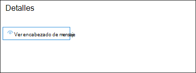

# <a name="quarantine-tags"></a>Etiquetas de cuarentena

> [!NOTE]
> Las características que se describen en este artículo están actualmente en versión preliminar, no están disponibles para todos los usuarios y están sujetas a cambios.

Las etiquetas de cuarentena en Exchange Online Protection (EOP) permiten a los administradores controlar lo que los usuarios pueden hacer con sus mensajes en cuarentena en función de cómo el mensaje llegó a la cuarentena.

EOP ha permitido o impedido tradicionalmente ciertos niveles de interactividad para mensajes en cuarentena y en notificaciones [de correo no deseado para el usuario final.](use-spam-notifications-to-release-and-report-quarantined-messages.md) [](find-and-release-quarantined-messages-as-a-user.md) Por ejemplo, los usuarios finales pueden ver y liberar mensajes que el filtrado contra correo no deseado ha puesto en cuarentena como correo no deseado o masivo, pero no pueden ver ni liberar mensajes que se han puesto en cuarentena como suplantación de identidad de confianza alta.

Para [](#step-2-assign-a-quarantine-tag-to-supported-features)las características de protección admitidas, las etiquetas de cuarentena especifican lo que los usuarios pueden hacer en los mensajes de notificación de correo no deseado para el usuario final y en los mensajes en cuarentena en cuarentena (mensajes en los que el usuario es un destinatario). Las etiquetas de cuarentena predeterminadas se asignan automáticamente para aplicar las capacidades históricas para los usuarios finales en los mensajes en cuarentena. O bien, puede crear y asignar etiquetas de cuarentena personalizadas para permitir o impedir que los usuarios finales realicen acciones específicas en los mensajes en cuarentena.

Los permisos individuales se combinan en los siguientes grupos de permisos preestablecidos:

- Sin acceso
- Acceso limitado
- Acceso completo

Los permisos individuales disponibles y lo que se incluye o no en los grupos de permisos preestablecidos se describen en la tabla siguiente:

|Permiso|Sin acceso|Acceso limitado|Acceso completo|
|---|:---:|:---:|:---:|
|**Permitir remitente** (_PermissionToAllowSender_)||||
|**Bloquear remitente** (_PermissionToBlockSender_)||||
|**Delete** (_PermissionToDelete_)||||
|**Preview** (_PermissionToPreview_)||||
|**Permitir que los destinatarios liberen un mensaje de cuarentena** (_PermissionToRelease_)||||
|**Permitir que los destinatarios soliciten que un mensaje se libera de la cuarentena** (_PermissionToRequestRelease_)||||
|

Si no le gustan los permisos predeterminados en los grupos de permisos preestablecidos, puede usar permisos personalizados al crear o modificar etiquetas de cuarentena personalizadas. Para obtener más información acerca de lo que hace cada permiso, vea la sección detalles del permiso de etiqueta [de](#quarantine-tag-permission-details) cuarentena más adelante en este artículo.

Puede crear y asignar etiquetas de cuarentena en el Centro de seguridad y cumplimiento de & o en PowerShell (Exchange Online PowerShell para organizaciones de Microsoft 365 con buzones de Exchange Online; EOP PowerShell independiente en organizaciones EOP sin buzones de Exchange Online).

## <a name="what-do-you-need-to-know-before-you-begin"></a>¿Qué necesita saber antes de comenzar?

- Abra el Centro de seguridad y cumplimiento en <https://protection.office.com/>. Para ir directamente a la página **Etiquetas de cuarentena,** abra <https://protection.office.com/quarantineTags> .

- Para conectarse al PowerShell de Exchange Online, consulte [Conexión a Exchange Online PowerShell](https://docs.microsoft.com/powershell/exchange/connect-to-exchange-online-powershell). Para conectarse a EOP PowerShell independiente, consulte [Connect to Exchange Online Protection PowerShell](https://docs.microsoft.com/powershell/exchange/connect-to-exchange-online-protection-powershell) (Conexión a Exchange Online Protection PowerShell).

- Para ver, crear, modificar o quitar etiquetas de cuarentena, debe ser miembro de los **roles** de administrador de seguridad o administración de la organización en el Centro de [seguridad & cumplimiento.](permissions-in-the-security-and-compliance-center.md) 

## <a name="step-1-create-quarantine-tags-in-the-security--compliance-center"></a>Paso 1: Crear etiquetas de cuarentena en el Centro de & cumplimiento

1. En el Centro de & cumplimiento, vaya a Directiva de administración **de** amenazas y, a continuación, \>  seleccione **Etiquetas de cuarentena.**

2. En la **página Etiquetas de** cuarentena, seleccione **Agregar etiqueta personalizada.**

3. Se **abrirá el Asistente para nueva** etiqueta. En la **página Nombre de** etiqueta, escriba un nombre breve pero único en el campo Nombre **de** etiqueta. Deberá identificar y seleccionar la etiqueta por su nombre en los próximos pasos. Cuando termine, haga clic en **Siguiente**.

4. En la **página Acceso a mensajes de** destinatario, seleccione uno de los siguientes valores:
   - **Sin acceso**
   - **Acceso limitado**
   - **Acceso completo**

   Los permisos individuales que se incluyen en estos grupos de permisos se describen anteriormente en este artículo.

   Para especificar permisos personalizados, seleccione **Establecer acceso específico (avanzado)** y configure las siguientes opciones:

     - **Seleccione la preferencia de acción de lanzamiento:** seleccione uno de los siguientes valores:
       - **Sin acción de lanzamiento:** este es el valor predeterminado.
       - **Permitir que los destinatarios liberen un mensaje de la cuarentena**
       - **Permitir que los destinatarios soliciten que un mensaje se libera de la cuarentena**

     - **Seleccione acciones adicionales que los destinatarios pueden realizar en** los mensajes en cuarentena: seleccione algunos, todos o ninguno de los siguientes valores:
       - **Eliminar**
       - **Versión preliminar**
       - **Permitir remitente**
       - **Bloquear remitente**

   Estos permisos y su efecto en los mensajes en cuarentena y [](#quarantine-tag-permission-details) en las notificaciones de correo no deseado para el usuario final se describen en la sección detalles de permisos de etiqueta de cuarentena más adelante en este artículo.

   Cuando termine, haga clic en **Siguiente**.

5. En la **página Resumen** que aparece, revise la configuración. Puedes hacer clic **en Editar** en cada opción para modificarla.

   Cuando haya terminado, haga clic en **Enviar.**

6. Haga **clic en Listo** en la página de confirmación que aparece.

Ahora está listo para asignar la etiqueta de cuarentena a una característica de cuarentena, como se describe en la [sección Paso 2.](#step-2-assign-a-quarantine-tag-to-supported-features)

### <a name="create-quarantine-tags-in-powershell"></a>Crear etiquetas de cuarentena en PowerShell

Si prefiere usar PowerShell para crear etiquetas en cuarentena, conéctese a Exchange Online PowerShell o Exchange Online Protection PowerShell y use el cmdlet **New-QuarantineTag.** Tiene dos métodos diferentes entre los que elegir:

- Use el _parámetro EndUserQuarantinePermissionsValue._
- Use el _parámetro EndUserQuarantinePermissions._

Estos métodos se describen en las secciones siguientes.

#### <a name="use-the-enduserquarantinepermissionsvalue-parameter"></a>Usar el parámetro EndUserQuarantinePermissionsValue

Para crear una etiqueta de cuarentena mediante el _parámetro EndUserQuarantinePermissionsValue,_ use la siguiente sintaxis:

```powershell
New-QuarantineTag -Name "<UniqueName>" -EndUserQuarantinePermissionsValue <0 to 236>
```

El _parámetro EndUserQuarantinePermissionsValue_ usa un valor decimal que se convierte a partir de un valor binario. El valor binario corresponde a los permisos de cuarentena de usuario final disponibles en un orden específico. Para cada permiso, el valor 1 es igual a True y el valor 0 es False.

El orden y los valores necesarios para cada permiso individual en grupos de permisos preestablecidos se describen en la tabla siguiente:

****

|Permiso|Sin acceso|Acceso limitado|Acceso completo|
|---|:---:|:---:|:---:|
|PermissionToAllowSender|0|0|1 |
|PermissionToBlockSender|0|1 |1 |
|PermissionToDelete|0|1 |1 |
|PermissionToDownload<sup>\*</sup>|0|0|0|
|PermissionToPreview|0|1 |1 |
|PermissionToRelease<sup>\*\*</sup>|0|0|1 |
|PermissionToRequestRelease<sup>\*\*</sup>|0|1 |0|
|PermissionToViewHeader<sup>\*</sup>|0|0|0|
|Valor binario|00000000|01101010|11101100|
|Valor decimal que se debe usar|0|106|236|

<sup>\*</sup> Actualmente, este valor siempre es 0. Para PermissionToViewHeader, el valor 0  no oculta el botón Ver encabezado del mensaje en los detalles del mensaje en cuarentena (el botón siempre está disponible).

<sup>\*\*</sup> No establezca ambos valores en 1. Establezca uno en 1 y el otro en 0, o establezca ambos en 0.

En este ejemplo se crea un nuevo nombre de etiqueta de cuarentena NoAccess que asigna los permisos Sin acceso, tal como se describe en la tabla anterior.

```powershell
New-QuarantineTag -Name NoAccess -EndUserQuarantinePermissionsValue 0
```

Para los permisos de acceso limitado, use el valor 106. Para los permisos de acceso completo, use el valor 236.

Para los permisos personalizados, use la tabla anterior para obtener el valor binario que corresponde a los permisos que desea. Convierta el valor binario en un valor decimal y use el valor decimal para el parámetro _EndUserQuarantinePermissionsValue._

Para obtener información detallada acerca de la sintaxis y los parámetros, [consulte New-QuarantineTag](https://docs.microsoft.com/powershell/module/exchange/new-quarantinetag).

#### <a name="use-the-enduserquarantinepermissions-parameter"></a>Usar el parámetro EndUserQuarantinePermissions

Para crear una etiqueta de cuarentena mediante el _parámetro EndUserQuarantinePermissionsValue,_ siga estos pasos:

A. Almacene un objeto de permisos de cuarentena en una variable mediante el cmdlet **New-QuarantinePermissions.**

<p>

B. Use la variable como _el valor EndUserQuarantinePermissions_ en el **comando New-QuarantineTag.**

##### <a name="step-a-store-a-quarantine-permissions-object-in-a-variable"></a>Paso A: Almacenar un objeto de permisos de cuarentena en una variable

Utilice la sintaxis siguiente:

```powershell
$<VariableName> = New-QuarantinePermissions [-PermissionToAllowSender <$true | $False>] [-PermissionToBlockSender <$true | $False>] [-PermissionToDelete <$true | $False>] [-PermissionToPreview <$true | $False>] [-PermissionToRelease <$true | $False>] [-PermissionToRequestRelease <$true | $False>]
```

El valor predeterminado para los parámetros no usados es , por lo que solo necesita usar los parámetros donde desea establecer `$false` el valor en `$true` .

En los ejemplos siguientes se muestra cómo crear objetos de permisos que corresponden a los grupos de permisos preestablecidos:

- **Sin acceso:**

  ```powershell
  $NoAccess = New-QuarantinePermissions
  ```

- **Acceso limitado:**

  ```powershell
  $LimitedAccess = New-QuarantinePermissions -PermissionToBlockSender $true -PermissionToDelete $true -PermissionToPreview $true -PermissionToRequestRelease $true
  ```

- **Acceso completo:**

  ```powershell
  $FullAccess = New-QuarantinePermissions -PermissionToAllowSender $true -PermissionToBlockSender $true -PermissionToDelete $true -PermissionToPreview $true -PermissionToRelease $true
  ```

Para ver los valores que ha establecido, ejecute el nombre de la variable como un comando (por ejemplo, ejecute el `$NoAccess` comando).

Para los permisos personalizados, no establezca los parámetros _PermissionToRelease_ y _PermissionToRequestRelease en_ `$true` . Establezca uno en `$true` y deje el otro como , o deje ambos como `$false` `$false` .

También puede modificar una variable de objeto de permisos existente después de crearla, pero antes de usarla con el cmdlet **Set-QuarantinePermissions.**

Para obtener información detallada acerca de la sintaxis y los parámetros, consulte [New-QuarantinePermissions](https://docs.microsoft.com/powershell/module/exchange/new-quarantinepermissions) y [Set-QuarantinePermissions](https://docs.microsoft.com/powershell/module/exchange/set-quarantinepermissions).

##### <a name="step-b-use-the-variable-in-the-new-quarantinetag-command"></a>Paso B: Usar la variable en el New-QuarantineTag comando

Después de crear y almacenar el objeto permissions en una variable, use la variable para el valor del parámetro _EndUserQuarantinePermission_ en el siguiente comando **New-QuarantineTag:**

```powershell
New-QuarantineTag -Name "<UniqueName>" -EndUserQuarantinePermissions $<VariableName>
```

En este ejemplo se crea una nueva etiqueta de cuarentena denominada LimitedAccess mediante el objeto de permisos que se describió y `$LimitedAccess` creó en el paso anterior.

```powershell
New-QuarantineTag -Name LimitedAccess -EndUserQuarantinePermissions $LimitedAccess
```

Para obtener información detallada acerca de la sintaxis y los parámetros, [consulte New-QuarantineTag](https://docs.microsoft.com/powershell/module/exchange/new-quarantinetag).

## <a name="step-2-assign-a-quarantine-tag-to-supported-features"></a>Paso 2: Asignar una etiqueta de cuarentena a las características compatibles

En _las características_ de protección admitidas que ponen en cuarentena mensajes o archivos (automáticamente o como una acción configurable), puede asignar una etiqueta de cuarentena a las acciones de cuarentena disponibles. En la tabla siguiente se describen las características que ponen en cuarentena los mensajes y la disponibilidad de las etiquetas de cuarentena:

****

|Característica|¿Se admiten etiquetas de cuarentena?|Etiquetas de cuarentena predeterminadas usadas|
|---|:---:|---|
|[Directivas contra correo no deseado:](configure-your-spam-filter-policies.md) <ul><li>**Correo no** deseado (_SpamAction_)</li><li>**Correo no deseado de** confianza alta (_HighConfidenceSpamAction_)</li><li>**Correo electrónico de suplantación** de identidad _(PhishSpamAction)_</li><li>**Correo electrónico de suplantación de** identidad de confianza alta (_HighConfidencePhishAction_)</li><li>**Correo electrónico masivo** (_BulkSpamAction_)</li></ul>|Sí|<ul><li>DefaultSpamTag (acceso completo)</li><li>DefaultHighConfSpamTag (acceso completo)</li><li>DefaultPhishTag (acceso completo)</li><li>DefaultHighConfPhishTag (sin acceso)</li><li>DefaultBulkTag (acceso completo)</li></ul>
|Directivas contra la suplantación de identidad: <ul><li>[Protección de inteligencia de suplantación](set-up-anti-phishing-policies.md#spoof-settings) de documentos (_AuthenticationFailAction_)</li><li>[Protección de suplantación:](set-up-anti-phishing-policies.md#impersonation-settings-in-anti-phishing-policies-in-microsoft-defender-for-office-365)<sup>\*</sup> <ul><li>**Si un usuario suplantado envía correo** electrónico (_TargetedUserProtectionAction_)</li><li>**Si un dominio suplantado envía correo** electrónico (_TargetedDomainProtectionAction_)</li><li>**Inteligencia de buzones de correo** \> **Si un usuario suplantado envía correo** electrónico (_MailboxIntelligenceProtectionAction_)</li></ul></li></ul></ul>|No|No aplicable|
|[Directivas antimalware:](configure-anti-malware-policies.md)todos los mensajes detectados siempre se ponen en cuarentena.|No|No aplicable|
|[Datos adjuntos seguros para SharePoint, OneDrive y Microsoft Teams](atp-for-spo-odb-and-teams.md)|No|No aplicable|
|[Reglas de flujo de](https://docs.microsoft.com/exchange/security-and-compliance/mail-flow-rules/mail-flow-rules) correo (también conocidas como reglas de transporte) con la acción: Entregar el mensaje a la **cuarentena** hospedada (_Cuarentena_).|No|No aplicable|
|

<sup>\*</sup> La configuración de protección de suplantación solo está disponible en las directivas contra suplantación de identidad en Microsoft Defender para Office 365.

Si está satisfecho con los permisos de usuario final proporcionados por las etiquetas de cuarentena predeterminadas, no necesita hacer nada. Si desea personalizar las capacidades del usuario final (botones disponibles) en las notificaciones de correo no deseado para el usuario final o en los detalles de los mensajes en cuarentena, puede asignar una etiqueta de cuarentena personalizada.

### <a name="assign-quarantine-tags-in-anti-spam-policies-in-the-security--compliance-center"></a>Asignar etiquetas de cuarentena en directivas contra correo no deseado en el Centro de & cumplimiento

Las instrucciones completas para crear y modificar directivas contra correo no deseado se describen en Configurar directivas contra correo no deseado [en EOP.](configure-your-spam-filter-policies.md)

1. En el Centro de & cumplimiento,  vaya a Directiva de administración de amenazas y, a \>  \> continuación, seleccione **Correo no deseado.** O bien, abra <https://protection.office.com/antispam> .

2. Busque y seleccione una directiva contra correo no deseado existente para editarla o cree una nueva directiva contra correo no deseado.

3. En el control desplegable de detalles de directiva, expanda la sección Correo no deseado **y acciones masivas.**

4. Si ha seleccionado  un mensaje de cuarentena para la acción  de un veredicto de filtrado de correo no deseado disponible, el cuadro de etiqueta Aplicar directiva de cuarentena está disponible para que seleccione la etiqueta de cuarentena para ese veredicto.

   **Nota:** Al crear una nueva directiva, se usa un valor de etiqueta de cuarentena en blanco para un veredicto de filtrado de correo no deseado que indica la etiqueta de cuarentena predeterminada para ese veredicto. Cuando más adelante edite la directiva, los valores en blanco se reemplazan por los nombres de etiqueta de cuarentena predeterminados reales, como se describe en la tabla anterior.

   

5. Cuando haya terminado, haga clic en **Guardar**.

#### <a name="assign-quarantine-tags-in-anti-spam-policies-in-powershell"></a>Asignar etiquetas de cuarentena en directivas contra correo no deseado en PowerShell

Si prefiere usar PowerShell para asignar etiquetas de cuarentena en directivas contra correo no deseado, conéctese a Exchange Online PowerShell o Exchange Online Protection PowerShell y use la siguiente sintaxis:

```powershell
<New-HostedContentFilterPolicy -Name "<Unique name>" | Set-HostedContentFilterPolicy -Identity "<Policy name>">  [-SpamAction Quarantine] [-SpamQuarantineTag <QuarantineTagName>] [-HighConfidenceSpamAction Quarantine] [-HighConfidenceSpamQuarantineTag <QuarantineTagName>] [-PhishSpamAction Quarantine] [-PhishQuarantineTag <QuarantineTagName>] [-HighConfidencePhishQuarantineTag <QuarantineTagName>] [-BulkSpamAction Quarantine] [-BulkQuarantineTag <QuarantineTagName>] ...
```

**Notas**:

- El valor predeterminado para el parámetro _HighConfidencePhishAction_ es Quarantine, por lo que no es necesario establecer la acción cuarentena para las detecciones de suplantación de identidad de confianza alta en las nuevas directivas contra correo no deseado. Para todos los demás veredictos de filtrado de correo no deseado en directivas contra correo no deseado nuevas o existentes, la etiqueta de cuarentena solo es efectiva si el valor de acción es Cuarentena. Para ver los valores de acción en las directivas contra correo no deseado existentes, ejecute el siguiente comando:

  ```powershell
  Get-HostedContentFilterPolicy | Format-Table Name,*SpamAction,HighConfidencePhishAction
  ```

  Para obtener información sobre los valores de acción predeterminados y los valores de acción recomendados para Standard y Strict, vea configuración de directiva contra [correo no deseado de EOP.](recommended-settings-for-eop-and-office365-atp.md#eop-anti-spam-policy-settings)

- Un veredicto de filtrado de correo no deseado sin un parámetro de etiqueta de cuarentena correspondiente significa que se usa la etiqueta de [cuarentena](#step-2-assign-a-quarantine-tag-to-supported-features) predeterminada para ese veredicto.

  Solo necesita reemplazar una etiqueta de cuarentena predeterminada por una etiqueta de cuarentena personalizada si desea cambiar las capacidades predeterminadas del usuario final en los mensajes en cuarentena.

- Una nueva directiva contra correo no deseado en PowerShell requiere una directiva de filtro de correo no deseado (configuración) con el cmdlet **New-HostedContentFilterPolicy** y una nueva regla de filtro de correo no deseado (filtros de destinatarios) mediante el cmdlet **New-HostedContentFilterRule.** Para obtener instrucciones, [vea Usar PowerShell para crear directivas contra correo no deseado.](configure-your-spam-filter-policies.md#use-powershell-to-create-anti-spam-policies)

En este ejemplo se crea una nueva directiva de filtro de correo no deseado denominada Research Department con la siguiente configuración:

- La acción para todos los veredictos de filtrado de correo no deseado se establece en Cuarentena.
- La etiqueta de cuarentena personalizada denominada NoAccess que asigna permisos **sin** acceso reemplaza a las etiquetas de cuarentena predeterminadas que aún **no** asignan permisos de acceso de forma predeterminada.

```powershell
New-HostedContentFilterPolicy -Name Research Department -SpamAction Quarantine -SpamQuarantineTag NoAccess -HighConfidenceSpamAction Quarantine -HighConfidenceSpamQuarantineTag NoAction -PhishSpamAction Quarantine -PhishQuarantineTag NoAction -BulkSpamAction Quarantine -BulkQuarantineTag NoAccess
```

Para obtener información detallada acerca de la sintaxis y los parámetros, consulte [New-HostedContentFilterPolicy](https://docs.microsoft.com/powershell/module/exchange/new-hostedcontentfilterpolicy).

En este ejemplo se modifica la directiva de filtro de correo no deseado existente denominada Human Resources. La acción para el veredicto de cuarentena de correo no deseado se establece en Cuarentena y se asigna la etiqueta de cuarentena personalizada denominada NoAccess.

```powershell
Set-HostedContentFilterPolicy -Identity "Human Resources" -SpamAction Quarantine -SpamQuarantineTag NoAccess
```

Para obtener información detallada acerca de la sintaxis y los parámetros, consulte [Set-HostedContentFilterPolicy](https://docs.microsoft.com/powershell/module/exchange/set-hostedcontentfilterpolicy).

## <a name="configure-global-quarantine-notification-settings-in-the-security--compliance-center"></a>Configurar las opciones de notificación de cuarentena global en el Centro de & cumplimiento

La configuración global de las etiquetas de cuarentena permite personalizar las notificaciones de correo no deseado para el usuario final que se envían a los destinatarios de los mensajes que se han puesto en cuarentena. Para obtener más información acerca de estas notificaciones, consulte Notificaciones de correo no [deseado para el usuario final.](use-spam-notifications-to-release-and-report-quarantined-messages.md)

1. En el Centro de & cumplimiento, vaya a Directiva de administración **de** amenazas y, a continuación, \>  seleccione **Etiquetas de cuarentena.**

2. En la **página Etiquetas de** cuarentena, seleccione **Configuración global.**

3. En el **control desplegable de configuración de** notificación de cuarentena que se abre, configure algunas o todas las opciones siguientes:

   - **Use el logotipo de mi** compañía: seleccione esta opción para reemplazar el logotipo predeterminado de Microsoft que se usa en la parte superior de las notificaciones de correo no deseado para el usuario final. Antes de hacerlo, debe seguir las instrucciones de Personalizar el tema de [Microsoft 365](https://docs.microsoft.com/microsoft-365/admin/setup/customize-your-organization-theme) para que su organización cargue el logotipo personalizado.

     La siguiente captura de pantalla muestra un logotipo personalizado en una notificación de correo no deseado para el usuario final:

     

   - **Elegir idioma:** las notificaciones de correo no deseado para el usuario final ya están localizadas en función de la configuración de idioma del destinatario. Puede especificar texto personalizado en diferentes idiomas para los valores **de nombre para mostrar y** aviso de declinación **de** responsabilidades.

     Seleccione al menos un idioma en el primer cuadro de idioma y, a continuación, haga clic **en Agregar**. Puede seleccionar varios idiomas haciendo clic en **Agregar** después de cada uno. Un cuadro de idioma de sección muestra todos los idiomas que has seleccionado:

     

   - **Nombre para mostrar:** personalizar el nombre para mostrar del remitente que se usa en las notificaciones de correo no deseado para el usuario final.

     Para cada idioma que haya agregado, seleccione el idioma en el segundo cuadro de idioma (no haga clic en la X) y escriba el valor de texto que desee en el cuadro Nombre para **mostrar.**

     La siguiente captura de pantalla muestra el nombre para mostrar personalizado en una notificación de correo no deseado para el usuario final:

     

   - **Aviso** de declinación de responsabilidades: agregue un aviso de declinación de responsabilidades personalizado en la parte inferior de las notificaciones de correo no deseado para el usuario final. El texto localizado, **un aviso de declinación de** responsabilidades de su organización: siempre se incluye primero, seguido del texto que especifique.

     Para cada idioma que haya agregado, seleccione el idioma en el segundo cuadro de idioma (no haga clic en la X) y escriba el valor de texto que desee en el cuadro Aviso de declinación **de** responsabilidades.

     La siguiente captura de pantalla muestra el aviso de declinación de responsabilidades personalizado en una notificación de correo no deseado para el usuario final:

     

## <a name="view-quarantine-tags-in-the-security--compliance-center"></a>Ver etiquetas de cuarentena en el Centro de & cumplimiento

1. En el Centro de & cumplimiento, vaya a Directiva de administración **de** amenazas y, a continuación, \>  seleccione **Etiquetas de cuarentena.**

- Para ver la configuración de las etiquetas de cuarentena integradas o personalizadas, seleccione la etiqueta de cuarentena de la lista (no active la casilla).

- Para ver la configuración global, seleccione **Configuración global**

### <a name="view-quarantine-tags-in-powershell"></a>Ver etiquetas de cuarentena en PowerShell

Si prefiere usar PowerShell para ver etiquetas en cuarentena, siga uno de estos pasos:

- Para ver una lista resumida de todas las etiquetas integradas o personalizadas, ejecute el siguiente comando:

  ```powershell
  Get-QuarantineTag | Format-Table Name
  ```

- Para ver la configuración de las etiquetas de cuarentena integradas o personalizadas, reemplace por el nombre de la etiqueta de cuarentena y \<TagName\> ejecute el siguiente comando:

  ```powershell
  Get-QuarantineTag -Identity "<TagName>"
  ```

- Para ver la configuración global, ejecute el siguiente comando:

  ```powershell
  Get-QuarantineTag -QuarantineTagType GlobalQuarantineTag
  ```

Para obtener información detallada acerca de la sintaxis y los parámetros, consulte [Get-HostedContentFilterPolicy](https://docs.microsoft.com/powershell/module/exchange/get-hostedcontentfilterpolicy).

## <a name="remove-quarantine-tags-in-the-security--compliance-center"></a>Quitar etiquetas de cuarentena en el Centro de & cumplimiento

**Notas**:

- No puede quitar etiquetas de cuarentena integradas.

- Antes de quitar una etiqueta de cuarentena personalizada, compruebe que no se esté utilizando. Por ejemplo, ejecute el siguiente comando en PowerShell:

  ```powershell
  Get-HostedContentFilterPolicy | Format-List Name,*QuarantineTag
  ```

  Si se usa la etiqueta de cuarentena, [reemplace la etiqueta](#step-2-assign-a-quarantine-tag-to-supported-features) de cuarentena asignada antes de quitarla.

1. En el Centro de & cumplimiento, vaya a Directiva de administración **de** amenazas y, a continuación, \>  seleccione **Etiquetas de cuarentena.**

2. En la **página Etiquetas de** cuarentena, seleccione la etiqueta de cuarentena personalizada que desea quitar y haga clic en **Eliminar etiqueta.**

3. Haga **clic en Quitar** etiqueta en el cuadro de diálogo de confirmación que aparece.

### <a name="remove-quarantine-tags-in-powershell"></a>Quitar etiquetas de cuarentena en PowerShell

Si prefiere usar PowerShell para quitar una etiqueta de cuarentena personalizada, reemplace por el nombre de la etiqueta de cuarentena y \<TagName\> ejecute el siguiente comando:

```powershell
Remove-QuarantineTag -Identity "<TagName>"
```

Para obtener información detallada acerca de la sintaxis y los parámetros, [consulte Remove-QuarantineTag](https://docs.microsoft.com/powershell/module/exchange/remove-quarantinetag).

## <a name="quarantine-tag-permission-details"></a>Detalles del permiso de etiqueta de cuarentena

En las secciones siguientes se describen los efectos de los grupos de permisos preestablecidos y los permisos individuales en los detalles de los mensajes en cuarentena y en las notificaciones de correo no deseado para el usuario final.

### <a name="preset-permissions-groups"></a>Grupos de permisos preestablecidos

Los permisos individuales que se incluyen en los grupos de permisos preestablecidos se enumeran en la tabla al principio de este artículo.

#### <a name="no-access"></a>Sin acceso

Si la etiqueta de cuarentena asigna los **permisos Sin** acceso (sin permisos), los usuarios aún obtienen algunas funcionalidades de línea base:

- **Detalles del mensaje en cuarentena:** el **botón Ver encabezado del** mensaje siempre está disponible.

  

- **Notificaciones de correo no deseado para el** usuario final: el botón Revisar que lleva al usuario al mensaje en cuarentena siempre está disponible. 

  

#### <a name="limited-access"></a>Acceso limitado

Si la etiqueta de cuarentena asigna los permisos **de acceso** limitado, los usuarios obtienen las siguientes funcionalidades:

- **Detalles del mensaje en cuarentena:** están disponibles los siguientes botones:
  - **Solicitud de lanzamiento**
  - **Ver encabezado de mensaje**
  - **Vista previa del mensaje**
  - **Bloquear remitente**
  - **Quitar de la cuarentena**

  

- **Notificaciones de correo no deseado para el usuario final:** están disponibles los siguientes botones:
  - **Bloquear remitente**
  - **Revisar**

  

#### <a name="full-access"></a>Acceso completo

Si la etiqueta de cuarentena asigna los permisos de **acceso** completo (todos los permisos disponibles), los usuarios obtienen las siguientes funcionalidades:

- **Detalles del mensaje en cuarentena:** están disponibles los siguientes botones:
  - **Mensaje de versión**
  - **Ver encabezado de mensaje**
  - **Vista previa del mensaje**
  - **Bloquear remitente**
  - **Permitir remitente**
  - **Quitar de la cuarentena**

  

- **Notificaciones de correo no deseado para el usuario final:** están disponibles los siguientes botones:
  - **Bloquear remitente**
  - **Release**
  - **Revisar**

  

### <a name="individual-permissions"></a>Permisos individuales

> [!NOTE]
> Recuerde que los usuarios siempre obtienen los botones descritos en la [sección Sin](#no-access) acceso. Estos botones no se incluyen en las descripciones de permisos individuales.

#### <a name="allow-sender-permission"></a>Permitir permiso de remitente

El **permiso** Permitir remitente (_PermissionToAllowSender_) controla el acceso al botón que permite a los usuarios agregar cómodamente el remitente del mensaje en cuarentena a su lista de remitentes seguros.

- **Detalles del mensaje en cuarentena:**
  - **Permitir permiso de** remitente habilitado: **el botón** Permitir remitente está disponible.
  - **Permitir permiso de** remitente deshabilitado: el **botón** Permitir remitente no está disponible.

- **Notificaciones de correo no deseado para el usuario** final: sin efecto.

Para obtener más información acerca de la lista de remitentes seguros, vea Impedir que los remitentes de confianza se bloqueen y [usar Exchange Online PowerShell](configure-junk-email-settings-on-exo-mailboxes.md#use-exchange-online-powershell-to-configure-the-safelist-collection-on-a-mailbox)para configurar la colección de listas [seguras](https://support.microsoft.com/office/274ae301-5db2-4aad-be21-25413cede077#__toc304379666) en un buzón.

#### <a name="block-sender-permission"></a>Bloquear el permiso del remitente

El **permiso bloquear remitente** (_PermissionToBlockSender_) controla el acceso al botón que permite a los usuarios agregar cómodamente el remitente del mensaje en cuarentena a su lista de remitentes bloqueados.

- **Detalles del mensaje en cuarentena:**
  - **Bloquear permiso de** remitente habilitado: el botón Bloquear **remitente** está disponible.
  - **Bloquear permiso de** remitente deshabilitado: **el botón** Bloquear remitente no está disponible.

- **Notificaciones de correo no deseado para el usuario final:**
  - **Bloquear permiso de** remitente deshabilitado: **el botón** Bloquear remitente no está disponible.
  - **Bloquear permiso de** remitente habilitado: el botón Bloquear **remitente** está disponible.

Para obtener más información acerca de la lista de remitentes bloqueados, vea [Bloquear](https://support.microsoft.com/office/274ae301-5db2-4aad-be21-25413cede077#__toc304379667) mensajes de alguien y [Usar Exchange Online PowerShell](configure-junk-email-settings-on-exo-mailboxes.md#use-exchange-online-powershell-to-configure-the-safelist-collection-on-a-mailbox)para configurar la colección de listas seguras en un buzón.

#### <a name="delete-permission"></a>Permiso de eliminación

El **permiso** Eliminar (_PermissionToDelete_) controla la capacidad de los usuarios de eliminar sus mensajes (mensajes en los que el usuario es un destinatario) de la cuarentena.

- **Detalles del mensaje en cuarentena:**
  - **Permiso** de eliminación habilitado: el botón Quitar **de cuarentena** está disponible.
  - **Permiso** de eliminación deshabilitado: el botón Quitar **de cuarentena** no está disponible.

- **Notificaciones de correo no deseado para el usuario** final: sin efecto.

#### <a name="preview-permission"></a>Permiso de vista previa

El **permiso de** vista previa (_PermissionToPreview_) controla la capacidad de los usuarios para obtener una vista previa de sus mensajes en cuarentena.

- **Detalles del mensaje en cuarentena:**
  - **Permiso de** vista previa habilitado: el **botón Vista previa del** mensaje está disponible.
  - **Permiso de** vista previa deshabilitado: el **botón Vista previa del** mensaje no está disponible.

- **Notificaciones de correo no deseado para el usuario** final: sin efecto.

#### <a name="allow-recipients-to-release-a-message-from-quarantine-permission"></a>Permitir que los destinatarios liberen un mensaje del permiso de cuarentena

El permiso Permitir a los destinatarios para liberar un mensaje de cuarentena _(PermissionToRelease)_ controla la capacidad de los usuarios de liberar sus mensajes en cuarentena directamente y sin la **aprobación** de un administrador.

- **Detalles del mensaje en cuarentena:**
  - Permiso habilitado: el **botón Liberar mensaje** está disponible.
  - Permiso deshabilitado: el **botón Liberar mensaje** no está disponible.

- **Notificaciones de correo no deseado para el usuario final:**
  - Permiso habilitado: el **botón** Liberar está disponible.
  - Permiso deshabilitado: el **botón Liberar** no está disponible.

#### <a name="allow-recipients-to-request-a-message-to-be-released-from-quarantine-permission"></a>Permitir que los destinatarios soliciten que se libera un mensaje del permiso de cuarentena

El **permiso Permitir que** los destinatarios soliciten que un mensaje se libere del permiso  de cuarentena _(PermissionToRequestRelease)_ controla la capacidad de los usuarios para solicitar la liberación de sus mensajes en cuarentena. El mensaje solo se libera después de que un administrador apruebe la solicitud.

- **Detalles del mensaje en cuarentena:**
  - Permiso habilitado: el **botón Solicitar versión** está disponible.
  - Permiso deshabilitado: el **botón Solicitar versión** no está disponible.

- **Notificaciones de correo no deseado para el usuario** final: el **botón** Liberar no está disponible.
