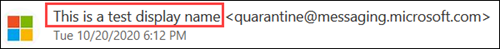

# <a name="quarantine-tags"></a>Etiquetas de cuarentena

> [!NOTE]
> Las características que se describen en este artículo están actualmente en versión preliminar, no están disponibles para todos los usuarios y están sujetas a cambios.

Las etiquetas de cuarentena de Exchange Online Protection (EOP) permiten a los administradores controlar lo que los usuarios pueden hacer a sus mensajes en cuarentena en función de cómo llegó el mensaje en cuarentena.

Tradicionalmente, EOP ha permitido o ha impedido ciertos niveles de interactividad para los mensajes en [cuarentena](find-and-release-quarantined-messages-as-a-user.md) y en las [notificaciones de correo no deseado para el usuario final](use-spam-notifications-to-release-and-report-quarantined-messages.md). Por ejemplo, los usuarios finales pueden ver y liberar mensajes que se pusieron en cuarentena por filtrado contra correo electrónico no deseado o en masa, pero no pueden ver ni liberar mensajes que se pusieron en cuarentena como suplantación de identidad de confianza alta.

Para [las características de protección admitidas, las](#step-2-assign-a-quarantine-tag-to-supported-features)etiquetas de cuarentena especifican lo que los usuarios pueden hacer en los mensajes de notificación de correo no deseado para el usuario final y en cuarentena en los mensajes en cuarentena (mensajes en los que el usuario es un destinatario). Las etiquetas de cuarentena predeterminadas se asignan automáticamente para imponer las capacidades históricas para los usuarios finales en mensajes en cuarentena. O bien, puede crear y asignar etiquetas de cuarentena personalizadas para permitir o impedir que los usuarios finales realicen acciones específicas en los mensajes en cuarentena.

Los permisos individuales se combinan en los siguientes grupos de permisos preestablecidos:

- Sin acceso
- Acceso limitado
- Acceso completo

En la tabla siguiente se describen los permisos individuales disponibles y lo que se incluye o no incluidos en los grupos de permisos predeterminados:

|Permiso|Sin acceso|Acceso limitado|Acceso completo|
|---|:---:|:---:|:---:|
|**Permitir remitente** ( _PermissionToAllowSender_ )||||
|**Bloquear remitente** ( _PermissionToBlockSender_ )||||
|**Eliminar** ( _PermissionToDelete_ )||||
|**Vista previa** ( _PermissionToPreview_ )||||
|**Permitir que los destinatarios liberen un mensaje de la cuarentena** ( _PermissionToRelease_ )||||
|**Permitir que los destinatarios soliciten que se libere un mensaje de la cuarentena** ( _PermissionToRequestRelease_ )||||
|

Si no le gustan los permisos predeterminados en los grupos de permisos preestablecidos, puede usar permisos personalizados cuando cree o modifique etiquetas de cuarentena personalizadas. Para obtener más información acerca de lo que hace cada permiso, consulte la sección detalles de permisos de la [etiqueta de cuarentena](#quarantine-tag-permission-details) más adelante en este artículo.

Puede crear y asignar etiquetas de cuarentena en el centro de seguridad & cumplimiento o en PowerShell (Exchange Online PowerShell para Microsoft 365 organizaciones con buzones de Exchange Online; independiente de EOP con PowerShell en organizaciones de EOP sin buzones de Exchange Online).

## <a name="what-do-you-need-to-know-before-you-begin"></a>¿Qué necesita saber antes de comenzar?

- Abra el Centro de seguridad y cumplimiento en <https://protection.office.com/>. Para ir directamente a la página **etiquetas de cuarentena** , Abra <https://protection.office.com/quarantineTags> .

- Para conectarse al PowerShell de Exchange Online, consulte [Conexión a Exchange Online PowerShell](https://docs.microsoft.com/powershell/exchange/connect-to-exchange-online-powershell). Para conectarse a EOP PowerShell independiente, consulte [Connect to Exchange Online Protection PowerShell](https://docs.microsoft.com/powershell/exchange/connect-to-exchange-online-protection-powershell) (Conexión a Exchange Online Protection PowerShell).

- Para ver, crear, modificar o quitar etiquetas de cuarentena, debe pertenecer a uno de los siguientes grupos de roles:
  - **Administración de la organización** o **Administrador de seguridad** en el [Centro de seguridad y cumplimiento](permissions-in-the-security-and-compliance-center.md).
  - **Administración de la organización** o **Administración de higiene** en [Exchange Online](https://docs.microsoft.com/Exchange/permissions-exo/permissions-exo#role-groups).

## <a name="step-1-create-quarantine-tags-in-the-security--compliance-center"></a>Paso 1: crear etiquetas de cuarentena en el centro de seguridad & cumplimiento

1. En el centro de seguridad & cumplimiento, vaya a Directiva de **Administración** \> **Policy** de amenazas y, a continuación, seleccione **marcas de cuarentena** .

2. En la página **etiquetas de cuarentena** , seleccione **Agregar etiqueta personalizada** .

3. Se abrirá el asistente **nueva etiqueta** . En la página **nombre de etiqueta** , escriba un nombre breve pero único en el campo Nombre de **etiqueta** . Deberá identificar y seleccionar la etiqueta por nombre en los próximos pasos. Cuando termine, haga clic en **Siguiente** .

4. En la página **acceso al mensaje de destinatarios** , seleccione uno de los siguientes valores:
   - **Sin acceso**
   - **Acceso limitado**
   - **Acceso completo**

   Los permisos individuales que se incluyen en estos grupos de permisos se describen anteriormente en este artículo.

   Para especificar permisos personalizados, seleccione **establecer acceso específico (avanzado)** y configure las siguientes opciones:

     - **Seleccione versión preferencia** de la acción: Seleccione uno de los siguientes valores:
       - **No hay ninguna acción de liberación** : este es el valor predeterminado.
       - **Permitir que los destinatarios liberen un mensaje de la cuarentena**
       - **Permitir que los destinatarios soliciten que se libere un mensaje de la cuarentena**

     - **Seleccionar acciones adicionales los destinatarios pueden realizar en los mensajes en cuarentena** : Seleccione algunos, todos o ninguno de los siguientes valores:
       - **Eliminar**
       - **Versión preliminar**
       - **Permitir remitente**
       - **Bloquear remitente**

   Estos permisos y su efecto en los mensajes en cuarentena y en las notificaciones de correo no deseado para el usuario final se describen en la sección [detalles de permisos de etiqueta de cuarentena](#quarantine-tag-permission-details) más adelante en este artículo.

   Cuando termine, haga clic en **Siguiente** .

5. En la página de **Resumen** que aparece, revise la configuración. Puede hacer clic en **Editar** en cada configuración para modificarla.

   Cuando haya terminado, haga clic en **Enviar** .

6. Haga clic en **listo** en la página de confirmación que aparece.

Ahora está listo para asignar la etiqueta Quarantine a una característica de cuarentena, tal como se describe en la sección [paso 2](#step-2-assign-a-quarantine-tag-to-supported-features) .

### <a name="create-quarantine-tags-in-powershell"></a>Crear etiquetas de cuarentena en PowerShell

Si prefiere usar PowerShell para crear etiquetas de cuarentena, conéctese a Exchange Online PowerShell o Exchange Online Protection PowerShell y use el cmdlet **New-QuarantineTag** . Tiene dos métodos diferentes para elegir:

- Use el parámetro _EndUserQuarantinePermissionsValue_ .
- Use el parámetro _EndUserQuarantinePermissions_ .

Estos métodos se describen en las secciones siguientes.

#### <a name="use-the-enduserquarantinepermissionsvalue-parameter"></a>Usar el parámetro EndUserQuarantinePermissionsValue

Para crear una etiqueta Quarantine con el parámetro _EndUserQuarantinePermissionsValue_ , use la siguiente sintaxis:

```powershell
New-QuarantineTag -Name "<UniqueName>" -EndUserQuarantinePermissionsValue <0 to 236>
```

El parámetro _EndUserQuarantinePermissionsValue_ usa un valor decimal que se convierte a partir de un valor binario. El valor binario corresponde a los permisos de cuarentena disponibles para el usuario final en un orden específico. Para cada permiso, el valor 1 equivale a verdadero y el valor 0 equivale a falso.

En la tabla siguiente se describen el orden y los valores necesarios para cada permiso individual en los grupos de permisos preestablecidos:

****

|Permiso|Sin acceso|Acceso limitado|Acceso completo|
|---|:---:|:---:|:---:|
|PermissionToAllowSender|comprendi|comprendi|1|
|PermissionToBlockSender|comprendi|1|1|
|PermissionToDelete|comprendi|1|1|
|PermissionToDownload<sup>\*</sup>|comprendi|comprendi|comprendi|
|PermissionToPreview|comprendi|1|1|
|PermissionToRelease<sup>\*\*</sup>|comprendi|comprendi|1|
|PermissionToRequestRelease<sup>\*\*</sup>|comprendi|1|comprendi|
|PermissionToViewHeader<sup>\*</sup>|comprendi|comprendi|comprendi|
|Valor binario|00000000|01101010|11101100|
|Valor decimal que se va a usar|comprendi|106|236|

<sup>\*</sup> Actualmente, este valor siempre es 0. Para PermissionToViewHeader, el valor 0 no oculta el botón **Ver encabezado de mensaje** en los detalles del mensaje en cuarentena (el botón siempre está disponible).

<sup>\*\*</sup> No establezca ninguno de estos valores en 1. Establezca uno en 1 y el otro en 0, o establézcalo en 0.

En este ejemplo se crea un nuevo nombre de etiqueta de cuarentena NoAccess que asigna los permisos sin acceso como se describe en la tabla anterior.

```powershell
New-QuarantineTag -Name NoAccess -EndUserQuarantinePermissionsValue 0
```

Para los permisos de acceso limitado, use el valor 106. Para los permisos de acceso total, use el valor 236.

Para los permisos personalizados, use la tabla anterior para obtener el valor binario correspondiente a los permisos que desee. Convierta el valor binario a un valor decimal y use el valor decimal para el parámetro _EndUserQuarantinePermissionsValue_ .

Para obtener información detallada acerca de la sintaxis y los parámetros, consulte [New-QuarantineTag](https://docs.microsoft.com/powershell/module/exchange/new-quarantinetag).

#### <a name="use-the-enduserquarantinepermissions-parameter"></a>Usar el parámetro EndUserQuarantinePermissions

Para crear una etiqueta Quarantine con el parámetro _EndUserQuarantinePermissionsValue_ , siga estos pasos:

A. Almacene un objeto de permisos de cuarentena en una variable con el cmdlet **New-QuarantinePermissions** .
<br/>
B. Use la variable como el valor _EndUserQuarantinePermissions_ en el comando **New-QuarantineTag** .

##### <a name="step-a-store-a-quarantine-permissions-object-in-a-variable"></a>Paso A: almacenar un objeto de permisos de cuarentena en una variable

Utilice la sintaxis siguiente:

```powershell
$<VariableName> = New-QuarantinePermissions [-PermissionToAllowSender <$true | $False>] [-PermissionToBlockSender <$true | $False>] [-PermissionToDelete <$true | $False>] [-PermissionToPreview <$true | $False>] [-PermissionToRelease <$true | $False>] [-PermissionToRequestRelease <$true | $False>]
```

El valor predeterminado para los parámetros no usados es `$false` , por lo que solo necesita usar los parámetros en los que desea establecer el valor `$true` .

Los ejemplos siguientes muestran cómo crear objetos de permiso que corresponden a los grupos de permisos preestablecidos:

- **Sin acceso** :

  ```powershell
  $NoAccess = New-QuarantinePermissions
  ```

- **Acceso limitado** :

  ```powershell
  $LimitedAccess = New-QuarantinePermissions -PermissionToBlockSender $true -PermissionToDelete $true -PermissionToPreview $true -PermissionToRequestRelease $true
  ```

- **Acceso total** :

  ```powershell
  $FullAccess = New-QuarantinePermissions -PermissionToAllowSender $true -PermissionToBlockSender $true -PermissionToDelete $true -PermissionToPreview $true -PermissionToRelease $true
  ```

Para ver los valores que ha establecido, ejecute el nombre de variable como un comando (por ejemplo, ejecute el comando `$NoAccess` ).

Para los permisos personalizados, no establezca los parámetros _PermissionToRelease_ y _PermissionToRequestRelease_ en `$true` . Establezca uno en `$true` y déjelo como `$false` , o deje ambos como `$false` .

También puede modificar una variable de objeto de permisos existente después de crearla, pero antes de usarla mediante el cmdlet **set-QuarantinePermissions** .

Para obtener información más detallada acerca de la sintaxis y los parámetros, consulte [New-QuarantinePermissions](https://docs.microsoft.com/powershell/module/exchange/new-quarantinepermissions) y [set-QuarantinePermissions](https://docs.microsoft.com/powershell/module/exchange/set-quarantinepermissions).

##### <a name="step-b-use-the-variable-in-the-new-quarantinetag-command"></a>Paso B: usar la variable en el comando New-QuarantineTag

Una vez que haya creado y guardado el objeto Permissions en una variable, use la variable para el valor del parámetro _EndUserQuarantinePermission_ en el siguiente comando **New-QuarantineTag** :

```powershell
New-QuarantineTag -Name "<UniqueName>" -EndUserQuarantinePermissions $<VariableName>
```

En este ejemplo se crea una nueva etiqueta Quarantine llamada LimitedAccess mediante el `$LimitedAccess` objeto Permissions descrito y creado en el paso anterior.

```powershell
New-QuarantineTag -Name LimitedAccess -EndUserQuarantinePermissions $LimitedAccess
```

Para obtener información detallada acerca de la sintaxis y los parámetros, consulte [New-QuarantineTag](https://docs.microsoft.com/powershell/module/exchange/new-quarantinetag).

## <a name="step-2-assign-a-quarantine-tag-to-supported-features"></a>Paso 2: asignar una etiqueta de cuarentena a las características admitidas

En las características de protección _admitidas_ que ponen mensajes o archivos en cuarentena (de forma automática o como una acción configurable), puede asignar una etiqueta Quarantine a las acciones de cuarentena disponibles. En la tabla siguiente se describen las características que ponen en cuarentena los mensajes y la disponibilidad de las etiquetas de cuarentena:

****

|Característica|¿Se admiten las etiquetas de cuarentena?|Etiquetas de cuarentena predeterminadas usadas|
|---|:---:|---|
|[Directivas contra correo no deseado](configure-your-spam-filter-policies.md): <ul><li>**Correo no deseado** ( _SpamAction_ )</li><li>**Correo no deseado de alta confianza** ( _HighConfidenceSpamAction_ )</li><li>**Correo electrónico de suplantación de identidad** ( _PhishSpamAction_ )</li><li>**Correo electrónico de suplantación de identidad de alta confianza** ( _HighConfidencePhishAction_ )</li><li>**Correo electrónico masivo** ( _BulkSpamAction_ )</li></ul>|Sí|<ul><li>DefaultSpamTag (acceso completo)</li><li>DefaultHighConfSpamTag (acceso completo)</li><li>DefaultPhishTag (acceso completo)</li><li>DefaultHighConfPhishTag (sin acceso)</li><li>DefaultBulkTag (acceso completo)</li></ul>
|Directivas contra la suplantación de identidad: <ul><li>[Protección de inteligencia de suplantación de identidad](set-up-anti-phishing-policies.md#spoof-settings) ( _AuthenticationFailAction_ )</li><li>[Protección de suplantación](set-up-anti-phishing-policies.md#impersonation-settings-in-atp-anti-phishing-policies):<sup>\*</sup> <ul><li>**Si un usuario suplantado envía un correo electrónico** ( _TargetedUserProtectionAction_ )</li><li>**Si un dominio suplantado envía un correo electrónico** ( _TargetedDomainProtectionAction_ )</li><li>Inteligencia de buzones **Mailbox intelligence** \> **Si un usuario suplantado envía un correo electrónico** ( _MailboxIntelligenceProtectionAction_ )</li></ul></li></ul></ul>|No|No aplicable|
|[Directivas antimalware](configure-anti-malware-policies.md): todos los mensajes detectados siempre se ponen en cuarentena.|No|No aplicable|
|[ATP para SharePoint, OneDrive y Microsoft Teams](atp-for-spo-odb-and-teams.md)|No|No aplicable|
|[Reglas de flujo de correo](https://docs.microsoft.com/exchange/security-and-compliance/mail-flow-rules/mail-flow-rules) (también conocidas como reglas de transporte) con la acción: **entregar el mensaje a la cuarentena hospedada** ( _cuarentena_ ).|No|No aplicable|
|

<sup>\*</sup> La configuración de protección de suplantación solo está disponible en directivas antiphishing en Microsoft defender para Office 365.

Si está satisfecho con los permisos de usuario final que proporcionan las etiquetas de cuarentena predeterminadas, no es necesario realizar ninguna acción. Si desea personalizar las funciones del usuario final (botones disponibles) en las notificaciones de correo no deseado del usuario final o en los detalles de los mensajes en cuarentena, puede asignar una etiqueta de cuarentena personalizada.

### <a name="assign-quarantine-tags-in-anti-spam-policies-in-the-security--compliance-center"></a>Asignar etiquetas de cuarentena en directivas contra correo no deseado en el centro de seguridad & cumplimiento

En [configurar las directivas contra correo no deseado en EOP](configure-your-spam-filter-policies.md)se describen las instrucciones completas para la creación y modificación de las directivas contra el correo no deseado.

1. En el centro de seguridad & cumplimiento, vaya a Directiva de **Administración** \> **Policy** \> de amenazas y, a continuación, seleccione **anti-spam** . O bien, Abra <https://protection.office.com/antispam> .

2. Busque y seleccione una directiva contra correo no deseado existente para editarla o cree una nueva Directiva contra correo no deseado.

3. En el control flotante detalles de la Directiva, expanda la sección **acciones en masa y correo no deseado** .
  
4. Si ha seleccionado **mensaje en cuarentena** para la acción de un veredicto de filtrado de correo no deseado disponible, el cuadro **Aplicar etiqueta de directiva de cuarentena** estará disponible para que seleccione la etiqueta de cuarentena para dicho veredicto.

   **Nota** : cuando se crea una nueva Directiva, un valor de etiqueta de cuarentena en blanco para un veredicto de filtrado de correo no deseado indica que se usa la etiqueta de cuarentena predeterminada para ese veredicto. Cuando edita la directiva más adelante, los valores en blanco se reemplazan por los nombres de las etiquetas de cuarentena predeterminadas reales, tal como se describe en la tabla anterior.
  
   

5. Cuando haya terminado, haga clic en **Guardar** .

#### <a name="assign-quarantine-tags-in-anti-spam-policies-in-powershell"></a>Asignar etiquetas de cuarentena en directivas contra correo no deseado en PowerShell

Si prefiere usar PowerShell para asignar etiquetas de cuarentena en directivas contra correo no deseado, conéctese a Exchange Online PowerShell o Exchange Online Protection PowerShell y use la siguiente sintaxis:

```powershell
<New-HostedContentFilterPolicy -Name "<Unique name>" | Set-HostedContentFilterPolicy -Identity "<Policy name>">  [-SpamAction Quarantine] [-SpamQuarantineTag <QuarantineTagName>] [-HighConfidenceSpamAction Quarantine] [-HighConfidenceSpamQuarantineTag <QuarantineTagName>] [-PhishSpamAction Quarantine] [-PhishQuarantineTag <QuarantineTagName>] [-HighConfidencePhishQuarantineTag <QuarantineTagName>] [-BulkSpamAction Quarantine] [-BulkQuarantineTag <QuarantineTagName>] ...
```

**Notas** :

- El valor predeterminado para el parámetro _HighConfidencePhishAction_ es Quarantine, por lo que no es necesario configurar la acción de cuarentena para detecciones de suplantación de identidad (phishing) de alta confianza en nuevas directivas contra correo no deseado. Para todos los demás veredictos del filtrado de correo no deseado en las directivas contra correo no deseado nuevas o existentes, la etiqueta Quarantine solo es efectiva si el valor de la acción es Quarantine. Para ver los valores de la acción en las directivas antispam existentes, ejecute el siguiente comando:

  ```powershell
  Get-HostedContentFilterPolicy | Format-Table Name,*SpamAction,HighConfidencePhishAction
  ```

  Para obtener información sobre los valores de acción predeterminada y los valores de acción recomendados para Standard y Strict, vea configuración de la [Directiva contra correo no deseado de EOP](recommended-settings-for-eop-and-office365-atp.md#eop-anti-spam-policy-settings).

- Un veredicto de filtrado de correo no deseado sin un parámetro correspondiente de la etiqueta Quarantine significa que se usa la [etiqueta de cuarentena predeterminada](#step-2-assign-a-quarantine-tag-to-supported-features) para ese veredicto.

  Sólo tiene que reemplazar una etiqueta Quarantine predeterminada por una etiqueta de cuarentena personalizada si desea cambiar las funciones predeterminadas del usuario final en los mensajes en cuarentena.

- Una nueva Directiva contra correo no deseado en PowerShell requiere una directiva de filtro de correo no deseado (configuración) mediante el cmdlet **New-HostedContentFilterPolicy** y una nueva regla de filtro de correo no deseado (filtros de destinatario) mediante el cmdlet **New-HostedContentFilterRule** . Para obtener instrucciones, vea [usar PowerShell para crear directivas contra correo no deseado](configure-your-spam-filter-policies.md#use-powershell-to-create-anti-spam-policies).

En este ejemplo se crea una nueva Directiva de filtro de correo no deseado denominada Research Department con la siguiente configuración:

- La acción para todos los veredictos de filtrado de correo no deseado se establece en cuarentena.
- La etiqueta de cuarentena personalizada denominada NoAccess, que no asigna permisos de **acceso** , reemplaza a todas las etiquetas de cuarentena predeterminadas que aún no no **contengan** permisos de acceso de forma predeterminada.

```powershell
New-HostedContentFilterPolicy -Name Research Department -SpamAction Quarantine -SpamQuarantineTag NoAccess -HighConfidenceSpamAction Quarantine -HighConfidenceSpamQuarantineTag NoAction -PhishSpamAction Quarantine -PhishQuarantineTag NoAction -BulkSpamAction Quarantine -BulkQuarantineTag NoAccess
```

Para obtener información detallada acerca de la sintaxis y los parámetros, consulte [New-HostedContentFilterPolicy](https://docs.microsoft.com/powershell/module/exchange/new-hostedcontentfilterpolicy).

En este ejemplo se modifica la Directiva de filtro de correo no deseado existente denominada Human Resources. La acción para el veredicto de cuarentena de correo no deseado se establece en cuarentena y se asigna la etiqueta de cuarentena personalizada denominada NoAccess.

```powershell
Set-HostedContentFilterPolicy -Identity "Human Resources" -SpamAction Quarantine -SpamQuarantineTag NoAccess
```

Para obtener información detallada acerca de la sintaxis y los parámetros, consulte [Set-HostedContentFilterPolicy](https://docs.microsoft.com/powershell/module/exchange/set-hostedcontentfilterpolicy).

## <a name="configure-global-quarantine-notification-settings-in-the-security--compliance-center"></a>Configurar las opciones globales de notificación de cuarentena en el centro de seguridad & cumplimiento

La configuración global de las etiquetas de cuarentena le permite personalizar las notificaciones de correo no deseado para el usuario final que se envían a los destinatarios de los mensajes que se pusieron en cuarentena. Para obtener más información acerca de estas notificaciones, consulte [End-User spam Notifications](use-spam-notifications-to-release-and-report-quarantined-messages.md).

1. En el centro de seguridad & cumplimiento, vaya a Directiva de **Administración** \> **Policy** de amenazas y, a continuación, seleccione **marcas de cuarentena** .

2. En la página **etiquetas de cuarentena** , seleccione **configuración global** .

3. En el control flotante **configuración de notificación de cuarentena** que se abre, configure algunas o todas las opciones siguientes:

   - **Usar mi logotipo de la compañía** : Seleccione esta opción para reemplazar el logotipo de Microsoft predeterminado que se usa en la parte superior de las notificaciones de correo no deseado para el usuario final. Antes de hacerlo, debe seguir las instrucciones que se indican en [customize the Microsoft 365 Theme for your Organization](https://docs.microsoft.com/microsoft-365/admin/setup/customize-your-organization-theme) to Upload your custom logo.

     En la siguiente captura de pantalla se muestra un logotipo personalizado en una notificación de correo no deseado para el usuario final:

     

   - **Elija lenguaje** : las notificaciones de correo no deseado para el usuario final ya se localizan en función de la configuración de idioma del destinatario. Puede especificar texto personalizado en diferentes idiomas para el **nombre para mostrar** y los valores de **declinación de responsabilidades** .

     Seleccione al menos un idioma en el cuadro primer idioma y, a continuación, haga clic en **Agregar** . Puede seleccionar varios idiomas haciendo clic en **Agregar** después de cada uno de ellos. Un cuadro de idioma de sección muestra todos los idiomas que ha seleccionado:

     

   - **Nombre para mostrar** : personalizar el nombre para mostrar del remitente que se usa en las notificaciones de correo no deseado para el usuario final.

     Para cada idioma que haya agregado, seleccione el idioma en el cuadro segundo idioma (no haga clic en la X) y escriba el valor de texto que desee en el cuadro **nombre para mostrar** .

     En la siguiente captura de pantalla se muestra el nombre para mostrar personalizado en una notificación de correo no deseado para el usuario final:

     

   - **Declinación de responsabilidades** : agregar una declinación de responsabilidades personalizada a la parte inferior de las notificaciones de correo no deseado del usuario final. El texto localizado, **un aviso de declinación de responsabilidades de su organización:** siempre se incluye en primer lugar, seguido del texto que especifique.

     Para cada idioma que haya agregado, seleccione el idioma en el cuadro segundo idioma (no haga clic en la X) y escriba el valor de texto que desee en el cuadro **declinación de responsabilidades** .

     En la siguiente captura de pantalla se muestra la declinación de responsabilidades personalizada en una notificación de correo no deseado de usuario final:

     

## <a name="view-quarantine-tags-in-the-security--compliance-center"></a>Ver las etiquetas de cuarentena en el centro de seguridad & cumplimiento

1. En el centro de seguridad & cumplimiento, vaya a Directiva de **Administración** \> **Policy** de amenazas y, a continuación, seleccione **marcas de cuarentena** .

- Para ver la configuración de las etiquetas de cuarentena integradas o personalizadas, seleccione la etiqueta cuarentena de la lista (no active la casilla de verificación).

- Para ver la configuración global, seleccione **configuración global**

### <a name="view-quarantine-tags-in-powershell"></a>Ver las etiquetas de cuarentena en PowerShell

Si prefiere usar PowerShell para ver las etiquetas de cuarentena, siga uno de estos pasos:

- Para ver una lista de Resumen de todas las etiquetas integradas o personalizadas, ejecute el siguiente comando:

  ```powershell
  Get-QuarantineTag | Format-Table Name
  ```

- Para ver la configuración de las etiquetas de cuarentena integradas o personalizadas, reemplace \<TagName\> por el nombre de la etiqueta Quarantine y ejecute el siguiente comando:

  ```powershell
  Get-QuarantineTag -Identity "<TagName>"
  ```

- Para ver la configuración global, ejecute el siguiente comando:

  ```powershell
  Get-QuarantineTag -QuarantineTagType GlobalQuarantineTag
  ```

Para obtener información detallada acerca de la sintaxis y los parámetros, consulte [Get-HostedContentFilterPolicy](https://docs.microsoft.com/powershell/module/exchange/get-hostedcontentfilterpolicy).

## <a name="remove-quarantine-tags-in-the-security--compliance-center"></a>Quitar las etiquetas de cuarentena en el centro de seguridad & cumplimiento

**Notas** :

- No puede quitar las etiquetas de cuarentena integradas.

- Antes de quitar una etiqueta de cuarentena personalizada, compruebe que no se esté usando. Por ejemplo, ejecute el siguiente comando en PowerShell:

  ```powershell
  Get-HostedContentFilterPolicy | Format-List Name,*QuarantineTag
  ```

  Si se está usando la etiqueta Quarantine, [reemplace la etiqueta cuarentena asignada antes de](#step-2-assign-a-quarantine-tag-to-supported-features) quitarla.

1. En el centro de seguridad & cumplimiento, vaya a Directiva de **Administración** \> **Policy** de amenazas y, a continuación, seleccione **marcas de cuarentena** .

2. En la página **etiquetas de cuarentena** , seleccione la etiqueta de cuarentena personalizada que desee quitar y, a continuación, haga clic en **Eliminar etiqueta** .

3. Haga clic en **quitar etiqueta** en el cuadro de diálogo de confirmación que aparece.

### <a name="remove-quarantine-tags-in-powershell"></a>Quitar etiquetas de cuarentena en PowerShell

Si prefiere usar PowerShell para quitar una etiqueta de cuarentena personalizada, reemplace \<TagName\> por el nombre de la etiqueta Quarantine y ejecute el siguiente comando:

```powershell
Remove-QuarantineTag -Identity "<TagName>"
```

Para obtener información detallada acerca de la sintaxis y los parámetros, consulte [Remove-QuarantineTag](https://docs.microsoft.com/powershell/module/exchange/remove-quarantinetag).

## <a name="quarantine-tag-permission-details"></a>Detalles del permiso de etiqueta de cuarentena

En las secciones siguientes se describen los efectos de los grupos de permisos predeterminados y los permisos individuales en los detalles de los mensajes en cuarentena y en las notificaciones de correo no deseado para el usuario final.

### <a name="preset-permissions-groups"></a>Grupos de permisos preestablecidos

Los permisos individuales que se incluyen en los grupos de permisos preestablecidos se enumeran en la tabla al principio de este artículo.

#### <a name="no-access"></a>Sin acceso

Si la etiqueta Quarantine asigna los permisos **sin acceso** (sin permisos), los usuarios seguirán teniendo algunas capacidades de línea base:

- **Detalles del mensaje en cuarentena** : el botón **Ver encabezado del mensaje** siempre está disponible.

  

- **Notificaciones de correo no deseado para el usuario final** : siempre está disponible el botón **revisar** que lleva al usuario al mensaje en cuarentena.

  

#### <a name="limited-access"></a>Acceso limitado

Si la etiqueta Quarantine asigna los permisos de **acceso limitado** , los usuarios obtienen las siguientes capacidades:

- **Detalles del mensaje en cuarentena** : están disponibles los siguientes botones:
  - **Publicación de la solicitud**
  - **Ver encabezado de mensaje**
  - **Vista previa del mensaje**
  - **Bloquear remitente**
  - **Quitar de cuarentena**

  

- **Notificaciones de correo no deseado para el usuario final** : están disponibles los siguientes botones:
  - **Bloquear remitente**
  - **Revisar**

  

#### <a name="full-access"></a>Acceso completo

Si la etiqueta Quarantine asigna los permisos de **acceso total** (todos los permisos disponibles), los usuarios obtienen las siguientes capacidades:

- **Detalles del mensaje en cuarentena** : están disponibles los siguientes botones:
  - **Liberar mensaje**
  - **Ver encabezado de mensaje**
  - **Vista previa del mensaje**
  - **Bloquear remitente**
  - **Permitir remitente**
  - **Quitar de cuarentena**

  

- **Notificaciones de correo no deseado para el usuario final** : están disponibles los siguientes botones:
  - **Bloquear remitente**
  - **Versión**
  - **Revisar**

  

### <a name="individual-permissions"></a>Permisos individuales

> [!NOTE]
> Recuerde que los usuarios siempre obtienen los botones descritos en la sección [sin acceso](#no-access) . Estos botones no se incluyen en las descripciones de los permisos individuales.

#### <a name="allow-sender-permission"></a>Permiso Permitir remitente

El permiso **Permitir remitente** ( _PermissionToAllowSender_ ) controla el acceso al botón que permite a los usuarios agregar de forma cómoda el remitente del mensaje en cuarentena a la lista de remitentes seguros.

- **Detalles del mensaje en cuarentena** :
  - Permiso **Permitir remitente** habilitado: el botón **Permitir remitente** está disponible.
  - Permiso **Permitir remitente** deshabilitado: el botón **Permitir remitente** no está disponible.

- **Notificaciones de correo no deseado para el usuario final** : sin efecto.

Para obtener más información acerca de la lista de remitentes seguros, consulte [impedir el bloqueo de remitentes de confianza](https://support.microsoft.com/office/274ae301-5db2-4aad-be21-25413cede077#__toc304379666) y [usar Exchange Online PowerShell para configurar la colección de listas seguras en un buzón](https://docs.microsoft.com/microsoft-365/security/office-365-security/configure-junk-email-settings-on-exo-mailboxes#use-exchange-online-powershell-to-configure-the-safelist-collection-on-a-mailbox).

### <a name="block-sender-permission"></a>Permiso bloquear remitente

El permiso **bloquear remitente** ( _PermissionToBlockSender_ ) controla el acceso al botón que permite a los usuarios agregar convenientemente el remitente del mensaje en cuarentena a la lista de remitentes bloqueados.

- **Detalles del mensaje en cuarentena** :
  - Permiso **bloquear remitente** habilitado: el botón **bloquear remitente** está disponible.
  - Permiso **bloquear remitente** deshabilitado: el botón **bloquear remitente** no está disponible.

- **Notificaciones de correo no deseado para el usuario final** :
  - Permiso **bloquear remitente** deshabilitado: el botón **bloquear remitente** no está disponible.
  - Permiso **bloquear remitente** habilitado: el botón **bloquear remitente** está disponible.

Para obtener más información acerca de la lista de remitentes bloqueados, vea [bloquear mensajes de alguien](https://support.microsoft.com/office/274ae301-5db2-4aad-be21-25413cede077#__toc304379667) y [usar Exchange Online PowerShell para configurar la colección de listas seguras en un buzón](https://docs.microsoft.com/microsoft-365/security/office-365-security/configure-junk-email-settings-on-exo-mailboxes#use-exchange-online-powershell-to-configure-the-safelist-collection-on-a-mailbox).

### <a name="delete-permission"></a>Permiso de eliminación

El permiso de **eliminación** ( _PermissionToDelete_ ) controla la capacidad de los usuarios de eliminar sus mensajes (mensajes en los que el usuario es un destinatario) de la cuarentena.

- **Detalles del mensaje en cuarentena** :
  - Permiso de **eliminación** habilitado: el botón **quitar la cuarentena** está disponible.
  - Permiso de **eliminación** deshabilitado: el botón **quitar de cuarentena** no está disponible.

- **Notificaciones de correo no deseado para el usuario final** : sin efecto.

### <a name="preview-permission"></a>Permiso de vista previa

El permiso de **vista previa** ( _PermissionToPreview_ ) controla la capacidad de los usuarios de obtener una vista previa de los mensajes en cuarentena.

- **Detalles del mensaje en cuarentena** :
  - Permiso de **vista previa** habilitado: el botón **vista previa del mensaje** está disponible.
  - Permiso de **vista previa** deshabilitado: el botón **vista previa de mensaje** no está disponible.

- **Notificaciones de correo no deseado para el usuario final** : sin efecto.

#### <a name="allow-recipients-to-release-a-message-from-quarantine-permission"></a>Permitir que los destinatarios liberen un mensaje del permiso de cuarentena

El permiso **permitir a los destinatarios publicar un mensaje de cuarentena** ( _PermissionToRelease_ ) controla la capacidad de los usuarios de liberar los mensajes en cuarentena directamente y sin la aprobación de un administrador.

- **Detalles del mensaje en cuarentena** :
  - Permiso habilitado: el botón **liberar mensaje** está disponible.
  - Permiso deshabilitado: el botón **liberar mensaje** no está disponible.
  
- **Notificaciones de correo no deseado para el usuario final** :
  - Permiso habilitado: el botón **liberar** está disponible.
  - Permiso deshabilitado: el botón **liberar** no está disponible.

#### <a name="allow-recipients-to-request-a-message-to-be-released-from-quarantine-permission"></a>Permitir que los destinatarios soliciten que se libere un mensaje del permiso de cuarentena

El permiso permitir que los **destinatarios soliciten un mensaje se libere del** permiso de cuarentena ( _PermissionToRequestRelease_ ) controla la capacidad de los usuarios de _solicitar_ la liberación de sus mensajes en cuarentena. El mensaje solo se publica después de que un administrador apruebe la solicitud.

- **Detalles del mensaje en cuarentena** :
  - Permiso habilitado: el botón **Solicitar versión** está disponible.
  - Permiso deshabilitado: el botón de la versión de la **solicitud** no está disponible.

- **Notificaciones de correo no deseado para el usuario final** : el botón **liberar** no está disponible.
