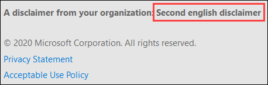

# <a name="quarantine-policies"></a>Directivas de cuarentena

> [!NOTE]
> Las características que se describen en este artículo están actualmente en Versión preliminar, no están disponibles para todos y están sujetas a cambios.

Las directivas de cuarentena (anteriormente conocidas como etiquetas de cuarentena) en Exchange Online Protection (EOP) permiten a los administradores controlar lo que los usuarios pueden hacer con sus mensajes en cuarentena en función de cómo el mensaje llegó a la cuarentena.

Tradicionalmente, EOP ha permitido o impedido [](find-and-release-quarantined-messages-as-a-user.md) ciertos niveles de interactividad para los mensajes en cuarentena y en las notificaciones de [correo no deseado del usuario final.](use-spam-notifications-to-release-and-report-quarantined-messages.md) Por ejemplo, los usuarios pueden ver y liberar mensajes que fueron puestos en cuarentena por el filtrado contra correo no deseado como correo no deseado o masivo, pero no pueden ver ni liberar mensajes que se han puesto en cuarentena como phishing de elevada confianza (solo los administradores pueden hacerlo).

Para [las características](#step-2-assign-a-quarantine-policy-to-supported-features)de protección admitidas, las directivas de cuarentena especifican lo que los usuarios pueden hacer en los mensajes de notificación de correo no deseado del usuario final y en sus mensajes en cuarentena en cuarentena (mensajes en los que el usuario es un destinatario). Las directivas de cuarentena predeterminadas se asignan automáticamente para aplicar las capacidades históricas de los usuarios en mensajes en cuarentena. O bien, puede crear y asignar directivas de cuarentena personalizadas para permitir o impedir que los usuarios finales realicen acciones específicas en mensajes en cuarentena.

Los permisos individuales se combinan en los siguientes grupos de permisos preestablecidos:

- Sin acceso
- Acceso limitado
- Acceso completo

Los permisos individuales disponibles y lo que se incluye o no en los grupos de permisos preestablecidos se describen en la tabla siguiente:

<br>

****

|Permiso|Sin acceso|Acceso limitado|Acceso completo|
|---|:---:|:---:|:---:|
|**Permitir remitente** (_PermissionToAllowSender_)||||
|**Bloquear remitente** (_PermissionToBlockSender_)||||
|**Delete** (_PermissionToDelete_)||||
|**Vista** previa (_PermissionToPreview_)||||
|**Permitir que los destinatarios liberen un mensaje de cuarentena** (_PermissionToRelease_)||||
|**Permitir que los destinatarios soliciten la puesta en** cuarentena de un mensaje (_PermissionToRequestRelease_)||||
|

Si no le gustan los permisos predeterminados en los grupos de permisos preestablecidos, puede usar permisos personalizados al crear o modificar directivas de cuarentena personalizadas. Para obtener más información acerca de lo que hace cada permiso, vea la sección Detalles de permisos de directiva [de cuarentena](#quarantine-policy-permission-details) más adelante en este artículo.

Puede crear y asignar directivas de cuarentena en el portal de Microsoft 365 Defender o en PowerShell (Exchange Online PowerShell para organizaciones de Microsoft 365 con buzones de correo de Exchange Online; PowerShell de EOP independiente en organizaciones de EOP sin Exchange Online buzones).

## <a name="what-do-you-need-to-know-before-you-begin"></a>¿Qué necesita saber antes de comenzar?

- Abra el portal de Microsoft 365 Defender en <https://security.microsoft.com>. O bien, para ir directamente a la página **Directivas de** cuarentena, abra <https://security.microsoft.com/quarantineTags> .

- Para conectarse al PowerShell de Exchange Online, consulte [Conexión a Exchange Online PowerShell](/powershell/exchange/connect-to-exchange-online-powershell). Para conectarse a EOP PowerShell independiente, consulte [Connect to Exchange Online Protection PowerShell](/powershell/exchange/connect-to-exchange-online-protection-powershell) (Conexión a Exchange Online Protection PowerShell).

- Para ver, crear, modificar o quitar directivas de cuarentena,  debe  ser miembro de los roles Administración de la organización o Administrador de seguridad en el portal Microsoft 365 Defender seguridad. Para obtener más información, consulte [Permisos en el portal de Microsoft 365 Defender](permissions-microsoft-365-security-center.md).

## <a name="step-1-create-quarantine-policies-in-the-microsoft-365-defender-portal"></a>Paso 1: Crear directivas de cuarentena en el portal de Microsoft 365 Defender web

1. En el portal Microsoft 365 Defender, vaya a Correo electrónico **&** sección Directivas de amenazas Sección Directivas de cuarentena y, a continuación, \>  \>  \>  seleccione Directivas **de cuarentena**.

2. En la **página Directiva de** cuarentena, haga clic en Agregar icono de directiva personalizada Agregar directiva  **personalizada.**

3. Se **abrirá el Asistente para nueva** directiva. En la **página Nombre de** directiva, escriba un nombre breve pero único en el cuadro Nombre **de** directiva. Deberá identificar y seleccionar la directiva de cuarentena por su nombre en los próximos pasos. Cuando termine, haga clic en **Siguiente**.

4. En la **página Acceso a mensajes de** destinatario, seleccione uno de los siguientes valores:
   - **Sin acceso**
   - **Acceso limitado**
   - **Acceso completo**

   Los permisos individuales que se incluyen en estos grupos de permisos se describen anteriormente en este artículo.

   Para especificar permisos personalizados, seleccione **Establecer acceso específico (Avanzado)** y configure las siguientes opciones que aparecen:

     - **Seleccionar preferencia de acción de lanzamiento:** seleccione uno de los siguientes valores:
       - **Sin acción de lanzamiento:** este es el valor predeterminado.
       - **Permitir que los destinatarios liberen un mensaje de cuarentena**
       - **Permitir que los destinatarios soliciten un mensaje que se liberará de la cuarentena**
     - **Seleccionar acciones adicionales que los** destinatarios pueden realizar en mensajes en cuarentena: seleccione algunos, todos o ninguno de los siguientes valores:
       - **Eliminar**
       - **Versión preliminar**
       - **Bloquear remitente**

   Estos permisos y su efecto en los mensajes en cuarentena y en las notificaciones de correo no deseado del usuario final se describen en la sección [Detalles](#quarantine-policy-permission-details) de permisos de directiva de cuarentena más adelante en este artículo.

   Cuando termine, haga clic en **Siguiente**.

5. En la **página Revisar directiva** que aparece, revisa la configuración. Puede seleccionar **Editar** en cada sección para modificar la configuración dentro de la sección. También puede hacer clic en **Volver atrás** o seleccionar la página específica del asistente.

   Cuando haya terminado, haga clic en **Enviar**.

6. En la página de confirmación que aparece, haga clic en **Listo**.

Ahora ya está listo para asignar la directiva de cuarentena a una característica de cuarentena, tal como se describe en la [sección Paso 2.](#step-2-assign-a-quarantine-policy-to-supported-features)

### <a name="create-quarantine-policies-in-powershell"></a>Crear directivas de cuarentena en PowerShell

Si prefiere usar PowerShell para crear directivas de cuarentena, conéctese Exchange Online PowerShell o Exchange Online Protection PowerShell y use el cmdlet **New-QuarantineTag.** Tiene dos métodos diferentes entre los que elegir:

- Use el _parámetro EndUserQuarantinePermissionsValue._
- Use el _parámetro EndUserQuarantinePermissions._

Estos métodos se describen en las secciones siguientes.

#### <a name="use-the-enduserquarantinepermissionsvalue-parameter"></a>Usar el parámetro EndUserQuarantinePermissionsValue

Para crear una directiva de cuarentena mediante el _parámetro EndUserQuarantinePermissionsValue,_ use la siguiente sintaxis:

```powershell
New-QuarantineTag -Name "<UniqueName>" -EndUserQuarantinePermissionsValue <0 to 236>
```

El _parámetro EndUserQuarantinePermissionsValue_ usa un valor decimal que se convierte a partir de un valor binario. El valor binario corresponde a los permisos de cuarentena de usuario final disponibles en un orden específico. Para cada permiso, el valor 1 es True y el valor 0 es False.

El orden y los valores necesarios para cada permiso individual en grupos de permisos preestablecidos se describen en la tabla siguiente:

<br>

****

|Permiso|Sin acceso|Acceso limitado|Acceso completo|
|---|:---:|:---:|:---:|
|PermissionToAllowSender|0|0|1|
|PermissionToBlockSender|0|1|1|
|PermissionToDelete|0|1|1|
|PermissionToDownload<sup>\*</sup>|0|0|0|
|PermissionToPreview|0|1|1|
|PermissionToRelease<sup>\*\*</sup>|0|0|1|
|PermissionToRequestRelease<sup>\*\*</sup>|0|1|0|
|PermissionToViewHeader<sup>\*</sup>|0|0|0|
|Valor binario|00000000|01101010|11101100|
|Valor decimal que se usará|0|106|236|
|

<sup>\*</sup> Actualmente, este valor es siempre 0. Para PermissionToViewHeader, el valor 0  no oculta el botón Ver encabezado del mensaje en los detalles del mensaje en cuarentena (el botón siempre está disponible).

<sup>\*\*</sup> No establezca ambos valores en 1. Establezca uno en 1 y el otro en 0, o establezca ambos en 0.

En este ejemplo se crea un nuevo nombre de directiva de cuarentena NoAccess que asigna los permisos Sin acceso, tal como se describe en la tabla anterior.

```powershell
New-QuarantineTag -Name NoAccess -EndUserQuarantinePermissionsValue 0
```

Para permisos de acceso limitado, use el valor 106. Para obtener permisos de acceso completo, use el valor 236.

Para los permisos personalizados, use la tabla anterior para obtener el valor binario que corresponde a los permisos que desea. Convierta el valor binario en un valor decimal y use el valor decimal para el parámetro _EndUserQuarantinePermissionsValue._

Para obtener información detallada sobre la sintaxis y los parámetros, [vea New-QuarantineTag](/powershell/module/exchange/new-quarantinetag).

#### <a name="use-the-enduserquarantinepermissions-parameter"></a>Usar el parámetro EndUserQuarantinePermissions

Para crear una directiva de cuarentena mediante el _parámetro EndUserQuarantinePermissionsValue,_ siga estos pasos:

R: Almacene un objeto de permisos de cuarentena en una variable mediante el cmdlet **New-QuarantinePermissions.**

<p>

B. Use la variable como el _valor EndUserQuarantinePermissions_ en el **comando New-QuarantineTag.**

##### <a name="step-a-store-a-quarantine-permissions-object-in-a-variable"></a>Paso A: Almacenar un objeto de permisos de cuarentena en una variable

Utilice la siguiente sintaxis:

```powershell
$<VariableName> = New-QuarantinePermissions [-PermissionToAllowSender <$true | $False>] [-PermissionToBlockSender <$true | $False>] [-PermissionToDelete <$true | $False>] [-PermissionToPreview <$true | $False>] [-PermissionToRelease <$true | $False>] [-PermissionToRequestRelease <$true | $False>]
```

El valor predeterminado de los parámetros no usados es , por lo que solo necesita usar los parámetros donde desea establecer `$false` el valor en `$true` .

En los ejemplos siguientes se muestra cómo crear objetos de permisos que corresponden a los grupos de permisos preestablecidos:

- **Sin acceso**:

  ```powershell
  $NoAccess = New-QuarantinePermissions
  ```

- **Acceso limitado:**

  ```powershell
  $LimitedAccess = New-QuarantinePermissions -PermissionToBlockSender $true -PermissionToDelete $true -PermissionToPreview $true -PermissionToRequestRelease $true
  ```

- **Acceso completo:**

  ```powershell
  $FullAccess = New-QuarantinePermissions -PermissionToAllowSender $true -PermissionToBlockSender $true -PermissionToDelete $true -PermissionToPreview $true -PermissionToRelease $true
  ```

Para ver los valores que ha establecido, ejecute el nombre de la variable como un comando (por ejemplo, ejecute el comando `$NoAccess` ).

Para los permisos personalizados, no establezca los parámetros _PermissionToRelease_ y _PermissionToRequestRelease en_ `$true` . Establezca uno en `$true` y deje el otro como , o deje ambos como `$false` `$false` .

También puede modificar una variable de objeto permissions existente después de crearla, pero antes de usarla mediante el cmdlet **Set-QuarantinePermissions.**

Para obtener información detallada sobre la sintaxis y los parámetros, [vea New-QuarantinePermissions](/powershell/module/exchange/new-quarantinepermissions) y [Set-QuarantinePermissions](/powershell/module/exchange/set-quarantinepermissions).

##### <a name="step-b-use-the-variable-in-the-new-quarantinetag-command"></a>Paso B: Usar la variable en el New-QuarantineTag comando

Después de crear y almacenar el objeto permissions en una variable, use la variable para el valor del parámetro _EndUserQuarantinePermission_ en el siguiente comando **New-QuarantineTag:**

```powershell
New-QuarantineTag -Name "<UniqueName>" -EndUserQuarantinePermissions $<VariableName>
```

En este ejemplo se crea una nueva directiva de cuarentena denominada LimitedAccess mediante el objeto permissions que se describió y `$LimitedAccess` creó en el paso anterior.

```powershell
New-QuarantineTag -Name LimitedAccess -EndUserQuarantinePermissions $LimitedAccess
```

Para obtener información detallada sobre la sintaxis y los parámetros, [vea New-QuarantineTag](/powershell/module/exchange/new-quarantinetag).

## <a name="step-2-assign-a-quarantine-policy-to-supported-features"></a>Paso 2: Asignar una directiva de cuarentena a las características compatibles

En _las características_ de protección admitidas que ponen en cuarentena mensajes o archivos (automáticamente o como una acción configurable), puede asignar una directiva de cuarentena a las acciones de cuarentena disponibles. En la tabla siguiente se describen las características que ponen en cuarentena los mensajes y la disponibilidad de las directivas de cuarentena:

<br>

****

|Característica|¿Se admiten directivas de cuarentena?|Directivas de cuarentena predeterminadas usadas|
|---|:---:|---|
|[Directivas contra correo no deseado:](configure-your-spam-filter-policies.md) <ul><li>**Correo no deseado** (_SpamAction_)</li><li>**Correo no deseado de elevada** confianza (_HighConfidenceSpamAction_)</li><li>**Phishing** (_PhishSpamAction_)</li><li>**Phishing de elevada confianza** (_HighConfidencePhishAction_)</li><li>**Bulk** (_BulkSpamAction_)</li></ul>|Sí|<ul><li>DefaultSpamTag (acceso completo)</li><li>DefaultHighConfSpamTag (acceso completo)</li><li>DefaultPhishTag (acceso completo)</li><li>DefaultHighConfPhishTag (sin acceso)</li><li>DefaultBulkTag (acceso completo)</li></ul>
|Directivas contra suplantación de identidad: <ul><li>[Protección de inteligencia suplantada](set-up-anti-phishing-policies.md#spoof-settings) (_AuthenticationFailAction_)</li><li>[Protección de suplantación:](set-up-anti-phishing-policies.md#impersonation-settings-in-anti-phishing-policies-in-microsoft-defender-for-office-365)<sup>\*</sup> <ul><li>**Si se detecta message como un usuario suplantado** (_TargetedUserProtectionAction_)</li><li>**Si el mensaje se detecta como un dominio suplantado** (_TargetedDomainProtectionAction_)</li><li>**Si la inteligencia de buzones detecta y suplanta al usuario** (_MailboxIntelligenceProtectionAction_)</li></ul></li></ul></ul>|No|n/a|
|[Directivas antimalware:](configure-anti-malware-policies.md)todos los mensajes detectados siempre se ponen en cuarentena.|No|n/a|
|[Datos adjuntos seguros para SharePoint, OneDrive y Microsoft Teams](mdo-for-spo-odb-and-teams.md)|No|n/a|
|[Reglas de flujo de](/exchange/security-and-compliance/mail-flow-rules/mail-flow-rules) correo (también conocidas como reglas de transporte) con la acción: Entregar el mensaje a la cuarentena **hospedada** (_Cuarentena_).|No|n/a|
|

<sup>\*</sup>La configuración de protección de suplantación solo está disponible en las directivas contra suplantación de identidad en Microsoft Defender para Office 365.

Si está satisfecho con los permisos de usuario final proporcionados por las directivas de cuarentena predeterminadas, no necesita hacer nada. Si desea personalizar las capacidades del usuario final (botones disponibles) en notificaciones de correo no deseado del usuario final o en detalles de mensajes en cuarentena, puede asignar una directiva de cuarentena personalizada.

### <a name="assign-quarantine-policies-in-anti-spam-policies-in-the-microsoft-365-defender-portal"></a>Asignar directivas de cuarentena en directivas contra correo no deseado en el portal Microsoft 365 Defender correo electrónico

Las instrucciones completas para crear y modificar directivas contra correo no deseado se describen en [Configure anti-spam policies in EOP](configure-your-spam-filter-policies.md).

1. En el portal de Microsoft 365 Defender, vaya a Correo electrónico **y &** de colaboración directivas & sección Directivas contra \>  \>  correo \> **no deseado.** O bien, abra <https://security.microsoft.com/antispam> .

2. En la **página Directivas contra correo** no deseado, siga uno de estos pasos:
   - Busque y seleccione una directiva **contra** correo no deseado entrante existente.
   - Cree una nueva **directiva contra** correo no deseado entrante.

3. Realice uno de los pasos siguientes:
   - **Editar la directiva contra correo no** deseado existente: en el control desplegable de detalles de la directiva, vaya a la sección Acciones y, a continuación, haga clic en Editar **acciones**. 
   - **Crear una nueva directiva contra correo no deseado:** en el asistente para nueva directiva, vaya a la **página** Acciones.

4. En la **página** Acciones. cada veredicto que tenga la **acción Mensaje de** cuarentena también tendrá el cuadro **Seleccionar** directiva de cuarentena para que seleccione una directiva de cuarentena correspondiente.

   **Nota:** Al crear una nueva directiva, se usa un valor de directiva de cuarentena **Select** en blanco que indica la directiva de cuarentena predeterminada para ese veredicto. Cuando más adelante edite la directiva, los valores en blanco se reemplazan por los nombres de directiva de cuarentena predeterminados reales, como se describe en la tabla anterior.

   

5. Cuando haya terminado, haga clic en **Guardar**.

#### <a name="assign-quarantine-policies-in-anti-spam-policies-in-powershell"></a>Asignar directivas de cuarentena en directivas contra correo no deseado en PowerShell

Si prefiere usar PowerShell para asignar directivas de cuarentena en directivas contra correo no deseado, conéctese a Exchange Online PowerShell o Exchange Online Protection PowerShell y use la siguiente sintaxis:

```powershell
<New-HostedContentFilterPolicy -Name "<Unique name>" | Set-HostedContentFilterPolicy -Identity "<Policy name>">  [-SpamAction Quarantine] [-SpamQuarantineTag <QuarantineTagName>] [-HighConfidenceSpamAction Quarantine] [-HighConfidenceSpamQuarantineTag <QuarantineTagName>] [-PhishSpamAction Quarantine] [-PhishQuarantineTag <QuarantineTagName>] [-HighConfidencePhishQuarantineTag <QuarantineTagName>] [-BulkSpamAction Quarantine] [-BulkQuarantineTag <QuarantineTagName>] ...
```

**Notas**:

- El valor predeterminado del parámetro _HighConfidencePhishAction_ es Quarantine, por lo que no es necesario establecer la acción Cuarentena para detecciones de phishing de elevada confianza en nuevas directivas contra correo no deseado. Para todos los demás veredictos de filtrado de correo no deseado en directivas antispam nuevas o existentes, la directiva de cuarentena solo es eficaz si el valor de la acción es Cuarentena. Para ver los valores de acción en las directivas contra correo no deseado existentes, ejecute el siguiente comando:

  ```powershell
  Get-HostedContentFilterPolicy | Format-Table Name,*SpamAction,HighConfidencePhishAction
  ```

  Para obtener información sobre los valores de acción predeterminados y los valores de acción recomendados para Standard y Strict, consulte [EOP anti-spam policy settings](recommended-settings-for-eop-and-office365.md#eop-anti-spam-policy-settings).

- Un veredicto de filtrado de correo no deseado sin un parámetro de directiva de cuarentena correspondiente significa que se usa la directiva de [cuarentena](#step-2-assign-a-quarantine-policy-to-supported-features) predeterminada para ese veredicto.

  Solo necesita reemplazar una directiva de cuarentena predeterminada por una directiva de cuarentena personalizada si desea cambiar las funcionalidades predeterminadas del usuario final en los mensajes en cuarentena.

- Una nueva directiva contra correo no deseado en PowerShell requiere una directiva de filtro de correo no deseado (configuración) mediante el cmdlet **New-HostedContentFilterPolicy** y una nueva regla de filtro de correo no deseado (filtros de destinatarios) mediante el cmdlet **New-HostedContentFilterRule.** Para obtener instrucciones, [vea Use PowerShell to create anti-spam policies](configure-your-spam-filter-policies.md#use-powershell-to-create-anti-spam-policies).

En este ejemplo se crea una nueva directiva de filtro de correo no deseado denominada Departamento de investigación con la siguiente configuración:

- La acción de todos los veredictos de filtrado de correo no deseado se establece en Cuarentena.
- La directiva de cuarentena personalizada denominada NoAccess que asigna **ningún** permiso de acceso reemplaza a las directivas de cuarentena predeterminadas que aún **no** asignan permisos de acceso de forma predeterminada.

```powershell
New-HostedContentFilterPolicy -Name Research Department -SpamAction Quarantine -SpamQuarantineTag NoAccess -HighConfidenceSpamAction Quarantine -HighConfidenceSpamQuarantineTag NoAction -PhishSpamAction Quarantine -PhishQuarantineTag NoAction -BulkSpamAction Quarantine -BulkQuarantineTag NoAccess
```

Para obtener información detallada acerca de la sintaxis y los parámetros, consulte [New-HostedContentFilterPolicy](/powershell/module/exchange/new-hostedcontentfilterpolicy).

En este ejemplo se modifica la directiva de filtro de correo no deseado existente denominada Recursos humanos. La acción del veredicto de cuarentena de correo no deseado se establece en Cuarentena y se asigna la directiva de cuarentena personalizada denominada NoAccess.

```powershell
Set-HostedContentFilterPolicy -Identity "Human Resources" -SpamAction Quarantine -SpamQuarantineTag NoAccess
```

Para obtener información detallada acerca de la sintaxis y los parámetros, consulte [Set-HostedContentFilterPolicy](/powershell/module/exchange/set-hostedcontentfilterpolicy).

## <a name="configure-global-quarantine-notification-settings-in-the-microsoft-365-defender-portal"></a>Configurar las opciones de notificación de cuarentena global en el portal de Microsoft 365 Defender web

La configuración global de las directivas de cuarentena permite personalizar las notificaciones de correo no deseado del usuario final que se envían a los destinatarios de los mensajes que se han puesto en cuarentena. Para obtener más información acerca de estas notificaciones, vea [Notificaciones de correo no deseado del usuario final.](use-spam-notifications-to-release-and-report-quarantined-messages.md)

1. En el portal Microsoft 365 Defender, vaya a Correo electrónico **&** sección Directivas de amenazas Sección Directivas de cuarentena y, a continuación, \>  \>  \>  seleccione Directivas **de cuarentena**.

2. En la **página Directiva de** cuarentena, seleccione Configuración **global**.

3. En el **control desplegable De** notificaciones de cuarentena que se abre, configure algunas o todas las opciones siguientes:

   - **Nombre para mostrar:** personalice el nombre para mostrar del remitente que se usa en las notificaciones de correo no deseado del usuario final.

     Para cada idioma que haya agregado, seleccione el idioma del segundo cuadro de idioma (no haga clic en la X) y escriba el valor de texto que desee en el cuadro Nombre **para** mostrar.

     La siguiente captura de pantalla muestra el nombre para mostrar personalizado en una notificación de correo no deseado del usuario final:

     

   - **Aviso** de declinación de responsabilidades: agregue un aviso de declinación de responsabilidades personalizado a la parte inferior de las notificaciones de correo no deseado del usuario final. El texto localizado, **Un aviso de declinación de responsabilidades de su organización:** siempre se incluye primero, seguido del texto que especifique.

     Para cada idioma que haya agregado, seleccione el idioma del segundo cuadro de idioma (no haga clic en la X) y escriba el valor de texto que desee en el cuadro **Declinación de** responsabilidades.

     La siguiente captura de pantalla muestra el aviso de declinación de responsabilidades personalizado en una notificación de correo no deseado del usuario final:

     

   - **Elegir idioma:** las notificaciones de correo no deseado del usuario final ya están localizadas en función de la configuración de idioma del destinatario. Puede especificar texto personalizado en diferentes idiomas para los valores **Nombre para mostrar** y **Declinación de** responsabilidades.

     Seleccione al menos un idioma en el primer cuadro de idioma y, a continuación, haga clic **en Agregar**. Puede seleccionar varios idiomas haciendo clic **en Agregar** después de cada uno. Un cuadro de idioma de sección muestra todos los idiomas que ha seleccionado:

     

   - **Usar el logotipo de mi** empresa: seleccione esta opción para reemplazar el logotipo predeterminado de Microsoft que se usa en la parte superior de las notificaciones de correo no deseado del usuario final. Antes de hacerlo, debes seguir las instrucciones de Personalizar el [tema Microsoft 365 de](../../admin/setup/customize-your-organization-theme.md) la organización para cargar el logotipo personalizado.

     La siguiente captura de pantalla muestra un logotipo personalizado en una notificación de correo no deseado del usuario final:

     

## <a name="view-quarantine-policies-in-the-microsoft-365-defender-portal"></a>Ver directivas de cuarentena en el Microsoft 365 Defender web

1. En el portal Microsoft 365 Defender, vaya a Correo electrónico **&** sección Directivas de amenazas Sección Directivas de cuarentena y, a continuación, \>  \>  \>  seleccione Directivas **de cuarentena**.

2. La **página Directiva de** cuarentena muestra la lista de directivas por **Nombre** y Última **fecha actualizada.**

3. Para ver la configuración de directivas de cuarentena integradas o personalizadas, seleccione la directiva de cuarentena de la lista haciendo clic en el nombre.

4. Para ver la configuración global, haga clic **en Configuración global**

### <a name="view-quarantine-policies-in-powershell"></a>Ver directivas de cuarentena en PowerShell

Si prefiere usar PowerShell para ver directivas de cuarentena, siga estos pasos:

- Para ver una lista resumida de todas las directivas integradas o personalizadas, ejecute el siguiente comando:

  ```powershell
  Get-QuarantineTag | Format-Table Name
  ```

- Para ver la configuración de directivas de cuarentena integradas o personalizadas, reemplace por el nombre de la directiva de cuarentena y \<QuarantinePolicyName\> ejecute el siguiente comando:

  ```powershell
  Get-QuarantineTag -Identity "<QuarantinePolicyName>"
  ```

- Para ver la configuración global, ejecute el siguiente comando:

  ```powershell
  Get-QuarantineTag -QuarantineTagType GlobalQuarantineTag
  ```

Para obtener información detallada acerca de la sintaxis y los parámetros, consulte [Get-HostedContentFilterPolicy](/powershell/module/exchange/get-hostedcontentfilterpolicy).

## <a name="modify-quarantine-policies-in-the-microsoft-365-defender-portal"></a>Modificar directivas de cuarentena en el portal Microsoft 365 Defender web

1. En el portal Microsoft 365 Defender, vaya a Correo electrónico **&** sección Directivas de amenazas Sección Directivas de cuarentena y, a continuación, \>  \>  \>  seleccione Directivas **de cuarentena**.

2. En la **página Directivas de** cuarentena, seleccione la directiva haciendo clic en el nombre.

3. Después de seleccionar la directiva, haga clic en el icono Editar directiva  **Editar** icono de directiva que aparece.

4. El **Asistente para editar** directivas que  se abre es prácticamente idéntico al Asistente para nueva directiva, tal como se describe en la sección Crear directivas de cuarentena en la sección del portal [de Microsoft 365 Defender](#step-1-create-quarantine-policies-in-the-microsoft-365-defender-portal) anteriormente en este artículo.

   La diferencia principal es que no se puede cambiar el nombre de una directiva existente.

5. Cuando haya terminado de modificar la directiva, vaya a la página **Resumen y** haga clic en **Enviar**.

### <a name="modify-quarantine-policies-in-powershell"></a>Modificar directivas de cuarentena en PowerShell

Si prefiere usar PowerShell para modificar una directiva de cuarentena personalizada, reemplace por el nombre de la directiva de cuarentena y \<QuarantinePolicyName\> use la sintaxis siguiente:

```powershell
Set-QuarantineTag -Identity "<QuarantinePolicyName>" [Settings]
```

La configuración disponible es la misma que se describe para crear directivas de cuarentena anteriormente en este artículo.

Para obtener información detallada sobre la sintaxis y los parámetros, [vea Set-QuarantineTag](/powershell/module/exchange/set-quarantinetag).

## <a name="remove-quarantine-policies-in-the-microsoft-365-defender-portal"></a>Quitar directivas de cuarentena en el Microsoft 365 Defender web

**Notas**:

- No puede quitar directivas de cuarentena integradas.
- Antes de quitar una directiva de cuarentena personalizada, compruebe que no se está utilizando. Por ejemplo, ejecute el siguiente comando en PowerShell:

  ```powershell
  Get-HostedContentFilterPolicy | Format-List Name,*QuarantineTag
  ```

  Si se usa la directiva de cuarentena, [reemplace la directiva](#step-2-assign-a-quarantine-policy-to-supported-features) de cuarentena asignada antes de quitarla.

1. En el portal Microsoft 365 Defender, vaya a Correo electrónico **&** sección Directivas de amenazas Sección Directivas de cuarentena y, a continuación, \>  \>  \>  seleccione Directivas **de cuarentena**.

2. En la **página Directiva de** cuarentena, seleccione la directiva de cuarentena personalizada que desea quitar haciendo clic en el nombre.

3. Después de seleccionar la directiva, haga clic en el icono Eliminar directiva  **Eliminar** icono de directiva que aparece.

4. Haga **clic en Quitar** directiva en el cuadro de diálogo de confirmación que aparece.

### <a name="remove-quarantine-policies-in-powershell"></a>Quitar directivas de cuarentena en PowerShell

Si prefiere usar PowerShell para quitar una directiva de cuarentena personalizada, reemplace por el nombre de la directiva de cuarentena y \<QuarantinePolicyName\> ejecute el siguiente comando:

```powershell
Remove-QuarantineTag -Identity "<QuarantinePolicyName>"
```

Para obtener información detallada acerca de la sintaxis y los parámetros, [vea Remove-QuarantineTag](/powershell/module/exchange/remove-quarantinetag).

## <a name="quarantine-policy-permission-details"></a>Detalles de permisos de directiva de cuarentena

En las secciones siguientes se describen los efectos de los grupos de permisos preestablecidos y los permisos individuales en los detalles de los mensajes en cuarentena y en las notificaciones de correo no deseado del usuario final.

### <a name="preset-permissions-groups"></a>Grupos de permisos preestablecidos

Los permisos individuales que se incluyen en grupos de permisos preestablecidos se enumeran en la tabla al principio de este artículo.

#### <a name="no-access"></a>Sin acceso

Si la directiva de cuarentena asigna los **permisos Sin acceso** (sin permisos), los usuarios aún obtienen algunas funcionalidades de línea base:

- **Detalles del mensaje en cuarentena:** el **botón Ver encabezado del** mensaje siempre está disponible.

  

- **Notificaciones de correo no deseado del** usuario final: el botón **Revisar** que lleva al usuario al mensaje en cuarentena siempre está disponible.

  

#### <a name="limited-access"></a>Acceso limitado

Si la directiva de cuarentena asigna los **permisos de** acceso limitado, los usuarios obtienen las siguientes funcionalidades:

- **Detalles del mensaje en cuarentena:** los botones siguientes están disponibles:
  - **Versión de solicitud**
  - **Ver encabezado de mensaje**
  - **Mensaje de vista previa**
  - **Bloquear remitente**
  - **Quitar de la cuarentena**

  

- **Notificaciones de correo no deseado del** usuario final: los botones siguientes están disponibles:
  - **Bloquear remitente**
  - **Revisar**

  

#### <a name="full-access"></a>Acceso completo

Si la directiva de cuarentena asigna los **permisos de** acceso completo (todos los permisos disponibles), los usuarios obtienen las siguientes funcionalidades:

- **Detalles del mensaje en cuarentena:** los botones siguientes están disponibles:
  - **Mensaje de versión**
  - **Ver encabezado de mensaje**
  - **Mensaje de vista previa**
  - **Bloquear remitente**
  - **Permitir remitente**
  - **Quitar de la cuarentena**

  

- **Notificaciones de correo no deseado del** usuario final: los botones siguientes están disponibles:
  - **Bloquear remitente**
  - **Liberar**
  - **Revisar**

  

### <a name="individual-permissions"></a>Permisos individuales

> [!NOTE]
> Recuerde que los usuarios siempre obtienen los botones descritos en la [sección Sin](#no-access) acceso. Estos botones no se incluyen en las descripciones de permisos individuales.

#### <a name="allow-sender-permission"></a>Permitir permiso de remitente

El permiso Permitir **remitente** (_PermissionToAllowSender_) controla el acceso al botón que permite a los usuarios agregar cómodamente el remitente del mensaje en cuarentena a su lista Caja fuerte remitentes.

- **Detalles del mensaje en cuarentena:**
  - **Permitir permiso de** remitente habilitado: **el botón Permitir remitente** está disponible.
  - **Permitir permiso de** remitente deshabilitado: **el botón Permitir remitente** no está disponible.

- **Notificaciones de correo no deseado del usuario final:** Sin efecto.

Para obtener más información acerca de la lista Caja fuerte remitentes, vea Prevent [trusted senders from being blocked](https://support.microsoft.com/office/274ae301-5db2-4aad-be21-25413cede077#__toc304379666) y Use Exchange Online [PowerShell to configure the safelist collection on a mailbox](configure-junk-email-settings-on-exo-mailboxes.md#use-exchange-online-powershell-to-configure-the-safelist-collection-on-a-mailbox).

#### <a name="block-sender-permission"></a>Bloquear el permiso del remitente

El **permiso bloquear remitente** (_PermissionToBlockSender_) controla el acceso al botón que permite a los usuarios agregar cómodamente el remitente del mensaje en cuarentena a su lista de remitentes bloqueados.

- **Detalles del mensaje en cuarentena:**
  - **Bloquear permiso de** remitente habilitado: el **botón Bloquear remitente** está disponible.
  - **Bloquear el permiso** del remitente deshabilitado: **el botón Bloquear remitente** no está disponible.

- **Notificaciones de correo no deseado del usuario final:**
  - **Bloquear el permiso** del remitente deshabilitado: **el botón Bloquear remitente** no está disponible.
  - **Bloquear permiso de** remitente habilitado: el **botón Bloquear remitente** está disponible.

Para obtener más información acerca de la lista Remitentes bloqueados, vea [Bloquear](https://support.microsoft.com/office/274ae301-5db2-4aad-be21-25413cede077#__toc304379667) mensajes de alguien y Usar Exchange Online PowerShell para configurar la colección de listas seguras [en un buzón.](configure-junk-email-settings-on-exo-mailboxes.md#use-exchange-online-powershell-to-configure-the-safelist-collection-on-a-mailbox)

#### <a name="delete-permission"></a>Permiso de eliminación

El **permiso Delete** (_PermissionToDelete_) controla la capacidad de los usuarios para eliminar sus mensajes (mensajes donde el usuario es un destinatario) de la cuarentena.

- **Detalles del mensaje en cuarentena:**
  - **Permisos** de eliminación habilitados: **el botón Quitar de cuarentena** está disponible.
  - **Eliminar** permiso deshabilitado: el **botón Quitar de cuarentena** no está disponible.

- **Notificaciones de correo no deseado del usuario final:** Sin efecto.

#### <a name="preview-permission"></a>Permiso de vista previa

El **permiso Vista** previa (_PermissionToPreview_) controla la capacidad de los usuarios para obtener una vista previa de sus mensajes en cuarentena.

- **Detalles del mensaje en cuarentena:**
  - **Permiso** de vista previa habilitado: **el botón Vista previa del** mensaje está disponible.
  - **Permiso** de vista previa deshabilitado: **el botón Vista previa del** mensaje no está disponible.

- **Notificaciones de correo no deseado del usuario final:** Sin efecto.

#### <a name="allow-recipients-to-release-a-message-from-quarantine-permission"></a>Permitir que los destinatarios liberen un mensaje del permiso de cuarentena

Allow **recipients to release a message from quarantine** permission (_PermissionToRelease_) controla la capacidad de los usuarios para liberar sus mensajes en cuarentena directamente y sin la aprobación de un administrador.

- **Detalles del mensaje en cuarentena:**
  - Permiso habilitado: el **botón Liberar mensaje** está disponible.
  - Permiso deshabilitado: el **botón Liberar mensaje** no está disponible.

- **Notificaciones de correo no deseado del usuario final:**
  - Permiso habilitado: el **botón Liberar** está disponible.
  - Permiso deshabilitado: el **botón Liberar** no está disponible.

#### <a name="allow-recipients-to-request-a-message-to-be-released-from-quarantine-permission"></a>Permitir que los destinatarios soliciten un mensaje que se liberará del permiso de cuarentena

Allow **recipients to request a message to be released from quarantine** permission (_PermissionToRequestRelease_) controls the ability of users to _request_ the release of their quarantined messages. El mensaje solo se libera después de que un administrador apruebe la solicitud.

- **Detalles del mensaje en cuarentena:**
  - Permiso habilitado: el **botón Solicitar versión** está disponible.
  - Permiso deshabilitado: el **botón Solicitar versión** no está disponible.

- **Notificaciones de correo no deseado del** usuario final: el botón **Liberar** no está disponible.
