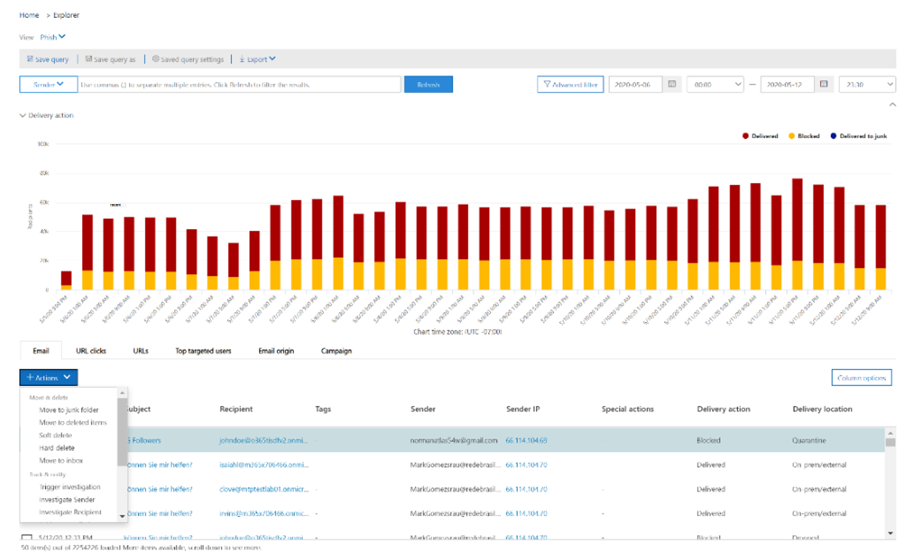

# Corregir el correo electrónico malintencionado entregado en Office 365Remediate malicious email delivered in Office 365

[!INCLUDE [Microsoft 365 Defender rebranding](../includes/microsoft-defender-for-office.md)]

**Se aplica a****Applies to**
-    [Microsoft Defender para Office 365 plan 2Microsoft Defender for Office 365 plan 2](https://go.microsoft.com/fwlink/?linkid=2148715)

La corrección significa tomar una acción recomendada contra una amenaza.Remediation means taking a prescribed action against a threat. El sistema puede limpiar el correo electrónico malintencionado enviado a su organización, ya sea a través de la purga automática (ZAP) de cero horas, o bien mediante equipos de seguridad mediante acciones de corrección como mover a la bandeja de *entrada,* mover a correo no *deseado,* mover a elementos eliminados, eliminación temporal o eliminación *permanente.*Malicious email sent to your organization can be cleaned up either by the system, through zero-hour auto purge (ZAP), or by security teams through remediation actions like *move to inbox*, *move to junk*, *move to deleted items*, *soft delete*, or *hard delete*. Microsoft Defender para Office 365 P2/E5 permite a los equipos de seguridad corregir amenazas en la funcionalidad de colaboración y correo electrónico a través de investigaciones manuales y automatizadas.Microsoft Defender for Office 365 P2/E5 enables security teams to remediate threats in email and collaboration functionality through manual and automated investigation.

> [!NOTE]
> Para corregir el correo electrónico malintencionado, los equipos de seguridad necesitan que se les asigne el rol *de búsqueda* y depuración.To remediate malicious email, security teams need the *search and purge* role assigned to them. La asignación de roles se realiza mediante permisos en el centro de seguridad y cumplimiento.Role assignment is done through permissions in the security and compliance center.

## Lo que necesita saber antes de comenzarWhat you need to know before you begin

Los administradores pueden tomar las medidas necesarias en los  correos electrónicos, pero para que se aprueben esas acciones, deben tener asignado el rol de búsqueda y depuración a través de los permisos del Centro de seguridad **&** \> **cumplimiento.**Admins can take required action on emails, but to get those actions approved, they must have the *search and purge* role assigned to them via **Security & Compliance Center** \> **Permissions**. Sin el rol de "búsqueda y depuración" agregado a uno de los grupos de roles, no podrán ejecutar la acción.Without the "search and purge" role added to one of the role-groups, they won't be able to execute the action.

## Corrección manual y automatizadaManual and automated remediation

*La búsqueda manual* se produce cuando los equipos de seguridad identifican las amenazas manualmente mediante las funciones de búsqueda y filtrado en el Explorador de amenazas.*Manual hunting* occurs when security teams identify threats manually by using the search and filtering capabilities in Threat Explorer. La corrección manual del correo electrónico se puede desencadenar a través de cualquier vista de correo electrónico *(malware,* *suplantación* de identidad o todo el correo *electrónico)* después de identificar un conjunto de correos electrónicos que deben corregirse.Manual email remediation can be triggered through any email view (*Malware*, *Phish*, or *All email*) after you identify a set of emails that need to be remediated.

> [!div class="mx-imgBorder"]
> 

Los equipos de seguridad pueden usar el Explorador de amenazas para seleccionar correos electrónicos de varias maneras:Security teams can use Threat Explorer to select emails in several ways:

- Elegir correos electrónicos a mano: use filtros en varias vistas.Choose emails by hand: Use filters in various views. Seleccione hasta 100 correos electrónicos para corregir.Select up to 100 emails to remediate.

- Selección de consulta: seleccione una consulta completa con el botón **seleccionar todo en la** parte superior.Query selection: Select an entire query by using the top **select all** button. La misma consulta también se muestra en los detalles de envío de correo del centro de acciones.The same query is also shown in action center mail submission details.

- Selección de consulta con exclusión: a veces, es posible que los equipos de operaciones de seguridad quieran corregir correos electrónicos seleccionando una consulta completa y excluyendo algunos correos electrónicos de la consulta manualmente.Query selection with exclusion: Sometimes security operations teams may want to remediate emails by selecting an entire query and excluding certain emails from the query manually. Para ello, un administrador  puede usar la casilla Seleccionar todo y desplazarse hacia abajo para excluir los correos electrónicos manualmente.To do so, an admin can use the **Select all** check box and scroll down to exclude emails manually. La consulta puede contener un máximo de 1.000 correos electrónicos.The query can hold a maximum of 1,000 emails. El número máximo de exclusiones es 100.The maximum number of exclusions is 100.

Una vez que los correos electrónicos se seleccionan a través del Explorador de amenazas, puede iniciar la corrección mediante acciones directas o mediante la cola de mensajes de correo electrónico para una acción:Once emails are selected through Threat Explorer, you can start remediation by taking direct action or by queuing up emails for an action:

- Aprobación directa: cuando el personal de seguridad que tiene los permisos  adecuados selecciona acciones como mover a la bandeja de *entrada,* mover a correo no deseado, mover a elementos eliminados, eliminar temporalmente o eliminar permanentemente, y se siguen los pasos siguientes de la corrección, el proceso de corrección comienza a ejecutar la acción seleccionada.Direct approval: When actions like *move to inbox*, *move to junk*, *move to deleted items*, *soft delete*, or *hard delete* are selected by security personnel who have appropriate permissions, and the next steps in remediation are followed, the remediation process begins to execute the selected action. Un menú desplegable temporal muestra la corrección en curso.A temporary flyout shows remediation in progress.

- Aprobación en dos pasos: los administradores que no tienen los permisos adecuados o que necesitan esperar para ejecutar la acción pueden realizar una acción de "agregar a la corrección".Two-step approval: An "add to remediation" action can be taken by admins who don't have appropriate permissions or who need to wait to execute the action. En este caso, los correos electrónicos dirigidos se agregan a un contenedor de corrección.In this case, the targeted emails are added to a remediation container. La aprobación es necesaria antes de que se ejecute la corrección.Approval is needed before the remediation is executed.

**Las acciones automatizadas de investigación y** respuesta se desencadenan mediante alertas o por equipos de operaciones de seguridad desde el Explorador de amenazas.**Automated investigation and response** actions are triggered by alerts or by security operations teams from Threat Explorer. Estas pueden incluir acciones de corrección recomendadas que deben ser aprobadas por un equipo de operaciones de seguridad.These may include recommended remediation actions that must be approved by a security operations team. Estas acciones se incluyen en la **pestaña Acción** en la investigación automatizada.These actions are included on the **Action** tab in the automated investigation.

> [!div class="mx-imgBorder"]
> 

Todas las correcciones (ya sea la aprobación directa o la aprobación en dos pasos) que se crearon en el Explorador de amenazas, así como las acciones aprobadas procedentes de investigaciones automatizadas se muestran en el Centro de actividades.All remediations (either direct approval or two-step approval) that were created in Threat Explorer as well as approved actions coming from automated investigations are displayed in the Action Center. Accede a ellos a través del panel de navegación izquierdo en **El Centro de** acciones de \> **revisión.**Access these via the left navigation panel under **Review** \> **Action Center**.

> [!div class="mx-imgBorder"]
> 

El Centro de actividades muestra todas las acciones de corrección de los últimos 30 días.Action Center shows all remediation actions for the past 30 days. Las acciones realizadas a través del Explorador de amenazas se enumeran con el nombre que el equipo de operaciones de seguridad proporcionó cuando se creó la corrección.Actions taken through Threat Explorer are listed by the name that the security operations team provided when the remediation was created. Las acciones realizadas a través de investigaciones automatizadas tienen títulos que comienzan con la alerta relacionada que desencadenó la investigación, como "Clúster de correo electrónico zap... ".Actions taken through automated investigations have titles that begin with the related alert that triggered the investigation, such as "Zap email cluster... ."

Abra cualquier elemento de corrección para ver detalles sobre él, incluido su nombre, fecha de creación, descripción, gravedad de amenaza y estado.Open any remediation item to view details about it, including its name, creation date, description, threat severity, and status. También muestra las dos pestañas siguientes.It also shows the following two tabs.

- **Pestaña envío de** correo: muestra el número de correos electrónicos enviados a través del Explorador de amenazas o investigaciones automatizadas que se corregirán.**Mail submission** tab: Displays the number of emails submitted through Threat Explorer or automated investigations to be remediated. Estos correos electrónicos pueden ser acciones o no pueden actuar.These emails can be actionable or not actionable.

  > [!div class="mx-imgBorder"]
  > 

  - **Acción:** los correos electrónicos de las siguientes ubicaciones de buzones de correo en la nube se pueden actuar y mover:**Actionable**: Emails in the following cloud mailbox locations can be acted on and moved:
    - Bandeja de entradaInbox
    - Correo no deseadoJunk
    - Carpeta eliminadaDeleted folder
    - Carpeta eliminada temporalmenteSoft-deleted folder

      > [!NOTE]
      > Actualmente, solo un usuario con acceso al buzón puede recuperar elementos de una carpeta eliminada temporalmente.Currently, only a user with access to the mailbox can recover items from a soft-deleted folder.

  - **No se puede actuar:** los correos electrónicos de las siguientes ubicaciones no se pueden actuar ni mover en acciones de corrección:**Not actionable**: Emails in the following locations can't be acted on or moved in remediation actions:
    - CuarentenaQuarantine
    - Carpeta eliminada permanentementeHard-deleted folder
    - Local/externoOn-premises/external
    - Error o descartadoFailed/dropped

  Los mensajes sospechosos se clasifican como corregibles o no se pueden solucionar.Suspicious messages are categorized as either remediable or nonremediable. En la mayoría de los casos, la combinación de mensajes correctibles y no recuperables equivale al total de mensajes enviados.In most cases, remediable and nonremediable messages combine equals total messages submitted. Pero en raras ocasiones esto puede no ser cierto.But in rare cases this may not be true. Esto puede ocurrir debido a retrasos del sistema, tiempos de espera o mensajes expirados.This can happen because of system delays, timeouts, or expired messages. Los mensajes expiran en función del período de retención del Explorador de amenazas de la organización.Messages expire based on the Threat Explorer retention period for your organization.

  A menos que esté remediando mensajes antiguos después del período de retención del Explorador de amenazas de su organización, es aconsejable reintentar la corrección de elementos si ve incoherencias de número.Unless you're remediating old messages after your organization's Threat Explorer retention period, it's advisable to retry remediating items if you see number inconsistencies. Para los retrasos del sistema, las actualizaciones de corrección normalmente se actualizan en unas pocas horas.For system delays, remediation updates are typically refreshed within a few hours.

  Si el período de retención de su organización para el correo electrónico en el Explorador de amenazas es de 30 días y va a corregir los correos electrónicos que van de 29 a 30 días, es posible que los recuentos de envío de correo no siempre se agreguen.If your organization's retention period for email in Threat Explorer is 30 days and you're remediating emails going back 29-30 days, mail submission counts may not always add up. Es posible que los correos electrónicos ya empezaron a salir del período de retención.The emails might have started moving out of the retention period already.

  Si las correcciones se han quedado bloqueadas en el estado "En curso" durante un tiempo, es probable que se deba a retrasos en el sistema.If remediations are stuck in the "In progress" state for a while, it's likely due to system delays. La corrección puede tardar hasta unas horas.It could take up to a few hours to remediate. Es posible que vea variaciones en los recuentos de envío de correo, ya que es posible que algunos de los correos electrónicos no se hayan incluido en la consulta al inicio de la corrección debido a retrasos en el sistema.You might see variations in mail submission counts, as some of the emails may not have been included the query at the start of remediation due to system delays. Es una buena idea volver a intentar corregir en estos casos.It is a good idea to retry remediating in such cases.

  > [!NOTE]
  > Para obtener mejores resultados, la corrección debe realizarse en lotes de 50 000 o menos.For best results, remediation should be done in batches of 50,000 or fewer.

  Solo se actúa sobre correos electrónicos que se pueden corregir durante la corrección.Only remediable emails are acted on during remediation. El sistema de correo electrónico de Office 365 no puede corregir los correos electrónicos no inmediatos, ya que no se almacenan en buzones en la nube.Nonremediable emails can't be remediated by the Office 365 email system, as they aren't stored in cloud mailboxes.

  Los administradores pueden tomar medidas en los correos electrónicos en cuarentena si es necesario, pero esos correos electrónicos expirarán de la cuarentena si no se purgan manualmente.Admins can take actions on emails in quarantine if necessary, but those emails will expire out of quarantine if they're not manually purged. Los usuarios no pueden acceder a los correos electrónicos en cuarentena debido a contenido malintencionado, por lo que el personal de seguridad no tiene que realizar ninguna acción para deshacerse de las amenazas en cuarentena.Emails quarantined because of malicious content aren't accessible by users, so security personnel don't have to take any action to get rid of threats in quarantine. Si los correos electrónicos son locales o externos, se puede contactar con el usuario para dirigirse al correo electrónico sospechoso.If the emails are on-premises or external, the user can be contacted to address the suspicious email. O bien, los administradores pueden usar herramientas de seguridad/servidor de correo electrónico independientes para la eliminación.Or the admins can use separate email server/security tools for removal. Estos correos electrónicos se pueden identificar aplicando la ubicación de entrega *=* filtro externo local en el Explorador de amenazas.These emails can be identified by applying the *delivery location = on-prem* external filter in Threat Explorer. En el caso del correo electrónico con errores o eliminados, o el correo electrónico no accesible para los usuarios, no habrá ningún correo electrónico para mitigar, ya que estos correos no llegan al buzón.For failed or dropped email, or email not accessible by users, there won't be any email to mitigate, since these mails don't reach the mailbox.

  La siguiente imagen muestra el aspecto de un envío en el Centro de acciones.The following image shows how a submission looks in Action Center. Una corrección puede contener varios envíos.A remediation can contain multiple submissions. Si se aprueban varias acciones a través de una investigación automatizada, cada acción de clúster de correo electrónico o correo electrónico aparece en la misma corrección que un envío diferente.If multiple actions get approved through one automated investigation, each email or email cluster action appears in the same remediation as a different submission.

  > [!div class="mx-imgBorder"]
  > 

  Seleccione un elemento de envío de correo para mostrar los detalles de esa corrección, como la consulta (cuando se desencadena la corrección mediante investigaciones automatizadas o el Explorador de amenazas mediante la selección de una consulta) y las horas de inicio y finalización de la corrección.Select a mail submission item to show the details of that remediation, such as the query (when remediation is triggered through automated investigations or Threat Explorer through selecting a query) and the start and end times of remediation. También muestra una lista de mensajes que se enviaron para su corrección.It also displays a list of messages that were submitted for remediation. A medida que los mensajes se mueven fuera del período de retención del Explorador de amenazas, los mensajes desaparecen de esta lista.As messages move out of the Threat Explorer retention period, the messages disappear from this list. La lista también muestra mensajes individuales que se pueden corregir.The list also shows individual messages that are remediable.

- **Registros de acciones:** esta pestaña muestra los mensajes corregidos, incluida la fecha de aprobación, el administrador que aprobó la acción, la acción, el estado y los recuentos.**Action logs**: This tab shows the messages remediated, including approved date, admin who approved the action, action, status, and counts.

  El estado puede ser:Status can be:

  - **Iniciado:** se desencadena la corrección.**Started**: Remediation is triggered.
  - **En cola:** la corrección está en cola para la mitigación de mensajes de correo electrónico.**Queued**: Remediation is queued up for mitigation of emails.
  - **En curso:** la mitigación está en curso.**In progress**: Mitigation is in progress.
  - **Completado:** mitigación en todos los mensajes de correo electrónico que se pueden corregir completados correctamente o con algunos errores.**Completed**: Mitigation on all remediable emails either completed successfully or with some failures.
  - **Error:** no se han realizado correctamente las correcciones.**Failed**: No remediations were successful.

  Como solo se pueden actuar mensajes de correo electrónico que se pueden corregir, la limpieza de cada correo electrónico se muestra como correcta o con errores.As only remediable emails can be acted on, each email's cleanup is shown as successful or failed. A partir del total de mensajes de correo electrónico que se pueden corregir, se notifican mitigaciones correctas y con errores.From the total remediable emails, successful and failed mitigations are reported.

  - **Correcto:** se ha realizado la acción deseada en los correos electrónicos que se pueden corregir.**Success**: The desired action on remediable emails was accomplished. Por ejemplo: un administrador desea quitar correos electrónicos de los buzones, por lo que el administrador realiza la acción de eliminar los correos electrónicos de forma flexible.For example: An admin wants to remove emails from mailboxes, so the admin takes the action of soft-deleting emails. Si no se encuentra un correo electrónico que se puede corregir en la carpeta original después de realizar la acción, el estado se mostrará como correcto.If a remediable email isn't found in the original folder after the action is taken, the status will show as successful.

  - **Error:** error en la acción deseada en los mensajes de correo electrónico que se pueden corregir.**Failure**: The desired action on remediable emails failed. Por ejemplo: un administrador desea quitar correos electrónicos de los buzones, por lo que el administrador realiza la acción de eliminar los correos electrónicos de forma flexible.For example: An admin wants to remove emails from mailboxes, so the admin takes the action of soft-deleting emails. Si aún se encuentra un correo electrónico que se puede corregir en el buzón después de realizar la acción, el estado se mostrará como con error.If a remediable email is still found in the mailbox after the action is taken, status will show as failed.

  Seleccione cualquier elemento del registro de acciones para mostrar los detalles de corrección.Select any item in the action log to display remediation details. Si los detalles dicen "correcto" o "no se encontró en el buzón", ese elemento ya se quitó del buzón.If the details say "successful" or "not found in mailbox," that item was already removed from the mailbox. A veces hay un error sistémico durante la corrección.Sometimes there's a systemic error during remediation. En esos casos, es una buena idea reintentar la corrección.In those cases, it's a good idea to retry remediation.

  En el caso de la corrección de lotes grandes, también puede exportar los mensajes enviados para corrección a través del envío de correo y los mensajes que se han corregido a través de registros de acciones.In case of remediating large batches, you can also export the messages send for remediation via Mail Submission and messages which got remediated via Action Logs. El límite de exportación se incrementa a 100.000 registros.The export limit is increased to 100k records.

  La corrección es una herramienta eficaz para mitigar las amenazas y solucionar correos electrónicos sospechosos.Remediation is a powerful tool to mitigate threats and address suspicious emails. Ayuda a mantener una organización segura.It helps keep an organization secure.
