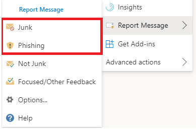

# Notificar falsos positivos y falsos negativos en Outlook

[!INCLUDE [Microsoft 365 Defender rebranding](../includes/microsoft-defender-for-office.md)]

**Se aplica a**
- [Exchange Online Protection](exchange-online-protection-overview.md)
- [Plan 1 y Plan 2 de Microsoft Defender para Office 365](defender-for-office-365.md)
- [Microsoft 365 Defender](../defender/microsoft-365-defender.md)

> [!NOTE]
> Si es administrador de una organización de Microsoft 365 con buzones de Exchange Online, le recomendamos que use el portal de envíos en el Centro de seguridad & cumplimiento. Para obtener más información, vea [Use Admin Submission to submit suspected spam, phish, URLs, and files to Microsoft](admin-submission.md).

En las organizaciones de Microsoft 365 con buzones en Exchange Online o buzones locales con autenticación moderna híbrida, puede enviar falsos positivos (correo electrónico bueno marcado como correo no deseado) y falsos negativos (correo electrónico no deseado y phish permitido) a Exchange Online Protection (EOP).

## Cosas que debe recordar antes de usar la característica Mensaje de informe

- Para obtener la mejor experiencia de envío de usuario, use el complemento Report Message o el complemento Report Phishing.

- Tenga en cuenta que este complemento funciona para Outlook en todas las plataformas: en la web, iOS, Android y Escritorio.

- Si es administrador de una organización con buzones de Exchange Online, use el portal de envíos en el Centro de seguridad & cumplimiento. Para obtener más información, vea [Use Admin Submission to submit suspected spam, phish, URLs, and files to Microsoft](admin-submission.md).

- Puede configurar para enviar mensajes directamente a Microsoft, un buzón que especifique o ambos. Para obtener más información, vea [Directivas de envío de usuarios](user-submission.md).

- Para obtener más información acerca de cómo notificar mensajes a Microsoft, vea [Report messages and files to Microsoft](report-junk-email-messages-to-microsoft.md).

## Usar la característica Mensaje de informe

### Notificar mensajes de correo no deseado y suplantación de identidad

Para los mensajes de la Bandeja de entrada o cualquier otra carpeta de correo electrónico excepto correo no deseado, use el siguiente método para notificar mensajes de correo no deseado y suplantación de identidad:

1. Haga clic en **los** puntos suspensivos Más acciones  de la esquina superior derecha  del mensaje seleccionado, haga clic en Informar mensaje en el menú desplegable y, a continuación, seleccione Correo no deseado o **Suplantación de identidad**.
  
   > [!div class="mx-imgBorder"]
   > 

   > [!div class="mx-imgBorder"]
   > 

2. Los mensajes seleccionados se enviarán a Microsoft para su análisis y:

   - Se ha movido a la carpeta correo no deseado si se ha notificado como correo no deseado.

   - Se elimina si se ha notificado como suplantación de identidad.
   
### Informar de mensajes que no son correo no deseado

1. Haga clic **en los** puntos suspensivos Más acciones  de la esquina superior derecha del mensaje seleccionado, haga clic en Informar mensaje en el menú desplegable y, a continuación, haga clic en **No deseado**.  

   > [!div class="mx-imgBorder"]
   > 

   > [!div class="mx-imgBorder"]
   > 

2. El mensaje seleccionado se enviará a Microsoft para su análisis y se trasladará a la Bandeja de entrada o a cualquier otra carpeta especificada.

## Habilitar los complementos Detección de informes y Mensajes de informe

Los complementos Report Message y Report Phishing para Outlook y Outlook en la web (anteriormente conocidos como Outlook Web App) permiten a los usuarios notificar fácilmente falsos positivos (correo electrónico bueno marcado como negativo) o falsos negativos (correo electrónico no permitido) a Microsoft y sus filiales para su análisis. 

Microsoft usa estos envíos para mejorar la eficacia de las tecnologías de protección de correo electrónico. Por ejemplo, supongamos que los usuarios están informando de muchos mensajes mediante el complemento Detección de suplantación de identidad de informes. Esta información se muestra en el Panel de seguridad y otros informes. El equipo de seguridad de la organización puede usar esta información como una indicación de que es posible que sea necesario actualizar las directivas contra suplantación de identidad. 

Puede instalar el complemento Report Message o Report Phishing. Si desea que los usuarios informen tanto de mensajes de correo no deseado como de suplantación de identidad( phishing), implemente el complemento Report Message en su organización. Para obtener más información, vea Enable the Report Message add-in. 

El complemento Mensaje de informe proporciona la opción de notificar mensajes de correo no deseado y de suplantación de identidad. Los administradores pueden habilitar el complemento Mensaje de informe para la organización y los usuarios individuales pueden instalarlo por sí mismos. 

El complemento Report Phishing proporciona la opción de notificar solo mensajes de suplantación de identidad. Los administradores pueden habilitar el complemento Report Phishing para la organización y los usuarios individuales pueden instalarlo por sí mismos. 

Si eres un usuario individual, puedes habilitar ambos complementos por ti mismo.

si es un administrador global o un administrador de Exchange Online y Exchange está configurado para usar la autenticación de OAuth, puede habilitar el complemento Report Message y el complemento Report Phishing para su organización. Ambos complementos ya están disponibles a través [de la implementación centralizada](../../admin/manage/centralized-deployment-of-add-ins.md).

## ¿Qué necesita saber antes de empezar?

- Tanto el complemento Mensaje de informe como el complemento Report Phishing funcionan con la mayoría de las suscripciones de Microsoft 365 y los siguientes productos:

  - Outlook en la Web
  - Outlook 2013 SP1 o posterior
  - Outlook 2016 para Mac
  - Outlook incluido con aplicaciones de Microsoft 365 para Empresas
  - Aplicación de Outlook para iOS y Android

- Ambos complementos no están disponibles para buzones o buzones compartidos en organizaciones locales de Exchange.

- El explorador web existente debe funcionar con los complementos Report Message y Report Phishing. Pero, si observa que el complemento no está disponible o no funciona como se esperaba, pruebe con un explorador diferente.

- Para las instalaciones organizativas, la organización debe configurarse para usar la autenticación de OAuth. Para obtener más información, vea [Determine if Centralized Deployment of add-ins works for your organization](../../admin/manage/centralized-deployment-of-add-ins.md).

- Los administradores deben ser miembros del grupo de roles Administradores globales. Para obtener más información, vea [Permisos en el Centro de seguridad y cumplimiento](permissions-in-the-security-and-compliance-center.md).

## Obtener el complemento Mensaje de informe

### Obtener el complemento por ti mismo

1. Vaya a Microsoft AppSource en <https://appsource.microsoft.com/marketplace/apps> y busque el complemento Mensaje de informe. Para ir directamente al complemento Mensaje de informe, vaya a <https://appsource.microsoft.com/product/office/wa104381180> .

2. Haga **clic en OBTENER AHORA**.

   

3. En el cuadro de diálogo que aparece, revise los términos de uso y la directiva de privacidad y, a continuación, haga clic **en Continuar**.

4. Inicie sesión con su cuenta laboral o educativa (para uso empresarial) o su cuenta Microsoft (para uso personal).

Después de instalar y habilitar el complemento, verá los siguientes iconos:

- En Outlook, el icono tiene este aspecto:

  > [!div class="mx-imgBorder"]
  > 

- En Outlook en la web, el icono tiene este aspecto:

  > [!div class="mx-imgBorder"]
  > 

### Obtener el complemento para su organización

> [!NOTE]
> El complemento podría tardar hasta 12 horas en aparecer en la organización.

1. En el Centro de administración de Microsoft 365, vaya a la página Complementos  \> **de configuración** en <https://admin.microsoft.com/AdminPortal/Home#/Settings/AddIns> . Si no ves  la página Complemento, ve  al vínculo Configuración Complementos de aplicaciones integradas en la parte \>  \>  superior de la **página Aplicaciones integradas.**

2. Seleccione **Implementar complemento en** la parte superior de la página y, a continuación, seleccione **Siguiente**.

   

3. En el menú desplegable Implementar un nuevo complemento que aparece, revise la información y, **a** continuación, haga clic **en Siguiente**.

4. En la página siguiente, haga clic **en Elegir en la Tienda**.

   

5. En la **página Seleccionar complemento** que aparece, haga clic en el cuadro Buscar, escriba **Mensaje** de informe y, a continuación, haga clic en **Buscar** en el icono Buscar   . En la lista de resultados, busque **Mensaje de informe** y, a continuación, haga clic en **Agregar**.

   

6. En el cuadro de diálogo que aparece, revise la información de privacidad y licencias y, a continuación, haga clic **en Continuar**.

7. En la **página Configurar complemento que** aparece, configure las siguientes opciones:

   - **Usuarios asignados:** seleccione uno de los siguientes valores:

     - **Todos** (predeterminado)
     - **Usuarios o grupos específicos**
     - **Sólo yo**

   - **Método de implementación:** seleccione uno de los siguientes valores:

     - **Corregido (predeterminado):** el complemento se implementa automáticamente en los usuarios especificados y no pueden quitarlo.
     - **Disponible:** los usuarios pueden instalar el complemento en **Home** \> **Get add-ins** \> **Admin-managed**.
     - **Opcional:** el complemento se implementa automáticamente en los usuarios especificados, pero pueden elegir quitarlo.

   

   Cuando haya terminado, haga clic en **Implementar**.

8. En la **página Implementar mensaje de** informe que aparece, verá un informe de progreso seguido de una confirmación de que se implementó el complemento. Después de leer la información, haga clic **en Siguiente**.

   

9. En la **página Anunciar complemento que** aparece, revise la información y, a continuación, haga clic en **Cerrar**.

   

## Revisar o editar la configuración del complemento Mensaje de informe

1. En el Centro de administración de Microsoft 365, vaya a la página Complementos  \> **de configuración** en <https://admin.microsoft.com/AdminPortal/Home#/Settings/AddIns> . Si no ves  la página Complemento, ve  al vínculo Configuración Complementos de aplicaciones integradas en la parte \>  \>  superior de la **página Aplicaciones integradas.**

   

2. Busque y seleccione el **complemento Mensaje** de informe.

3. En el **control desplegable Editar mensaje** de informe que aparece, revise y edite la configuración según corresponda para su organización. Cuando haya terminado, haga clic en **Guardar**.

   

## Obtener el complemento de suplantación de identidad de informe

### Obtener el complemento por ti mismo

1. Vaya a Microsoft AppSource en y busque el complemento <https://appsource.microsoft.com/marketplace/apps> Report Phishing.

2. Haga **clic en OBTENER AHORA**.

3. En el cuadro de diálogo que aparece, revise los términos de uso y la directiva de privacidad y, a continuación, haga clic **en Continuar**.

4. Inicie sesión con su cuenta laboral o educativa (para uso empresarial) o su cuenta Microsoft (para uso personal).

Después de instalar y habilitar el complemento, verá los siguientes iconos:

- En Outlook, el icono tiene este aspecto:

  

- En Outlook en la web, el icono tiene este aspecto:

  > [!div class="mx-imgBorder"]
  > 

### Obtener el complemento para su organización

> [!NOTE]
> El complemento podría tardar hasta 12 horas en aparecer en la organización.

1. En el Centro de administración de Microsoft 365, vaya a la página Complementos  \> **de configuración** en <https://admin.microsoft.com/AdminPortal/Home#/Settings/AddIns> . Si no ves  la página Complemento, ve  al vínculo Configuración Complementos de aplicaciones integradas en la parte \>  \>  superior de la **página Aplicaciones integradas.**

2. Seleccione **Implementar complemento en** la parte superior de la página y, a continuación, seleccione **Siguiente**.

   

3. En el menú desplegable Implementar un nuevo complemento que aparece, revise la información y, **a** continuación, haga clic **en Siguiente**.

4. En la página siguiente, haga clic **en Elegir en la Tienda**.

   

5. En la **página Seleccionar complemento** que aparece, haga clic en el cuadro Buscar, escriba Informe de **suplantación** de identidad y, a continuación, haga clic en **Buscar** icono   . En la lista de resultados, busque **Report Phishing** y, a continuación, haga clic **en Agregar**.

6. En el cuadro de diálogo que aparece, revise la información de privacidad y licencias y, a continuación, haga clic **en Continuar**.

7. En la **página Configurar complemento que** aparece, configure las siguientes opciones:

   - **Usuarios asignados:** seleccione uno de los siguientes valores:

     - **Todos** (predeterminado)
     - **Usuarios o grupos específicos**
     - **Sólo yo**

   - **Método de implementación:** seleccione uno de los siguientes valores:

     - **Corregido (predeterminado):** el complemento se implementa automáticamente en los usuarios especificados y no pueden quitarlo.
     - **Disponible:** los usuarios pueden instalar el complemento en **Home** \> **Get add-ins** \> **Admin-managed**.
     - **Opcional:** el complemento se implementa automáticamente en los usuarios especificados, pero pueden elegir quitarlo.

   Cuando haya terminado, haga clic en **Implementar**.

8. En la **página Implementar suplantación** de identidad de informes que aparece, verá un informe de progreso seguido de una confirmación de que el complemento se implementó. Después de leer la información, haga clic **en Siguiente**.

9. En la **página Anunciar complemento que** aparece, revise la información y, a continuación, haga clic en **Cerrar**.

## Revisar o editar la configuración del complemento de suplantación de identidad de informes

1. En el Centro de administración de Microsoft 365, vaya a la página Complementos  \> **de configuración** en <https://admin.microsoft.com/AdminPortal/Home#/Settings/AddIns> . Si no ves  la página Complemento, ve  al vínculo Configuración Complementos de aplicaciones integradas en la parte \>  \>  superior de la **página Aplicaciones integradas.**

2. Busque y seleccione el **complemento Report Phishing.**

3. En el **control desplegable Editar suplantación** de identidad de informe que aparece, revise y edite la configuración según corresponda para su organización. Cuando haya terminado, haga clic en **Guardar**.

## Ver y revisar los mensajes notificados

Para revisar los mensajes que los usuarios informan a Microsoft, tiene estas opciones:

- Use el portal de envíos de administrador. Para obtener más información, vea [Ver envíos de usuarios a Microsoft](admin-submission.md#view-user-submissions-to-microsoft).

- Cree una regla de flujo de correo (también conocida como regla de transporte) para enviar copias de los mensajes notificados. Para obtener instrucciones, consulte [Use mail flow rules to see what your users are reporting to Microsoft](use-mail-flow-rules-to-see-what-your-users-are-reporting-to-microsoft.md).