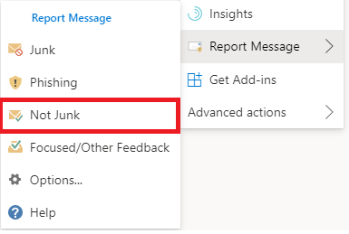

# Informar de falsos positivos y falsos negativos en Outlook

[!INCLUDE [Microsoft 365 Defender rebranding](../includes/microsoft-defender-for-office.md)]

**Se aplica a**
- [Exchange Online Protection](exchange-online-protection-overview.md)
- [Plan 1 y Plan 2 de Microsoft Defender para Office 365](defender-for-office-365.md)
- [Microsoft 365 Defender](../defender/microsoft-365-defender.md)

> [!NOTE]
> Si es administrador de una organización Microsoft 365 con buzones de correo Exchange Online, se recomienda usar el portal de envíos en el Centro de seguridad y & cumplimiento. Para obtener más información, vea [Use Admin Submission to submit suspected spam, phish, URLs, and files to Microsoft](admin-submission.md).

En las organizaciones de Microsoft 365 con buzones en buzones de Exchange Online o locales mediante autenticación moderna híbrida, puede enviar falsos positivos (correo electrónico bueno bloqueado o enviado a la carpeta no deseado) y falsos negativos (correo electrónico no deseado o suplantación de identidad que se entregó a la bandeja de entrada) a Exchange Online Protection (EOP).

## ¿Qué necesita saber antes de comenzar?

- Para obtener la mejor experiencia de envío de usuario, use el complemento Report Message o el complemento Report Phishing.

- Tenga en cuenta que este complemento funciona Outlook en todas las plataformas: en la web, iOS, Android y Escritorio.

- Si es administrador de una organización con buzones de correo Exchange Online, use el portal de envíos en el Centro de seguridad & cumplimiento. Para obtener más información, vea [Use Admin Submission to submit suspected spam, phish, URLs, and files to Microsoft](admin-submission.md).

- Puede configurar para enviar mensajes directamente a Microsoft, un buzón que especifique o ambos. Para obtener más información, vea [Directivas de envío de usuarios](user-submission.md).

- Para obtener más información sobre cómo obtener y habilitar el mensaje de informe o los complementos de suplantación de identidad de informes, vea Habilitar el mensaje de informe o los complementos de suplantación [de identidad de informe](enable-the-report-message-add-in.md).

- Para obtener más información acerca de cómo notificar mensajes a Microsoft, vea [Report messages and files to Microsoft](report-junk-email-messages-to-microsoft.md).

## Usar la característica Mensaje de informe

### Notificar mensajes de correo no deseado y suplantación de identidad

Para los mensajes de la Bandeja de entrada o cualquier otra carpeta de correo electrónico excepto correo no deseado, use el siguiente método para notificar mensajes de correo no deseado y suplantación de identidad:

1. Haga clic en **los** puntos suspensivos Más acciones  de la esquina superior derecha  del mensaje seleccionado, haga clic en Informar mensaje en el menú desplegable y, a continuación, seleccione Correo no deseado o **Suplantación de identidad**.
  
   > [!div class="mx-imgBorder"]
   > 

   > [!div class="mx-imgBorder"]
   > 

2. Los mensajes seleccionados se enviarán a Microsoft para su análisis y:

   - Se ha movido a la carpeta correo no deseado si se ha notificado como correo no deseado.

   - Se elimina si se ha notificado como suplantación de identidad.
   
### Informar de mensajes que no son correo no deseado

1. Haga clic **en los** puntos suspensivos Más acciones  de la esquina superior derecha del mensaje seleccionado, haga clic en Informar mensaje en el menú desplegable y, a continuación, haga clic en **No deseado**.  

   > [!div class="mx-imgBorder"]
   > 

   > [!div class="mx-imgBorder"]
   > 

2. El mensaje seleccionado se enviará a Microsoft para su análisis y se trasladará a la Bandeja de entrada o a cualquier otra carpeta especificada.

## Ver y revisar los mensajes notificados

Para revisar los mensajes que los usuarios informan a Microsoft, tiene estas opciones:

- Use el portal de envíos de administrador. Para obtener más información, vea [Ver envíos de usuarios a Microsoft](admin-submission.md#view-user-submissions-to-microsoft).

- Cree una regla de flujo de correo (también conocida como regla de transporte) para enviar copias de los mensajes notificados. Para obtener instrucciones, consulte [Use mail flow rules to see what your users are reporting to Microsoft](use-mail-flow-rules-to-see-what-your-users-are-reporting-to-microsoft.md).