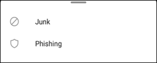

# Informar del correo electrónico no deseado y de suplantación de identidad en Outlook para iOS y Android en Exchange Online

[!INCLUDE [Microsoft 365 Defender rebranding](../includes/microsoft-defender-for-office.md)]

En Microsoft 365 organizaciones con buzones de correo en Exchange online o buzones locales que usan la [autenticación moderna híbrida](https://docs.microsoft.com/microsoft-365/enterprise/hybrid-modern-auth-overview), puede usar las opciones de informes integradas en Outlook para iOS y Android para enviar falsos positivos (correo electrónico bueno marcado como correo no deseado), falsos negativos (correo electrónico incorrecto permitido) y mensajes de suplantación de identidad para Exchange Online Protection (EOP).

## ¿Qué necesita saber antes de empezar?

- Si es administrador de una organización con buzones de correo de Exchange Online, le recomendamos que use el portal de envíos del centro de seguridad & cumplimiento. Para obtener más información, vea [usar el envío de administración para enviar un correo no deseado, phish, direcciones URL y archivos sospechosos a Microsoft](admin-submission.md).

- Puede configurar los mensajes notificados para que se copien o redirijan a un buzón de correo que especifique. Para obtener más información, consulte [directivas de envíos de usuario](user-submission.md).

- Para obtener más información acerca de los informes de mensajes a Microsoft, vea [Informe de mensajes y archivos a Microsoft](report-junk-email-messages-to-microsoft.md).

  > [!NOTE]
  > Si la notificación de correo no deseado está deshabilitada para Outlook en la Directiva de envío de usuario, los mensajes de correo no deseado o de suplantación de identidad se moverán a la carpeta de correo no deseado y no se notificará al administrador

## Notificar mensajes de correo no deseado y suplantación de identidad en Outlook para iOS y Android

Para los mensajes de la bandeja de entrada, o cualquier otra carpeta de correo electrónico excepto correo electrónico no deseado, siga estos pasos para notificar mensajes de correo no deseado y suplantación de identidad (phishing) para iOS y Android:

1. Seleccione uno o más mensajes.
2. En la esquina superior derecha, puntee en los tres puntos verticales. Se abrirá el menú Acción.

   

3. Pulse **informar de correo no deseado** y seleccione **correo no deseado** o **suplantación de identidad**.

   

4. En el cuadro de diálogo que aparece, puede elegir **Informe** o **no gracias**. Al seleccionar **no gracias**, si ha punteado en **correo no deseado** , el mensaje se mueve a la carpeta correo electrónico no deseado, si puntea en **suplantación de identidad** , el mensaje se mueve a la carpeta elementos eliminados. Seleccione **Report** para enviar también una copia del mensaje a Microsoft.

   

Si cambia de opinión, seleccione **Deshacer** en la notificación del sistema que aparece. El mensaje permanece en la carpeta Bandeja de entrada.

## Notificar mensajes seguros desde la carpeta correo no deseado en Outlook para iOS y Android

En la carpeta de correo no deseado, siga estos pasos para notificar falsos positivos de correo no deseado:

1. Seleccione uno o más mensajes.
2. En la esquina superior derecha, puntee en los tres puntos verticales. Se abrirá el menú Acción.

   

3. Puntee en **no es correo electrónico no deseado**.

Una notificación del sistema parece que el correo electrónico se ha movido a la bandeja de entrada. Si cambia de opinión, seleccione **Deshacer** en la notificación del sistema. El correo electrónico permanece en la carpeta de correo no deseado.
