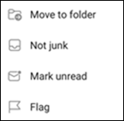

# Notificar correo electrónico no deseado y de suplantación de identidad en Outlook para iOS y Android en Exchange Online

[!INCLUDE [Microsoft 365 Defender rebranding](../includes/microsoft-defender-for-office.md)]

En organizaciones de Microsoft 365 con buzones en Exchange Online o buzones locales mediante la autenticación moderna [híbrida,](https://docs.microsoft.com/microsoft-365/enterprise/hybrid-modern-auth-overview)puede usar las opciones de informes integradas en Outlook para iOS y Android para enviar falsos positivos (correo electrónico bueno marcado como correo no deseado), falsos negativos (correo electrónico no deseado permitido) y mensajes de suplantación de identidad a Exchange Online Protection (EOP).

## ¿Qué necesita saber antes de comenzar?

- Si es administrador de una organización con buzones de Exchange Online, le recomendamos que use el portal de envíos en el Centro de & cumplimiento. Para obtener más información, vea Usar envío de administrador para enviar correos sospechosos de correo no [deseado, phishing, direcciones URL y archivos a Microsoft.](admin-submission.md)

- Puede configurar los mensajes notificados para que se copien o redirijan a un buzón que especifique. Para obtener más información, consulta [Directivas de envío de usuarios.](user-submission.md)

- Para obtener más información acerca de la notificación de mensajes a Microsoft, vea Notificar mensajes [y archivos a Microsoft.](report-junk-email-messages-to-microsoft.md)

  > [!NOTE]
  > Si los informes de correo no deseado están deshabilitados para Outlook en la directiva de envío de usuario, los mensajes de correo no deseado o de suplantación de identidad se mueven a la carpeta de correo no deseado y no se notifican a su administrador o Microsoft.

## Notificar mensajes de correo no deseado y suplantación de identidad en Outlook para iOS y Android

Para los mensajes de la Bandeja de entrada o cualquier otra carpeta de correo electrónico excepto correo no deseado, siga estos pasos para notificar mensajes de correo no deseado y de suplantación de identidad (phishing) para iOS y Android:

1. Seleccione uno o más mensajes.
2. En la esquina superior derecha, pulsa en los tres puntos verticales. Se abre el menú de acciones.

   

3. Pulse **Informar de correo no** deseado y, a **continuación,** seleccione Correo no deseado o **Suplantación de identidad**.

   

4. En el cuadro de diálogo que aparece, puede elegir **Informe** o **No gracias.** Al seleccionar No se **agradece,** si ha pulsado Correo no deseado,  el mensaje se mueve a la carpeta Correo no deseado, si pulsa suplantación de identidad, el mensaje se mueve a la carpeta Elementos eliminados.  Seleccione **Informe** para enviar también una copia del mensaje a Microsoft.

   

Si cambias de opinión, selecciona **Deshacer** en la notificación del sistema que aparece. El mensaje permanece en la carpeta Bandeja de entrada.

## Notificar mensajes que no son correo no deseado desde la carpeta de correo no deseado en Outlook para iOS y Android

En la carpeta Correo no deseado, siga estos pasos para notificar falsos positivos de correo no deseado:

1. Seleccione uno o más mensajes.
2. En la esquina superior derecha, pulsa en los tres puntos verticales. Se abre el menú de acciones.

   

3. Pulse **No deseado.**

Aparece una notificación del sistema que muestra que el correo electrónico se ha movido a la Bandeja de entrada. Si cambias de opinión, selecciona **Deshacer en** la notificación del sistema. El correo electrónico permanece en la carpeta Correo no deseado.
