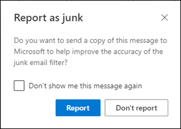

# <a name="report-junk-and-phishing-email-in-outlook-on-the-web-in-office-365"></a><span data-ttu-id="9c082-103">Informar del correo electrónico no deseado y de suplantación de identidad en Outlook en la web en Office 365</span><span class="sxs-lookup"><span data-stu-id="9c082-103">Report junk and phishing email in Outlook on the web in Office 365</span></span>

<span data-ttu-id="9c082-104">Si es un cliente de Office 365 con buzones de correo de Exchange Online, puede usar las opciones de informes integradas en Outlook en la web (anteriormente conocido como Outlook Web App) para enviar falsos positivos (correo electrónico bueno marcado como correo no deseado), falsos negativos (correo electrónico incorrecto permitido) y mensajes de suplantación de identidad a Exchange Online Protection (EOP).</span><span class="sxs-lookup"><span data-stu-id="9c082-104">If you're an Office 365 customer with Exchange Online mailboxes, you can use the built-in reporting options in Outlook on the web (formerly known as Outlook Web App) to submit false positives (good email marked as spam), false negatives (bad email allowed) and phishing messages to Exchange Online Protection (EOP).</span></span>

## <a name="what-do-you-need-to-know-before-you-begin"></a><span data-ttu-id="9c082-105">¿Qué necesita saber antes de empezar?</span><span class="sxs-lookup"><span data-stu-id="9c082-105">What do you need to know before you begin?</span></span>

- <span data-ttu-id="9c082-106">Si es administrador de una organización de Office 365 con buzones de correo de Exchange Online, le recomendamos que use el portal de envíos del centro de seguridad & cumplimiento de Office 365.</span><span class="sxs-lookup"><span data-stu-id="9c082-106">If you're an admin in an Office 365 organization with Exchange Online mailboxes, we recommend that you use the Submissions portal in the Office 365 Security & Compliance Center.</span></span> <span data-ttu-id="9c082-107">Para obtener más información, vea [usar el envío de administración para enviar un correo no deseado, phish, direcciones URL y archivos sospechosos a Microsoft](admin-submission.md).</span><span class="sxs-lookup"><span data-stu-id="9c082-107">For more information, see [Use Admin Submission to submit suspected spam, phish, URLs, and files to Microsoft](admin-submission.md).</span></span>

- <span data-ttu-id="9c082-108">Los administradores pueden deshabilitar o habilitar la capacidad de los usuarios para notificar mensajes a Microsoft en Outlook en la Web.</span><span class="sxs-lookup"><span data-stu-id="9c082-108">Admins can disable or enable the ability for users to report messages to Microsoft in Outlook on the web.</span></span> <span data-ttu-id="9c082-109">Para obtener más información, vea la sección [deshabilitar o habilitar la notificación de correo electrónico no deseado en Outlook en la web](#disable-or-enable-junk-email-reporting-in-outlook-on-the-web) , más adelante en este tema.</span><span class="sxs-lookup"><span data-stu-id="9c082-109">For details, see the [Disable or enable junk email reporting in Outlook on the web](#disable-or-enable-junk-email-reporting-in-outlook-on-the-web) section later in this topic.</span></span>

- <span data-ttu-id="9c082-110">Para obtener más información acerca de los informes de mensajes a Microsoft, vea [Informe de mensajes y archivos a Microsoft en Office 365](report-junk-email-messages-to-microsoft.md).</span><span class="sxs-lookup"><span data-stu-id="9c082-110">For more information about reporting messages to Microsoft, see [Report messages and files to Microsoft in Office 365](report-junk-email-messages-to-microsoft.md).</span></span>

## <a name="report-spam-and-phishing-messages-in-outlook-on-the-web"></a><span data-ttu-id="9c082-111">Notificar mensajes de correo no deseado y suplantación de identidad en Outlook en la web</span><span class="sxs-lookup"><span data-stu-id="9c082-111">Report spam and phishing messages in Outlook on the web</span></span>

1. <span data-ttu-id="9c082-112">Para los mensajes de la bandeja de entrada o cualquier otra carpeta de correo electrónico excepto correo electrónico no deseado, use cualquiera de los métodos siguientes para notificar mensajes de correo no deseado y suplantación de identidad:</span><span class="sxs-lookup"><span data-stu-id="9c082-112">For messages in the Inbox or any other email folder except Junk Email, use either of the following methods to report spam and phishing messages:</span></span>

   - <span data-ttu-id="9c082-113">Seleccione el mensaje, haga clic en **correo no deseado** en la barra de herramientas y seleccione **correo no deseado** o **suplantación de identidad**.</span><span class="sxs-lookup"><span data-stu-id="9c082-113">Select the message, click **Junk** on the toolbar, and then select **Junk** or **Phishing**.</span></span>

     

   - <span data-ttu-id="9c082-115">Seleccione uno o más mensajes, haga clic con el botón secundario y, a continuación, seleccione **marcar como correo no deseado**.</span><span class="sxs-lookup"><span data-stu-id="9c082-115">Select one or more messages, right-click, and then select **Mark as junk**.</span></span>

2. <span data-ttu-id="9c082-116">En el cuadro de diálogo que aparece, haga clic en **Informe**.</span><span class="sxs-lookup"><span data-stu-id="9c082-116">In the dialog that appears, click **Report**.</span></span> <span data-ttu-id="9c082-117">Si cambia de opinión, haga clic en **no informar**.</span><span class="sxs-lookup"><span data-stu-id="9c082-117">If you change your mind, click **Don't Report**.</span></span>

   

   

3. <span data-ttu-id="9c082-120">Los mensajes seleccionados se enviarán a Microsoft para su análisis.</span><span class="sxs-lookup"><span data-stu-id="9c082-120">The selected messages will be sent to Microsoft for analysis.</span></span> <span data-ttu-id="9c082-121">Para confirmar que los mensajes se han enviado, abra la carpeta **Mensajes enviados** para ver los mensajes enviados.</span><span class="sxs-lookup"><span data-stu-id="9c082-121">To confirm that the messages have been submitted, open your **Sent Items** folder to view the submitted messages.</span></span>

## <a name="report-non-spam-and-phishing-messages-from-the-junk-email-folder-in-outlook-on-the-web"></a><span data-ttu-id="9c082-122">Informar de mensajes de suplantación de identidad y correo no deseado de la carpeta correo electrónico no deseado en Outlook en la web</span><span class="sxs-lookup"><span data-stu-id="9c082-122">Report non-spam and phishing messages from the Junk Email folder in Outlook on the web</span></span>

1. <span data-ttu-id="9c082-123">En la carpeta correo electrónico no deseado, use cualquiera de los métodos siguientes para informar sobre falsos positivos o mensajes de suplantación de identidad:</span><span class="sxs-lookup"><span data-stu-id="9c082-123">In the Junk Email folder, use either of the following methods to report spam false positives or phishing messages:</span></span>

   - <span data-ttu-id="9c082-124">Seleccione el mensaje, haga clic en **correo deseado** en la barra de herramientas y, a continuación, seleccione **correo deseado** o **suplantación de identidad**.</span><span class="sxs-lookup"><span data-stu-id="9c082-124">Select the message, click **Not Junk** on the toolbar, and then select **Not Junk** or **Phishing**.</span></span>

     

   - <span data-ttu-id="9c082-126">Seleccione uno o más mensajes, haga clic con el botón secundario y, a continuación, seleccione **marcar como correo deseado**.</span><span class="sxs-lookup"><span data-stu-id="9c082-126">Select one or more messages, right-click, and then select **Mark as not junk**.</span></span>

2. <span data-ttu-id="9c082-127">En el cuadro de diálogo que aparece, lea la información y haga clic en **Informe**.</span><span class="sxs-lookup"><span data-stu-id="9c082-127">In the dialog that appears, read the information and click **Report**.</span></span> <span data-ttu-id="9c082-128">Si cambia de opinión, haga clic en **no informar**.</span><span class="sxs-lookup"><span data-stu-id="9c082-128">If you change your mind, click **Don't Report**.</span></span>

   

   

3. <span data-ttu-id="9c082-131">Los mensajes seleccionados se enviarán a Microsoft para su análisis.</span><span class="sxs-lookup"><span data-stu-id="9c082-131">The selected messages will be sent to Microsoft for analysis.</span></span> <span data-ttu-id="9c082-132">Para confirmar que los mensajes se han enviado, abra la carpeta **Mensajes enviados** para ver los mensajes enviados.</span><span class="sxs-lookup"><span data-stu-id="9c082-132">To confirm that the messages have been submitted, open your **Sent Items** folder to view the submitted messages.</span></span>

## <a name="disable-or-enable-junk-email-reporting-in-outlook-on-the-web"></a><span data-ttu-id="9c082-133">Deshabilitar o habilitar la notificación de correo no deseado en Outlook en la web</span><span class="sxs-lookup"><span data-stu-id="9c082-133">Disable or enable junk email reporting in Outlook on the web</span></span>

<span data-ttu-id="9c082-134">De forma predeterminada, los usuarios pueden notificar falsos positivos de correo no deseado, falsos negativos y mensajes de suplantación de identidad a Microsoft para su análisis en Outlook en la Web.</span><span class="sxs-lookup"><span data-stu-id="9c082-134">By default, users can report spam false positives, false negatives, and phishing messages to Microsoft for analysis in Outlook on the web.</span></span> <span data-ttu-id="9c082-135">Los administradores pueden configurar las directivas de buzones de correo de Outlook en la web en Exchange Online PowerShell para evitar que los usuarios informen falsos positivos de correo no deseado y correo no deseado falsos negativos para Microsoft.</span><span class="sxs-lookup"><span data-stu-id="9c082-135">Admins can configure Outlook on the web mailbox policies in Exchange Online PowerShell to prevent users from reporting spam false positives and spam false negatives to Microsoft.</span></span> <span data-ttu-id="9c082-136">No se puede deshabilitar la capacidad de los usuarios para notificar mensajes de suplantación de identidad a Microsoft.</span><span class="sxs-lookup"><span data-stu-id="9c082-136">You can't disable the ability for users to report phishing messages to Microsoft.</span></span>

### <a name="what-do-you-need-to-know-before-you-begin"></a><span data-ttu-id="9c082-137">¿Qué necesita saber antes de empezar?</span><span class="sxs-lookup"><span data-stu-id="9c082-137">What do you need to know before you begin?</span></span>

- <span data-ttu-id="9c082-138">Para conectarse a PowerShell de Exchange Online, consulte [Conectarse a PowerShell de Exchange Online](https://docs.microsoft.com/powershell/exchange/exchange-online/connect-to-exchange-online-powershell/connect-to-exchange-online-powershell).</span><span class="sxs-lookup"><span data-stu-id="9c082-138">To connect to Exchange Online PowerShell, see [Connect to Exchange Online PowerShell](https://docs.microsoft.com/powershell/exchange/exchange-online/connect-to-exchange-online-powershell/connect-to-exchange-online-powershell).</span></span>

- <span data-ttu-id="9c082-139">Deberá tener asignados permisos antes de poder llevar a cabo estos procedimientos.</span><span class="sxs-lookup"><span data-stu-id="9c082-139">You need to be assigned permissions before you can perform these procedures.</span></span> <span data-ttu-id="9c082-140">En concreto, necesitará los roles de **directivas de destinatarios** o **destinatarios de correo** en Exchange Online, que se asignan a los grupos de roles administración de la **organización** y **Administración de destinatarios** de forma predeterminada.</span><span class="sxs-lookup"><span data-stu-id="9c082-140">Specifically you need the **Recipient Policies** or **Mail Recipients** roles in Exchange Online, which are assigned to the **Organization Management** and **Recipient Management** role groups by default.</span></span> <span data-ttu-id="9c082-141">Para obtener más información acerca de los grupos de roles de Exchange Online, vea [Modify role Groups in Exchange Online](https://docs.microsoft.com/Exchange/permissions-exo/role-groups#modify-role-groups).</span><span class="sxs-lookup"><span data-stu-id="9c082-141">For more information about role groups in Exchange Online, see [Modify role groups in Exchange Online](https://docs.microsoft.com/Exchange/permissions-exo/role-groups#modify-role-groups).</span></span>

- <span data-ttu-id="9c082-142">Cada organización tiene una directiva predeterminada denominada OwaMailboxPolicy-default, pero puede crear directivas personalizadas.</span><span class="sxs-lookup"><span data-stu-id="9c082-142">Every organization has a default policy named OwaMailboxPolicy-Default, but you can create custom policies.</span></span> <span data-ttu-id="9c082-143">Las directivas personalizadas se aplican a los usuarios en el ámbito antes de la directiva predeterminada.</span><span class="sxs-lookup"><span data-stu-id="9c082-143">Custom policies are applied to scoped users before the default policy.</span></span> <span data-ttu-id="9c082-144">Para obtener más información acerca de las directivas de buzón de correo de Outlook en la web, vea [directivas de buzones de correo de Outlook en la web en Exchange Online](https://docs.microsoft.com/Exchange/clients-and-mobile-in-exchange-online/outlook-on-the-web/outlook-web-app-mailbox-policies).</span><span class="sxs-lookup"><span data-stu-id="9c082-144">For more information about Outlook on the web mailbox policies, see [Outlook on the web mailbox policies in Exchange Online](https://docs.microsoft.com/Exchange/clients-and-mobile-in-exchange-online/outlook-on-the-web/outlook-web-app-mailbox-policies).</span></span>

- <span data-ttu-id="9c082-145">La deshabilitación de la notificación de correo no deseado no elimina la capacidad de marcar un mensaje como correo no deseado en Outlook en la Web.</span><span class="sxs-lookup"><span data-stu-id="9c082-145">Disabling junk email reporting doesn't remove the ability to mark a message as junk or not junk in Outlook on the web.</span></span> <span data-ttu-id="9c082-146">Al seleccionar un mensaje en la carpeta correo electrónico no deseado y al hacer clic en **correo deseado** \> y **no deseado** , el mensaje se vuelve a mover a la bandeja de entrada.</span><span class="sxs-lookup"><span data-stu-id="9c082-146">Selecting a message in the Junk email folder and clicking **Not junk** \> **Not junk** still moves the message back into the Inbox.</span></span> <span data-ttu-id="9c082-147">Al seleccionar un mensaje en cualquier otra carpeta de correo electrónico y **al hacer clic** \> en correo no deseado todavía se mueve el mensaje a la carpeta correo **electrónico no deseado** .</span><span class="sxs-lookup"><span data-stu-id="9c082-147">Selecting a message in any other email folder and clicking **Junk** \> **Junk** still moves the message into the Junk Email folder.</span></span> <span data-ttu-id="9c082-148">Lo que ya no está disponible es la opción de informar al mensaje a Microsoft.</span><span class="sxs-lookup"><span data-stu-id="9c082-148">What's no longer available is the option to report the message to Microsoft.</span></span>

### <a name="use-exchange-online-powershell-to-disable-or-enable-junk-email-reporting-in-outlook-on-the-web"></a><span data-ttu-id="9c082-149">Usar Exchange Online PowerShell para deshabilitar o habilitar la notificación de correo electrónico no deseado en Outlook en la web</span><span class="sxs-lookup"><span data-stu-id="9c082-149">Use Exchange Online PowerShell to disable or enable junk email reporting in Outlook on the web</span></span>

1. <span data-ttu-id="9c082-150">Para buscar las directivas de buzón de correo de Outlook en la Web existentes y el estado de la notificación de correo no deseado, ejecute el siguiente comando:</span><span class="sxs-lookup"><span data-stu-id="9c082-150">To find your existing Outlook on the web mailbox policies and the status of junk email reporting, run the following command:</span></span>

   ```powershell
   Get-OwaMailboxPolicy | Format-Table Name,ReportJunkEmailEnabled
   ```

2. <span data-ttu-id="9c082-151">Para deshabilitar o habilitar la notificación de correo no deseado en Outlook en la web, use la siguiente sintaxis:</span><span class="sxs-lookup"><span data-stu-id="9c082-151">To disable or enable junk email reporting in Outlook on the web, use the following syntax:</span></span>

   ```powershell
   Set-OwaMailboxPolicy -Identity "<OWAMailboxPolicyName>" -ReportJunkEmailEnabled <$true | $false>
   ```

   <span data-ttu-id="9c082-152">En este ejemplo se deshabilita la notificación de correo no deseado en la directiva predeterminada.</span><span class="sxs-lookup"><span data-stu-id="9c082-152">This example disables junk email reporting in the default policy.</span></span>

   ```powershell
   Set-OwaMailboxPolicy -Identity "OwaMailboxPolicy-Default" -ReportJunkEmailEnabled $false
   ```

   <span data-ttu-id="9c082-153">En este ejemplo se habilita la notificación de correo no deseado en la directiva personalizada denominada administradores de contoso.</span><span class="sxs-lookup"><span data-stu-id="9c082-153">This example enables junk email reporting in the custom policy named Contoso Managers.</span></span>

   ```powershell
   Set-OwaMailboxPolicy -Identity "Contoso Managers" -ReportJunkEmailEnabled $true
   ```

<span data-ttu-id="9c082-154">Para obtener información más detallada acerca de la sintaxis y los parámetros, consulte [Get-owamailboxpolicy](https://docs.microsoft.com/powershell/module/exchange/client-access/get-owamailboxpolicy) y [set-OwaMailboxPolicy](https://docs.microsoft.com/powershell/module/exchange/client-access/set-owamailboxpolicy).</span><span class="sxs-lookup"><span data-stu-id="9c082-154">For detailed syntax and parameter information, see [Get-OwaMailboxPolicy](https://docs.microsoft.com/powershell/module/exchange/client-access/get-owamailboxpolicy) and [Set-OwaMailboxPolicy](https://docs.microsoft.com/powershell/module/exchange/client-access/set-owamailboxpolicy).</span></span>

### <a name="how-do-you-know-this-worked"></a><span data-ttu-id="9c082-155">¿Cómo saber si el proceso se completó correctamente?</span><span class="sxs-lookup"><span data-stu-id="9c082-155">How do you know this worked?</span></span>

<span data-ttu-id="9c082-156">Para comprobar que ha habilitado o deshabilitado correctamente la notificación de correo no deseado en Outlook en la web, siga uno de estos pasos:</span><span class="sxs-lookup"><span data-stu-id="9c082-156">To verify that you've successfully enabled or disabled junk email reporting in Outlook on the web, use any of the following steps:</span></span>

- <span data-ttu-id="9c082-157">En Exchange Online PowerShell, ejecute el siguiente comando y compruebe el valor de la propiedad **ReportJunkEmailEnabled** :</span><span class="sxs-lookup"><span data-stu-id="9c082-157">In Exchange Online PowerShell, run the following command and verify the **ReportJunkEmailEnabled** property value:</span></span>

  ```powershell
  Get-OwaMailboxPolicy | Format-Table Name,ReportJunkEmailEnabled
  ```

- <span data-ttu-id="9c082-158">Abrir el buzón de un usuario afectado en Outlook en la web, seleccione un mensaje en la bandeja de entrada **, haga clic** \> en correo **no deseado y compruebe** que la pregunta para informar del mensaje a Microsoft es o no se muestra.<sup>\*</sup></span><span class="sxs-lookup"><span data-stu-id="9c082-158">Open an affected user's mailbox in Outlook on the web, select a message in the Inbox, click **Junk** \> **Junk** and verify the prompt to report the message to Microsoft is or is not displayed.<sup>\*</sup></span></span>

- <span data-ttu-id="9c082-159">Abrir el buzón de un usuario afectado en Outlook en la web, seleccione un mensaje en la carpeta de **correo no deseado** **, haga clic** \> en correo no deseado y compruebe que la pregunta para informar del mensaje a Microsoft es o no se muestra.<sup>\*</sup></span><span class="sxs-lookup"><span data-stu-id="9c082-159">Open an affected user's mailbox in Outlook on the web, select a message in the Junk Email folder, click **Junk** \> **Junk** and verify the prompt to report the message to Microsoft is or is not displayed.<sup>\*</sup></span></span>

<span data-ttu-id="9c082-160"><sup>\*</sup>Los usuarios pueden ocultar el mensaje para informar del mensaje mientras están notificando el mensaje.</span><span class="sxs-lookup"><span data-stu-id="9c082-160"><sup>\*</sup> Users can hide the prompt to report the message while still reporting the message.</span></span> <span data-ttu-id="9c082-161">Para comprobar esta configuración en Outlook en la web:</span><span class="sxs-lookup"><span data-stu-id="9c082-161">To check this setting in Outlook on the web:</span></span>

1. <span data-ttu-id="9c082-162">Haga clic en **configuración**  \> de configuración del Web **ver todo** \> el **correo electrónico no deseado**de configuración de Outlook.</span><span class="sxs-lookup"><span data-stu-id="9c082-162">Click **Settings**  \> **View all Outlook settings** \> **Junk email**.</span></span>
2. <span data-ttu-id="9c082-163">En la sección **informes** , compruebe el valor: **preguntarme antes de enviar un informe**.</span><span class="sxs-lookup"><span data-stu-id="9c082-163">In the **Reporting** section, verify the value: **Ask me before sending a report**.</span></span>

   
