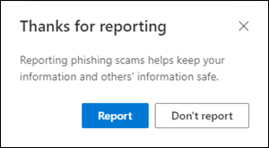

# <a name="report-junk-and-phishing-email-in-outlook-on-the-web-in-exchange-online"></a>Informar del correo electrónico no deseado y de suplantación de identidad en Outlook en la web en Exchange Online

[!INCLUDE [Microsoft 365 Defender rebranding](../includes/microsoft-defender-for-office.md)]


En Microsoft 365 organizaciones con buzones de correo en Exchange Online, puede usar las opciones de informes integradas en Outlook en la web (anteriormente conocido como Outlook Web App) para enviar falsos positivos (correo electrónico bueno marcado como correo no deseado), falsos negativos (se permite correo erróneo) y mensajes de suplantación de identidad a Exchange Online Protection (EOP).

## <a name="what-do-you-need-to-know-before-you-begin"></a>¿Qué necesita saber antes de empezar?

- Si es administrador de una organización con buzones de correo de Exchange Online, le recomendamos que use el portal de envíos del centro de seguridad & cumplimiento. Para obtener más información, vea [usar el envío de administración para enviar un correo no deseado, phish, direcciones URL y archivos sospechosos a Microsoft](admin-submission.md).

- Los administradores pueden deshabilitar o habilitar la capacidad de los usuarios para notificar mensajes a Microsoft en Outlook en la Web. Para obtener más información, vea la sección [deshabilitar o habilitar la notificación de correo electrónico no deseado en Outlook en la web](#disable-or-enable-junk-email-reporting-in-outlook-on-the-web) , más adelante en este tema.

- Puede configurar los mensajes notificados para que se copien o redirijan a un buzón de correo que especifique. Para obtener más información, vea [especificar un buzón para los envíos de usuarios de correo no deseado y mensajes de suplantación de identidad en Exchange Online](user-submission.md).

- Para obtener más información acerca de los informes de mensajes a Microsoft, vea [Informe de mensajes y archivos a Microsoft](report-junk-email-messages-to-microsoft.md).

## <a name="report-spam-and-phishing-messages-in-outlook-on-the-web"></a>Notificar mensajes de correo no deseado y suplantación de identidad en Outlook en la web

1. Para los mensajes de la bandeja de entrada o cualquier otra carpeta de correo electrónico excepto correo electrónico no deseado, use cualquiera de los métodos siguientes para notificar mensajes de correo no deseado y suplantación de identidad:

   - Seleccione el mensaje, haga clic en **correo no deseado** en la barra de herramientas y seleccione **correo no deseado** o **suplantación de identidad**.

     

   - Seleccione uno o más mensajes, haga clic con el botón secundario y, a continuación, seleccione **marcar como correo no deseado**.

2. En el cuadro de diálogo que aparece, haga clic en **Informe**. Si cambia de opinión, haga clic en **no informar**.

   |Desea|Suplantación de identidad (phishing)|
   |:---:|:---:|
   |||

3. Los mensajes seleccionados se enviarán a Microsoft para su análisis. Para confirmar que los mensajes se han enviado, abra la carpeta **Mensajes enviados** para ver los mensajes enviados.

## <a name="report-non-spam-and-phishing-messages-from-the-junk-email-folder-in-outlook-on-the-web"></a>Informar de mensajes de suplantación de identidad y correo no deseado de la carpeta correo electrónico no deseado en Outlook en la web

1. En la carpeta correo electrónico no deseado, use cualquiera de los métodos siguientes para informar sobre falsos positivos o mensajes de suplantación de identidad:

   - Seleccione el mensaje, haga clic en **correo deseado** en la barra de herramientas y, a continuación, seleccione **correo deseado** o **suplantación de identidad**.

     

   - Seleccione uno o más mensajes, haga clic con el botón secundario y, a continuación, seleccione **marcar como correo deseado**.

2. En el cuadro de diálogo que aparece, lea la información y haga clic en **Informe**. Si cambia de opinión, haga clic en **no informar**.

   |Correo deseado|Suplantación de identidad (phishing)|
   |:---:|:---:|
   |||

3. Los mensajes seleccionados se enviarán a Microsoft para su análisis. Para confirmar que los mensajes se han enviado, abra la carpeta **Mensajes enviados** para ver los mensajes enviados.

## <a name="disable-or-enable-junk-email-reporting-in-outlook-on-the-web"></a>Deshabilitar o habilitar la notificación de correo no deseado en Outlook en la web

De forma predeterminada, los usuarios pueden notificar falsos positivos de correo no deseado, falsos negativos y mensajes de suplantación de identidad a Microsoft para su análisis en Outlook en la Web. Los administradores pueden configurar las directivas de buzones de correo de Outlook en la web en Exchange Online PowerShell para evitar que los usuarios informen falsos positivos de correo no deseado y correo no deseado falsos negativos para Microsoft. No se puede deshabilitar la capacidad de los usuarios para notificar mensajes de suplantación de identidad a Microsoft.

### <a name="what-do-you-need-to-know-before-you-begin"></a>¿Qué necesita saber antes de empezar?

- Para conectarse a PowerShell de Exchange Online, consulte [Conectarse a PowerShell de Exchange Online](https://docs.microsoft.com/powershell/exchange/connect-to-exchange-online-powershell).

- Deberá tener asignados permisos antes de poder llevar a cabo estos procedimientos. En concreto, necesitará los roles de **directivas de destinatarios** o **destinatarios de correo** en Exchange Online, que se asignan a los grupos de roles administración de la **organización** y **Administración de destinatarios** de forma predeterminada. Para obtener más información acerca de los grupos de roles de Exchange Online, vea [Modify role Groups in Exchange Online](https://docs.microsoft.com/Exchange/permissions-exo/role-groups#modify-role-groups).

- Cada organización tiene una directiva predeterminada denominada OwaMailboxPolicy-default, pero puede crear directivas personalizadas. Las directivas personalizadas se aplican a los usuarios en el ámbito antes de la directiva predeterminada. Para obtener más información acerca de las directivas de buzón de correo de Outlook en la web, vea [directivas de buzones de correo de Outlook en la web en Exchange Online](https://docs.microsoft.com/Exchange/clients-and-mobile-in-exchange-online/outlook-on-the-web/outlook-web-app-mailbox-policies).

- La deshabilitación de la notificación de correo no deseado no elimina la capacidad de marcar un mensaje como correo no deseado en Outlook en la Web. Al seleccionar un mensaje en la carpeta correo electrónico no deseado y al hacer clic en **correo deseado** y \> **no deseado** , el mensaje se vuelve a mover a la bandeja de entrada. Al seleccionar un mensaje en cualquier otra carpeta de correo electrónico y **al hacer clic en correo no** \> **deseado** todavía se mueve el mensaje a la carpeta correo electrónico no deseado. Lo que ya no está disponible es la opción de informar al mensaje a Microsoft.

### <a name="use-exchange-online-powershell-to-disable-or-enable-junk-email-reporting-in-outlook-on-the-web"></a>Usar Exchange Online PowerShell para deshabilitar o habilitar la notificación de correo electrónico no deseado en Outlook en la web

1. Para buscar las directivas de buzón de correo de Outlook en la Web existentes y el estado de la notificación de correo no deseado, ejecute el siguiente comando:

   ```powershell
   Get-OwaMailboxPolicy | Format-Table Name,ReportJunkEmailEnabled
   ```

2. Para deshabilitar o habilitar la notificación de correo no deseado en Outlook en la web, use la siguiente sintaxis:

   ```powershell
   Set-OwaMailboxPolicy -Identity "<OWAMailboxPolicyName>" -ReportJunkEmailEnabled <$true | $false>
   ```

   En este ejemplo se deshabilita la notificación de correo no deseado en la directiva predeterminada.

   ```powershell
   Set-OwaMailboxPolicy -Identity "OwaMailboxPolicy-Default" -ReportJunkEmailEnabled $false
   ```

   En este ejemplo se habilita la notificación de correo no deseado en la directiva personalizada denominada administradores de contoso.

   ```powershell
   Set-OwaMailboxPolicy -Identity "Contoso Managers" -ReportJunkEmailEnabled $true
   ```

Para obtener información más detallada acerca de la sintaxis y los parámetros, consulte [Get-owamailboxpolicy](https://docs.microsoft.com/powershell/module/exchange/get-owamailboxpolicy) y [set-OwaMailboxPolicy](https://docs.microsoft.com/powershell/module/exchange/set-owamailboxpolicy).

### <a name="how-do-you-know-this-worked"></a>¿Cómo saber si el proceso se completó correctamente?

Para comprobar que ha habilitado o deshabilitado correctamente la notificación de correo no deseado en Outlook en la web, siga uno de estos pasos:

- En Exchange Online PowerShell, ejecute el siguiente comando y compruebe el valor de la propiedad **ReportJunkEmailEnabled** :

  ```powershell
  Get-OwaMailboxPolicy | Format-Table Name,ReportJunkEmailEnabled
  ```

- Abrir el buzón de un usuario afectado en Outlook en la web, seleccione un mensaje en la bandeja de entrada **, haga clic en correo** no deseado \> **Junk** y compruebe que la pregunta para informar del mensaje a Microsoft es o no se muestra.<sup>\*</sup>

- Abrir el buzón de un usuario afectado en Outlook en la web, seleccione un mensaje en la carpeta de correo no deseado **, haga clic en correo no deseado** \> **Junk** y compruebe que la pregunta para informar del mensaje a Microsoft es o no se muestra.<sup>\*</sup>

<sup>\*</sup> Los usuarios pueden ocultar el mensaje para informar del mensaje mientras están notificando el mensaje. Para comprobar esta configuración en Outlook en la web:

1. Haga clic en **configuración**  \> **ver todo** el \> **correo electrónico no deseado**de configuración de Outlook.
2. En la sección **informes** , compruebe el valor: **preguntarme antes de enviar un informe**.

   
