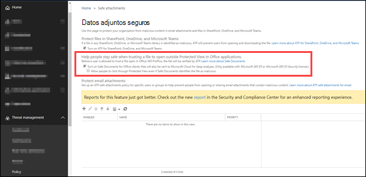

# <a name="safe-documents-in-microsoft-365-e5"></a>Documentos seguros en Microsoft 365 E5

[!INCLUDE [Microsoft 365 Defender rebranding](../includes/microsoft-defender-for-office.md)]


Documentos seguros es una característica de la seguridad de Microsoft 365 E5 o Microsoft 365 E5 que usa [Microsoft defender para el punto de conexión](https://docs.microsoft.com/windows/security/threat-protection/microsoft-defender-atp/microsoft-defender-advanced-threat-protection) para examinar documentos y archivos que se abren en la [vista protegida](https://support.microsoft.com/office/d6f09ac7-e6b9-4495-8e43-2bbcdbcb6653).

## <a name="what-do-you-need-to-know-before-you-begin"></a>¿Qué necesita saber antes de comenzar?

- Documentos seguros solo está disponible para los usuarios con licencias de seguridad de *microsoft 365 E5* o *Microsoft 365 E5* . Estas licencias no se incluyen en los planes de Microsoft defender para Office 365.

- Documentos seguros es compatible con las aplicaciones de Microsoft 365 para empresas (anteriormente conocidas como Office 365 ProPlus) versión 2004 o posterior.

- Abra el Centro de seguridad y cumplimiento en <https://protection.office.com>. Para ir directamente a la página **datos adjuntos seguros de ATP** , Abra <https://protection.office.com/safeattachmentv2> .

- Para conectarse al PowerShell de Exchange Online, consulte [Conectarse a PowerShell de Exchange Online](https://docs.microsoft.com/powershell/exchange/connect-to-exchange-online-powershell).

- Necesita que se le asignen permisos en el Centro de seguridad y cumplimiento de Office 365 antes de que pueda usar este cmdlet.
  - Para establecer la configuración de los documentos seguros, debe ser miembro de los grupos de funciones administración de la **organización** o **Administrador de seguridad** .
  - Para tener acceso de solo lectura a la configuración de documentos seguros, debe ser miembro de los grupos de roles **lector global** o **lector de seguridad** .

  Para obtener más información, vea [Permisos en el Centro de seguridad y cumplimiento](permissions-in-the-security-and-compliance-center.md).

  **Notas**:

  - Agregar usuarios al rol correspondiente de Azure Active Directory en el Centro de administración de Microsoft 365 otorga a los usuarios los permisos necesarios en el Centro de seguridad y cumplimiento _y_ permisos para otras características de Microsoft 365. Para obtener más información, vea [Sobre los roles de administrador](https://docs.microsoft.com/microsoft-365/admin/add-users/about-admin-roles).
  - El grupo de roles **Administración de organización de solo lectura** en [Exchange Online](https://docs.microsoft.com/Exchange/permissions-exo/permissions-exo#role-groups) también proporciona acceso de solo lectura a la característica.

### <a name="how-does-microsoft-handle-your-data"></a>¿Cómo administra Microsoft sus datos?

Para mantenerlo protegido, los documentos seguros envían archivos a [Microsoft defender para](https://docs.microsoft.com/windows/security/threat-protection/microsoft-defender-atp/microsoft-defender-advanced-threat-protection) la nube de punto de conexión para su análisis. Aquí encontrará información detallada sobre cómo se pueden encontrar Microsoft defender for Endpoint en los datos: [Microsoft defender for Endpoint Data Storage and Privacy](https://docs.microsoft.com/windows/security/threat-protection/microsoft-defender-atp/data-storage-privacy).

Los archivos enviados por documentos seguros no se conservan en defender más allá del tiempo necesario para el análisis (normalmente, menos de 24 horas).

## <a name="use-the-security--compliance-center-to-configure-safe-documents"></a>Usar el centro de seguridad & cumplimiento para configurar documentos seguros

1. En el centro de seguridad & cumplimiento, vaya a la Directiva de **Administración de amenazas** \>  \> **datos adjuntos seguros de ATP** y haga clic en **configuración global**.

2. En la **configuración global** vuela hacia fuera que aparece, configure las siguientes opciones:

   - **Active los documentos seguros para los clientes de Office**: mueva el botón de alternancia a la derecha para activar la característica:  .

   - **Permitir que los usuarios haga clic a través de la vista protegida incluso si documentos seguros identifica el archivo como malintencionado**: le recomendamos que deje esta opción desactivada (deje el botón de alternancia a la izquierda:  ).

   Cuando haya terminado, haga clic en **Guardar**.

   

### <a name="use-exchange-online-powershell-to-configure-safe-documents"></a>Usar Exchange Online PowerShell para configurar documentos seguros

Utilice la sintaxis siguiente:

```powershell
Set-AtpPolicyForO365 -EnableSafeDocs <$true | $false> -AllowSafeDocsOpen <$true | $false>
```

- El parámetro _EnableSafeDocs_ habilita o deshabilita los documentos seguros para toda la organización.
- El parámetro _AllowSafeDocsOpen_ permite o impide que los usuarios abandonen la vista protegida (es decir, que abra el documento) si el documento se ha identificado como malintencionado.

En este ejemplo se habilitan documentos seguros para toda la organización y se impide que los usuarios abran documentos que se han identificado como malintencionados desde la vista protegida.

```powershell
Set-AtpPolicyForO365 -EnableSafeDocs $true -AllowSafeDocsOpen $false
```

Para obtener información detallada acerca de la sintaxis y los parámetros, consulte [set-AtpPolicyForO365](https://docs.microsoft.com/powershell/module/exchange/set-atppolicyforo365).

### <a name="how-do-i-know-this-worked"></a>¿Cómo saber si el proceso se ha completado correctamente?

Para comprobar que ha habilitado y configurado documentos seguros, siga uno de estos pasos:

- En el centro de seguridad & cumplimiento, vaya a la Directiva de **Administración de amenazas** : \>  \> **datos adjuntos seguros de ATP**, haga clic en **configuración global** y compruebe los documentos de seguridad **Activar documentos seguros para clientes de Office** y **permitir que los usuarios haga clic en la vista protegida, incluso si documentos seguros identifica el archivo como configuración malintencionada** .

- Ejecute el siguiente comando en Exchange Online PowerShell y compruebe los valores de propiedad:

  ```powershell
  Get-AtpPolicyForO365 | Format-List *SafeDocs*
  ```

- Los siguientes archivos están disponibles para probar la protección de documentos seguros. Estos documentos son similares a los del archivo de EICAR.TXT para probar soluciones antivirus y antivirus. Los archivos no son dañinos, pero desencadenarán la protección de los documentos seguros.

  - [SafeDocsDemo.docx](https://github.com/MicrosoftDocs/microsoft-365-docs/raw/public/microsoft-365/downloads/SafeDocsDemo.docx)
  - [SafeDocsDemo.pptx](https://github.com/MicrosoftDocs/microsoft-365-docs/raw/public/microsoft-365/downloads/SafeDocsDemo.pptx)
  - [SafeDocsDemo.xlsx](https://github.com/MicrosoftDocs/microsoft-365-docs/raw/public/microsoft-365/downloads/SafeDocsDemo.xlsx)
