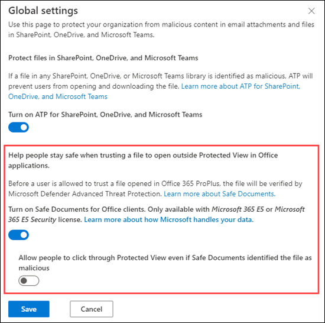

# <a name="safe-documents-in-office-365-advanced-threat-protection"></a>Documentos seguros en Protección contra amenazas avanzada de Office 365

Documentos seguros es una característica de Office 365 Advanced Threat Protection (Office 365 ATP) que usa la [protección contra amenazas avanzada de Microsoft defender](https://docs.microsoft.com/windows/security/threat-protection/microsoft-defender-atp/microsoft-defender-advanced-threat-protection) para examinar documentos y archivos que se abren en la [vista protegida](https://support.office.com/article/d6f09ac7-e6b9-4495-8e43-2bbcdbcb6653).

## <a name="what-do-you-need-to-know-before-you-begin"></a>¿Qué necesita saber antes de comenzar?

- Esta característica solo está disponible para los usuarios con la licencia de seguridad Microsoft 365 E5 o Microsoft 365 E5.

- Documentos seguros está actualmente disponible para la versión preliminar pública, disponible para los usuarios que forman parte del [programa de Office Insider](https://insider.office.com/en-us/join) en el canal mensual (dirigido), con office versión 2002 (12527,20092) o posterior. Esta característica está desactivada de forma predeterminada y el administrador de seguridad la tendrá que habilitar.

- Para conectarse a PowerShell de Exchange Online, consulte [Conectarse a PowerShell de Exchange Online](https://docs.microsoft.com/powershell/exchange/exchange-online/connect-to-exchange-online-powershell/connect-to-exchange-online-powershell). Para conectarse a PowerShell de EOP independiente, vea [Connect to Exchange Online Protection PowerShell](https://docs.microsoft.com/powershell/exchange/exchange-eop/connect-to-exchange-online-protection-powershell).

- Debe tener permisos asignados para poder llevar a cabo los procedimientos de este tema. Para habilitar y configurar documentos seguros, debe ser miembro de los grupos de funciones **Administración** de la organización o **Administrador de seguridad** . Para obtener más información acerca de los grupos de roles en el Centro de seguridad y cumplimiento, consulte [Permisos en el Centro de seguridad y cumplimiento](permissions-in-the-security-and-compliance-center.md).

## <a name="how-does-microsoft-handle-your-data"></a>¿Cómo administra Microsoft sus datos?

Para mantenerlo protegido, los documentos seguros envían archivos a la nube de [protección contra amenazas avanzada de Microsoft defender](https://docs.microsoft.com/windows/security/threat-protection/microsoft-defender-atp/microsoft-defender-advanced-threat-protection) para su análisis.

- [Aquí](https://docs.microsoft.com/windows/security/threat-protection/microsoft-defender-atp/data-storage-privacy) encontrará información sobre cómo la protección avanzada de subprocesos de Microsoft defender administra sus datos
- Además de las directrices anteriores, los archivos enviados por documentos seguros no se conservan en defender más allá del tiempo necesario para el análisis, que normalmente es inferior a 24 horas.

## <a name="use-the-security--compliance-center-to-configure-safe-documents"></a>Usar el centro de seguridad & cumplimiento para configurar documentos seguros

1. Abra el centro de seguridad & cumplimiento en <https://protection.office.com> .

2. Vaya a Directiva de **Administración de amenazas** \> **Policy** \> : **datos adjuntos seguros de ATP**.

3. En la sección **ayuda para que los usuarios sigan siendo seguros cuando confíen en un archivo para abrirse fuera de la vista protegida en las aplicaciones de Office** , configure cualquiera de las siguientes opciones:

   - **Activar documentos seguros para clientes de Office (los archivos también se enviarán a la nube de Microsoft para análisis profundos)**

   - **Permitir que los usuarios haga clic a través de la vista protegida incluso si documentos seguros identifica el archivo como malintencionado**: se recomienda no habilitar esta opción.

4. Cuando haya terminado, haga clic en **Guardar**.



### <a name="use-exchange-online-powershell-or-standalone-eop-powershell-to-configure-safe-documents"></a>Usar Exchange Online PowerShell o PowerShell independiente de EOP para configurar documentos seguros

Use la sintaxis que se muestre a continuación:

```powershell
Set-AtpPolicyForO365 -EnableSafeDocs <$true|$false> -AllowSafeDocsOpen <$true|$false>
```

- El parámetro _EnableSafeDocs_ habilita o deshabilita los documentos seguros para toda la organización.

- El parámetro _AllowSafeDocsOpen_ permite o impide que los usuarios abandonen la vista protegida (es decir, que abra el documento) si el documento se ha identificado como malintencionado.

En este ejemplo se habilitan documentos seguros para toda la organización y se impide que los usuarios abran documentos que se han identificado como malintencionados desde la vista protegida.

```powershell
Set-AtpPolicyForO365 -EnableSafeDocs $true -AllowSafeDocsOpen $false
```

Para obtener información detallada acerca de la sintaxis y los parámetros, consulte [set-AtpPolicyForO365](https://docs.microsoft.com/powershell/module/exchange/advanced-threat-protection/set-atppolicyforo365).

### <a name="how-do-i-know-this-worked"></a>¿Cómo saber si el proceso se ha completado correctamente?

Para comprobar que ha habilitado y configurado documentos seguros, siga uno de estos pasos:

- En el centro de seguridad & cumplimiento, vaya a la Directiva de **Administración de amenazas** \> **Policy** \> **datos adjuntos seguros de ATP**y compruebe que las selecciones en la sección **ayuda para que los usuarios sigan siendo seguros cuando confíen en un archivo para abrir una vista protegida externa en la sección aplicaciones de Office** .

- Ejecute el siguiente comando en Exchange Online PowerShell y compruebe los valores de propiedad:

  ```powershell
  Get-AtpPolicyForO365 | Format-List *SafeDocs*
  ```
