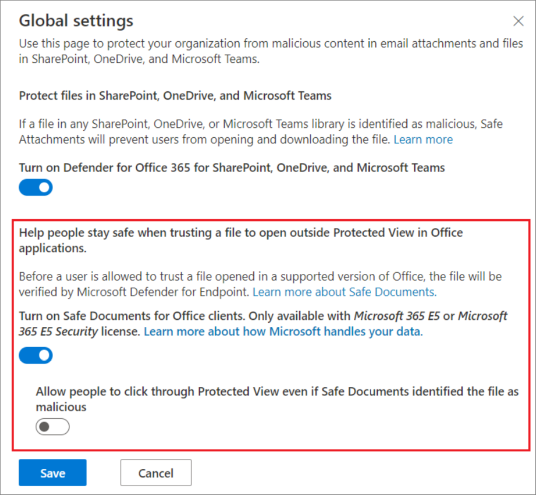

# <a name="safe-documents-in-microsoft-365-e5"></a>Documentos seguros en Microsoft 365 E5

[!INCLUDE [Microsoft 365 Defender rebranding](../includes/microsoft-defender-for-office.md)]

**Se aplica a**
- [Microsoft 365 Defender](../defender/microsoft-365-defender.md)

Caja fuerte Documents es una característica premium que usa el back-end en la [](https://support.microsoft.com/office/d6f09ac7-e6b9-4495-8e43-2bbcdbcb6653) nube de [Microsoft Defender para](/windows/security/threat-protection/microsoft-defender-atp/microsoft-defender-advanced-threat-protection) endpoint para examinar documentos abiertos Office vista protegida o Protección de aplicaciones [para Office](https://support.microsoft.com/topic/9e0fb9c2-ffad-43bf-8ba3-78f785fdba46).

Los usuarios no necesitan que Defender for Endpoint esté instalado en sus dispositivos locales para obtener la protección Caja fuerte documentos. Los usuarios Caja fuerte protección de documentos si se cumplen todos los siguientes requisitos:

- Caja fuerte Los documentos están habilitados en la organización, tal como se describe en este artículo.
- Las licencias de un plan de licencias requerido se asignan a los usuarios. Caja fuerte Los documentos están controlados por el plan de servicio **Office 365 SafeDocs** (o **SAFEDOCS** o **bf6f5520-59e3-4f82-974b-7dbbc4fd27c7**) (también conocido como servicio). Este plan de servicio está disponible en los siguientes planes de licencias (también conocidos como planes de licencia, Microsoft 365 o productos):
  - Microsoft 365 A5 para profesorado
  - Microsoft 365 A5 para estudiantes
  - Microsoft 365 E5
  - Seguridad de Microsoft 365 E5

  Caja fuerte Los documentos no se incluyen en Microsoft Defender para Office 365 de licencias.

  Para obtener más información, vea [Nombres de productos e identificadores del plan de servicio para licencias.](/azure/active-directory/enterprise-users/licensing-service-plan-reference)

- Están usando Aplicaciones Microsoft 365 para empresas (anteriormente conocida como Office 365 ProPlus) versión 2004 o posterior.

## <a name="what-do-you-need-to-know-before-you-begin"></a>¿Qué necesita saber antes de comenzar?

- Abra el portal de Microsoft 365 Defender en <https://security.microsoft.com>. Para ir directamente a la **página Caja fuerte datos adjuntos,** use <https://security.microsoft.com/safeattachmentv2> .

- Para conectarse al PowerShell de Exchange Online, consulte [Conexión a Exchange Online PowerShell](/powershell/exchange/connect-to-exchange-online-powershell).

- Necesita permisos en Exchange Online **para** poder realizar los procedimientos de este artículo:
  - Para configurar Caja fuerte documentos, debe ser miembro de los grupos de roles **Administración** de la organización o Administrador **de** seguridad.
  - Para obtener acceso de solo lectura a Caja fuerte documentos, debe ser miembro de los grupos de roles Lector **global** o Lector **de** seguridad.

  Para obtener más información, vea los [permisos en Exchange Online](/exchange/permissions-exo/permissions-exo).

  > [!NOTE]
  >
  > - Agregar usuarios al rol de Azure Active Directory correspondiente en el Centro de administración de Microsoft 365 la cual proporciona a los usuarios los permisos necesarios _y_ para otras características de Microsoft 365. Para obtener más información, vea [Sobre los roles de administrador](../../admin/add-users/about-admin-roles.md).
  >
  > - El grupo de roles **Administración de organización de solo lectura** en [Exchange Online](/Exchange/permissions-exo/permissions-exo#role-groups) también proporciona acceso de solo lectura a la característica.

### <a name="how-does-microsoft-handle-your-data"></a>¿Cómo administra Microsoft los datos?

Para mantenerte protegido, Caja fuerte documentos envía archivos a la nube de [Microsoft Defender para endpoint](/windows/security/threat-protection/microsoft-defender-atp/microsoft-defender-advanced-threat-protection) para su análisis. Los detalles sobre cómo Administra Microsoft Defender para Endpoint sus datos se pueden encontrar aquí: Microsoft Defender para el almacenamiento de datos de punto [de conexión y privacidad.](/windows/security/threat-protection/microsoft-defender-atp/data-storage-privacy)

Los archivos enviados por Caja fuerte documentos no se conservan en Defender más allá del tiempo necesario para el análisis (normalmente, menos de 24 horas).

## <a name="use-the-microsoft-365-defender-portal-to-configure-safe-documents"></a>Usar el portal Microsoft 365 Defender para configurar Caja fuerte documentos

1. Abra el portal de Microsoft 365 Defender y vaya a Correo electrónico **&** directivas de colaboración & reglas de amenazas Caja fuerte \>  \>  \> **datos adjuntos** en la **sección** Directivas.

2. En la **página Caja fuerte datos adjuntos,** haga clic en **Configuración global**.

3. En el **menú desplegable Configuración global** que aparece, configure las siguientes opciones:
   - **Activar Caja fuerte documentos** para Office clientes: mueva el botón de alternancia a la derecha para activar la característica:  .
   - **Permitir** que los usuarios haga clic en la vista protegida incluso si Caja fuerte Documents identificó el archivo como malintencionado : Se recomienda que deje esta opción desactivada (deje el botón de alternancia a la izquierda:  ).

   Cuando haya terminado, haga clic en **Guardar**.

   

### <a name="use-exchange-online-powershell-to-configure-safe-documents"></a>Usar Exchange Online PowerShell para configurar Caja fuerte documentos

Si prefiere usar PowerShell para configurar documentos Caja fuerte, use la sintaxis siguiente en Exchange Online PowerShell:

```powershell
Set-AtpPolicyForO365 -EnableSafeDocs <$true | $false> -AllowSafeDocsOpen <$true | $false>
```

- El _parámetro EnableSafeDocs habilita_ o deshabilita Caja fuerte documentos para toda la organización.
- El _parámetro AllowSafeDocsOpen_ permite o impide que los usuarios abandonen la vista protegida (es decir, abrir el documento) si el documento se ha identificado como malintencionado.

En este ejemplo se Caja fuerte documentos para toda la organización e impide que los usuarios abran documentos que se hayan identificado como malintencionados desde la vista protegida.

```powershell
Set-AtpPolicyForO365 -EnableSafeDocs $true -AllowSafeDocsOpen $false
```

Para obtener información detallada sobre la sintaxis y los parámetros, [vea Set-AtpPolicyForO365](/powershell/module/exchange/set-atppolicyforo365).

### <a name="configure-individual-access-to-safe-documents"></a>Configurar el acceso individual a Caja fuerte documentos

Si desea permitir o bloquear selectivamente el acceso a la característica Caja fuerte documentos, siga estos pasos:

1. Active documentos Caja fuerte en el portal de Microsoft 365 Defender o Exchange Online PowerShell como se describe anteriormente en este artículo.
2. Use Azure AD PowerShell para deshabilitar documentos Caja fuerte para usuarios específicos, como se describe en Deshabilitar servicios de Microsoft 365 específicos para usuarios específicos para [un plan de licencias específico.](/microsoft-365/enterprise/disable-access-to-services-with-microsoft-365-powershell#disable-specific-microsoft-365-services-for-specific-users-for-a-specific-licensing-plan)

  El nombre del plan de servicio que se va a deshabilitar en PowerShell es **SAFEDOCS**.

Para obtener más información, consulte los siguientes temas:

- [Ver Microsoft 365 licencias y servicios con PowerShell](/microsoft-365/enterprise/view-licenses-and-services-with-microsoft-365-powershell)
- [Ver Microsoft 365 licencia de cuenta y detalles de servicio con PowerShell](/microsoft-365/enterprise/view-account-license-and-service-details-with-microsoft-365-powershell)
- [Nombres de productos e identificadores de planes de servicio para licencias](/azure/active-directory/enterprise-users/licensing-service-plan-reference)

### <a name="onboard-to-the-microsoft-defender-for-endpoint-service-to-enable-auditing-capabilities"></a>Incorporación al servicio Microsoft Defender para endpoints para habilitar las capacidades de auditoría

Para habilitar las capacidades de auditoría, el dispositivo local debe tener instalado Microsoft Defender para endpoint. Para implementar Microsoft Defender para endpoint, debe pasar por las distintas fases de implementación. Después de la incorporación, puede configurar las capacidades de auditoría en el portal de Microsoft 365 Defender auditoría.

Para obtener más información, [vea Onboard to the Microsoft Defender for Endpoint service](/microsoft-365/security/defender-endpoint/onboarding). Si necesita ayuda adicional, consulte [Troubleshoot Microsoft Defender for Endpoint onboarding issues](/microsoft-365/security/defender-endpoint/troubleshoot-onboarding).

### <a name="how-do-i-know-this-worked"></a>¿Cómo saber si el proceso se ha completado correctamente?

Para comprobar que ha habilitado y configurado documentos Caja fuerte documentos, siga estos pasos:

- En el portal de Microsoft 365 Defender,  vaya a Directivas de colaboración de & correo electrónico & Reglas directivas de amenazas \>  \>  \> **Caja fuerte Datos**  \>  **adjuntos**  en la sección Directivas Configuración global y compruebe la opción Activar documentos de Caja fuerte para clientes de Office y Permitir que los usuarios puedan hacer clic en la vista protegida incluso si Caja fuerte Documents identifica el archivo como una configuración malintencionada.

- Ejecute el siguiente comando en Exchange Online PowerShell y compruebe los valores de la propiedad:

  ```powershell
  Get-AtpPolicyForO365 | Format-List *SafeDocs*
  ```

- Los siguientes archivos están disponibles para probar la protección Caja fuerte documentos. Estos archivos son similares al archivo EICAR.TXT para probar soluciones antivirus y antimalware. Los archivos no son dañinos, pero desencadenarán la protección Caja fuerte documentos.

  - [SafeDocsDemo.docx](https://github.com/MicrosoftDocs/microsoft-365-docs/raw/public/microsoft-365/downloads/SafeDocsDemo.docx)
  - [SafeDocsDemo.pptx](https://github.com/MicrosoftDocs/microsoft-365-docs/raw/public/microsoft-365/downloads/SafeDocsDemo.pptx)
  - [SafeDocsDemo.xlsx](https://github.com/MicrosoftDocs/microsoft-365-docs/raw/public/microsoft-365/downloads/SafeDocsDemo.xlsx)
