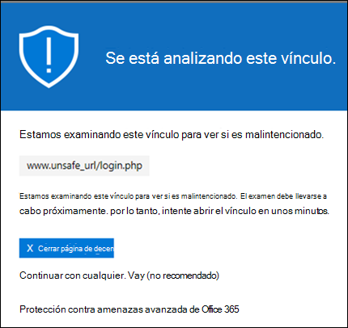
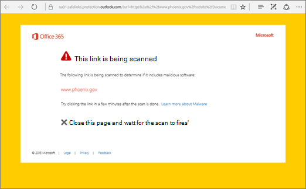
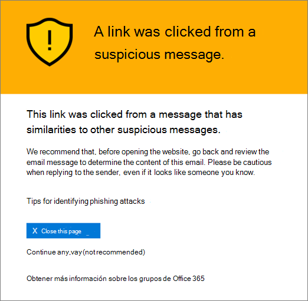
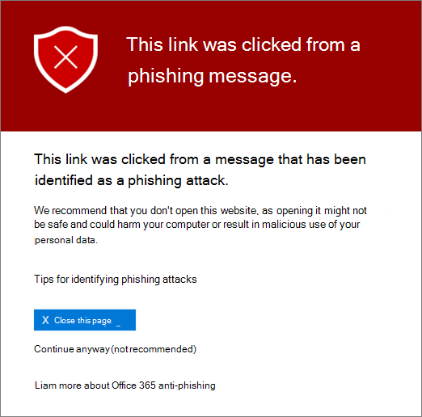
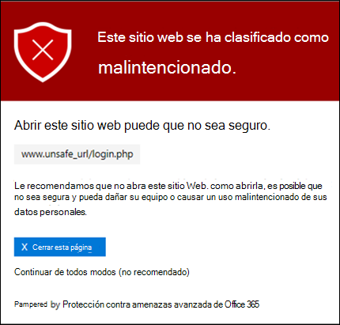
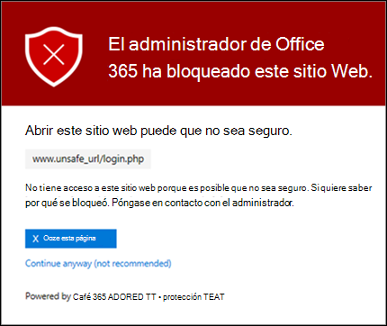
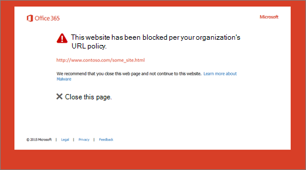
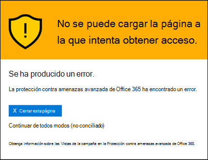
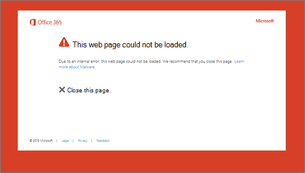

# Caja fuerte Vínculos en Microsoft Defender para Office 365

[!INCLUDE [Microsoft 365 Defender rebranding](../includes/microsoft-defender-for-office.md)]

**Se aplica a**
- [Plan 1 y Plan 2 de Microsoft Defender para Office 365](defender-for-office-365.md)
- [Microsoft 365 Defender](../defender/microsoft-365-defender.md)

> [!IMPORTANT]
> Este artículo está destinado a los clientes empresariales que tienen [Microsoft Defender para Office 365](defender-for-office-365.md). Si usa Outlook.com, Microsoft 365 Familia o Microsoft 365 Personal, y está buscando información sobre safelinks en Outlook, vea [Seguridad avanzada de Outlook.com](https://support.microsoft.com/office/882d2243-eab9-4545-a58a-b36fee4a46e2).

Caja fuerte Los vínculos son una característica de [Defender para Office 365](defender-for-office-365.md) que proporciona análisis y reescritura de mensajes de correo electrónico entrantes en el flujo de correo, y comprobación con tiempo de clic de direcciones URL y vínculos en mensajes de correo electrónico y otras ubicaciones. Caja fuerte El examen de vínculos se produce además de la protección contra correo no deseado y [antimalware](anti-spam-and-anti-malware-protection.md) normal en los mensajes de correo electrónico entrantes Exchange Online Protection (EOP). Caja fuerte El examen de vínculos puede ayudar a proteger su organización de vínculos malintencionados que se usan en la suplantación de identidad (phishing) y otros ataques.

Caja fuerte La protección de vínculos está disponible en las siguientes ubicaciones:

- **Mensajes de correo** electrónico: Caja fuerte protección de vínculos para vínculos en mensajes de correo electrónico está controlada por Caja fuerte de vínculos. No hay ninguna directiva Caja fuerte links predeterminada, por lo que para obtener la protección de los vínculos de Caja fuerte en los mensajes de correo electrónico, debe crear una o más directivas de vínculos de **Caja fuerte.** Para obtener instrucciones, vea [Configurar directivas Caja fuerte vínculos en Microsoft Defender para Office 365](set-up-safe-links-policies.md).

  Para obtener más información acerca de Caja fuerte de vínculos para mensajes de correo electrónico, vea la sección Caja fuerte [configuración](#safe-links-settings-for-email-messages) de vínculos para mensajes de correo electrónico más adelante en este artículo.

- **Microsoft Teams** (actualmente en vista previa de TAP): la protección de vínculos de Caja fuerte para vínculos en conversaciones Teams, chats de grupo o desde canales también está controlada por las directivas de vínculos de Caja fuerte. No hay ninguna directiva Caja fuerte links predeterminada, por lo que para obtener la protección de los vínculos de Caja fuerte en **Teams,** debe crear una o más directivas de vínculos Caja fuerte .

  Para obtener más información sobre Caja fuerte de vínculos en Teams, vea la sección Caja fuerte [configuración](#safe-links-settings-for-microsoft-teams) de vínculos de Microsoft Teams para Microsoft Teams más adelante en este artículo.

- **Office 365:** la protección Caja fuerte vínculos para aplicaciones Office 365 está disponible en aplicaciones de escritorio, móviles y web compatibles. Configurar **la** protección Caja fuerte vínculos para Office 365 aplicaciones en la  configuración global que están fuera de Caja fuerte de vínculos. Para obtener instrucciones, consulte [Configure global settings for Caja fuerte Links settings in Microsoft Defender for Office 365](configure-global-settings-for-safe-links.md).

  Caja fuerte La protección de vínculos para Office 365 aplicaciones se aplica a todos los usuarios de la organización con licencia para Defender para Office 365, independientemente de si los usuarios se incluyen en directivas de vínculos de Caja fuerte activas o no.

  Para obtener más información acerca de Caja fuerte protección de vínculos en Office 365 aplicaciones, consulta la sección Caja fuerte [configuración](#safe-links-settings-for-office-365-apps) de vínculos de Office 365 aplicaciones más adelante en este artículo.

En este artículo se incluyen descripciones detalladas de los siguientes tipos de Caja fuerte de vínculos:

- **Configuración en Caja fuerte de** vínculos: esta configuración se aplica solo a los usuarios que se incluyen en las directivas específicas y la configuración puede ser diferente entre directivas. Estas opciones incluyen:

  - [Caja fuerte Configuración de vínculos para mensajes de correo electrónico](#safe-links-settings-for-email-messages)
  - [Caja fuerte Configuración de vínculos para Microsoft Teams](#safe-links-settings-for-microsoft-teams)
  - ["No reescribir las siguientes direcciones URL" en las directivas Caja fuerte vínculos](#do-not-rewrite-the-following-urls-lists-in-safe-links-policies)

- **Configuración Caja fuerte vínculos** globales: esta configuración se configura globalmente, no en Caja fuerte de vínculos. Sin embargo, la configuración solo se aplica a los usuarios incluidos en las directivas de vínculos Caja fuerte activas. Estas opciones incluyen:

  - [Caja fuerte Configuración de vínculos para Office 365 aplicaciones](#safe-links-settings-for-office-365-apps)
  - [Lista "Bloquear las siguientes direcciones URL" para Caja fuerte vínculos](#block-the-following-urls-list-for-safe-links)

En la tabla siguiente se describen escenarios para vínculos de Caja fuerte en organizaciones de Microsoft 365 y Office 365 que incluyen Defender para Office 365 (es decir, la falta de licencias nunca es un problema en los ejemplos).

 

****

|Escenario|Resultado|
|---|---|
|Juan es miembro del departamento de marketing. Caja fuerte La protección de vínculos para Office 365 aplicaciones está activada en la configuración global de vínculos de Caja fuerte y existe una directiva de vínculos de Caja fuerte que se aplica a los miembros del departamento de marketing. Juan abre una PowerPoint en un mensaje de correo electrónico y, a continuación, hace clic en una dirección URL de la presentación.|Jean está protegido por Caja fuerte links. 
 Juan se incluye en una directiva Caja fuerte vínculos y Caja fuerte protección de vínculos para Office 365 aplicaciones está activada. 
 Para obtener más información acerca de los requisitos para la protección de vínculos de Caja fuerte en aplicaciones de Office 365, consulta la sección Caja fuerte Configuración de vínculos de [Office 365](#safe-links-settings-for-office-365-apps) aplicaciones más adelante en este artículo.|
|La organización de Microsoft 365 E5 chris no tiene Caja fuerte de vínculos configurados. Chris recibe un correo electrónico de un remitente externo que contiene una dirección URL a un sitio web malintencionado en el que, en última instancia, hace clic.|Chris no está protegido por Caja fuerte links. 
 Un administrador debe crear al menos una directiva de vínculos Caja fuerte para que cualquier persona pueda obtener Caja fuerte de vínculos en los mensajes de correo electrónico entrantes. Chris debe incluirse en las condiciones de la directiva para obtener la Caja fuerte de vínculos.|
|En la organización de Pat, ningún administrador ha creado directivas de vínculos Caja fuerte, pero Caja fuerte protección de vínculos para Office 365 aplicaciones está activada. Pat abre un documento de Word y hace clic en una dirección URL del archivo.|Pat no está protegido por Caja fuerte links. 
 Aunque Caja fuerte la protección de vínculos de Office 365 para aplicaciones de Office 365 está activada globalmente, Pat no se incluye en ninguna de las directivas de vínculos de Caja fuerte activas, por lo que no se puede aplicar la protección.|
|En la organización de Lee, se configura en la lista Bloquear las siguientes direcciones URL en la configuración global de `https://tailspintoys.com` Caja fuerte vínculos.  Ya existe Caja fuerte de vínculos que incluye Lee. Lee recibe un mensaje de correo electrónico que contiene la dirección URL `https://tailspintoys.com/aboutus/trythispage` . Lee hace clic en la dirección URL.|Es posible que la dirección URL se bloquee automáticamente para Lee; depende de la entrada url de la lista y del cliente de correo electrónico que Lee usó. Para obtener más información, vea la sección "Bloquear las siguientes direcciones URL" para [Caja fuerte vínculos más](#block-the-following-urls-list-for-safe-links) adelante en este artículo.|
|Tanto Jamie como Julia trabajan para contoso.com. Hace mucho tiempo, los administradores configuraron Caja fuerte de vínculos que se aplican tanto a Jamie como a Julia. Jamie envía un correo electrónico a Julia, sin saber que el correo electrónico contiene una dirección URL malintencionada.|Julia está protegida por Caja fuerte **links** si la directiva de vínculos de Caja fuerte que se aplica a ella está configurada para aplicarse a los mensajes entre destinatarios internos. Para obtener más información, vea la sección [Caja fuerte configuración de vínculos para](#safe-links-settings-for-email-messages) mensajes de correo electrónico más adelante en este artículo.|
|

## Caja fuerte Configuración de vínculos para mensajes de correo electrónico

Caja fuerte Los vínculos examinan el correo electrónico entrante en busca de hipervínculos malintencionados conocidos. Las direcciones URL escaneadas se reescritan con el prefijo de dirección URL estándar de Microsoft: `https://nam01.safelinks.protection.outlook.com` . Una vez reescrito el vínculo, se analiza para buscar contenido potencialmente malintencionado.

Después Caja fuerte los vínculos vuelve a escribir una dirección URL, la  dirección URL permanece reescrita incluso si el mensaje se reenvía manualmente o se responde a (tanto a destinatarios internos como externos). Los vínculos adicionales que se agregan al mensaje reenviado o respondido a él no se reescriben. Sin embargo, en  el caso del reenvío automático por las reglas de la Bandeja de entrada o el  reenvío SMTP, la dirección URL no se reescribirá en el mensaje destinado al destinatario final a menos que ese destinatario también esté protegido por vínculos de Caja fuerte o que la dirección URL ya se haya reescrito en una comunicación anterior. 

La configuración de las Caja fuerte de vínculos que se aplican a los mensajes de correo electrónico se describen en la siguiente lista:

- **Seleccione la acción para direcciones** URL potencialmente malintencionadas desconocidas en mensajes: habilita o deshabilita el examen de Caja fuerte vínculos en mensajes de correo electrónico. El valor recomendado es **On**. Activar esta configuración da como resultado las siguientes acciones.

  - Caja fuerte El examen de vínculos está Outlook (C2R) en Windows.
  - Las direcciones URL se reescribián y los usuarios se enrutan Caja fuerte protección de vínculos cuando hacen clic en direcciones URL en los mensajes.
  - Cuando se hace clic, las direcciones URL se comprueban en una lista de direcciones URL malintencionadas conocidas y en la lista ["Bloquear las siguientes direcciones URL".](#block-the-following-urls-list-for-safe-links)
  - Las direcciones URL que no tienen una reputación válida se detonan de forma asincrónica en segundo plano.

- **Aplicar análisis** de direcciones URL en tiempo real en busca de vínculos sospechosos y vínculos que apunten a archivos: habilita el examen en tiempo real de vínculos, incluidos los vínculos en mensajes de correo electrónico que apuntan a contenido descargable. El valor recomendado está habilitado.

  - **Espere a que se complete el examen de direcciones URL antes de entregar el mensaje:**

    - Habilitado: los mensajes que contienen direcciones URL se mantienen hasta que finaliza el examen. Los mensajes se entregan solo después de confirmar que las direcciones URL son seguras. Este es el valor recomendado.
    - Deshabilitado: si el examen de direcciones URL no se puede completar, entregue el mensaje de todos modos.

- **Aplicar Caja fuerte vínculos** a mensajes de correo electrónico enviados dentro de la organización: habilita o deshabilita el examen de vínculos de Caja fuerte en mensajes enviados entre remitentes internos y destinatarios internos dentro de la misma Exchange Online organización. El valor recomendado está habilitado.

- **No realizar un seguimiento de los clics del usuario:** habilita o deshabilita el almacenamiento de los Caja fuerte clics de vínculos para las direcciones URL que se hacen clic en los mensajes de correo electrónico. El valor recomendado es dejar esta configuración sin elegir (para realizar un seguimiento de los clics del usuario).

  Actualmente no se admite el seguimiento de clics en url para vínculos en mensajes de correo electrónico enviados entre remitentes internos y destinatarios internos.

- **No permitir que los usuarios hagan clic en la dirección URL original:** permite o bloquea que los usuarios hagan clic en la página [de advertencia](#warning-pages-from-safe-links) a la dirección URL original. El valor recomendado está habilitado.

- **Mostrar la personal de marca de la organización en las páginas de notificación** y advertencia: esta opción muestra la personalizado de marca de la organización en las páginas de advertencia. La personalidad de marca ayuda a los usuarios a identificar advertencias legítimas, ya que los atacantes suelen usar las páginas de advertencia predeterminadas de Microsoft. Para obtener más información acerca de la personalización de marca personalizada, [vea Customize the Microsoft 365 theme for your organization](../../admin/setup/customize-your-organization-theme.md).

- **No vuelva a escribir las siguientes direcciones URL:** deja las direcciones URL tal como están. Mantiene una lista personalizada de direcciones URL seguras que no necesitan análisis. La lista es única para cada directiva Caja fuerte vínculos. Para obtener más información sobre la lista No **volver** a escribir las siguientes direcciones URL, vea la sección "No reescribir las siguientes direcciones [URL"](#do-not-rewrite-the-following-urls-lists-in-safe-links-policies) en la sección directivas de vínculos de Caja fuerte más adelante en este artículo.

  Para obtener más información acerca de los valores recomendados para la configuración de directivas estándar y estricta para las directivas Caja fuerte vínculos, vea Caja fuerte configuración de directiva [vínculos](recommended-settings-for-eop-and-office365.md#safe-links-policy-settings).

- **Filtros de destinatarios:** debe especificar las condiciones de destinatario y las excepciones que determinan a quién se aplica la directiva. Puede usar estas propiedades para condiciones y excepciones:

  - **El destinatario es**
  - **El dominio de destinatario es**
  - **El destinatario es un miembro de**

  Solo puede usar una condición o excepción una vez, pero la condición o excepción puede contener varios valores. Varios valores de una misma condición o excepción usan la lógica OR (por ejemplo, _\<recipient1\>_ o _\<recipient2\>_). Condiciones o excepciones diversas usan la lógica AND (por ejemplo, _\<recipient1\>_ y _\<member of group 1\>_).

- **Prioridad:** si crea varias directivas, puede especificar el orden en que se aplican. Ninguna de las dos directivas puede tener la misma prioridad, y el procesamiento de directivas se detendrá cuando se aplique la primera directiva.

  Para obtener más información sobre el orden de prioridad y cómo se evalúan y aplican las distintas directivas, consulte [Orden y prioridad de la protección de correo electrónico](how-policies-and-protections-are-combined.md).

### Cómo Caja fuerte links en mensajes de correo electrónico

En un nivel alto, aquí se muestra cómo funciona la protección Caja fuerte vínculos en las direcciones URL de los mensajes de correo electrónico:

1. Todo el correo electrónico pasa por EOP, donde el protocolo de Internet (IP) y los filtros de sobre, la protección contra malware basado en firmas, los filtros contra correo no deseado y antimalware antes de entregar el mensaje al buzón del destinatario.

2. El usuario abre el mensaje en su buzón y hace clic en una dirección URL del mensaje.

3. Caja fuerte Los vínculos comprueban inmediatamente la dirección URL antes de abrir el sitio web:

   - Si la dirección URL se incluye en la lista **Bloquear las siguientes direcciones URL,** se abrirá una advertencia de dirección [URL](#blocked-url-warning) bloqueada.

   - Si la dirección URL apunta a un sitio  web que se ha determinado que es malintencionado, se abrirá una página de advertencia de sitio web malintencionado (o una página de advertencia diferente).

   - Si la dirección URL apunta a un archivo descargable y la opción Aplicar análisis de url en tiempo **real** en busca de vínculos sospechosos y vínculos que apunten a archivos está habilitada en la directiva que se aplica al usuario, se comprueba el archivo descargable.

   - Si se determina que la dirección URL es segura, se abrirá el sitio web.

## Caja fuerte Configuración de vínculos para Microsoft Teams

> [!IMPORTANT]
> A partir de marzo de 2020, esta característica está en versión preliminar y solo está disponible para los miembros de la Microsoft Teams Programa de adopción de tecnología (TAP). Para obtener información acerca de la programación de lanzamiento, consulte el [mapa Microsoft 365 ruta de trabajo](https://www.microsoft.com/microsoft-365/roadmap?rtc=1&filters=&searchterms=Safe%2CLinks%2CProtection%2Cfor%2CMicrosoft%2CTeams).

Puede habilitar o deshabilitar la protección Caja fuerte vínculos para Microsoft Teams en Caja fuerte de vínculos. En concreto, se usa la opción Seleccionar la acción para direcciones URL desconocidas o potencialmente malintencionadas **dentro Microsoft Teams** configuración. El valor recomendado es **On**.

La siguiente configuración en Caja fuerte de vínculos que se aplican a los vínculos de los mensajes de correo electrónico también se aplican a los vínculos de Teams:

- **Aplicar análisis de url en tiempo real en busca de vínculos sospechosos y vínculos que apunten a archivos**
- **No realizar un seguimiento de los clics del usuario**
- **No permitir que los usuarios hagan clic en la dirección URL original**

Esta configuración se explica anteriormente en la configuración [Caja fuerte vínculos para mensajes de correo electrónico](#safe-links-settings-for-email-messages).

Después de activar la protección de vínculos de Caja fuerte para Microsoft Teams, las direcciones URL de Teams se comprueban en una lista de vínculos malintencionados conocidos cuando el usuario protegido hace clic en el vínculo (protección con tiempo de clic). Las direcciones URL no se reescritan. Si se encuentra que un vínculo es malintencionado, los usuarios tendrán las siguientes experiencias:

- Si se hizo clic en el vínculo en una conversación de Teams, chat en grupo o desde canales, la página de advertencia como se muestra en la captura de pantalla siguiente aparecerá en el explorador web predeterminado.
- Si se hizo clic en el vínculo desde una pestaña anclada, la página de advertencia aparecerá en la Teams de la pestaña. La opción para abrir el vínculo en un explorador web está deshabilitada por motivos de seguridad.
- Dependiendo de cómo se configure la configuración No permitir que los usuarios hagan clic en la **dirección URL original** de la directiva, el usuario podrá o no podrá hacer clic en la dirección URL original ( Continuar de todos modos **(no recomendado)** en la captura de pantalla). Se recomienda habilitar la configuración No permitir que los usuarios hagan clic en la **dirección URL original** para que los usuarios no puedan hacer clic en la dirección URL original.

Si el usuario que envió el vínculo no está incluido en una directiva de vínculos de Caja fuerte donde está habilitada la protección de Teams, el usuario puede hacer clic en la dirección URL original de su equipo o dispositivo.

Al hacer **clic en el botón** Volver de la página de advertencia, el usuario volverá a su contexto o ubicación URL original. Sin embargo, al volver a hacer clic en el vínculo original, Caja fuerte vínculos volverán a examinar la dirección URL, por lo que la página de advertencia volverá a aparecer.

### Cómo Caja fuerte links en Teams

En un nivel alto, aquí se muestra cómo funciona la protección Caja fuerte vínculos para direcciones URL en Microsoft Teams:

1. Un usuario inicia la Teams aplicación.

2. Microsoft 365 comprueba que la organización del usuario incluye Microsoft Defender para Office 365 y que el usuario se incluye en una directiva de vínculos de Caja fuerte activa en la que la protección de Microsoft Teams está habilitada.

3. Las direcciones URL se validan al hacer clic para el usuario en chats, chats de grupo, canales y pestañas.

## Caja fuerte Configuración de vínculos para Office 365 aplicaciones

Caja fuerte La protección de vínculos para Office 365 aplicaciones comprueba vínculos en documentos de Office, no vínculos en mensajes de correo electrónico (pero puede comprobar vínculos en documentos Office adjuntos en mensajes de correo electrónico después de abrir el documento).

Caja fuerte La protección de vínculos Office 365 aplicaciones tiene los siguientes requisitos de cliente:

- Aplicaciones Microsoft 365 o Microsoft 365 Empresa Premium.
  - Las versiones actuales de Word, Excel y PowerPoint en Windows, Mac o en un explorador web.
  - Office aplicaciones en dispositivos iOS o Android.
  - Visio en Windows.
  - OneNote en un explorador web.

- Office 365 están configuradas para usar la autenticación moderna. Para obtener más información, vea How [modern authentication works for Office 2013, Office 2016 y Office 2019 client apps](../../enterprise/modern-auth-for-office-2013-and-2016.md).

- Los usuarios han iniciado sesión con sus cuentas laborales o educativas. Para obtener más información, vea [Iniciar sesión en Office](https://support.microsoft.com/office/b9582171-fd1f-4284-9846-bdd72bb28426).

Puede configurar la protección Caja fuerte vínculos para Office 365 aplicaciones en la configuración global de Caja fuerte vínculos, no en las directivas Caja fuerte vínculos. La protección se aplica a todos los usuarios de la organización que tienen licencia para Defender para Office 365, independientemente de si los usuarios se incluyen en directivas de vínculos de Caja fuerte activas o no.

La siguiente Caja fuerte de vínculos está disponible para Office 365 aplicaciones:

- **Office 365:** habilita o deshabilita el examen de Caja fuerte vínculos en aplicaciones Office 365 compatibles. El valor predeterminado y recomendado es **On**.

- No realice un seguimiento cuando los usuarios hagan clic en vínculos de **Caja fuerte:** habilita o deshabilita el almacenamiento de datos de clic de vínculos de Caja fuerte para las direcciones URL que se han hecho clic en las versiones de escritorio Word, Excel, PowerPoint y Visio. El valor recomendado es **Off**, lo que significa que se realiza un seguimiento de los clics del usuario.

- No permitir que los usuarios hagan clic en vínculos seguros  a la **dirección URL original:** permite o impide que los usuarios hagan clic en la página de advertencia a la dirección URL original en las versiones de escritorio Word, Excel, PowerPoint y Visio. El valor predeterminado y recomendado es **On**.

Para configurar la configuración Caja fuerte vínculos para Office 365 aplicaciones, consulta Configurar la protección de Caja fuerte [vínculos para Office 365 aplicaciones](configure-global-settings-for-safe-links.md#configure-safe-links-protection-for-office-365-apps-in-the-security--compliance-center).

Para obtener más información acerca de los valores recomendados para la configuración de directivas estándar y estricta, vea [Configuración global para Caja fuerte vínculos](recommended-settings-for-eop-and-office365.md#global-settings-for-safe-links).

### Cómo Caja fuerte links funciona en Office 365 aplicaciones

En un nivel alto, aquí se muestra cómo funciona la protección Caja fuerte vínculos para direcciones URL en Office 365 aplicaciones. Las aplicaciones Office 365 compatibles se describen en la sección anterior.

1. Un usuario inicia sesión en el uso de su cuenta laboral o educativa en una organización que incluye Aplicaciones Microsoft 365 o Microsoft 365 Empresa Premium.

2. El usuario abre y hace clic en un vínculo de un Office en un documento Aplicación de Office.

3. Caja fuerte Los vínculos comprueban inmediatamente la dirección URL antes de abrir el sitio web de destino:

   - Si la dirección URL se incluye en la lista que  omite el examen de vínculos Caja fuerte (la lista Bloquear las siguientes direcciones URL) se abrirá una página de advertencia de [dirección URL](#blocked-url-warning) bloqueada.

   - Si la dirección URL apunta a un sitio  web que se ha determinado que es malintencionado, se abrirá una página de advertencia de sitio web malintencionado (o una página de advertencia diferente).

   - Si la dirección URL apunta a un archivo descargable y la directiva de vínculos de Caja fuerte que se aplica al usuario está configurada para examinar vínculos a contenido descargable ( Aplicar análisis de url en tiempo **real** en busca de vínculos sospechosos y vínculos que apunten a archivos), se comprueba el archivo descargable.

   - Si la dirección URL se considera segura, el usuario se traslada al sitio web.

   - Si Caja fuerte el examen de vínculos no se puede completar, Caja fuerte protección de vínculos no se desencadena. En Office de escritorio, se advertirá al usuario antes de continuar con el sitio web de destino.

> [!NOTE]
> Puede tardar varios segundos al principio de cada sesión para comprobar que el usuario tiene Caja fuerte vínculos para Office habilitado.

## Lista "Bloquear las siguientes direcciones URL" para Caja fuerte vínculos

La **lista Bloquear las siguientes direcciones URL** define los vínculos que siempre están bloqueados por Caja fuerte análisis de vínculos en las siguientes ubicaciones:

- Mensajes de correo electrónico
- Documentos en Office 365 aplicaciones en Windows y Mac.
- Documentos en Office para iOS y Android.

Cuando un usuario de una directiva de vínculos Caja fuerte activa hace clic en un vínculo bloqueado en una aplicación compatible, se le traslada a la página de advertencia url [bloqueada.](#blocked-url-warning)

La lista de direcciones URL se configura en la configuración global de Caja fuerte vínculos. Para obtener instrucciones, [vea Configure the "Block the following URLs" list](configure-global-settings-for-safe-links.md#configure-the-block-the-following-urls-list-in-the-security--compliance-center).

> [!NOTE]
> 
> - Para obtener una lista realmente universal de direcciones URL bloqueadas en todas partes, vea [Manage the Tenant Allow/Block List](tenant-allow-block-list.md).
> 
> - Límites:
>   - El número máximo de entradas es 500.
>   - La longitud máxima de una entrada es de 128 caracteres.
>   - Todas las entradas no pueden superar los 10.000 caracteres.
> 
> - No incluya una barra diagonal ( `/` ) al final de la dirección URL. Por ejemplo, use `https://www.contoso.com` , no `https://www.contoso.com/` .
> 
> - Una dirección URL de solo dominio (por ejemplo `contoso.com` o `tailspintoys.com` ) bloqueará cualquier dirección URL que contenga el dominio.
> 
> - Puede bloquear un subdominio sin bloquear el dominio completo. Por ejemplo, `toys.contoso.com*` bloquea cualquier dirección URL que contenga el subdominio, pero no bloquea las direcciones URL que contienen el dominio completo `contoso.com` .
> 
> - Puede incluir hasta tres caracteres comodín ( `*` ) por entrada de dirección URL.

### Sintaxis de entrada para la lista "Bloquear las siguientes direcciones URL"

En la tabla siguiente se describen ejemplos de los valores que puede especificar y sus resultados:

****

|Valor|Resultado|
|---|---|
|`contoso.com` 
 o 
 `*contoso.com*`|Bloquea el dominio, los subdominios y las rutas de acceso. Por ejemplo, `https://www.contoso.com` , `https://sub.contoso.com` y se `https://contoso.com/abc` bloquean.|
|`https://contoso.com/a`|Bloques `https://contoso.com/a` pero no subpaths adicionales como `https://contoso.com/a/b` .|
|`https://contoso.com/a*`|Bloques `https://contoso.com/a` y subpaths adicionales como `https://contoso.com/a/b` .|
|`https://toys.contoso.com*`|Bloquea un subdominio ( en este ejemplo), pero permite hacer clic en otras direcciones URL de `toys` dominio (como o `https://contoso.com` `https://home.contoso.com` ).|
|

## "No reescribir las siguientes direcciones URL" en las directivas Caja fuerte vínculos

> [!NOTE]
> Si su organización usa directivas Caja fuerte vínculos, las listas No volver a escribir las siguientes listas de direcciones **URL** son el único método admitido para pruebas de suplantación de identidad de terceros.

Cada directiva Caja fuerte links contiene una lista Do **not rewrite the following URLs** que puede usar para especificar direcciones URL que no se reescriban mediante el examen de vínculos Caja fuerte. En otras palabras, la lista permite a los usuarios incluidos en la directiva obtener acceso a las direcciones URL especificadas que, de lo contrario, se bloquearían mediante Caja fuerte vínculos. Puede configurar diferentes listas en diferentes directivas Caja fuerte vínculos. El procesamiento de directivas se detiene después de que se aplique la primera directiva (probablemente, la prioridad más alta) al usuario. Por lo tanto, solo se aplica una no **reescritura** de la siguiente lista de direcciones URL a un usuario que se incluye en varias directivas de vínculos Caja fuerte activas.

Para agregar entradas a la lista en directivas de vínculos de Caja fuerte nuevas o existentes, vea [Create Caja fuerte Links policies](set-up-safe-links-policies.md#use-the-security--compliance-center-to-create-safe-links-policies) o Modify Caja fuerte Links [policies](set-up-safe-links-policies.md#use-the-security--compliance-center-to-modify-safe-links-policies).

> [!NOTE]
> 
> - Los siguientes clientes no reconocen las siguientes listas de **direcciones URL** en Caja fuerte de vínculos. Se puede bloquear el acceso a las direcciones URL de los usuarios incluidos en las policías en función de los resultados de la detección de vínculos Caja fuerte en estos clientes:
> 
>   - Microsoft Teams
>   - Office web
> 
>   Para obtener una lista realmente universal de direcciones URL permitidas en todas partes, vea [Manage the Tenant Allow/Block List](tenant-allow-block-list.md).
> 
> - Considere la posibilidad de agregar direcciones URL internas usadas habitualmente a la lista para mejorar la experiencia del usuario. Por ejemplo, si tiene servicios locales, como Skype Empresarial o SharePoint, puede agregar esas direcciones URL para excluirlas del examen.
> 
> - Si ya tiene **No volver** a escribir las siguientes entradas de direcciones URL en las directivas de vínculos de Caja fuerte, asegúrese de revisar las listas y agregar caracteres comodín según sea necesario. Por ejemplo, la lista tiene una entrada como y más adelante decide incluir `https://contoso.com/a` subpaths como `https://contoso.com/a/b` . En lugar de agregar una nueva entrada, agregue un comodín a la entrada existente para que se convierta en `https://contoso.com/a/*` .
> 
> - Puede incluir hasta tres caracteres comodín ( `*` ) por entrada de dirección URL. Los caracteres comodín incluyen explícitamente prefijos o subdominios. Por ejemplo, la entrada no es la misma que , porque permite a los usuarios visitar subdominios y rutas de acceso `contoso.com` `*.contoso.com/*` en el dominio `*.contoso.com/*` especificado.

### Sintaxis de entrada para la lista "No volver a escribir las siguientes direcciones URL"

En la tabla siguiente se describen ejemplos de los valores que puede especificar y sus resultados:

****

|Valor|Resultado|
|---|---|
|`contoso.com`|Permite el acceso a `https://contoso.com` subdominios o rutas de acceso, pero no a ella.|
|`*.contoso.com/*`|Permite el acceso a un dominio, subdominios y rutas de acceso (por ejemplo, `https://www.contoso.com` , `https://www.contoso.com` , o `https://maps.contoso.com` `https://www.contoso.com/a` ). 
 Esta entrada es intrínsecamente mejor que , porque no permite sitios `*contoso.com*` potencialmente fraudulentos, como `https://www.falsecontoso.com` o `https://www.false.contoso.completelyfalse.com`|
|`https://contoso.com/a`|Permite el acceso `https://contoso.com/a` a , pero no a subpaths como `https://contoso.com/a/b`|
|`https://contoso.com/a/*`|Permite el acceso a `https://contoso.com/a` y subpaths como `https://contoso.com/a/b`|
|

## Páginas de advertencia de Caja fuerte vínculos

Esta sección contiene ejemplos de las distintas páginas de advertencia que desencadena la protección Caja fuerte vínculos al hacer clic en una dirección URL.

Tenga en cuenta que se han actualizado varias páginas de advertencia. Si aún no ve las páginas actualizadas, lo hará pronto. Las páginas actualizadas incluyen una nueva combinación de colores, más detalles y la capacidad de continuar con un sitio a pesar de las advertencias y recomendaciones dadas.

### Notificación de examen en curso

La dirección URL en la que se ha hecho clic está siendo examinada Caja fuerte vínculos. Es posible que deba esperar unos instantes antes de volver a intentar el vínculo.

La página de notificación original tenía este aspecto:

### Advertencia de mensaje sospechoso

La dirección URL en la que se hizo clic estaba en un mensaje de correo electrónico que es similar a otros mensajes sospechosos. Se recomienda comprobar dos veces el mensaje de correo electrónico antes de continuar con el sitio.

### Advertencia de intento de suplantación de identidad

La dirección URL en la que se hizo clic estaba en un mensaje de correo electrónico que se ha identificado como un ataque de suplantación de identidad. Como resultado, se bloquean todas las direcciones URL del mensaje de correo electrónico. Se recomienda no continuar con el sitio.

### Advertencia de sitio web malintencionado

La dirección URL en la que se ha hecho clic apunta a un sitio que se ha identificado como malintencionado. Se recomienda no continuar con el sitio.

La página de advertencia original tenía este aspecto:

### Advertencia de dirección URL bloqueada

La dirección URL en la que se ha hecho clic ha sido bloqueada manualmente por un administrador de la organización (la lista Bloquear las siguientes direcciones **URL** en la configuración global de Caja fuerte vínculos). El vínculo no fue examinado por Caja fuerte links porque se bloqueó manualmente.

Hay varias razones por las que un administrador bloquearía manualmente direcciones URL específicas. Si cree que el sitio no debe bloquearse, póngase en contacto con el administrador.

La página de advertencia original tenía este aspecto:

### Advertencia de error

Se ha producido algún tipo de error y no se puede abrir la dirección URL.

La página de advertencia original tenía este aspecto:

