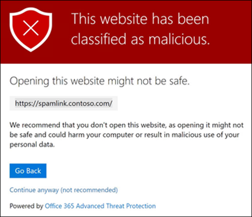

# Caja fuerte Vínculos en Microsoft Defender para Office 365Safe Links in Microsoft Defender for Office 365

[!INCLUDE [Microsoft 365 Defender rebranding](../includes/microsoft-defender-for-office.md)]

**Se aplica a****Applies to**
- [Plan 1 y Plan 2 de Microsoft Defender para Office 365Microsoft Defender for Office 365 plan 1 and plan 2](defender-for-office-365.md)
- [Microsoft 365 DefenderMicrosoft 365 Defender](../defender/microsoft-365-defender.md)

> [!IMPORTANT]
> Este artículo está destinado a los clientes empresariales que tienen [Microsoft Defender para Office 365](defender-for-office-365.md).This article is intended for business customers who have [Microsoft Defender for Office 365](defender-for-office-365.md). Si usa Outlook.com, Microsoft 365 Familia o Microsoft 365 Personal, y está buscando información sobre safelinks en Outlook, vea [Seguridad avanzada de Outlook.com](https://support.microsoft.com/office/882d2243-eab9-4545-a58a-b36fee4a46e2).If you're using Outlook.com, Microsoft 365 Family, or Microsoft 365 Personal, and you're looking for information about Safelinks in Outlook, see [Advanced Outlook.com security](https://support.microsoft.com/office/882d2243-eab9-4545-a58a-b36fee4a46e2).

Caja fuerte Los vínculos son una característica de [Defender para Office 365](defender-for-office-365.md) que proporciona análisis y reescritura de mensajes de correo electrónico entrantes en el flujo de correo, y comprobación con tiempo de clic de direcciones URL y vínculos en mensajes de correo electrónico y otras ubicaciones.Safe Links is a feature in [Defender for Office 365](defender-for-office-365.md) that provides URL scanning and rewriting of inbound email messages in mail flow, and time-of-click verification of URLs and links in email messages and other locations. Caja fuerte El examen de vínculos se produce además de la protección contra correo no deseado y [antimalware](anti-spam-and-anti-malware-protection.md) normal en los mensajes de correo electrónico entrantes Exchange Online Protection (EOP).Safe Links scanning occurs in addition to the regular [anti-spam and anti-malware protection](anti-spam-and-anti-malware-protection.md) in inbound email messages in Exchange Online Protection (EOP). Caja fuerte El examen de vínculos puede ayudar a proteger su organización de vínculos malintencionados que se usan en la suplantación de identidad (phishing) y otros ataques.Safe Links scanning can help protect your organization from malicious links that are used in phishing and other attacks.

Caja fuerte La protección de vínculos está disponible en las siguientes ubicaciones:Safe Links protection is available in the following locations:

- **Mensajes de correo** electrónico: Caja fuerte protección de vínculos para vínculos en mensajes de correo electrónico está controlada por Caja fuerte de vínculos.**Email messages**: Safe Links protection for links in email messages is controlled by Safe Links policies. No hay ninguna directiva Caja fuerte links predeterminada, por lo que para obtener la protección de los vínculos de Caja fuerte en los mensajes de correo electrónico, debe crear una o más directivas de vínculos de **Caja fuerte.**There is no default Safe Links policy, **so to get the protection of Safe Links in email messages, you need to create one or more Safe Links policies**. Para obtener instrucciones, vea [Configurar directivas Caja fuerte vínculos en Microsoft Defender para Office 365](set-up-safe-links-policies.md).For instructions, see [Set up Safe Links policies in Microsoft Defender for Office 365](set-up-safe-links-policies.md).

  Para obtener más información acerca de Caja fuerte de vínculos para mensajes de correo electrónico, vea la sección Caja fuerte [configuración](#safe-links-settings-for-email-messages) de vínculos para mensajes de correo electrónico más adelante en este artículo.For more information about Safe Links protection for email messages, see the [Safe Links settings for email messages](#safe-links-settings-for-email-messages) section later in this article.

- **Microsoft Teams** (actualmente en vista previa de TAP): la protección de vínculos de Caja fuerte para vínculos en conversaciones Teams, chats de grupo o desde canales también está controlada por las directivas de vínculos de Caja fuerte.**Microsoft Teams** (currently in TAP Preview): Safe Links protection for links in Teams conversations, group chats, or from channels is also controlled by Safe Links policies. No hay ninguna directiva Caja fuerte links predeterminada, por lo que para obtener la protección de los vínculos de Caja fuerte en **Teams,** debe crear una o más directivas de vínculos Caja fuerte .There is no default Safe Links policy, **so to get the protection of Safe Links in Teams, you need to create one or more Safe Links policies**.

  Para obtener más información sobre Caja fuerte de vínculos en Teams, vea la sección Caja fuerte [configuración](#safe-links-settings-for-microsoft-teams) de vínculos de Microsoft Teams para Microsoft Teams más adelante en este artículo.For more information about Safe Links protection in Teams, see the [Safe Links settings for Microsoft Teams](#safe-links-settings-for-microsoft-teams) section later in this article.

- **Office 365:** la protección Caja fuerte vínculos para aplicaciones Office 365 está disponible en aplicaciones de escritorio, móviles y web compatibles.**Office 365 apps**: Safe Links protection for Office 365 apps is available in supported desktop, mobile, and web apps. Configurar **la** protección Caja fuerte vínculos para Office 365 aplicaciones en la  configuración global que están fuera de Caja fuerte de vínculos.You **configure** Safe Links protection for Office 365 apps in the global setting that are **outside** of Safe Links policies. Para obtener instrucciones, consulte [Configure global settings for Caja fuerte Links settings in Microsoft Defender for Office 365](configure-global-settings-for-safe-links.md).For instructions, see [Configure global settings for Safe Links settings in Microsoft Defender for Office 365](configure-global-settings-for-safe-links.md).

  Caja fuerte La protección de vínculos para Office 365 aplicaciones se aplica a todos los usuarios de la organización con licencia para Defender para Office 365, independientemente de si los usuarios se incluyen en directivas de vínculos de Caja fuerte activas o no.Safe Links protection for Office 365 apps is applied to all users in the organization who are licensed for Defender for Office 365, regardless of whether the users are included in active Safe Links policies or not.

  Para obtener más información acerca de Caja fuerte protección de vínculos en Office 365 aplicaciones, consulta la sección Caja fuerte [configuración](#safe-links-settings-for-office-365-apps) de vínculos de Office 365 aplicaciones más adelante en este artículo.For more information about Safe Links protection in Office 365 apps, see the [Safe Links settings for Office 365 apps](#safe-links-settings-for-office-365-apps) section later in this article.

En este artículo se incluyen descripciones detalladas de los siguientes tipos de Caja fuerte de vínculos:This article includes detailed descriptions of the following types of Safe Links settings:

- **Configuración en Caja fuerte de** vínculos: esta configuración se aplica solo a los usuarios que se incluyen en las directivas específicas y la configuración puede ser diferente entre directivas.**Settings in Safe Links policies**: These settings apply only to the users who are included in the specific policies, and the settings might be different between policies. Estas opciones incluyen:These settings include:

  - [Caja fuerte Configuración de vínculos para mensajes de correo electrónicoSafe Links settings for email messages](#safe-links-settings-for-email-messages)
  - [Caja fuerte Configuración de vínculos para Microsoft TeamsSafe Links settings for Microsoft Teams](#safe-links-settings-for-microsoft-teams)
  - ["No reescribir las siguientes direcciones URL" en las directivas Caja fuerte vínculos"Do not rewrite the following URLs" lists in Safe Links policies](#do-not-rewrite-the-following-urls-lists-in-safe-links-policies)

- **Configuración Caja fuerte vínculos** globales: esta configuración se configura globalmente, no en Caja fuerte de vínculos.**Global Safe Links settings**: These settings are configured globally, not in Safe Links policies. Sin embargo, la configuración solo se aplica a los usuarios incluidos en las directivas de vínculos Caja fuerte activas.But, the settings apply only to users who are included in active Safe Links policies. Estas opciones incluyen:These settings include:

  - [Caja fuerte Configuración de vínculos para Office 365 aplicacionesSafe Links settings for Office 365 apps](#safe-links-settings-for-office-365-apps)
  - [Lista "Bloquear las siguientes direcciones URL" para Caja fuerte vínculos"Block the following URLs" list for Safe Links](#block-the-following-urls-list-for-safe-links)

En la tabla siguiente se describen escenarios para vínculos de Caja fuerte en organizaciones de Microsoft 365 y Office 365 que incluyen Defender para Office 365 (es decir, la falta de licencias nunca es un problema en los ejemplos).The following table describes scenarios for Safe Links in Microsoft 365 and Office 365 organizations that include Defender for Office 365 (in other words, lack of licensing is never an issue in the examples).

 

****

|EscenarioScenario|ResultadoResult|
|---|---|
|Juan es miembro del departamento de marketing.Jean is a member of the marketing department. Caja fuerte La protección de vínculos para Office 365 aplicaciones está activada en la configuración global de vínculos de Caja fuerte y existe una directiva de vínculos de Caja fuerte que se aplica a los miembros del departamento de marketing.Safe Links protection for Office 365 apps is turned on in the global settings for Safe Links, and a Safe Links policy that applies to members of the marketing department exists. Juan abre una PowerPoint en un mensaje de correo electrónico y, a continuación, hace clic en una dirección URL de la presentación.Jean opens a PowerPoint presentation in an email message, and then clicks a URL in the presentation.|Jean está protegido por Caja fuerte links.Jean is protected by Safe Links. 
 Juan se incluye en una directiva Caja fuerte vínculos y Caja fuerte protección de vínculos para Office 365 aplicaciones está activada.Jean is included in a Safe Links policy, and Safe Links protection for Office 365 apps is turned on. 
 Para obtener más información acerca de los requisitos para la protección de vínculos de Caja fuerte en aplicaciones de Office 365, consulta la sección Caja fuerte Configuración de vínculos de [Office 365](#safe-links-settings-for-office-365-apps) aplicaciones más adelante en este artículo.For more information about the requirements for Safe Links protection in Office 365 apps, see the [Safe Links settings for Office 365 apps](#safe-links-settings-for-office-365-apps) section later in this article.|
|La organización de Microsoft 365 E5 chris no tiene Caja fuerte de vínculos configurados.Chris's Microsoft 365 E5 organization has no Safe Links policies configured. Chris recibe un correo electrónico de un remitente externo que contiene una dirección URL a un sitio web malintencionado en el que, en última instancia, hace clic.Chris receives an email from an external sender that contains a URL to a malicious website that he ultimately clicks.|Chris no está protegido por Caja fuerte links.Chris is not protected by Safe Links. 
 Un administrador debe crear al menos una directiva de vínculos Caja fuerte para que cualquier persona pueda obtener Caja fuerte de vínculos en los mensajes de correo electrónico entrantes.An admin must create at least one Safe Links policy for anyone to get Safe Links protection in inbound email messages. Chris debe incluirse en las condiciones de la directiva para obtener la Caja fuerte de vínculos.Chris must be included in the conditions of policy to get Safe Links protection.|
|En la organización de Pat, ningún administrador ha creado directivas de vínculos Caja fuerte, pero Caja fuerte protección de vínculos para Office 365 aplicaciones está activada.In Pat's organization, no admins have created any Safe Links policies, but Safe Links protection for Office 365 apps is turned on. Pat abre un documento de Word y hace clic en una dirección URL del archivo.Pat opens a Word document and clicks a URL in the file.|Pat no está protegido por Caja fuerte links.Pat is not protected by Safe Links. 
 Aunque Caja fuerte la protección de vínculos de Office 365 para aplicaciones de Office 365 está activada globalmente, Pat no se incluye en ninguna de las directivas de vínculos de Caja fuerte activas, por lo que no se puede aplicar la protección.Although Safe Links protection for Office 365 apps is turned on globally, Pat is not included in any active Safe Links policies, so the protection can't be applied.|
|En la organización de Lee, se configura en la lista Bloquear las siguientes direcciones URL en la configuración global de `https://tailspintoys.com` Caja fuerte vínculos. In Lee's organization, `https://tailspintoys.com` is configured in the **Block the following URLs** list in the global settings for Safe Links. Ya existe Caja fuerte de vínculos que incluye Lee.A Safe Links policy that includes Lee already exists. Lee recibe un mensaje de correo electrónico que contiene la dirección URL `https://tailspintoys.com/aboutus/trythispage` .Lee receives an email message that contains the URL `https://tailspintoys.com/aboutus/trythispage`. Lee hace clic en la dirección URL.Lee clicks the URL.|Es posible que la dirección URL se bloquee automáticamente para Lee; depende de la entrada url de la lista y del cliente de correo electrónico que Lee usó.The URL might be automatically blocked for Lee; it depends on the URL entry in the list and the email client Lee used. Para obtener más información, vea la sección "Bloquear las siguientes direcciones URL" para [Caja fuerte vínculos más](#block-the-following-urls-list-for-safe-links) adelante en este artículo.For more information, see the ["Block the following URLs" list for Safe Links](#block-the-following-urls-list-for-safe-links) section later in this article.|
|Tanto Jamie como Julia trabajan para contoso.com.Jamie and Julia both work for contoso.com. Hace mucho tiempo, los administradores configuraron Caja fuerte de vínculos que se aplican tanto a Jamie como a Julia.A long time ago, admins configured Safe Links policies that apply to both of Jamie and Julia. Jamie envía un correo electrónico a Julia, sin saber que el correo electrónico contiene una dirección URL malintencionada.Jamie sends an email to Julia, not knowing that the email contains a malicious URL.|Julia está protegida por Caja fuerte **links** si la directiva de vínculos de Caja fuerte que se aplica a ella está configurada para aplicarse a los mensajes entre destinatarios internos.Julia is protected by Safe Links **if** the Safe Links policy that applies to her is configured to apply to messages between internal recipients. Para obtener más información, vea la sección [Caja fuerte configuración de vínculos para](#safe-links-settings-for-email-messages) mensajes de correo electrónico más adelante en este artículo.For more information, see the [Safe Links settings for email messages](#safe-links-settings-for-email-messages) section later in this article.|
|

## Caja fuerte Configuración de vínculos para mensajes de correo electrónicoSafe Links settings for email messages

Caja fuerte Los vínculos examinan el correo electrónico entrante en busca de hipervínculos malintencionados conocidos.Safe Links scans incoming email for known malicious hyperlinks. Las direcciones URL escaneadas se reescritan con el prefijo de dirección URL estándar de Microsoft: `https://nam01.safelinks.protection.outlook.com` .Scanned URLs are rewritten using the Microsoft standard URL prefix: `https://nam01.safelinks.protection.outlook.com`. Una vez reescrito el vínculo, se analiza para buscar contenido potencialmente malintencionado.After the link is rewritten, it's analyzed for potentially malicious content.

Después Caja fuerte los vínculos vuelve a escribir una dirección URL, la  dirección URL permanece reescrita incluso si el mensaje se reenvía manualmente o se responde a (tanto a destinatarios internos como externos).After Safe Links rewrites a URL, the URL remains rewritten even if the message is *manually* forwarded or replied to (both to internal and external recipients). Los vínculos adicionales que se agregan al mensaje reenviado o respondido a él no se reescriben.Additional links that are added to the forwarded or replied to message are not rewritten. Sin embargo, en  el caso del reenvío automático por las reglas de la Bandeja de entrada o el  reenvío SMTP, la dirección URL no se reescribirá en el mensaje destinado al destinatario final a menos que ese destinatario también esté protegido por vínculos de Caja fuerte o que la dirección URL ya se haya reescrito en una comunicación anterior.However, in the case of *automatic* forwarding by Inbox rules or SMTP forwarding, the URL will not be rewritten in the message that's intended for the final recipient *unless* that recipient is also protected by Safe Links or the URL had already been rewritten in a previous communication. 

La configuración de las Caja fuerte de vínculos que se aplican a los mensajes de correo electrónico se describen en la siguiente lista:The settings in Safe Links policies that apply to email messages are described in the following list:

- **Seleccione la acción para direcciones** URL potencialmente malintencionadas desconocidas en mensajes: habilita o deshabilita el examen de Caja fuerte vínculos en mensajes de correo electrónico.**Select the action for unknown potentially malicious URLs in messages**: Enables or disables Safe Links scanning in email messages. El valor recomendado es **On**.The recommended value is **On**. Activar esta configuración da como resultado las siguientes acciones.Turning on this setting results in the following actions.

  - Caja fuerte El examen de vínculos está Outlook (C2R) en Windows.Safe Links scanning is enabled in Outlook (C2R) on Windows.
  - Las direcciones URL se reescribián y los usuarios se enrutan Caja fuerte protección de vínculos cuando hacen clic en direcciones URL en los mensajes.URLs are rewritten and users are routed through Safe Links protection when they click URLs in messages.
  - Cuando se hace clic, las direcciones URL se comprueban en una lista de direcciones URL malintencionadas conocidas y en la lista ["Bloquear las siguientes direcciones URL".](#block-the-following-urls-list-for-safe-links)When clicked, URLs are checked against a list of known malicious URLs and the ["Block the following URLs" list](#block-the-following-urls-list-for-safe-links).
  - Las direcciones URL que no tienen una reputación válida se detonan de forma asincrónica en segundo plano.URLs that don't have a valid reputation are detonated asynchronously in the background.

- **Aplicar análisis** de direcciones URL en tiempo real en busca de vínculos sospechosos y vínculos que apunten a archivos: habilita el examen en tiempo real de vínculos, incluidos los vínculos en mensajes de correo electrónico que apuntan a contenido descargable.**Apply real-time URL scanning for suspicious links and links that point to files**: Enables real-time scanning of links, including links in email messages that point to downloadable content. El valor recomendado está habilitado.The recommended value is enabled.

  - **Espere a que se complete el examen de direcciones URL antes de entregar el mensaje:****Wait for URL scanning to complete before delivering the message**:

    - Habilitado: los mensajes que contienen direcciones URL se mantienen hasta que finaliza el examen.Enabled: Messages that contain URLs are held until scanning is finished. Los mensajes se entregan solo después de confirmar que las direcciones URL son seguras.Messages are delivered only after the URLs are confirmed to be safe. Este es el valor recomendado.This is the recommended value.
    - Deshabilitado: si el examen de direcciones URL no se puede completar, entregue el mensaje de todos modos.Disabled: If URL scanning can't complete, deliver the message anyway.

- **Aplicar Caja fuerte vínculos** a mensajes de correo electrónico enviados dentro de la organización: habilita o deshabilita el examen de vínculos de Caja fuerte en mensajes enviados entre remitentes internos y destinatarios internos dentro de la misma Exchange Online organización.**Apply Safe Links to email messages sent within the organization**: Enables or disables Safe Links scanning on messages sent between internal senders and internal recipients within the same Exchange Online organization. El valor recomendado está habilitado.The recommended value is enabled.

- **No realizar un seguimiento de los clics del usuario:** habilita o deshabilita el almacenamiento de los Caja fuerte clics de vínculos para las direcciones URL que se hacen clic en los mensajes de correo electrónico.**Do not track user clicks**: Enables or disables storing Safe Links click data for URLs clicked in email messages. El valor recomendado es dejar esta configuración sin elegir (para realizar un seguimiento de los clics del usuario).The recommend value is to leave this setting unselected (to track user clicks).

  Actualmente no se admite el seguimiento de clics en url para vínculos en mensajes de correo electrónico enviados entre remitentes internos y destinatarios internos.URL click tracking for links in email messages sent between internal senders and internal recipients is currently not supported.

- **No permitir que los usuarios hagan clic en la dirección URL original:** permite o bloquea que los usuarios hagan clic en la página [de advertencia](#warning-pages-from-safe-links) a la dirección URL original.**Do not allow users to click through to original URL**: Allows or blocks users from clicking through the [warning page](#warning-pages-from-safe-links) to the original URL. El valor recomendado está habilitado.The recommend value is enabled.

- **Mostrar la personal de marca de la organización en las páginas de notificación** y advertencia: esta opción muestra la personalizado de marca de la organización en las páginas de advertencia.**Display the organization branding on notification and warning pages**: This option shows your organization's branding on warning pages. La personalidad de marca ayuda a los usuarios a identificar advertencias legítimas, ya que los atacantes suelen usar las páginas de advertencia predeterminadas de Microsoft.Branding helps users identify legitimate warnings, because default Microsoft warning pages are often used by attackers. Para obtener más información acerca de la personalización de marca personalizada, [vea Customize the Microsoft 365 theme for your organization](../../admin/setup/customize-your-organization-theme.md).For more information about customized branding, see [Customize the Microsoft 365 theme for your organization](../../admin/setup/customize-your-organization-theme.md).

- **No vuelva a escribir las siguientes direcciones URL:** deja las direcciones URL tal como están.**Do not rewrite the following URLs**: Leaves URLs as they are. Mantiene una lista personalizada de direcciones URL seguras que no necesitan análisis.Keeps a custom list of safe URLs that don't need scanning. La lista es única para cada directiva Caja fuerte vínculos.The list is unique for each Safe Links policy. Para obtener más información sobre la lista No **volver** a escribir las siguientes direcciones URL, vea la sección "No reescribir las siguientes direcciones [URL"](#do-not-rewrite-the-following-urls-lists-in-safe-links-policies) en la sección directivas de vínculos de Caja fuerte más adelante en este artículo.For more information about the **Do not rewrite the following URLs** list, see the ["Do not rewrite the following URLs" lists in Safe Links policies](#do-not-rewrite-the-following-urls-lists-in-safe-links-policies) section later in this article.

  Para obtener más información acerca de los valores recomendados para la configuración de directivas estándar y estricta para las directivas Caja fuerte vínculos, vea Caja fuerte configuración de directiva [vínculos](recommended-settings-for-eop-and-office365.md#safe-links-policy-settings).For more information about the recommended values for Standard and Strict policy settings for Safe Links policies, see [Safe Links policy settings](recommended-settings-for-eop-and-office365.md#safe-links-policy-settings).

- **Filtros de destinatarios:** debe especificar las condiciones de destinatario y las excepciones que determinan a quién se aplica la directiva.**Recipient filters**: You need to specify the recipient conditions and exceptions that determine who the policy applies to. Puede usar estas propiedades para condiciones y excepciones:You can use these properties for conditions and exceptions:

  - **El destinatario es****The recipient is**
  - **El dominio de destinatario es****The recipient domain is**
  - **El destinatario es un miembro de****The recipient is a member of**

  Solo puede usar una condición o excepción una vez, pero la condición o excepción puede contener varios valores.You can only use a condition or exception once, but the condition or exception can contain multiple values. Varios valores de una misma condición o excepción usan la lógica OR (por ejemplo, _\<recipient1\>_ o _\<recipient2\>_).Multiple values of the same condition or exception use OR logic (for example, _\<recipient1\>_ or _\<recipient2\>_). Condiciones o excepciones diversas usan la lógica AND (por ejemplo, _\<recipient1\>_ y _\<member of group 1\>_).Different conditions or exceptions use AND logic (for example, _\<recipient1\>_ and _\<member of group 1\>_).

- **Prioridad:** si crea varias directivas, puede especificar el orden en que se aplican.**Priority**: If you create multiple policies, you can specify the order that they're applied. Ninguna de las dos directivas puede tener la misma prioridad, y el procesamiento de directivas se detendrá cuando se aplique la primera directiva.No two policies can have the same priority, and policy processing stops after the first policy is applied.

  Para obtener más información sobre el orden de prioridad y cómo se evalúan y aplican las distintas directivas, consulte [Orden y prioridad de la protección de correo electrónico](how-policies-and-protections-are-combined.md).For more information about the order of precedence and how multiple policies are evaluated and applied, see [Order and precedence of email protection](how-policies-and-protections-are-combined.md).

### Cómo Caja fuerte links en mensajes de correo electrónicoHow Safe Links works in email messages

En un nivel alto, aquí se muestra cómo funciona la protección Caja fuerte vínculos en las direcciones URL de los mensajes de correo electrónico:At a high level, here's how Safe Links protection works on URLs in email messages:

1. Todo el correo electrónico pasa por EOP, donde el protocolo de Internet (IP) y los filtros de sobre, la protección contra malware basado en firmas, los filtros contra correo no deseado y antimalware antes de entregar el mensaje al buzón del destinatario.All email goes through EOP, where internet protocol (IP) and envelope filters, signature-based malware protection, anti-spam and anti-malware filters before the message is delivered to the recipient's mailbox.

2. El usuario abre el mensaje en su buzón y hace clic en una dirección URL del mensaje.The user opens the message in their mailbox and clicks on a URL in the message.

3. Caja fuerte Los vínculos comprueban inmediatamente la dirección URL antes de abrir el sitio web:Safe Links immediately checks the URL before opening the website:

   - Si la dirección URL se incluye en la lista **Bloquear las siguientes direcciones URL,** se abrirá una advertencia de dirección [URL](#blocked-url-warning) bloqueada.If the URL is included in the **Block the following URLs** list, a [blocked URL warning](#blocked-url-warning) opens.

   - Si la dirección URL apunta a un sitio  web que se ha determinado que es malintencionado, se abrirá una página de advertencia de sitio web malintencionado (o una página de advertencia diferente).If the URL points to a website that has been determined to be malicious, a [malicious website warning](#malicious-website-warning) page (or a different warning page) opens.

   - Si la dirección URL apunta a un archivo descargable y la opción Aplicar análisis de url en tiempo **real** en busca de vínculos sospechosos y vínculos que apunten a archivos está habilitada en la directiva que se aplica al usuario, se comprueba el archivo descargable.If the URL points to a downloadable file, and the **Apply real-time URL scanning for suspicious links and links that point to files** setting is enabled in the policy that applies to the user, the downloadable file is checked.

   - Si se determina que la dirección URL es segura, se abrirá el sitio web.If the URL is determined to be safe, the website opens.

## Caja fuerte Configuración de vínculos para Microsoft TeamsSafe Links settings for Microsoft Teams

> [!IMPORTANT]
> A partir de marzo de 2020, esta característica está en versión preliminar y solo está disponible para los miembros de la Microsoft Teams Programa de adopción de tecnología (TAP).As of March 2020, this feature is in Preview and is available only to members of the Microsoft Teams Technology Adoption Program (TAP). Para obtener información acerca de la programación de lanzamiento, consulte el [mapa Microsoft 365 ruta de trabajo](https://www.microsoft.com/microsoft-365/roadmap?rtc=1&filters=&searchterms=Safe%2CLinks%2CProtection%2Cfor%2CMicrosoft%2CTeams).For information about the release schedule, check out the [Microsoft 365 roadmap](https://www.microsoft.com/microsoft-365/roadmap?rtc=1&filters=&searchterms=Safe%2CLinks%2CProtection%2Cfor%2CMicrosoft%2CTeams).

Puede habilitar o deshabilitar la protección Caja fuerte vínculos para Microsoft Teams en Caja fuerte de vínculos.You enable or disable Safe Links protection for Microsoft Teams in Safe Links policies. En concreto, se usa la opción Seleccionar la acción para direcciones URL desconocidas o potencialmente malintencionadas **dentro Microsoft Teams** configuración.Specifically, you use the **Select the action for unknown or potentially malicious URLs within Microsoft Teams** setting. El valor recomendado es **On**.The recommended value is **On**.

La siguiente configuración en Caja fuerte de vínculos que se aplican a los vínculos de los mensajes de correo electrónico también se aplican a los vínculos de Teams:The following settings in Safe Links policies that apply to links in email messages also apply to links in Teams:

- **Aplicar análisis de url en tiempo real en busca de vínculos sospechosos y vínculos que apunten a archivos****Apply real-time URL scanning for suspicious links and links that point to files**
- **No realizar un seguimiento de los clics del usuario****Do not track user clicks**
- **No permitir que los usuarios hagan clic en la dirección URL original****Do not allow users to click through to original URL**

Esta configuración se explica anteriormente en la configuración [Caja fuerte vínculos para mensajes de correo electrónico](#safe-links-settings-for-email-messages).These settings are explained previously in [Safe Links settings for email messages](#safe-links-settings-for-email-messages).

Después de activar la protección de vínculos de Caja fuerte para Microsoft Teams, las direcciones URL de Teams se comprueban en una lista de vínculos malintencionados conocidos cuando el usuario protegido hace clic en el vínculo (protección con tiempo de clic).After you turn on Safe Links protection for Microsoft Teams, URLs in Teams are checked against a list of known malicious links when the protected user clicks the link (time-of-click protection). Las direcciones URL no se reescritan.URLs are not rewritten. Si se encuentra que un vínculo es malintencionado, los usuarios tendrán las siguientes experiencias:If a link is found to be malicious, users will have the following experiences:

- Si se hizo clic en el vínculo en una conversación de Teams, chat en grupo o desde canales, la página de advertencia como se muestra en la captura de pantalla siguiente aparecerá en el explorador web predeterminado.If the link was clicked in a Teams conversation, group chat, or from channels, the warning page as shown in the screenshot below will appear in the default web browser.
- Si se hizo clic en el vínculo desde una pestaña anclada, la página de advertencia aparecerá en la Teams de la pestaña. La opción para abrir el vínculo en un explorador web está deshabilitada por motivos de seguridad.If the link was clicked from a pinned tab, the warning page will appear in the Teams interface within that tab. The option to open the link in a web browser is disabled for security reasons.
- Dependiendo de cómo se configure la configuración No permitir que los usuarios hagan clic en la **dirección URL original** de la directiva, el usuario podrá o no podrá hacer clic en la dirección URL original ( Continuar de todos modos **(no recomendado)** en la captura de pantalla).Depending on how the **Do not allow users to click through to original URL** setting in the policy is configured, the user will or will not be allowed to click through to the original URL (**Continue anyway (not recommended)** in the screenshot). Se recomienda habilitar la configuración No permitir que los usuarios hagan clic en la **dirección URL original** para que los usuarios no puedan hacer clic en la dirección URL original.We recommend that you enable the **Do not allow users to click through to original URL** setting so users can't click through to the original URL.

Si el usuario que envió el vínculo no está incluido en una directiva de vínculos de Caja fuerte donde está habilitada la protección de Teams, el usuario puede hacer clic en la dirección URL original de su equipo o dispositivo.If the user who sent the link isn't included in a Safe Links policy where Teams protection is enabled, the user is free to click through to the original URL on their computer or device.

Al hacer **clic en el botón** Volver de la página de advertencia, el usuario volverá a su contexto o ubicación URL original.Clicking the **Go Back** button on the warning page will return the user to their original context or URL location. Sin embargo, al volver a hacer clic en el vínculo original, Caja fuerte vínculos volverán a examinar la dirección URL, por lo que la página de advertencia volverá a aparecer.However, clicking on the original link again will cause Safe Links to rescan the URL, so the warning page will reappear.

### Cómo Caja fuerte links en TeamsHow Safe Links works in Teams

En un nivel alto, aquí se muestra cómo funciona la protección Caja fuerte vínculos para direcciones URL en Microsoft Teams:At a high level, here's how Safe Links protection works for URLs in Microsoft Teams:

1. Un usuario inicia la Teams aplicación.A user starts the Teams app.

2. Microsoft 365 comprueba que la organización del usuario incluye Microsoft Defender para Office 365 y que el usuario se incluye en una directiva de vínculos de Caja fuerte activa en la que la protección de Microsoft Teams está habilitada.Microsoft 365 verifies that the user's organization includes Microsoft Defender for Office 365, and that the user is included in an active Safe Links policy where protection for Microsoft Teams is enabled.

3. Las direcciones URL se validan al hacer clic para el usuario en chats, chats de grupo, canales y pestañas.URLs are validated at the time of click for the user in chats, group chats, channels, and tabs.

## Caja fuerte Configuración de vínculos para Office 365 aplicacionesSafe Links settings for Office 365 apps

Caja fuerte La protección de vínculos para Office 365 aplicaciones comprueba vínculos en documentos de Office, no vínculos en mensajes de correo electrónico (pero puede comprobar vínculos en documentos Office adjuntos en mensajes de correo electrónico después de abrir el documento).Safe Links protection for Office 365 apps checks links in Office documents, not links in email messages (but it can check links in attached Office documents in email messages after the document is opened).

Caja fuerte La protección de vínculos Office 365 aplicaciones tiene los siguientes requisitos de cliente:Safe Links protection for Office 365 apps has the following client requirements:

- Aplicaciones Microsoft 365 o Microsoft 365 Empresa Premium.Microsoft 365 Apps or Microsoft 365 Business Premium.
  - Las versiones actuales de Word, Excel y PowerPoint en Windows, Mac o en un explorador web.Current versions of Word, Excel, and PowerPoint on Windows, Mac, or in a web browser.
  - Office aplicaciones en dispositivos iOS o Android.Office apps on iOS or Android devices.
  - Visio en Windows.Visio on Windows.
  - OneNote en un explorador web.OneNote in a web browser.

- Office 365 están configuradas para usar la autenticación moderna.Office 365 apps are configured to use modern authentication. Para obtener más información, vea How [modern authentication works for Office 2013, Office 2016 y Office 2019 client apps](../../enterprise/modern-auth-for-office-2013-and-2016.md).For more information, see [How modern authentication works for Office 2013, Office 2016, and Office 2019 client apps](../../enterprise/modern-auth-for-office-2013-and-2016.md).

- Los usuarios han iniciado sesión con sus cuentas laborales o educativas.Users are signed in using their work or school accounts. Para obtener más información, vea [Iniciar sesión en Office](https://support.microsoft.com/office/b9582171-fd1f-4284-9846-bdd72bb28426).For more information, see [Sign in to Office](https://support.microsoft.com/office/b9582171-fd1f-4284-9846-bdd72bb28426).

Puede configurar la protección Caja fuerte vínculos para Office 365 aplicaciones en la configuración global de Caja fuerte vínculos, no en las directivas Caja fuerte vínculos.You configure Safe Links protection for Office 365 apps in the global settings for Safe Links, not in Safe Links policies. La protección se aplica a todos los usuarios de la organización que tienen licencia para Defender para Office 365, independientemente de si los usuarios se incluyen en directivas de vínculos de Caja fuerte activas o no.The protection is applied to all users in the organization who are licensed for Defender for Office 365, regardless of whether the users are included in active Safe Links policies or not.

La siguiente Caja fuerte de vínculos está disponible para Office 365 aplicaciones:The following Safe Links settings are available for Office 365 apps:

- **Office 365:** habilita o deshabilita el examen de Caja fuerte vínculos en aplicaciones Office 365 compatibles.**Office 365 applications**: Enables or disables Safe Links scanning in supported Office 365 apps. El valor predeterminado y recomendado es **On**.The default and recommended value is **On**.

- No realice un seguimiento cuando los usuarios hagan clic en vínculos de **Caja fuerte:** habilita o deshabilita el almacenamiento de datos de clic de vínculos de Caja fuerte para las direcciones URL que se han hecho clic en las versiones de escritorio Word, Excel, PowerPoint y Visio.**Do not track when users click Safe Links**: Enables or disables storing Safe Links click data for URLs clicked in the desktop versions Word, Excel, PowerPoint, and Visio. El valor recomendado es **Off**, lo que significa que se realiza un seguimiento de los clics del usuario.The recommended value is **Off**, which means user clicks are tracked.

- No permitir que los usuarios hagan clic en vínculos seguros  a la **dirección URL original:** permite o impide que los usuarios hagan clic en la página de advertencia a la dirección URL original en las versiones de escritorio Word, Excel, PowerPoint y Visio.**Do not let users click through safe links to original URL**: Allows or blocks users from clicking through the [warning page](#warning-pages-from-safe-links) to the original URL in in the desktop versions Word, Excel, PowerPoint, and Visio. El valor predeterminado y recomendado es **On**.The default and recommended value is **On**.

Para configurar la configuración Caja fuerte vínculos para Office 365 aplicaciones, consulta Configurar la protección de Caja fuerte [vínculos para Office 365 aplicaciones](configure-global-settings-for-safe-links.md#configure-safe-links-protection-for-office-365-apps-in-the-security--compliance-center).To configure the Safe Links settings for Office 365 apps, see [Configure Safe Links protection for Office 365 apps](configure-global-settings-for-safe-links.md#configure-safe-links-protection-for-office-365-apps-in-the-security--compliance-center).

Para obtener más información acerca de los valores recomendados para la configuración de directivas estándar y estricta, vea [Configuración global para Caja fuerte vínculos](recommended-settings-for-eop-and-office365.md#global-settings-for-safe-links).For more information about the recommended values for Standard and Strict policy settings, see [Global settings for Safe Links](recommended-settings-for-eop-and-office365.md#global-settings-for-safe-links).

### Cómo Caja fuerte links funciona en Office 365 aplicacionesHow Safe Links works in Office 365 apps

En un nivel alto, aquí se muestra cómo funciona la protección Caja fuerte vínculos para direcciones URL en Office 365 aplicaciones.At a high level, here's how Safe Links protection works for URLs in Office 365 apps. Las aplicaciones Office 365 compatibles se describen en la sección anterior.The supported Office 365 apps are described in the previous section.

1. Un usuario inicia sesión en el uso de su cuenta laboral o educativa en una organización que incluye Aplicaciones Microsoft 365 o Microsoft 365 Empresa Premium.A user signs in using their work or school account in an organization that includes Microsoft 365 Apps or Microsoft 365 Business Premium.

2. El usuario abre y hace clic en un vínculo de un Office en un documento Aplicación de Office.The user opens and clicks on a link an Office document in a supported Office app.

3. Caja fuerte Los vínculos comprueban inmediatamente la dirección URL antes de abrir el sitio web de destino:Safe Links immediately checks the URL before opening the target website:

   - Si la dirección URL se incluye en la lista que  omite el examen de vínculos Caja fuerte (la lista Bloquear las siguientes direcciones URL) se abrirá una página de advertencia de [dirección URL](#blocked-url-warning) bloqueada.If the URL is included in the list that skips Safe Links scanning (the **Block the following URLs** list) a [blocked URL warning](#blocked-url-warning) page opens.

   - Si la dirección URL apunta a un sitio  web que se ha determinado que es malintencionado, se abrirá una página de advertencia de sitio web malintencionado (o una página de advertencia diferente).If the URL points to a website that has been determined to be malicious, a [malicious website warning](#malicious-website-warning) page (or a different warning page) opens.

   - Si la dirección URL apunta a un archivo descargable y la directiva de vínculos de Caja fuerte que se aplica al usuario está configurada para examinar vínculos a contenido descargable ( Aplicar análisis de url en tiempo **real** en busca de vínculos sospechosos y vínculos que apunten a archivos), se comprueba el archivo descargable.If the URL points to a downloadable file, and the Safe Links policy that applies to the user is configured to scan links to downloadable content (**Apply real-time URL scanning for suspicious links and links that point to files**), the downloadable file is checked.

   - Si la dirección URL se considera segura, el usuario se traslada al sitio web.If the URL is considered safe, the user is taken to the website.

   - Si Caja fuerte el examen de vínculos no se puede completar, Caja fuerte protección de vínculos no se desencadena.If Safe Links scanning is unable to complete, Safe Links protection does not trigger. En Office de escritorio, se advertirá al usuario antes de continuar con el sitio web de destino.In Office desktop clients, the user will be warned before they proceed to the destination website.

> [!NOTE]
> Puede tardar varios segundos al principio de cada sesión para comprobar que el usuario tiene Caja fuerte vínculos para Office habilitado.It may take several seconds at the beginning of each session to verify that the user has Safe Links for Office enabled.

## Lista "Bloquear las siguientes direcciones URL" para Caja fuerte vínculos"Block the following URLs" list for Safe Links

La **lista Bloquear las siguientes direcciones URL** define los vínculos que siempre están bloqueados por Caja fuerte análisis de vínculos en las siguientes ubicaciones:The **Block the following URLs** list defines the links that are always blocked by Safe Links scanning in the following locations:

- Mensajes de correo electrónicoEmail messages.
- Documentos en Office 365 aplicaciones en Windows y Mac.Documents in Office 365 apps in Windows and Mac.
- Documentos en Office para iOS y Android.Documents in Office for iOS and Android.

Cuando un usuario de una directiva de vínculos Caja fuerte activa hace clic en un vínculo bloqueado en una aplicación compatible, se le traslada a la página de advertencia url [bloqueada.](#blocked-url-warning)When a user in an active Safe Links policy clicks a blocked link in a supported app, they're taken to the [Blocked URL warning](#blocked-url-warning) page.

La lista de direcciones URL se configura en la configuración global de Caja fuerte vínculos.You configure the list of URLs in the global settings for Safe Links. Para obtener instrucciones, [vea Configure the "Block the following URLs" list](configure-global-settings-for-safe-links.md#configure-the-block-the-following-urls-list-in-the-security--compliance-center).For instructions, see [Configure the "Block the following URLs" list](configure-global-settings-for-safe-links.md#configure-the-block-the-following-urls-list-in-the-security--compliance-center).

> [!NOTE]
> 
> - Para obtener una lista realmente universal de direcciones URL bloqueadas en todas partes, vea [Manage the Tenant Allow/Block List](tenant-allow-block-list.md).For a truly universal list of URLs that are blocked everywhere, see [Manage the Tenant Allow/Block List](tenant-allow-block-list.md).
> 
> - Límites:Limits:
>   - El número máximo de entradas es 500.The maximum number of entries is 500.
>   - La longitud máxima de una entrada es de 128 caracteres.The maximum length of an entry is 128 characters.
>   - Todas las entradas no pueden superar los 10.000 caracteres.All of the entries can't exceed 10,000 characters.
> 
> - No incluya una barra diagonal ( `/` ) al final de la dirección URL.Don't include a forward slash (`/`) at the end of the URL. Por ejemplo, use `https://www.contoso.com` , no `https://www.contoso.com/` .For example, use `https://www.contoso.com`, not `https://www.contoso.com/`.
> 
> - Una dirección URL de solo dominio (por ejemplo `contoso.com` o `tailspintoys.com` ) bloqueará cualquier dirección URL que contenga el dominio.A domain only-URL (for example `contoso.com` or `tailspintoys.com`) will block any URL that contains the domain.
> 
> - Puede bloquear un subdominio sin bloquear el dominio completo.You can block a subdomain without blocking the full domain. Por ejemplo, `toys.contoso.com*` bloquea cualquier dirección URL que contenga el subdominio, pero no bloquea las direcciones URL que contienen el dominio completo `contoso.com` .For example, `toys.contoso.com*` blocks any URL that contains the subdomain, but it doesn't block URLs that contain the full domain `contoso.com`.
> 
> - Puede incluir hasta tres caracteres comodín ( `*` ) por entrada de dirección URL.You can include up to three wildcards (`*`) per URL entry.

### Sintaxis de entrada para la lista "Bloquear las siguientes direcciones URL"Entry syntax for the "Block the following URLs" list

En la tabla siguiente se describen ejemplos de los valores que puede especificar y sus resultados:Examples of the values that you can enter and their results are described in the following table:

****

|ValorValue|ResultadoResult|
|---|---|
|`contoso.com` 
 oor 
 `*contoso.com*`|Bloquea el dominio, los subdominios y las rutas de acceso.Blocks the domain, subdomains, and paths. Por ejemplo, `https://www.contoso.com` , `https://sub.contoso.com` y se `https://contoso.com/abc` bloquean.For example, `https://www.contoso.com`, `https://sub.contoso.com`, and `https://contoso.com/abc` are blocked.|
|`https://contoso.com/a`|Bloques `https://contoso.com/a` pero no subpaths adicionales como `https://contoso.com/a/b` .Blocks `https://contoso.com/a` but not additional subpaths like `https://contoso.com/a/b`.|
|`https://contoso.com/a*`|Bloques `https://contoso.com/a` y subpaths adicionales como `https://contoso.com/a/b` .Blocks `https://contoso.com/a` and additional subpaths like `https://contoso.com/a/b`.|
|`https://toys.contoso.com*`|Bloquea un subdominio ( en este ejemplo), pero permite hacer clic en otras direcciones URL de `toys` dominio (como o `https://contoso.com` `https://home.contoso.com` ).Blocks a subdomain (`toys` in this example) but allow clicks to other domain URLs (like `https://contoso.com` or `https://home.contoso.com`).|
|

## "No reescribir las siguientes direcciones URL" en las directivas Caja fuerte vínculos"Do not rewrite the following URLs" lists in Safe Links policies

> [!NOTE]
> Si su organización usa directivas Caja fuerte vínculos, las listas No volver a escribir las siguientes listas de direcciones **URL** son el único método admitido para pruebas de suplantación de identidad de terceros.If your organization use Safe Links policies, the **Do not rewrite the following URLs** lists are the only supported method for third party phishing tests.

Cada directiva Caja fuerte links contiene una lista Do **not rewrite the following URLs** que puede usar para especificar direcciones URL que no se reescriban mediante el examen de vínculos Caja fuerte.Each Safe Links policy contains a **Do not rewrite the following URLs** list that you can use to specify URLs that are not rewritten by Safe Links scanning. En otras palabras, la lista permite a los usuarios incluidos en la directiva obtener acceso a las direcciones URL especificadas que, de lo contrario, se bloquearían mediante Caja fuerte vínculos.In other words, the list allows users who are included in the policy to access the specified URLs that would otherwise be blocked by Safe Links. Puede configurar diferentes listas en diferentes directivas Caja fuerte vínculos.You can configure different lists in different Safe Links policies. El procesamiento de directivas se detiene después de que se aplique la primera directiva (probablemente, la prioridad más alta) al usuario.Policy processing stops after the first (likely, the highest priority) policy is applied to the user. Por lo tanto, solo se aplica una no **reescritura** de la siguiente lista de direcciones URL a un usuario que se incluye en varias directivas de vínculos Caja fuerte activas.So, only one **Do not rewrite the following URLs** list is applied to a user who is included in multiple active Safe Links policies.

Para agregar entradas a la lista en directivas de vínculos de Caja fuerte nuevas o existentes, vea [Create Caja fuerte Links policies](set-up-safe-links-policies.md#use-the-security--compliance-center-to-create-safe-links-policies) o Modify Caja fuerte Links [policies](set-up-safe-links-policies.md#use-the-security--compliance-center-to-modify-safe-links-policies).To add entries to the list in new or existing Safe Links policies, see [Create Safe Links policies](set-up-safe-links-policies.md#use-the-security--compliance-center-to-create-safe-links-policies) or [Modify Safe Links policies](set-up-safe-links-policies.md#use-the-security--compliance-center-to-modify-safe-links-policies).

> [!NOTE]
> 
> - Los siguientes clientes no reconocen las siguientes listas de **direcciones URL** en Caja fuerte de vínculos.The following clients don't recognize the **Do not rewrite the following URLs** lists in Safe Links policies. Se puede bloquear el acceso a las direcciones URL de los usuarios incluidos en las policías en función de los resultados de la detección de vínculos Caja fuerte en estos clientes:Users included in the polices can be blocked from accessing the URLs based on the results of Safe Links scanning in these clients:
> 
>   - Microsoft TeamsMicrosoft Teams
>   - Office webOffice web apps
> 
>   Para obtener una lista realmente universal de direcciones URL permitidas en todas partes, vea [Manage the Tenant Allow/Block List](tenant-allow-block-list.md).For a truly universal list of URLs that are allowed everywhere, see [Manage the Tenant Allow/Block List](tenant-allow-block-list.md).
> 
> - Considere la posibilidad de agregar direcciones URL internas usadas habitualmente a la lista para mejorar la experiencia del usuario.Consider adding commonly used internal URLs to the list to improve the user experience. Por ejemplo, si tiene servicios locales, como Skype Empresarial o SharePoint, puede agregar esas direcciones URL para excluirlas del examen.For example, if you have on-premises services, such as Skype for Business or SharePoint, you can add those URLs to exclude them from scanning.
> 
> - Si ya tiene **No volver** a escribir las siguientes entradas de direcciones URL en las directivas de vínculos de Caja fuerte, asegúrese de revisar las listas y agregar caracteres comodín según sea necesario.If you already have **Do not rewrite the following URLs** entries in your Safe Links policies, be sure to review the lists and add wildcards as required. Por ejemplo, la lista tiene una entrada como y más adelante decide incluir `https://contoso.com/a` subpaths como `https://contoso.com/a/b` .For example, your list has an entry like `https://contoso.com/a` and you later decide to include subpaths like `https://contoso.com/a/b`. En lugar de agregar una nueva entrada, agregue un comodín a la entrada existente para que se convierta en `https://contoso.com/a/*` .Instead of adding a new entry, add a wildcard to the existing entry so it becomes `https://contoso.com/a/*`.
> 
> - Puede incluir hasta tres caracteres comodín ( `*` ) por entrada de dirección URL.You can include up to three wildcards (`*`) per URL entry. Los caracteres comodín incluyen explícitamente prefijos o subdominios.Wildcards explicitly include prefixes or subdomains. Por ejemplo, la entrada no es la misma que , porque permite a los usuarios visitar subdominios y rutas de acceso `contoso.com` `*.contoso.com/*` en el dominio `*.contoso.com/*` especificado.For example, the entry `contoso.com` is not the same as `*.contoso.com/*`, because `*.contoso.com/*` allows people to visit subdomains and paths in the specified domain.

### Sintaxis de entrada para la lista "No volver a escribir las siguientes direcciones URL"Entry syntax for the "Do not rewrite the following URLs" list

En la tabla siguiente se describen ejemplos de los valores que puede especificar y sus resultados:Examples of the values that you can enter and their results are described in the following table:

****

|ValorValue|ResultadoResult|
|---|---|
|`contoso.com`|Permite el acceso a `https://contoso.com` subdominios o rutas de acceso, pero no a ella.Allows access to `https://contoso.com` but not subdomains or paths.|
|`*.contoso.com/*`|Permite el acceso a un dominio, subdominios y rutas de acceso (por ejemplo, `https://www.contoso.com` , `https://www.contoso.com` , o `https://maps.contoso.com` `https://www.contoso.com/a` ).Allows access to a domain, subdomains, and paths (for example, `https://www.contoso.com`, `https://www.contoso.com`, `https://maps.contoso.com`, or `https://www.contoso.com/a`). 
 Esta entrada es intrínsecamente mejor que , porque no permite sitios `*contoso.com*` potencialmente fraudulentos, como `https://www.falsecontoso.com` o `https://www.false.contoso.completelyfalse.com`This entry is inherently better than `*contoso.com*`, because it doesn't allow potentially fraudulent sites, like `https://www.falsecontoso.com` or `https://www.false.contoso.completelyfalse.com`|
|`https://contoso.com/a`|Permite el acceso `https://contoso.com/a` a , pero no a subpaths como `https://contoso.com/a/b`Allows access to `https://contoso.com/a`, but not subpaths like `https://contoso.com/a/b`|
|`https://contoso.com/a/*`|Permite el acceso a `https://contoso.com/a` y subpaths como `https://contoso.com/a/b`Allows access to `https://contoso.com/a` and subpaths like `https://contoso.com/a/b`|
|

## Páginas de advertencia de Caja fuerte vínculosWarning pages from Safe Links

Esta sección contiene ejemplos de las distintas páginas de advertencia que desencadena la protección Caja fuerte vínculos al hacer clic en una dirección URL.This section contains examples of the various warning pages that are triggered by Safe Links protection when you click a URL.

Tenga en cuenta que se han actualizado varias páginas de advertencia.Note that several warning pages have been updated. Si aún no ve las páginas actualizadas, lo hará pronto.If you're not already seeing the updated pages, you will soon. Las páginas actualizadas incluyen una nueva combinación de colores, más detalles y la capacidad de continuar con un sitio a pesar de las advertencias y recomendaciones dadas.The updated pages include a new color scheme, more detail, and the ability to proceed to a site despite the given warning and recommendations.

### Notificación de examen en cursoScan in progress notification

La dirección URL en la que se ha hecho clic está siendo examinada Caja fuerte vínculos.The clicked URL is being scanned by Safe Links. Es posible que deba esperar unos instantes antes de volver a intentar el vínculo.You might need to wait a few moments before trying the link again.

La página de notificación original tenía este aspecto:The original notification page looked like this:

### Advertencia de mensaje sospechosoSuspicious message warning

La dirección URL en la que se hizo clic estaba en un mensaje de correo electrónico que es similar a otros mensajes sospechosos.The clicked URL was in an email message that's similar to other suspicious messages. Se recomienda comprobar dos veces el mensaje de correo electrónico antes de continuar con el sitio.We recommend that you double-check the email message before proceeding to the site.

### Advertencia de intento de suplantación de identidadPhishing attempt warning

La dirección URL en la que se hizo clic estaba en un mensaje de correo electrónico que se ha identificado como un ataque de suplantación de identidad.The clicked URL was in an email message that has been identified as a phishing attack. Como resultado, se bloquean todas las direcciones URL del mensaje de correo electrónico.As a result, all URLs in the email message are blocked. Se recomienda no continuar con el sitio.We recommend that you do not proceed to the site.

### Advertencia de sitio web malintencionadoMalicious website warning

La dirección URL en la que se ha hecho clic apunta a un sitio que se ha identificado como malintencionado.The clicked URL points to a site that has been identified as malicious. Se recomienda no continuar con el sitio.We recommend that you do not proceed to the site.

La página de advertencia original tenía este aspecto:The original warning page looked like this:

### Advertencia de dirección URL bloqueadaBlocked URL warning

La dirección URL en la que se ha hecho clic ha sido bloqueada manualmente por un administrador de la organización (la lista Bloquear las siguientes direcciones **URL** en la configuración global de Caja fuerte vínculos).The clicked URL has been manually blocked by an admin in your organization (the **Block the following URLs** list in the global settings for Safe Links). El vínculo no fue examinado por Caja fuerte links porque se bloqueó manualmente.The link was not scanned by Safe Links because it was manually blocked.

Hay varias razones por las que un administrador bloquearía manualmente direcciones URL específicas.There are several reasons why an admin would manually block specific URLs. Si cree que el sitio no debe bloquearse, póngase en contacto con el administrador.If you think the site should not be blocked, contact your admin.

La página de advertencia original tenía este aspecto:The original warning page looked like this:

### Advertencia de errorError warning

Se ha producido algún tipo de error y no se puede abrir la dirección URL.Some kind of error has occurred, and the URL can't be opened.

La página de advertencia original tenía este aspecto:The original warning page looked like this:

