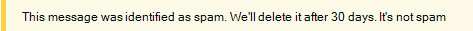
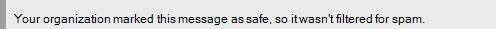

# Sugerencias de seguridad en mensajes de correo electrónicoSafety tips in email messages

Exchange Online Protection (EOP) y Microsoft 365 protegen el correo no deseado, el phishing y la prevención de malware.Exchange Online Protection (EOP) and Microsoft 365 protect you with spam, phishing, and malware prevention. Hoy en día, algunos de estos ataques están tan bien diseñados que parecen legítimos.Today, some of these attacks are so well crafted that they look legitimate. No siempre es suficiente enviar mensajes a la carpeta correo electrónico no deseado.Sending messages to the Junk Email folder isn't always enough. Ahora, cuando revise el correo electrónico en Outlook o en Outlook en la web o en cualquier cliente de correo electrónico, EOP comprueba automáticamente el remitente y agrega una sugerencia de seguridad en la parte superior del correo electrónico.Now, when you check your email in Outlook or Outlook on the web or any email client, EOP automatically checks the sender and adds a safety tip to the top of the email.

Las sugerencias de seguridad de Outlook no dependen de la versión de Outlook que está usando, ya que la sugerencia de seguridad se ha averiguado abierto e insertado directamente en el cuerpo del mensaje.Safety tips in Outlook do not depend on what version of Outlook you're using because the safety tip is cracked open and inserted directly into the message body. Esto significa que la sugerencia de seguridad se mostrará en cualquier cliente de correo electrónico que esté usando.This means that the safety tip will show up in whatever email client you're using. Se realiza en el nivel de filtro de correo electrónico y no se representa en el nivel de cliente de correo, por lo que no solo se muestra en ninguna versión de Outlook, sino que también se muestra en cualquier cliente de correo electrónico.It's done at the email filter level and not rendered at the mail client level, so not only does it show up in any version of Outlook, it also shows up in any email client.

La sugerencia de seguridad (un mensaje codificado por colores) le avisará de los mensajes potencialmente perjudiciales.The safety tip—a color-coded message—will warn you about potentially harmful messages. La mayoría de los mensajes de la bandeja de entrada no tienen una sugerencia de seguridad.Most messages in your inbox won't have a safety tip. Solo las verá cuando EOP y Microsoft 365 tienen información que necesita para evitar los ataques de correo no deseado, de suplantación de identidad (phishing) y de malware.You'll only see them when EOP and Microsoft 365 have information you need to help prevent spam, phishing, and malware attacks. Si se muestran sugerencias de seguridad en la bandeja de entrada, puede usar los siguientes ejemplos para obtener más información sobre cada tipo de sugerencia de seguridad.If safety tips do show up on in your inbox, you can use the following examples to learn more about each type of safety tip.

- Correo sospechoso (sugerencia de seguridad roja).Suspicious mail (red safety tip).

    

    Una sugerencia de seguridad roja en un correo electrónico significa que el mensaje que ha recibido contiene algo sospechoso, como una estafa de suplantación de identidad (phishing).A red safety tip in an email means that the message you received contains something suspicious, such as a phishing scam. Le recomendamos que elimine este tipo de mensaje de correo electrónico de la bandeja de entrada sin abrirlo.We recommend that you delete this kind of email message from your inbox without opening it.

- Correo no deseado (sugerencia de seguridad amarilla).Spam (yellow safety tip).

    

    Una sugerencia de seguridad amarilla en un correo electrónico significa que el mensaje se ha marcado como correo no deseado.A yellow safety tip in an email means that the message has been marked as spam. Si no reconoce y no confía en el remitente del mensaje, no descargue ningún dato adjunto ni ninguna imagen y no haga clic en ningún vínculo del mensaje.If you don't recognize and trust the sender of the message, don't download any attachments or pictures and don't click any links in the message. En Outlook en la web, puede hacer clic en **no es correo no deseado** en la barra amarilla de un elemento de correo no deseado para mover el mensaje a la bandeja de entrada.In Outlook on the web, you can click **It's not spam** in the yellow bar of a junk mail item to move the message to your inbox. Si aparece la sugerencia de seguridad amarilla en un mensaje que se entregó en la bandeja de entrada, probablemente se deba a que ha deshabilitado el traslado de correo no deseado a la carpeta correo electrónico no deseado.If the yellow safety tip appears on a message that was delivered to your inbox, it's probably there because you've disabled moving spam to your Junk Email folder.

- Correo seguro (sugerencia de seguridad verde).Safe mail (green safety tip).

    

    Además de los mensajes no seguros, también le mostraremos los mensajes válidos de los remitentes en los que confíe con una sugerencia de seguridad verde.In addition to unsafe messages, we'll also tell you about valid messages from senders we trust with a green safety tip. Una sugerencia de seguridad verde en un correo electrónico significa que se ha comprobado el remitente del mensaje y que se ha comprobado que es seguro.A green safety tip in an email means that we checked the sender of the message and verified that it's safe. Microsoft mantiene esta lista de remitentes de confianza que incluyen organizaciones financieras y otros usuarios que se falsifican o suplantan con frecuencia.Microsoft maintains this list of trusted senders which includes financial organizations and others that are frequently spoofed or impersonated.

- Correo sin filtrar (sugerencia de seguridad gris).Unfiltered mail (gray safety tip).

    

    También le informaremos cuando omitimos la comprobación de correo, ya que procede de un remitente en el que confía en la lista de remitentes seguros o si existe una regla de flujo de correo para omitir el filtrado.We'll also tell you when we skipped checking a mail because it's from a sender you trust on your Safe Senders list or if a mail flow rule exists to bypass filtering.

    La sugerencia de seguridad gris también aparece cuando se bloquean las imágenes externas, es decir, el mensaje está en la bandeja de entrada y no parece que sea correo no deseado, pero contiene imágenes externas que no ha decidido descargar.The gray safety tip also shows up when external images are blocked, that is, the message is in your inbox and doesn't appear to be spam, but contains external images that you haven't opted to download.
    

## Trabajar con sugerencias de seguridadWorking with safety tips

Las sugerencias de seguridad siempre están habilitadas para Outlook en la web, aunque no todos los mensajes recibirán ninguna.Safety tips are always enabled for Outlook on the web, even though not every message will receive one. Los administradores pueden desactivar las sugerencias de seguridad para otros clientes de correo electrónico como Outlook.Admins can turn safety tips off for other email clients such as Outlook. Para obtener más información, consulte [Configurar directivas contra correo electrónico no deseado en Office 365 ](configure-your-spam-filter-policies.md).For more information, see [Configure anti-spam policies in Office 365](configure-your-spam-filter-policies.md).

Si no está de acuerdo con el modo en que EOP ha clasificado un mensaje (es decir, si el mensaje no es correo no deseado o se debería haber marcado como correo no deseado), puede enviar los mensajes a Microsoft para su análisis a fin de mejorar su experiencia.If you disagree with how EOP categorized a message (that is, the message is not spam or it should have been marked as spam), you can submit the messages to Microsoft for analysis to help make your experience better. Para obtener instrucciones, consulte [informes de mensajes y archivos a Microsoft](report-junk-email-messages-to-microsoft.md).For instructions, see [Report messages and files to Microsoft](report-junk-email-messages-to-microsoft.md). También puede hacer clic en el vínculo comentarios de la sugerencia de seguridad para enviar comentarios directamente a Microsoft para ayudarnos a mejorar.You can also click on the Feedback link in the safety tip to submit comments directly to Microsoft to help us improve.
