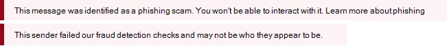
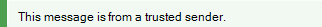

# Sugerencias de seguridad en mensajes de correo electrónico

[!INCLUDE [Microsoft 365 Defender rebranding](../includes/microsoft-defender-for-office.md)]

**Se aplica a**
- [Exchange Online Protection](exchange-online-protection-overview.md)
- [Plan 1 y Plan 2 de Microsoft Defender para Office 365](office-365-atp.md)
- [Microsoft 365 Defender](../mtp/microsoft-threat-protection.md)

Exchange Online Protection (EOP) y Microsoft 365 le protegen con correo no deseado, suplantación de identidad (phishing) y prevención de malware. Hoy en día, algunos de estos ataques están tan bien diseñados que parecen legítimos. Enviar mensajes a la carpeta correo no deseado no siempre es suficiente. Ahora, cuando comprueba el correo electrónico en Outlook, Outlook en la Web o en cualquier cliente de correo electrónico, EOP comprueba automáticamente el remitente y agrega una sugerencia de seguridad en la parte superior del correo electrónico.

Las sugerencias de seguridad en Outlook no dependen de la versión de Outlook que esté usando porque la sugerencia de seguridad se abre y se inserta directamente en el cuerpo del mensaje. Esto significa que la sugerencia de seguridad se mostrará en cualquier cliente de correo electrónico que use. Se realiza en el nivel de filtro de correo electrónico y no se representa en el nivel de cliente de correo, por lo que no solo se muestra en cualquier versión de Outlook, sino que también se muestra en cualquier cliente de correo electrónico.

La sugerencia de seguridad, un mensaje codificado por colores, le advertirá sobre mensajes potencialmente dañinos. La mayoría de los mensajes de la bandeja de entrada no tendrán una sugerencia de seguridad. Solo los verá cuando EOP y Microsoft 365 tengan información que necesite para ayudar a evitar ataques de correo no deseado, suplantación de identidad (phishing) y malware. Si las sugerencias de seguridad se muestran en la bandeja de entrada, puedes usar los siguientes ejemplos para obtener más información sobre cada tipo de sugerencia de seguridad.

- Correo sospechoso (sugerencia de seguridad roja).

    

    Una sugerencia de seguridad roja en un correo electrónico significa que el mensaje que recibió contiene algo sospechoso, como una estafa de suplantación de identidad. Se recomienda eliminar este tipo de mensaje de correo electrónico de la bandeja de entrada sin abrirlo.

- Correo seguro (sugerencia de seguridad verde).

    

    Además de los mensajes no seguros, también le hablaremos sobre los mensajes válidos de remitentes en los que confíamos con una sugerencia de seguridad verde. Una sugerencia de seguridad verde en un correo electrónico significa que hemos comprobado el remitente del mensaje y comprobado que es seguro. Microsoft mantiene esta lista de remitentes de confianza que incluye organizaciones financieras y otras que suelen suplantar o suplantar.

## Trabajar con sugerencias de seguridad

Las sugerencias de seguridad siempre están habilitadas para Outlook en la Web, aunque no todos los mensajes recibirán uno. Los administradores pueden desactivar las sugerencias de seguridad para otros clientes de correo electrónico, como Outlook. Para obtener más información, consulte [Configurar directivas contra correo electrónico no deseado en Office 365 ](configure-your-spam-filter-policies.md).

Si no está de acuerdo con cómo EOP clasificó un mensaje (es decir, el mensaje no es correo no deseado o debería haber sido marcado como correo no deseado), puede enviar los mensajes a Microsoft para su análisis para mejorar su experiencia. Para obtener instrucciones, vea [Notificar mensajes y archivos a Microsoft.](report-junk-email-messages-to-microsoft.md) También puede hacer clic en el vínculo Comentarios en la sugerencia de seguridad para enviar comentarios directamente a Microsoft para ayudarnos a mejorar.
