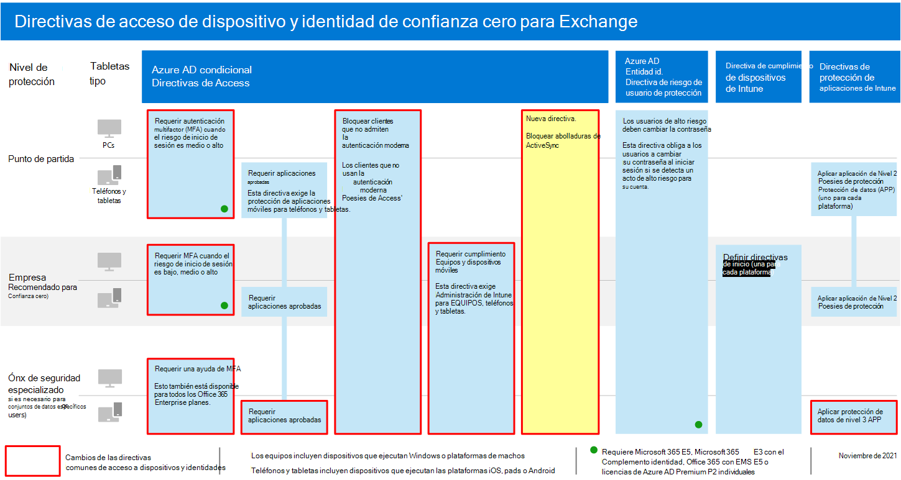

# <a name="policy-recommendations-for-securing-email"></a>Recomendaciones de directivas para proteger el correo electrónico

**Se aplica a**
- [Exchange Online Protection](https://go.microsoft.com/fwlink/?linkid=2148611)
- [Plan 1 y Plan 2 de Microsoft Defender para Office 365](https://go.microsoft.com/fwlink/?linkid=2148715)


En este artículo se describe cómo implementar las directivas recomendadas de acceso a dispositivos e identidades para proteger el correo electrónico de la organización y los clientes de correo electrónico que admiten la autenticación moderna y el acceso condicional. Esta guía se basa en las directivas comunes [de acceso](identity-access-policies.md) a dispositivos e identidades y también incluye algunas recomendaciones adicionales.

Estas recomendaciones se basan en tres niveles diferentes de seguridad y protección que se pueden aplicar en función de la granularidad de sus **necesidades:** línea **base,** confidencial y **altamente regulado.** Puede aprender más sobre estos niveles de seguridad y los sistemas operativos de cliente recomendados, a los que hacen referencia estas recomendaciones, en la [introducción a las directivas y configuraciones de seguridad recomendadas](microsoft-365-policies-configurations.md).

Estas recomendaciones requieren que los usuarios usen clientes de correo electrónico modernos, incluidos Outlook para iOS y Android en dispositivos móviles. Outlook para iOS y Android ofrece compatibilidad con las mejores características de Office 365. Estas aplicaciones móviles de Outlook también están diseñadas con funcionalidades de seguridad que admiten el uso móvil y funcionan junto con otras capacidades de seguridad de la nube de Microsoft. Para obtener más información, vea las preguntas más frecuentes sobre [Outlook para iOS y Android.](https://docs.microsoft.com/exchange/clients-and-mobile-in-exchange-online/outlook-for-ios-and-android/outlook-for-ios-and-android-faq)

## <a name="update-common-policies-to-include-email"></a>Actualizar directivas comunes para incluir correo electrónico

Para proteger el correo electrónico, en el siguiente diagrama se ilustran las directivas que se actualizarán a partir de las directivas comunes de acceso a dispositivos e identidades.

[](https://github.com/MicrosoftDocs/microsoft-365-docs/raw/public/microsoft-365/media/microsoft-365-policies-configurations/identity-access-ruleset-mail.png)

[Ver una versión más grande de esta imagen](https://github.com/MicrosoftDocs/microsoft-365-docs/raw/public/microsoft-365/media/microsoft-365-policies-configurations/identity-access-ruleset-mail.png)

Tenga en cuenta la adición de una nueva directiva para Exchange Online para bloquear los clientes de ActiveSync. Esto fuerza el uso de Outlook Mobile.

Si incluyó Exchange Online y Outlook en el ámbito de las directivas al configurarlas, solo tiene que crear la nueva directiva para bloquear los clientes de ActiveSync. Revise las directivas enumeradas en la tabla siguiente y realice las adiciones recomendadas o confirme que ya están incluidas. Cada directiva se vincula a las instrucciones de configuración asociadas [en directivas comunes de acceso a dispositivos e identidades.](identity-access-policies.md)

|Nivel de protección|Directivas|Más información|
|---|---|---|
|**Baseline**|[Requerir MFA cuando el riesgo de inicio de sesión *es medio* o *alto*](identity-access-policies.md#require-mfa-based-on-sign-in-risk)|Incluir Exchange Online en la asignación de aplicaciones en la nube|
||[Bloquear a los clientes que no sean compatibles con la autenticación moderna](identity-access-policies.md#block-clients-that-dont-support-multi-factor)|Incluir Exchange Online en la asignación de aplicaciones en la nube|
||[Aplicar directivas de protección de datos de APP](identity-access-policies.md#apply-app-data-protection-policies)|Asegúrese de que Outlook está incluido en la lista de aplicaciones. Asegúrate de actualizar la directiva para cada plataforma (iOS, Android, Windows)|
||[Requerir aplicaciones aprobadas y protección de aplicaciones](identity-access-policies.md#require-approved-apps-and-app-protection)|Incluir Exchange Online en la lista de aplicaciones en la nube|
||[Exigir equipos PC compatibles](identity-access-policies.md#require-compliant-pcs-but-not-compliant-phones-and-tablets)|Incluir Exchange Online en la lista de aplicaciones en la nube|
||[Bloquear clientes de ActiveSync](#block-activesync-clients)|Agregar esta nueva directiva|
|**Confidencial**|[Requerir MFA cuando el riesgo de inicio de sesión *es bajo,* *medio* o *alto*](identity-access-policies.md#require-mfa-based-on-sign-in-risk)|Incluir Exchange Online en la asignación de aplicaciones en la nube|
||[Requerir equipos y *dispositivos* móviles compatibles](identity-access-policies.md#require-compliant-pcs-and-mobile-devices)|Incluir Exchange Online en la lista de aplicaciones en la nube|
|**Extremadamente regulado**|[*Requerir* siempre MFA](identity-access-policies.md#require-mfa-based-on-sign-in-risk)|Incluir Exchange Online en la asignación de aplicaciones en la nube|
|

## <a name="block-activesync-clients"></a>Bloquear clientes de ActiveSync

Esta directiva impide que los clientes de ActiveSync omitan otras directivas de acceso condicional. La configuración de directiva solo se aplica a los clientes de ActiveSync. Al seleccionar Requerir **[directiva de protección de aplicaciones,](https://docs.microsoft.com/azure/active-directory/conditional-access/concept-conditional-access-grant#require-app-protection-policy)** esta directiva bloquea los clientes de ActiveSync. Puede encontrar detalles sobre cómo crear esta directiva en Requerir directiva de protección de aplicaciones para el acceso a aplicaciones en la nube [con acceso condicional.](https://docs.microsoft.com/azure/active-directory/conditional-access/app-protection-based-conditional-access)

- Siga el "Paso 2: Configurar una directiva de acceso condicional de Azure AD para Exchange Online con ActiveSync (EAS)" en el escenario 1: las aplicaciones de [Office 365](https://docs.microsoft.com/azure/active-directory/conditional-access/app-protection-based-conditional-access#scenario-1-office-365-apps-require-approved-apps-with-app-protection-policies)requieren aplicaciones aprobadas con directivas de protección de aplicaciones, lo que impide que los clientes de Exchange ActiveSync que aprovechan la autenticación básica se conecten a Exchange Online.

También puede usar directivas de autenticación para [deshabilitar la autenticación básica,](https://docs.microsoft.com/exchange/clients-and-mobile-in-exchange-online/disable-basic-authentication-in-exchange-online)lo que obliga a todas las solicitudes de acceso de cliente a usar la autenticación moderna.

## <a name="limit-access-to-exchange-online-from-outlook-on-the-web"></a>Limitar el acceso a Exchange Online desde Outlook en la Web

Puede restringir la capacidad de los usuarios de descargar datos adjuntos de Outlook en la Web en dispositivos umnanaged. Los usuarios de estos dispositivos pueden ver y editar estos archivos con Office Online sin perder y almacenar los archivos en el dispositivo. También puede impedir que los usuarios vean datos adjuntos en un dispositivo no administrado.

Para ello, siga estos pasos:

1. [Conéctese a una sesión de PowerShell remoto de Exchange Online.](https://docs.microsoft.com/powershell/exchange/exchange-online/connect-to-exchange-online-powershell/connect-to-exchange-online-powershell)
2. Si aún no tiene una directiva de buzón de OWA, cree una con el cmdlet [New-OwaMailboxPolicy.](https://docs.microsoft.com/powershell/module/exchange/new-owamailboxpolicy)
3. Si desea permitir la visualización de datos adjuntos pero sin descargarlos, use este comando:

   ```powershell
   Set-OwaMailboxPolicy -Identity Default -ConditionalAccessPolicy ReadOnly
   ```

4. Si desea bloquear datos adjuntos, use este comando:

   ```powershell
   Set-OwaMailboxPolicy -Identity Default -ConditionalAccessPolicy ReadOnlyPlusAttachmentsBlocked
   ```

5. En Azure Portal, cree una nueva directiva de acceso condicional con esta configuración:

   **Asignaciones** \> **Usuarios y grupos:** seleccione los usuarios y grupos adecuados para incluir y excluir.

   **Asignaciones** \> **Acciones o aplicaciones en la nube** \> **Aplicaciones en la nube** \> **Incluir** \> **Seleccionar aplicaciones:** seleccionar **Office 365 Exchange Online**

   **Controles de acceso** \> **Sesión:** seleccione **Usar restricciones aplicadas por la aplicación**

## <a name="require-that-ios-and-android-devices-must-use-outlook"></a>Requerir que los dispositivos iOS y Android deben usar Outlook

Para asegurarse de que los usuarios de dispositivos iOS y Android solo puedan tener acceso al contenido de trabajo o escuela con Outlook para iOS y Android, necesita una directiva de acceso condicional dirigida a esos usuarios potenciales.

Vea los pasos para configurar esta directiva en [Administrar el acceso de colaboración de mensajería mediante Outlook para iOS y Android.]( https://docs.microsoft.com/mem/intune/apps/app-configuration-policies-outlook#apply-conditional-access)

## <a name="set-up-message-encryption"></a>Configurar el cifrado de mensajes

Con las nuevas funcionalidades de Cifrado de mensajes de Office 365 (OME), que aprovechan las características de protección de Azure Information Protection, su organización puede compartir fácilmente el correo electrónico protegido con cualquier persona en cualquier dispositivo. Los usuarios pueden enviar y recibir mensajes protegidos con otras organizaciones de Microsoft 365, así como con no clientes que usen Outlook.com, Gmail y otros servicios de correo electrónico.

Para obtener más información, vea Configurar nuevas capacidades de cifrado de [mensajes de Office 365.](https://docs.microsoft.com/microsoft-365/compliance/set-up-new-message-encryption-capabilities)

## <a name="next-steps"></a>Siguientes pasos


Configure las directivas de acceso condicional para:

- [Microsoft Teams](teams-access-policies.md)
- [SharePoint](sharepoint-file-access-policies.md)
