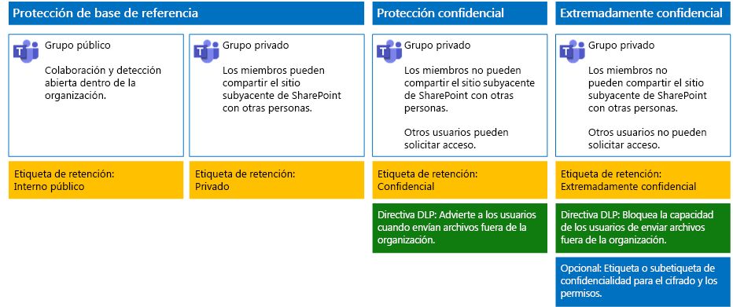

# Protección de archivos en Microsoft Teams

En este artículo se ofrecen recomendaciones para configurar equipos en Microsoft Teams y sus correspondientes sitios de SharePoint subyacentes, de forma que se equilibre la seguridad con la facilidad de colaboración. Aquí se definen cuatro configuraciones distintas, empezando por un sitio público dentro de la organización con las directivas de uso compartido más abiertas. Cada configuración adicional representa un paso significativo para la protección, pero a costa de que el correspondiente conjunto de miembros del equipo pierda capacidad de acceder a los archivos almacenados en Teams y de colaborar en ellos. Use estas recomendaciones como punto de partida y ajuste las configuraciones para satisfacer las necesidades de su organización. 
  
Las configuraciones que se explican en este artículo concuerdan con las recomendaciones de Microsoft para los tres niveles de protección de datos, identidades y dispositivos:
  
- Protección de base de referencia
    
- Protección confidencial
    
- Protección extremadamente confidencial
    
Para más información sobre estos niveles y capacidades recomendadas para cada nivel, vea los siguientes recursos. 
  
- [Protección de identidades y dispositivos para Office 365](https://docs.microsoft.com/office365/enterprise/microsoft-cloud-it-architecture-resources#BKMK_O365IDP)
    
- [Soluciones de protección de archivos en Office 365](https://docs.microsoft.com/office365/enterprise/microsoft-cloud-it-architecture-resources#BKMK_O365fileprotect)
    
## Introducción a las capacidades

Las recomendaciones de equipos protegidos abarcan toda una variedad de capacidades de Microsoft 365. En la siguiente ilustración se muestran las configuraciones recomendadas.

Como se muestra:
  
- La protección de línea base incluye un equipo público y otro privado. Los equipos públicos son aquellos visibles y accesibles por cualquier persona de la organización. Los equipos privados solo pueden detectarlos y acceder a ellos los miembros del equipo. Ambas configuraciones permiten compartir el sitio de SharePoint subyacente en el que se almacenan los archivos fuera del grupo del equipo.
 
- Los equipos que presentan una protección sensible y extremadamente confidencial son equipos privados, en los que el uso compartido y la solicitud de acceso al sitio subyacente están limitados.

    
- Las [etiquetas de retención](../../compliance/labels.md) proporcionan una manera de clasificar archivos dentro de los sitios de SharePoint subyacentes. Cada sitio de SharePoint subyacente está configurado para etiquetar automáticamente los archivos de bibliotecas de documentos con una etiqueta de retención predeterminada. Las etiquetas de este ejemplo son Interno público, Privado, Confidencial y Extremadamente confidencial, que se corresponden con las cuatro configuraciones de equipo. Los usuarios pueden cambiar las etiquetas de archivos concretos, pero esta configuración garantiza que todos los archivos reciben una etiqueta predeterminada.
    
- Las directivas de [prevención de pérdida de datos](../../compliance/data-loss-prevention-policies.md) (DLP) se configuran para que las etiquetas de retención Confidencial y Extremadamente confidencial puedan advertir o prevenir a los usuarios cuando intentan enviar estos tipos de archivo fuera de la organización.
    
- Si es necesario para su escenario, puede usar [etiquetas de confidencialidad](../../compliance/sensitivity-labels.md) para proteger archivos confidenciales con cifrado y permisos. Para los clientes de Azure Information Protection, puede usar las etiquetas de Azure Information Protection en el Centro de cumplimiento de Microsoft 365 y las etiquetas se sincronizarán con el portal de Azure en caso de que decida realizar una configuración adicional o avanzada. Las etiquetas de Azure Information Protection y etiquetas de confidencialidad de Office 365 son totalmente compatibles entre sí. Esto significa que, por ejemplo, si tiene contenido con la etiqueta de Azure Information Protection, no tendrá que volver a clasificar o cambiar las etiquetas de su contenido. No todos los clientes necesitan este nivel de protección. 
    
## Configuración de SharePoint y OneDrive para toda la organización

SharePoint y OneDrive incluyen opciones de configuración para toda la organización que afectan a todos los sitios y usuarios. Algunas de estas opciones también se pueden ajustar en el nivel de sitio para que sea más restrictivo (pero no para que lo sea menos). En esta sección se describe la configuración de todos los inquilinos que afecta a la seguridad y la colaboración. 
  
### Compartir

Para esta solución, se recomienda la siguiente configuración para toda la organización:
  
- Mantenga la directiva de uso compartido predeterminada, que permite compartir con todos los tipos de cuenta, incluso de forma anónima.
    
- Establezca la expiración de los vínculos anónimos, si así lo quiere.
    
- Establezca en Interno el tipo de vínculo predeterminado para el uso compartido. De esta manera se previene la pérdida accidental de datos fuera de la organización.
    
Aunque pueda parecer contradictorio permitir el uso compartido externo, este método proporciona más control sobre el uso compartido de archivos en comparación con el envío de archivos por correo electrónico. SharePoint y Outlook funcionan conjuntamente para proporcionar una colaboración segura en los archivos. 
  
- Outlook comparte un vínculo a un archivo de manera predeterminada en lugar de enviar el archivo por correo electrónico. 
    
- Con SharePoint y OneDrive, es muy fácil compartir vínculos a archivos con colaboradores que se encuentran tanto dentro como fuera de la organización.
    
También tiene controles que ayudan a regir el uso compartido externo. Por ejemplo, puede:
  
- Deshabilitar un vínculo de invitado anónimo.
    
- Revocar el acceso de usuario a un sitio.
    
- Ver quién tiene acceso a un sitio o documento específico.
    
- Establecer la expiración de vínculos anónimos de uso compartido (configuración de inquilino).
    
- Limitar quién puede compartir fuera de la organización (configuración de inquilino).
    
### Combinar el uso compartido externo con la prevención de pérdida de datos (DLP)

Si no permite el uso compartido externo, los usuarios con necesidades empresariales encontrarán métodos y herramientas alternativas. Microsoft recomienda combinar el uso compartido externo con directivas DLP para proteger archivos confidenciales y altamente confidenciales.
  
### Configuración de acceso a dispositivos

La configuración de acceso a dispositivos para SharePoint y OneDrive permite determinar si el acceso está limitado solo al explorador (no se pueden descargar archivos) o el acceso está bloqueado. Para obtener más información, consulte [Controlar el acceso desde dispositivos no administrados](https://docs.microsoft.com/sharepoint/control-access-from-unmanaged-devices). 

Para usar la configuración de acceso de dispositivo con las directivas de acceso condicional recomendadas en Azure Active Directory, vea [Recomendaciones de directivas para la protección de sitios y archivos de SharePoint](https://docs.microsoft.com/microsoft-365/enterprise/sharepoint-file-access-policies).
  
Revise esta configuración para decidir si quiere cambiar la configuración predeterminada de los sitios de OneDrive. Actualmente, las configuraciones de acceso a dispositivos y de uso compartido están duplicadas desde el Centro de administración de SharePoint y se aplican a ambos entornos.
  
## Configuración de sitios de equipo y de SharePoint

En la siguiente tabla se resume la configuración de cada uno de los equipos y de su correspondiente sitio de SharePoint que se han descrito en este artículo. Use estas configuraciones como punto de partida y ajuste los tipos de sitio y las configuraciones para satisfacer las necesidades de la organización. No todas las organizaciones necesitan todos los tipos de equipo. El número de organizaciones que necesita equipos con una protección extremadamente confidencial es muy reducido.
  
||||||
|:-----|:-----|:-----|:-----|:-----|
||**Protección de base de referencia n.º 1**   |**Protección de base de referencia n.º 2**   |**Protección confidencial**   |**Extremadamente confidencial**   |
|Descripción    |Equipo público con colaboración y detección abierta dentro de la organización.    |Equipo privado con uso compartido del sitio de SharePoint subyacente permitido fuera del grupo.    |Equipo privado, pero el uso compartido del sitio de SharePoint subyacente se permite solo a los miembros del sitio. DLP avisa a los usuarios cuando intentan enviar archivos fuera de la organización.    |Equipo privado con etiquetas de confidencialidad de cifrado de archivos y permisos que se trasladan junto con el archivo. DLP impide a los usuarios enviar archivos fuera de la organización.    |
|Sitio de grupo público o privado    |Público    |Private    |Private    |Private    |
|¿Quién tiene acceso?    |Todos los usuarios de la organización, incluidos los usuarios B2B.    |Solo los miembros del sitio. Otros usuarios pueden pedir acceso.    |Solo los miembros del equipo. Otros usuarios pueden solicitar acceso al sitio subyacente, que deberá aprobar el propietario del equipo.    |Solo los miembros. Otros usuarios no pueden solicitar acceso al sitio subyacente.    |
|Controles de uso compartido en el nivel de sitio    |Uso compartido permitido con cualquier usuario. Configuración predeterminada.    |Uso compartido permitido con cualquier usuario. Configuración predeterminada.    |Los miembros no pueden compartir el acceso al sitio.    Los usuarios que no son miembros pueden pedir acceso al sitio, pero estas solicitudes deben ser supervisadas por un propietario de grupo del equipo.    |Los miembros no pueden compartir el acceso al sitio.    Los usuarios no miembros no pueden pedir acceso al sitio o al contenido.    |
|Controles de acceso a dispositivos en el nivel de sitio    |Sin controles adicionales.    |Sin controles adicionales.    |Impide a los usuarios descargar archivos en dispositivos no compatibles o que no están unidos a ningún dispositivo. Esto permite solamente el acceso de explorador desde los demás dispositivos.    |Impedir quela descarga de archivos en dispositivos de dominios no combinados o no compatibles.    |
|Etiquetas de retención    |Interno público    |Private    |Confidencial    |Extremadamente confidencial    |
|Directivas DLP    |||Advierten a los usuarios cuando se envían archivos etiquetados como Confidenciales fuera de la organización.    Para bloquear el uso compartido externo de tipos de datos confidenciales, como números de tarjeta de crédito u otros datos personales, puede configurar directivas DLP adicionales para estos tipos de datos (incluidos los tipos de datos personalizados que configure).    |Impiden a los usuarios enviar archivos etiquetados como Extremadamente confidencial fuera de la organización. Permiten a los usuarios anular esto si proporcionan una justificación que incluya el nombre del usuario con el que van a compartir el archivo.    |
|Etiquetas de confidencialidad    ||||Use etiquetas de confidencialidad para cifrar y conceder permisos a los archivos. Esta protección se traslada junto con los archivos en caso de que estos se filtren del sitio de SharePoint subyacente.    |
   
Para conocer los pasos necesarios para la implementación de los cuatro tipos diferentes de sitios en esta solución, vea [Implementar equipos con tres niveles de protección para los archivos](deploy-teams-three-tiers.md).
  
## Etiquetas de retención de Office 365

Se recomienda usar etiquetas de retención para entornos con datos confidenciales. Después de configurar y publicar las etiquetas de retención:
  
- Puede aplicar una etiqueta predeterminada a una biblioteca de documentos en el sitio de SharePoint subyacente para que todos los documentos de la sección **Archivos** del equipo obtengan la etiqueta predeterminada. 
    
- Aplicar etiquetas a contenido automáticamente si coincide con condiciones específicas.
    
- Puede aplicar directivas DLP basadas en etiquetas de retención.
    
- Las personas de la organización pueden aplicar una etiqueta manualmente a contenido en Outlook en la Web, Outlook 2010 y versiones posteriores, OneDrive, SharePoint y grupos de Office 365. A menudo, los usuarios son los que mejor saben con qué tipo de contenido están trabajando, de modo que pueden clasificarlo y aplicar la directiva de DLP adecuada.
    
Como se muestra, esta solución incluye la creación de las siguientes etiquetas de retención:
  
- Extremadamente confidencial
    
- Confidencial
    
- Private
    
- Interno público
    
Estas etiquetas se asignan a los sitios recomendados en las ilustraciones y los gráficos antes citados en este artículo. Esta solución recomienda configurar las directivas DLP para evitar la filtración de archivos etiquetados como “Confidencial” y “Extremadamente confidencial” a miembros ajenos a la organización.
  
Para conocer los pasos necesarios para configurar etiquetas de retención y directivas DLP en esta solución, consulte [Protección de archivos en equipos con etiquetas de retención y DLP](deploy-teams-retention-DLP.md).
  
## Etiquetas de confidencialidad 

Si existe una justificación para sus circunstancias de seguridad, puede usar las etiquetas de confidencialidad para aplicar protección a los archivos donde quiera que vayan. Las etiquetas de confidencialidad en el Centro de cumplimiento de Microsoft 365 y las etiquetas de Azure Information Protection son las mismas. Para esta solución, se recomienda usar una etiqueta o una subetiqueta de confidencialidad para conceder permisos y cifrar los archivos que deben protegerse con el máximo nivel de seguridad. 

Para obtener más información, vea [Información general sobre las etiquetas de retención](../../compliance/sensitivity-labels.md).

Para conocer los pasos para configurar etiquetas de confidencialidad en esta solución, vea [Proteger archivos en equipos con etiquetas de confidencialidad](deploy-teams-sensitivity-labels.md).
   
   
## Vea también
  
[Adopción de la nube y soluciones híbridas](https://docs.microsoft.com/office365/enterprise/cloud-adoption-and-hybrid-solutions)
  
