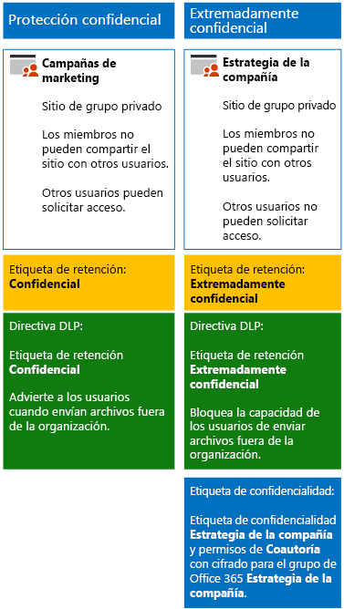

# <a name="secure-sharepoint-online-sites-in-a-devtest-environment"></a>Protección de sitios de SharePoint Online en un entorno de desarrollo y pruebas

En este artículo, se ofrecen instrucciones paso a paso para crear un entorno de desarrollo y pruebas donde se incluyan sitios de SharePoint Online con información extremadamente confidencial para la solución [Protección de archivos y sitios de SharePoint Online](secure-sharepoint-online-sites-and-files.md).



Use este entorno de desarrollo y pruebas para experimentar y adaptar la configuración a sus necesidades específicas antes de implementar estos tipos de sitios de grupo en producción.

## <a name="phase-1-build-out-your-microsoft-365-enterprise-test-environment"></a>Fase 1: Crear el entorno de pruebas de Microsoft 365 Enterprise

Si solamente quiere probar sitios de grupo confidenciales y extremadamente confidenciales de forma ligera con los requisitos mínimos, siga las instrucciones de [Configuración básica ligera](https://docs.microsoft.com/microsoft-365/enterprise/lightweight-base-configuration-microsoft-365-enterprise).

Si quiere probar los sitios de grupo confidenciales y extremadamente confidenciales en una empresa simulada, siga las instrucciones de [Sincronización de hash de contraseñas](https://docs.microsoft.com/microsoft-365/enterprise/password-hash-sync-m365-ent-test-environment).

> [!NOTE]
> Probar sitios de grupo confidenciales y extremadamente confidenciales no requiere el entorno de pruebas de una empresa simulada, que incluye una intranet simulada conectada a Internet y la sincronización de directorios de un bosque de Active Directory Domain Services (AD DS). Aquí se ofrece como opción para poder probar sitios de grupo confidenciales y extremadamente confidenciales y experimentar con esa posibilidad en un entorno que representa una organización típica.

## <a name="phase-2-create-and-configure-your-azure-active-directory-ad-groups-and-users"></a>Fase 2: Crear y configurar los usuarios y grupos de Azure Active Directory (AD)

En esta fase se crean y configuran los grupos y usuarios de Azure AD para la organización ficticia.

Primero, cree dos grupos para una organización típica en Azure Portal.

1. Cree una pestaña aparte en el explorador y, después, vaya a Azure Portal, en [https://portal.azure.com](https://portal.azure.com). Si es necesario, inicie sesión con las credenciales de la cuenta de administrador global de la suscripción de pago o de la suscripción de prueba de Microsoft 365 E5.

2. En Azure Portal, haga clic en **Azure Active Directory > Grupos**.

3. En la hoja **Todos los grupos**, haga clic en **+ Nuevo grupo**.

4. En la hoja **Grupo**:

   - Seleccione **Seguridad** en **Tipo de grupo**.

   - Escriba **Directivos** en **Nombre**.

   - Seleccione **Asignada** en **Tipo de pertenencia**.

5. Haga clic en **Crear** y, después, cierre la hoja **Grupo**.

6. Repita los pasos 3-5 para crear un nuevo grupo llamado **Personal de marketing**.

Después, configure la asignación automática de licencias para que se asignen licencias de forma automática a los miembros de los grupos para las suscripciones de Microsoft 365 y EMS.

1. En Azure Portal, haga clic en **Azure Active Directory > Licencias > Todos los productos**.

2. En la lista, seleccione **Microsoft 365 Enterprise E5** y haga clic en **Asignar**.

3. En la hoja **Asignar licencia**, haga clic en **Usuarios y grupos**.

4. En la lista de grupos, seleccione lo siguiente:

   - C-Suite

   - Personal de marketing

5. Haga clic en **Seleccionar** y, después, en **Asignar**.

6. Cierre la pestaña Azure Portal del explorador.

Después conéctese al módulo de PowerShell de Azure Active Directory para Graph como se indica en el artículo [Connect with the Azure Active Directory PowerShell for Graph module ](https://docs.microsoft.com/office365/enterprise/powershell/connect-to-office-365-powershell#connect-with-the-azure-active-directory-powershell-for-graph-module).

Rellene el nombre de la organización, la ubicación y una contraseña común; después, ejecute los siguientes comandos desde el símbolo del sistema de PowerShell o el entorno de scripts integrado (ISE) para crear cuentas de usuario y agregarlas a sus respectivos grupos:

```powershell
$orgName="<organization name, such as contoso for the contoso.onmicrosoft.com trial subscription domain name>"
$location="<the ISO ALPHA2 country code, such as US for the United States>"
$commonPassword="<common password for all the new accounts>"

$PasswordProfile=New-Object -TypeName Microsoft.Open.AzureAD.Model.PasswordProfile
$PasswordProfile.Password=$commonPassword

$groupName="C-Suite"
$userNames=@("CEO","CFO","CIO")
$groupID=(Get-AzureADGroup | Where { $_.DisplayName -eq $groupName }).ObjectID
ForEach ($element in $userNames){
New-AzureADUser -DisplayName $element -PasswordProfile $PasswordProfile -UserPrincipalName ($element + "@" + $orgName + ".onmicrosoft.com") -AccountEnabled $true -MailNickName $element -UsageLocation $location
Add-AzureADGroupMember -RefObjectId (Get-AzureADUser | Where { $_.DisplayName -eq $element }).ObjectID -ObjectId $groupID
}
$groupName="Marketing staff"
$userNames=@("Marketing1", "Marketing2")
$groupID=(Get-AzureADGroup | Where { $_.DisplayName -eq $groupName }).ObjectID
ForEach ($element in $userNames){
New-AzureADUser -DisplayName $element -PasswordProfile $PasswordProfile -UserPrincipalName ($element + "@" + $orgName + ".onmicrosoft.com") -AccountEnabled $true -MailNickName $element -UsageLocation $location
Add-AzureADGroupMember -RefObjectId (Get-AzureADUser | Where { $_.DisplayName -eq $element }).ObjectID -ObjectId $groupID
}
```

> [!NOTE]
> Se usa una contraseña común para automatizar y facilitar la configuración de un entorno de prueba y desarrollo. Evidentemente, esto no se recomienda en el caso de suscripciones de producción.

Después, siga estos pasos para comprobar que la asignación de licencias basada en grupos funcione correctamente.

1. En la pestaña **Inicio de Microsoft Office** del explorador, haga clic en el icono **Administrador**.

2. En la nueva pestaña **Centro de administración de Microsoft 365** del explorador, haga clic en **Usuarios**.

3. En la lista de usuarios, haga clic en **CEO** (Consejero delegado).

4. En el panel que muestra las propiedades de la cuenta de usuario **CEO**, compruebe que dicha cuenta tiene asignada la licencia **Microsoft 365 Enterprise E5** (en **Licencias de productos**).

## <a name="phase-3-create-retention-labels"></a>Fase 3: Crear etiquetas de retención

En esta fase crea las etiquetas de retención de los documentos en los sitios de grupo de SharePoint.

1. Inicie sesión en el [portal de cumplimiento de Microsoft 365](https://compliance.microsoft.com) con su cuenta de administrador global.

2. En la pestaña **Inicio: cumplimiento de Microsoft 365** del navegador, haga clic en **Clasificaciones > Etiquetas**.

3. Haga clic en **Etiquetas de retención > Crear una etiqueta**.

4. En el panel **Nombre de la etiqueta**, escriba **Confidencial** en **Asignar un nombre a la etiqueta**, y después haga clic en **Siguiente**.

5. En el panel **descriptores de plan de archivos**, haga clic en **Siguiente**.

6. En el panel **Configuración de etiqueta**, si es necesario, marque **Retención** como **Activada** y haga clic en **Siguiente**.

7. En el panel **Revise su configuración**, haga clic en **Crear la etiqueta**.

8. Repita los pasos 3-7 para crear otra etiqueta de retención llamada **Extremadamente confidencial**.

9. En el panel **Inicio > Etiquetas**, haga clic para **Publish labels** (Publicar etiquetas).

10. En el panel **Elegir etiquetas para publicar**, haga clic en **Elegir etiquetas para publicar**.

11. En el panel de **elección de etiquetas**, haga clic en **Agregar** y seleccione las cuatro etiquetas.

12. Haga clic en **Listo**.

13. En el panel **Elegir etiquetas para publicar**, haga clic en **Siguiente**.

14. En el panel **Seleccionar ubicaciones**, haga clic en **Siguiente**.

15. En el panel **Escriba un nombre para la directiva**, escriba **Organización de ejemplo** en **Nombre** y haga clic en **Siguiente**.

16. En el panel **Revise su configuración**, haga clic en **Publicar etiquetas** y luego en **Cerrar**.

## <a name="phase-4-create-your-team-sites"></a>Fase 4: Crear los sitios de grupo

En esta fase se crean y configuran los sitios de grupo confidenciales y extremadamente confidenciales de la organización de ejemplo.

### <a name="sensitive-team-site-for-marketing-campaigns"></a>Sitio de grupo confidencial para campañas de marketing

Primero, cree un sitio de grupo confidencial para que los miembros del grupo de marketing puedan colaborar en las campañas de marketing existentes.

1. [Cree un sitio de grupo privado](https://support.office.com/article/ef10c1e7-15f3-42a3-98aa-b5972711777d) llamado **Campañas de marketing**.

2. En la barra de herramientas, haga clic en el sitio de grupo de SharePoint, en el icono de configuración y, luego, en **Permisos del sitio**.

3. En el panel **Permisos del sitio**, en **Configuración de uso compartido**, haga clic en **Cambiar configuración de uso compartido**.

4. En **Permisos de uso compartido**, seleccione **Solo los propietarios del sitio pueden compartir archivos, carpetas, además del sitio** y, luego, haga clic en **Guardar**.

Después, configure la carpeta de documentos del sitio de grupo de SharePoint de Campañas de marketing para la etiqueta de retención Confidencial.

1. En la pestaña **Campañas de marketing: Inicio** del explorador, haga clic en **Documentos**.

2. Haga clic en el icono de configuración y luego en **Configuración de biblioteca**.

3. En **Permisos y administración**, haga clic en **Apply label to items in this library** (Aplicar la etiqueta a los elementos de esta biblioteca).

4. En **Configuración-Aplicar etiqueta**, seleccione **Confidencial** y haga clic en **Guardar**.

Después, configure una directiva de prevención de pérdida de datos (DLP) que notifique a los usuarios cada vez que compartan un documento con la etiqueta Confidencial, lo que incluye documentos en el sitio Campañas de marketing, fuera de la organización.

1. Inicie sesión en el [portal de cumplimiento de Microsoft 365](https://compliance.microsoft.com/) con su cuenta de administrador global.

2. En la nueva pestaña **cumplimiento de Microsoft 365** del explorador, haga clic en **Directivas  > Prevención de pérdida de datos**.

3. En el panel **Inicio > Prevención de pérdida de datos**, haga clic en **Crear una directiva**.

4. En el panel **Start with a template or create a custom policy** (Empezar con una plantilla o crear una directiva personalizada), haga clic en **Personalizada** y luego en **Siguiente**.

5. En el panel **Asignar un nombre a la directiva**, escriba **Sitios de SharePoint con etiqueta Confidencial** en **Nombre** y haga clic en **Siguiente**.

6. En el panel **Elegir ubicaciones**, haga clic en **Let me choose specific locations** (Permitir elegir ubicaciones concretas) y luego en **Siguiente**.

7. En la lista de ubicaciones, deshabilite las ubicaciones **Correo electrónico de Exchange**, **Cuentas de OneDrive** y **mensajes de chat y de canal de Teams** y, después, haga clic en **Siguiente**.

8. En el panel **Personalizar los tipos de información confidencial que quiere proteger**, haga clic en **Editar**.

9. En el panel **Choose the types of content to protect** (Elegir los tipos de contenido que se va a proteger), haga clic en **Agregar** en el cuadro desplegable y luego en **Etiquetas de retención**.

10. En el panel **Etiquetas de retención**, haga clic en **Agregar**, seleccione la etiqueta **Confidencial**, haga clic en **Agregar** y luego en **Listo**.

11. En el panel **Choose the types of content to protect** (Elegir los tipos de contenido que se va a proteger), haga clic en **Guardar**.

12. En el panel **Personalizar los tipos de información confidencial que quiere proteger**, haga clic en **Siguiente**.

13. En el panel **What do you want to do if we detect sensitive info?** (¿Qué quiere hacer si se detecta información confidencial?), haga clic en **Customize the tip and email** (Personalizar la sugerencia y el correo electrónico).

14. En el panel **Customize policy tips and email notifications** (Personalizar sugerencias de directiva y notificaciones de correo electrónico), haga clic en **Customize the policy tip text** (Personalizar el texto de la sugerencia de directiva).

15. En el cuadro de texto, escriba o pegue lo siguiente:

    Para compartir con un usuario de fuera de la organización, descargue el archivo y luego ábralo. Haga clic en Archivo, Proteger documento y Cifrar con contraseña y, luego, especifique una contraseña segura. Envíe la contraseña en un correo electrónico diferente u otro medio de comunicación.

16. Haga clic en **Aceptar**.

17. En el panel **¿Qué quiere hacer si se detecta información confidencial?**, haga clic en **Siguiente**.

18. En el panel **Do you want to turn on the policy or test things out first?** (¿Desea activar la directiva o probarla primero?), haga clic en **Yes, turn it on right away** (Sí, activarla inmediatamente) y luego en **Siguiente**.

19. En el panel **Revise su configuración**, haga clic en **Crear** y, después, en **Cerrar**.

### <a name="company-strategy-team-site"></a>Sitio de equipo de estrategia de empresa

Primero, cree un sitio de grupo extremadamente confidencial para que la alta dirección pueda colaborar en la estrategia de empresa:

1. [Cree un nuevo sitio de grupo privado](https://support.office.com/article/ef10c1e7-15f3-42a3-98aa-b5972711777d) llamado **Estrategia de empresa**.
2. En la barra de herramientas, haga clic en el sitio de grupo de SharePoint, en el icono de configuración y, luego, en **Permisos del sitio**.

3. En el panel **Permisos del sitio**, en **Configuración de uso compartido**, haga clic en **Cambiar configuración de uso compartido**.

4. En **Permisos de uso compartido**, seleccione **Solo los propietarios del sitio pueden compartir archivos, carpetas y el sitio**.

5. Desactive **Permitir solicitudes de acceso** y, después, haga clic en **Guardar**.

Después, configure la carpeta de documentos del sitio de grupo de SharePoint Estrategia de empresa para la etiqueta Extremadamente confidencial.

1. En la pestaña **Estrategia de empresa: Inicio** del explorador, haga clic en **Documentos**.

2. Haga clic en el icono de configuración y luego en **Configuración de biblioteca**.

3. En **Permisos y administración**, haga clic en **Apply label to items in this library** (Aplicar la etiqueta a los elementos de esta biblioteca).

4. En **Configuración-Aplicar etiqueta**, seleccione **Extremadamente confidencial** y haga clic en **Guardar**.

Después, configure una directiva de DLP que impida a los usuarios compartir un documento con la etiqueta Extremadamente confidencial, que incluye los documentos en el sitio Estrategia de empresa, fuera de la organización.

1. Inicie sesión en el [portal de cumplimiento de Microsoft 365](https://compliance.microsoft.com/) con su administrador global.

2. En la nueva pestaña **cumplimiento de Microsoft 365** del explorador, haga clic en **Directivas  > Prevención de pérdida de datos**.

3. En el panel **Inicio > Prevención de pérdida de datos**, haga clic en **Crear una directiva**.

4. En el panel **Start with a template or create a custom policy** (Empezar con una plantilla o crear una directiva personalizada), haga clic en **Personalizada** y luego en **Siguiente**.

5. En el panel **Asignar un nombre a la directiva**, escriba **Sitios de SharePoint con etiqueta Extremadamente confidencial** en **Nombre** y haga clic en **Siguiente**.

6. En el panel **Elegir ubicaciones**, haga clic en **Let me choose specific locations** (Permitir elegir ubicaciones concretas) y luego en **Siguiente**.

7. En la lista de ubicaciones, deshabilite las ubicaciones **Correo electrónico de Exchange**, **Cuentas de OneDrive** y **mensajes de chat y de canal de Teams** y, después, haga clic en **Siguiente**.

8. En el panel **Personalizar los tipos de información confidencial que quiere proteger**, haga clic en **Editar**.

9. En el panel **Choose the types of content to protect** (Elegir los tipos de contenido que se va a proteger), haga clic en **Agregar** en el cuadro desplegable y luego en **Etiquetas de retención**.

10. En el panel **Etiquetas de retención**, haga clic en **Agregar**, seleccione la etiqueta **Extremadamente confidencial**, haga clic en **Agregar** y luego en **Listo**.

11. En el panel **Choose the types of content to protect** (Elegir los tipos de contenido que se va a proteger), haga clic en **Guardar**.

12. En el panel **Personalizar los tipos de información confidencial que quiere proteger**, haga clic en **Siguiente**.

13. En el panel **What do you want to do if we detect sensitive info?** (¿Qué quiere hacer si se detecta información confidencial?), haga clic en **Customize the tip and email** (Personalizar la sugerencia y el correo electrónico).

14. En el panel **Customize policy tips and email notifications** (Personalizar sugerencias de directiva y notificaciones de correo electrónico), haga clic en **Customize the policy tip text** (Personalizar el texto de la sugerencia de directiva).

15. En el cuadro de texto, escriba o pegue lo siguiente:

    Para compartir con un usuario de fuera de la organización, descargue el archivo y luego ábralo. Haga clic en Archivo, Proteger documento y Cifrar con contraseña y, luego, especifique una contraseña segura. Envíe la contraseña en un correo electrónico diferente u otro medio de comunicación.

16. Haga clic en **Aceptar**.

17. En el panel **Do you want to turn on the policy or test things out first?** (¿Desea activar la directiva o probarla primero?), haga clic en **Yes, turn it on right away** (Sí, activarla inmediatamente) y luego en **Siguiente**.

18. En el panel **Do you want to turn on the policy or test things out first?** (¿Desea activar la directiva o probarla primero?), haga clic en **Yes, turn it on right away** (Sí, activarla inmediatamente) y luego en **Siguiente**.

19. En el panel **Revise su configuración**, haga clic en **Crear** y luego en **Cerrar**.

Siga [estas instrucciones ](https://docs.microsoft.com/microsoft-365/compliance/encryption-sensitivity-labels) para configurar una etiqueta de confidencialidad aparte con la siguiente configuración:

- El nombre de la etiqueta es Estrategia de empresa.

- El cifrado está habilitado.

- El grupo Estrategia de empresa tiene permisos de coautoría.

Después de crear la nueva etiqueta, publíquela. Si inicia sesión como miembro del grupo Estrategia de empresa, verá la nueva etiqueta en la opción Confidencialidad en la barra de herramientas Inicio de Word, Excel y PowerPoint. Seleccione la etiqueta Estrategia de empresa en la opción Confidencialidad para asignar dicha etiqueta a un archivo.

Los archivos en la sección de documentos del sitio de grupo de SharePoint de Estrategia de empresa tienen asignada la etiqueta de retención Extremadamente confidencial, y están sujetos a la directiva DLP configurada. Estos archivos también pueden tener asignada la etiqueta de confidencialidad de Estrategia de empresa.

Esta es la configuración resultante del equipo Campañas de marketing y los sitios de grupo Estrategia de empresa.


## <a name="next-step"></a>Paso siguiente

Cuando esté listo para la implementación en producción de sitios seguros de SharePoint Online, vea [Protección de archivos y sitios de SharePoint Online](secure-sharepoint-online-sites-and-files.md) para obtener información detallada y vínculos a artículos de implementación paso a paso.

## <a name="see-also"></a>Consulta también

[Adopción de la nube y soluciones híbridas](https://docs.microsoft.com/office365/enterprise/cloud-adoption-and-hybrid-solutions)

[Guía de seguridad de Microsoft para campañas políticas, ONG y otras organizaciones ágiles](microsoft-security-guidance-for-political-campaigns-nonprofits-and-other-agile-o.md)
