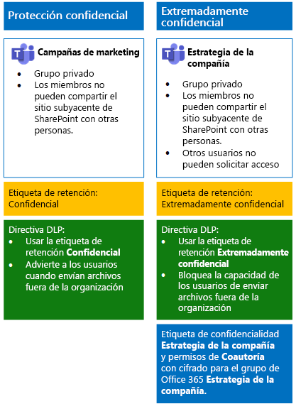
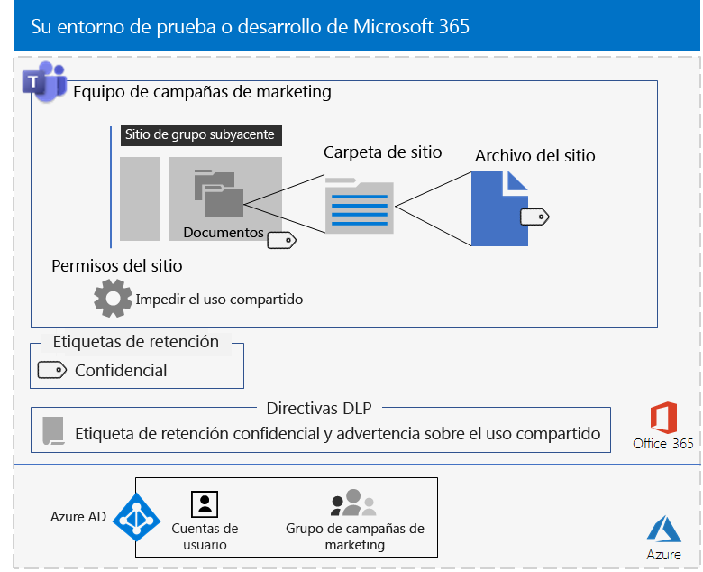
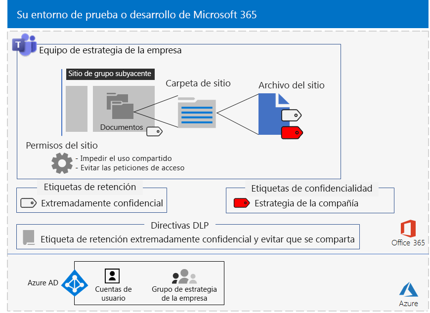

# <a name="secure-teams-for-files-in-a-devtest-environment"></a><span data-ttu-id="c04f8-103">Protección de equipos para archivos en un entorno de desarrollo y pruebas</span><span class="sxs-lookup"><span data-stu-id="c04f8-103">Secure Teams for files in a dev/test environment</span></span>

<span data-ttu-id="c04f8-104">En este artículo se proporcionan instrucciones pormenorizadas para crear un entorno de desarrollo y pruebas que incluya los equipos confidenciales y extremadamente confidenciales de la solución [Protección de archivos en Microsoft Teams](secure-files-in-teams.md).</span><span class="sxs-lookup"><span data-stu-id="c04f8-104">This article provides step-by-step instructions to create a dev/test environment that includes the sensitive and highly confidential teams for the [Secure files in Microsoft Teams](secure-files-in-teams.md) solution.</span></span>
  

  
<span data-ttu-id="c04f8-106">Use este entorno de desarrollo y pruebas para experimentar y adaptar la configuración a sus necesidades específicas antes de implementar estos tipos de equipos en producción.</span><span class="sxs-lookup"><span data-stu-id="c04f8-106">Use this dev/test environment to experiment and fine-tune settings for your specific needs before deploying these types of teams in production.</span></span>
  
## <a name="phase-1-build-out-your-microsoft-365-enterprise-test-environment"></a><span data-ttu-id="c04f8-107">Fase 1: Crear el entorno de pruebas de Microsoft 365 Enterprise</span><span class="sxs-lookup"><span data-stu-id="c04f8-107">Phase 1: Build out your Microsoft 365 Enterprise test environment</span></span>

<span data-ttu-id="c04f8-108">Si solamente quiere probar los equipos confidenciales y extremadamente confidenciales de forma ligera con los requisitos mínimos, siga las instrucciones de [Configuración básica ligera](https://docs.microsoft.com/microsoft-365/enterprise/lightweight-base-configuration-microsoft-365-enterprise).</span><span class="sxs-lookup"><span data-stu-id="c04f8-108">If you just want to test sensitive and highly confidential teams in a lightweight way with the minimum requirements, follow the instructions in [Lightweight base configuration](https://docs.microsoft.com/microsoft-365/enterprise/lightweight-base-configuration-microsoft-365-enterprise).</span></span>

<span data-ttu-id="c04f8-109">Si quiere probar los equipos confidenciales y extremadamente confidenciales en una empresa simulada, siga las instrucciones de [Sincronización de hash de contraseñas](https://docs.microsoft.com/microsoft-365/enterprise/password-hash-sync-m365-ent-test-environment).</span><span class="sxs-lookup"><span data-stu-id="c04f8-109">If you want to test sensitive and highly confidential teams in a simulated enterprise, follow the instructions in [Password hash synchronization](https://docs.microsoft.com/microsoft-365/enterprise/password-hash-sync-m365-ent-test-environment).</span></span>

>[!Note]
><span data-ttu-id="c04f8-110">Probar equipos confidenciales y extremadamente confidenciales no requiere el entorno de pruebas de una empresa simulada, que incluye una intranet simulada conectada a Internet y la sincronización de directorios de un bosque de Active Directory Domain Services (AD DS).</span><span class="sxs-lookup"><span data-stu-id="c04f8-110">Testing sensitive and highly confidential teams does not require the simulated enterprise test environment, which includes a simulated intranet connected to the Internet and directory synchronization for an Active Directory Domain Services (AD DS) forest.</span></span> <span data-ttu-id="c04f8-111">Aquí se ofrece como opción para poder probar equipos confidenciales y extremadamente confidenciales y experimentar con esa posibilidad en un entorno que representa una organización típica.</span><span class="sxs-lookup"><span data-stu-id="c04f8-111">It is provided here as an option so that you can test sensitive and highly confidential teams and experiment with it in an environment that represents a typical organization.</span></span>
>
    
## <a name="phase-2-create-and-configure-your-azure-active-directory-ad-groups-and-users"></a><span data-ttu-id="c04f8-112">Fase 2: Crear y configurar los usuarios y grupos de Azure Active Directory (AD)</span><span class="sxs-lookup"><span data-stu-id="c04f8-112">Phase 2: Create and configure your Azure Active Directory (AD) groups and users</span></span>

<span data-ttu-id="c04f8-113">En esta fase se crean y configuran los grupos y usuarios de Azure AD para la organización ficticia.</span><span class="sxs-lookup"><span data-stu-id="c04f8-113">In this phase, you create and configure the Azure AD groups and users for your fictional organization.</span></span>
  
<span data-ttu-id="c04f8-114">Primero, cree dos grupos para una organización típica en Azure Portal.</span><span class="sxs-lookup"><span data-stu-id="c04f8-114">First, create two groups for a typical organization with the Azure portal.</span></span>
  
1. <span data-ttu-id="c04f8-115">Cree una pestaña aparte en el explorador y, después, vaya a Azure Portal, en [https://portal.azure.com](https://portal.azure.com).</span><span class="sxs-lookup"><span data-stu-id="c04f8-115">Create a separate tab in your browser, and then go to the Azure portal at [https://portal.azure.com](https://portal.azure.com).</span></span> <span data-ttu-id="c04f8-116">Si es necesario, inicie sesión con las credenciales de la cuenta de administrador global de la suscripción de pago o de la suscripción de prueba de Microsoft 365 E5.</span><span class="sxs-lookup"><span data-stu-id="c04f8-116">If needed, sign in with the credentials of the global administrator account for your Microsoft 365 E5 trial or paid subscription.</span></span>
    
2. <span data-ttu-id="c04f8-117">En Azure Portal, haga clic en **Azure Active Directory > Grupos**.</span><span class="sxs-lookup"><span data-stu-id="c04f8-117">In the Azure portal, click **Azure Active Directory > Groups**.</span></span>
    
3. <span data-ttu-id="c04f8-118">En la hoja **Todos los grupos**, haga clic en **+ Nuevo grupo**.</span><span class="sxs-lookup"><span data-stu-id="c04f8-118">On the **Groups - All groups** blade, click **+ New group**.</span></span>
    
4. <span data-ttu-id="c04f8-119">En la hoja **Grupo**:</span><span class="sxs-lookup"><span data-stu-id="c04f8-119">On the **Group** blade:</span></span>
    
  - <span data-ttu-id="c04f8-120">Seleccione **Seguridad** en **Tipo de grupo**.</span><span class="sxs-lookup"><span data-stu-id="c04f8-120">Select **Security** in **Group type**.</span></span>
    
  - <span data-ttu-id="c04f8-121">Escriba **Directivos** en **Nombre**.</span><span class="sxs-lookup"><span data-stu-id="c04f8-121">Type **C-Suite** in **Name**.</span></span>
    
  - <span data-ttu-id="c04f8-122">Seleccione **Asignada** en **Tipo de pertenencia**.</span><span class="sxs-lookup"><span data-stu-id="c04f8-122">Select **Assigned** in **Membership type**.</span></span>
      
5. <span data-ttu-id="c04f8-123">Haga clic en **Crear** y, después, cierre la hoja **Grupo**.</span><span class="sxs-lookup"><span data-stu-id="c04f8-123">Click **Create**, and then close the **Group** blade.</span></span>
    
6.  <span data-ttu-id="c04f8-124">Repita los pasos 3-5 para crear un nuevo grupo llamado **Personal de marketing**.</span><span class="sxs-lookup"><span data-stu-id="c04f8-124">Repeat steps 3-5 for a new following group named **Marketing staff**.</span></span>
    
<span data-ttu-id="c04f8-125">Después, configure la asignación automática de licencias para que se asignen licencias de forma automática a los miembros de los grupos para las suscripciones de Office 365 y EMS.</span><span class="sxs-lookup"><span data-stu-id="c04f8-125">Next, you configure automatic licensing so that members of your groups are automatically assigned licenses for your Office 365 and EMS subscriptions.</span></span>
  
1. <span data-ttu-id="c04f8-126">En Azure Portal, haga clic en **Azure Active Directory > Licencias > Todos los productos**.</span><span class="sxs-lookup"><span data-stu-id="c04f8-126">In the Azure portal, click **Azure Active Directory > Licenses > All products**.</span></span>
    
2. <span data-ttu-id="c04f8-127">En la lista, seleccione **Microsoft 365 Enterprise E5** y haga clic en **Asignar**.</span><span class="sxs-lookup"><span data-stu-id="c04f8-127">In the list, select **Microsoft 365 Enterprise E5**, and then click **Assign**.</span></span>
    
3. <span data-ttu-id="c04f8-128">En la hoja **Asignar licencia**, haga clic en **Usuarios y grupos**.</span><span class="sxs-lookup"><span data-stu-id="c04f8-128">In the **Assign license** blade, click **Users and groups**.</span></span>
    
4. <span data-ttu-id="c04f8-129">En la lista de grupos, seleccione lo siguiente:</span><span class="sxs-lookup"><span data-stu-id="c04f8-129">In the list of groups, select the following:</span></span>
    
  - <span data-ttu-id="c04f8-130">C-Suite</span><span class="sxs-lookup"><span data-stu-id="c04f8-130">C-Suite</span></span>
    
  - <span data-ttu-id="c04f8-131">Personal de marketing</span><span class="sxs-lookup"><span data-stu-id="c04f8-131">Marketing staff</span></span>
    
5. <span data-ttu-id="c04f8-132">Haga clic en **Seleccionar** y, después, en **Asignar**.</span><span class="sxs-lookup"><span data-stu-id="c04f8-132">Click **Select**, and then click **Assign**.</span></span>
    
6. <span data-ttu-id="c04f8-133">Cierre la pestaña Azure Portal del explorador.</span><span class="sxs-lookup"><span data-stu-id="c04f8-133">Close the Azure portal tab in your browser.</span></span>
    
<span data-ttu-id="c04f8-134">Después conéctese al módulo de PowerShell de Azure Active Directory para Graph como se indica en el artículo [Connect with the Azure Active Directory PowerShell for Graph module ](https://docs.microsoft.com/office365/enterprise/powershell/connect-to-office-365-powershell#connect-with-the-azure-active-directory-powershell-for-graph-module).</span><span class="sxs-lookup"><span data-stu-id="c04f8-134">Next, you [Connect with the Azure Active Directory PowerShell for Graph module ](https://docs.microsoft.com/office365/enterprise/powershell/connect-to-office-365-powershell#connect-with-the-azure-active-directory-powershell-for-graph-module).</span></span>
  
<span data-ttu-id="c04f8-135">Rellene el nombre de la organización, la ubicación y una contraseña común; después, ejecute los siguientes comandos desde el símbolo del sistema de PowerShell o el entorno de scripts integrado (ISE) para crear cuentas de usuario y agregarlas a sus respectivos grupos:</span><span class="sxs-lookup"><span data-stu-id="c04f8-135">Fill in your organization name, your location, and a common password, and then run these commands from the PowerShell command prompt or Integrated Script Environment (ISE) to create user accounts and add them to their groups:</span></span>
  
```
$orgName="<organization name, such as contoso for the contoso.onmicrosoft.com trial subscription domain name>"
$location="<the ISO ALPHA2 country code, such as US for the United States>"
$commonPassword="<common password for all the new accounts>"

$PasswordProfile=New-Object -TypeName Microsoft.Open.AzureAD.Model.PasswordProfile
$PasswordProfile.Password=$commonPassword

$groupName="C-Suite"
$userNames=@("CEO","CFO","CIO") 
$groupID=(Get-AzureADGroup | Where { $_.DisplayName -eq $groupName }).ObjectID
ForEach ($element in $userNames){ 
New-AzureADUser -DisplayName $element -PasswordProfile $PasswordProfile -UserPrincipalName ($element + "@" + $orgName + ".onmicrosoft.com") -AccountEnabled $true -MailNickName $element -UsageLocation $location 
Add-AzureADGroupMember -RefObjectId (Get-AzureADUser | Where { $_.DisplayName -eq $element }).ObjectID -ObjectId $groupID
}
$groupName="Marketing staff"
$userNames=@("Marketing1", "Marketing2") 
$groupID=(Get-AzureADGroup | Where { $_.DisplayName -eq $groupName }).ObjectID
ForEach ($element in $userNames){ 
New-AzureADUser -DisplayName $element -PasswordProfile $PasswordProfile -UserPrincipalName ($element + "@" + $orgName + ".onmicrosoft.com") -AccountEnabled $true -MailNickName $element -UsageLocation $location 
Add-AzureADGroupMember -RefObjectId (Get-AzureADUser | Where { $_.DisplayName -eq $element }).ObjectID -ObjectId $groupID
}
```

> [!NOTE]
> <span data-ttu-id="c04f8-136">Se usa una contraseña común para automatizar y facilitar la configuración de un entorno de prueba y desarrollo.</span><span class="sxs-lookup"><span data-stu-id="c04f8-136">The use of a common password here is for automation and ease of configuration for a dev/test environment.</span></span> <span data-ttu-id="c04f8-137">Evidentemente, esto no se recomienda en el caso de suscripciones de producción.</span><span class="sxs-lookup"><span data-stu-id="c04f8-137">Obviously, this is highly discouraged for production subscriptions.</span></span> 
  
<span data-ttu-id="c04f8-138">Después, siga estos pasos para comprobar que la asignación de licencias basada en grupos funcione correctamente.</span><span class="sxs-lookup"><span data-stu-id="c04f8-138">Use these steps to verify that group-based licensing is working correctly.</span></span>
  
1. <span data-ttu-id="c04f8-139">En la pestaña **Inicio de Microsoft Office** del explorador, haga clic en el icono **Administrador**.</span><span class="sxs-lookup"><span data-stu-id="c04f8-139">From the **Microsoft Office Home** tab of your browser, click the **Admin** tile.</span></span>
    
2. <span data-ttu-id="c04f8-140">En la nueva pestaña **Centro de administración de Microsoft 365** del explorador, haga clic en **Usuarios**.</span><span class="sxs-lookup"><span data-stu-id="c04f8-140">From the new **Microsoft 365 admin center** tab of your browser, click **Users**.</span></span>
    
3. <span data-ttu-id="c04f8-141">En la lista de usuarios, haga clic en **CEO** (Consejero delegado).</span><span class="sxs-lookup"><span data-stu-id="c04f8-141">In the list of users, click **CEO**.</span></span>
    
4. <span data-ttu-id="c04f8-142">En el panel que muestra las propiedades de la cuenta de usuario **CEO**, compruebe que dicha cuenta tiene asignada la licencia **Microsoft 365 Enterprise E5** (en **Licencias de productos**).</span><span class="sxs-lookup"><span data-stu-id="c04f8-142">In the pane that lists the properties of the **CEO** user account, verify that it has been assigned the **Microsoft 365 Enterprise E5** license (in **Product licenses**).</span></span>
    
## <a name="phase-3-create-office-365-retention-labels"></a><span data-ttu-id="c04f8-143">Fase 3: Crear etiquetas de retención de Office 365</span><span class="sxs-lookup"><span data-stu-id="c04f8-143">Phase 3: Create Office 365 retention labels</span></span>

<span data-ttu-id="c04f8-144">En esta fase, se crean las etiquetas de retención de los diferentes niveles de seguridad de las carpetas de documentos de sitios de SharePoint subyacentes.</span><span class="sxs-lookup"><span data-stu-id="c04f8-144">In this phase, you create the retention labels for the different levels of security for underlying SharePoint site documents folders.</span></span>

1. <span data-ttu-id="c04f8-145">Inicie sesión en el [portal de cumplimiento de Microsoft 365](https://compliance.microsoft.com) con su cuenta de administrador global.</span><span class="sxs-lookup"><span data-stu-id="c04f8-145">Sign in to the [Microsoft 365 compliance portal](https://compliance.microsoft.com) with your global admin account.</span></span>
    
2. <span data-ttu-id="c04f8-146">En la pestaña **Inicio: cumplimiento de Microsoft 365** del navegador, haga clic en **Clasificaciones > Etiquetas**.</span><span class="sxs-lookup"><span data-stu-id="c04f8-146">From the **Home - Microsoft 365 compliance** tab of your browser, click **Classifications > Labels**.</span></span>
    
3. <span data-ttu-id="c04f8-147">Haga clic en **Etiquetas de retención > Crear una etiqueta**.</span><span class="sxs-lookup"><span data-stu-id="c04f8-147">Click **Retention labels > Create a label**.</span></span>
    
4. <span data-ttu-id="c04f8-148">En el panel **Nombre de la etiqueta**, escriba **Confidencial** en **Asignar un nombre a la etiqueta**, y después haga clic en **Siguiente**.</span><span class="sxs-lookup"><span data-stu-id="c04f8-148">On the **Name your label** pane, type **Sensitive** in **Name your label**, and then click **Next**.</span></span>

5. <span data-ttu-id="c04f8-149">En el panel **descriptores de plan de archivos**, haga clic en **Siguiente**.</span><span class="sxs-lookup"><span data-stu-id="c04f8-149">On the **File plan descriptors** pane, click **Next**.</span></span>
    
6. <span data-ttu-id="c04f8-150">En el panel **Configuración de etiqueta**, si es necesario, marque **Retención** como **Activada** y haga clic en **Siguiente**.</span><span class="sxs-lookup"><span data-stu-id="c04f8-150">On the **Label settings** pane, if needed, set **Retention** to **On**, and then click **Next**.</span></span>
    
7. <span data-ttu-id="c04f8-151">En el panel **Revise su configuración**, haga clic en **Crear la etiqueta**.</span><span class="sxs-lookup"><span data-stu-id="c04f8-151">On the **Review your settings** pane, click **Create the label**.</span></span>
    
8. <span data-ttu-id="c04f8-152">Repita los pasos 3-7 para crear otra etiqueta de retención llamada **Extremadamente confidencial**.</span><span class="sxs-lookup"><span data-stu-id="c04f8-152">Repeat steps 3-7 for an additional retention label named **Highly Confidential**.</span></span>
    
9. <span data-ttu-id="c04f8-153">En el panel **Inicio > Etiquetas**, haga clic para **Publish labels** (Publicar etiquetas).</span><span class="sxs-lookup"><span data-stu-id="c04f8-153">From the **Home > Labels** pane, click **Publish labels**.</span></span>
    
10. <span data-ttu-id="c04f8-154">En el panel **Elegir etiquetas para publicar**, haga clic en **Elegir etiquetas para publicar**.</span><span class="sxs-lookup"><span data-stu-id="c04f8-154">On the **Choose labels to publish** pane, click **Choose labels to publish**.</span></span>
    
11. <span data-ttu-id="c04f8-155">En el panel de **elección de etiquetas**, haga clic en **Agregar** y seleccione las cuatro etiquetas.</span><span class="sxs-lookup"><span data-stu-id="c04f8-155">On the **Choose labels** pane, click **Add** and select all four labels.</span></span>
    
12. <span data-ttu-id="c04f8-156">Haga clic en **Listo**.</span><span class="sxs-lookup"><span data-stu-id="c04f8-156">Click **Done**.</span></span>
    
13. <span data-ttu-id="c04f8-157">En el panel **Elegir etiquetas para publicar**, haga clic en **Siguiente**.</span><span class="sxs-lookup"><span data-stu-id="c04f8-157">On the **Choose labels to publish** pane, click **Next**.</span></span>
    
14. <span data-ttu-id="c04f8-158">En el panel **Seleccionar ubicaciones**, haga clic en **Siguiente**.</span><span class="sxs-lookup"><span data-stu-id="c04f8-158">On the **Choose locations** pane, click **Next**.</span></span>
    
15. <span data-ttu-id="c04f8-159">En el panel **Escriba un nombre para la directiva**, escriba **Organización de ejemplo** en **Nombre** y haga clic en **Siguiente**.</span><span class="sxs-lookup"><span data-stu-id="c04f8-159">On the **Name your policy** pane, type **Example organization** in **Name**, and then click **Next**.</span></span>
    
16. <span data-ttu-id="c04f8-160">En el panel **Revise su configuración**, haga clic en **Publicar etiquetas** y luego en **Cerrar**.</span><span class="sxs-lookup"><span data-stu-id="c04f8-160">On the **Review your settings** pane, click **Publish labels**, and then click **Close**.</span></span>
    
## <a name="phase-4-create-your-teams"></a><span data-ttu-id="c04f8-161">Fase 4: Crear los equipos</span><span class="sxs-lookup"><span data-stu-id="c04f8-161">Phase 4: Create your teams</span></span>

<span data-ttu-id="c04f8-162">En esta fase se crean y configuran los equipos confidenciales y extremadamente confidenciales de la organización de ejemplo.</span><span class="sxs-lookup"><span data-stu-id="c04f8-162">In this phase, you create and configure sensitive and highly confidential teams for your example organization.</span></span>

### <a name="sensitive-team-for-marketing-campaigns"></a><span data-ttu-id="c04f8-163">Equipo confidencial para campañas de marketing</span><span class="sxs-lookup"><span data-stu-id="c04f8-163">Sensitive team for marketing campaigns</span></span>

<span data-ttu-id="c04f8-164">Para crear un equipo confidencial para que los miembros del grupo de marketing puedan colaborar en las campañas de marketing existentes:</span><span class="sxs-lookup"><span data-stu-id="c04f8-164">To create a sensitive-level team for members of the marketing group to collaborate on ongoing marketing campaigns:</span></span>

1. <span data-ttu-id="c04f8-165">[Cree un equipo privado](https://support.office.com//article/create-a-team-from-scratch-174adf5f-846b-4780-b765-de1a0a737e2b) llamado **Campañas de marketing**.</span><span class="sxs-lookup"><span data-stu-id="c04f8-165">[Create a new private team](https://support.office.com//article/create-a-team-from-scratch-174adf5f-846b-4780-b765-de1a0a737e2b) with the name **Marketing Campaigns**.</span></span>
2. <span data-ttu-id="c04f8-166">Abra el equipo **Campañas de marketing**.</span><span class="sxs-lookup"><span data-stu-id="c04f8-166">Open the **Marketing Campaigns** team.</span></span>
3.  <span data-ttu-id="c04f8-167">En la barra de herramientas del equipo, haga clic en **Archivos**.</span><span class="sxs-lookup"><span data-stu-id="c04f8-167">In the tool bar for the team, click **Files**.</span></span>
4.  <span data-ttu-id="c04f8-168">Haga clic en los puntos suspensivos y, luego, en **Abrir en SharePoint**.</span><span class="sxs-lookup"><span data-stu-id="c04f8-168">Click the ellipsis, and then click **Open in SharePoint**.</span></span>
5.  <span data-ttu-id="c04f8-169">En la barra de herramientas, haga clic en el sitio de SharePoint subyacente, en el icono de configuración y, luego, en **Permisos del sitio**.</span><span class="sxs-lookup"><span data-stu-id="c04f8-169">In the tool bar of the underlying SharePoint site, click the settings icon, and then click **Site permissions**.</span></span>
6.  <span data-ttu-id="c04f8-170">En el panel **Permisos del sitio**, en **Configuración de uso compartido**, haga clic en **Cambiar configuración de uso compartido**.</span><span class="sxs-lookup"><span data-stu-id="c04f8-170">In the **Site permissions** pane, under **Sharing Settings**, click **Change sharing settings**.</span></span>
7.  <span data-ttu-id="c04f8-171">En **Permisos de uso compartido**, seleccione **Solo los propietarios del sitio pueden compartir archivos, carpetas, además del sitio** y, luego, haga clic en **Guardar**.</span><span class="sxs-lookup"><span data-stu-id="c04f8-171">Under **Sharing permissions**, choose **Only site owners can share files, folders, and the site**, and then click **Save**.</span></span>

<span data-ttu-id="c04f8-172">Después, configure la carpeta de documentos del sitio de SharePoint subyacente de Campañas de marketing para la etiqueta Confidencial.</span><span class="sxs-lookup"><span data-stu-id="c04f8-172">Next, configure the documents folder of the underlying Marketing Campaigns SharePoint site for the Sensitive label.</span></span>

1.  <span data-ttu-id="c04f8-173">En la pestaña **Campañas de marketing: Inicio** del explorador, haga clic en **Documentos**.</span><span class="sxs-lookup"><span data-stu-id="c04f8-173">In the **Marketing Campaigns-Home** tab of your browser, click **Documents**.</span></span>
2.  <span data-ttu-id="c04f8-174">Haga clic en el icono de configuración y luego en **Configuración de biblioteca**.</span><span class="sxs-lookup"><span data-stu-id="c04f8-174">Click the settings icon, and then click **Library settings**.</span></span>
3.  <span data-ttu-id="c04f8-175">En **Permisos y administración**, haga clic en **Apply label to items in this library** (Aplicar la etiqueta a los elementos de esta biblioteca).</span><span class="sxs-lookup"><span data-stu-id="c04f8-175">Under **Permissions and Management**, click **Apply label to items in this library**.</span></span>
4.  <span data-ttu-id="c04f8-176">En **Configuración-Aplicar etiqueta**, seleccione **Confidencial** y haga clic en **Guardar**.</span><span class="sxs-lookup"><span data-stu-id="c04f8-176">In **Settings-Apply Label**, select **Sensitive**, and then click **Save**.</span></span> 

<span data-ttu-id="c04f8-177">Después, configure una directiva de prevención de pérdida de datos (DLP) que notifique a los usuarios cada vez que compartan un documento en un sitio de SharePoint subyacente con la etiqueta Confidencial, que incluye el sitio Campañas de marketing, fuera de la organización.</span><span class="sxs-lookup"><span data-stu-id="c04f8-177">Next, configure a data loss prevention (DLP) policy that notifies users when they share a document on the underlying SharePoint site with the Sensitive label, which includes the Marketing Campaigns site, outside the organization.</span></span>

1. <span data-ttu-id="c04f8-178">Inicie sesión en el [portal de cumplimiento de Microsoft 365](https://compliance.microsoft.com/) con su cuenta de administrador global.</span><span class="sxs-lookup"><span data-stu-id="c04f8-178">Sign in to the [Microsoft 365 compliance portal](https://compliance.microsoft.com/) with your global admin account.</span></span>
    
2. <span data-ttu-id="c04f8-179">En la nueva pestaña **cumplimiento de Microsoft 365** del explorador, haga clic en **Directivas  > Prevención de pérdida de datos**.</span><span class="sxs-lookup"><span data-stu-id="c04f8-179">On the new **Microsoft 365 compliance** tab in your browser, click **Policies > Data loss prevention**.</span></span>
    
3. <span data-ttu-id="c04f8-180">En el panel **Inicio > Prevención de pérdida de datos**, haga clic en **Crear una directiva**.</span><span class="sxs-lookup"><span data-stu-id="c04f8-180">In the **Home > Data loss prevention** pane, click **Create a policy**.</span></span>
    
4. <span data-ttu-id="c04f8-181">En el panel **Start with a template or create a custom policy** (Empezar con una plantilla o crear una directiva personalizada), haga clic en **Personalizada** y luego en **Siguiente**.</span><span class="sxs-lookup"><span data-stu-id="c04f8-181">In the **Start with a template or create a custom policy** pane, click **Custom**, and then click **Next**.</span></span>
    
5. <span data-ttu-id="c04f8-182">En el panel **Asignar un nombre a la directiva**, escriba **Sitios de SharePoint con etiqueta Confidencial** en **Nombre** y haga clic en **Siguiente**.</span><span class="sxs-lookup"><span data-stu-id="c04f8-182">In the **Name your policy** pane, type **Sensitive label SharePoint sites** in **Name**, and then click **Next**.</span></span>
    
6. <span data-ttu-id="c04f8-183">En el panel **Elegir ubicaciones**, haga clic en **Let me choose specific locations** (Permitir elegir ubicaciones concretas) y luego en **Siguiente**.</span><span class="sxs-lookup"><span data-stu-id="c04f8-183">In the **Choose locations** pane, click **Let me choose specific locations**, and then click **Next**.</span></span>
    
7. <span data-ttu-id="c04f8-184">En la lista de ubicaciones, deshabilite las ubicaciones **Correo electrónico de Exchange**, **Cuentas de OneDrive** y **mensajes de chat y de canal de Teams** y, después, haga clic en **Siguiente**.</span><span class="sxs-lookup"><span data-stu-id="c04f8-184">In the list of locations, disable the **Exchange email**, **OneDrive accounts**, and **Teams chat and channel messages** locations, and then click **Next**.</span></span>
    
8. <span data-ttu-id="c04f8-185">En el panel **Personalizar los tipos de información confidencial que quiere proteger**, haga clic en **Editar**.</span><span class="sxs-lookup"><span data-stu-id="c04f8-185">In the **Customize the type of content you want to protect** pane, click **Edit**.</span></span>
    
9. <span data-ttu-id="c04f8-186">En el panel **Choose the types of content to protect** (Elegir los tipos de contenido que se va a proteger), haga clic en **Agregar** en el cuadro desplegable y luego en **Etiquetas de retención**.</span><span class="sxs-lookup"><span data-stu-id="c04f8-186">In the **Choose the types of content to protect** pane, click **Add** in the drop-down box, and then click **Retention labels**.</span></span>
    
10. <span data-ttu-id="c04f8-187">En el panel **Etiquetas de retención**, haga clic en **Agregar**, seleccione la etiqueta **Confidencial**, haga clic en **Agregar** y luego en **Listo**.</span><span class="sxs-lookup"><span data-stu-id="c04f8-187">In the **Retention labels** pane, click **Add**, select the **Sensitive** label, click **Add**, and then click **Done**.</span></span>
    
11. <span data-ttu-id="c04f8-188">En el panel **Choose the types of content to protect** (Elegir los tipos de contenido que se va a proteger), haga clic en **Guardar**.</span><span class="sxs-lookup"><span data-stu-id="c04f8-188">In the **Choose the types of content to protect** pane, click **Save**.</span></span>
    
12. <span data-ttu-id="c04f8-189">En el panel **Personalizar los tipos de información confidencial que quiere proteger**, haga clic en **Siguiente**.</span><span class="sxs-lookup"><span data-stu-id="c04f8-189">In the **Customize the type of content you want to protect** pane, click **Next**.</span></span>

13. <span data-ttu-id="c04f8-190">En el panel **What do you want to do if we detect sensitive info?** (¿Qué quiere hacer si se detecta información confidencial?), haga clic en **Customize the tip and email** (Personalizar la sugerencia y el correo electrónico).</span><span class="sxs-lookup"><span data-stu-id="c04f8-190">In the **What do you want to do if we detect sensitive info?** pane, click **Customize the tip and email**.</span></span>
    
14. <span data-ttu-id="c04f8-191">En el panel **Customize policy tips and email notifications** (Personalizar sugerencias de directiva y notificaciones de correo electrónico), haga clic en **Customize the policy tip text** (Personalizar el texto de la sugerencia de directiva).</span><span class="sxs-lookup"><span data-stu-id="c04f8-191">In the **Customize policy tips and email notifications** pane, click **Customize the policy tip text**.</span></span>
    
15. <span data-ttu-id="c04f8-192">En el cuadro de texto, escriba o pegue lo siguiente:</span><span class="sxs-lookup"><span data-stu-id="c04f8-192">In the text box, type or paste in the following:</span></span>
    
  - <span data-ttu-id="c04f8-p104">Para compartir con un usuario de fuera de la organización, descargue el archivo y luego ábralo. Haga clic en Archivo, Proteger documento y Cifrar con contraseña y, luego, especifique una contraseña segura. Envíe la contraseña en un correo electrónico diferente u otro medio de comunicación.</span><span class="sxs-lookup"><span data-stu-id="c04f8-p104">To share with a user outside the organization, download the file and then open it. Click File, then Protect Document, and then Encrypt with Password, and then specify a strong password. Send the password in a separate email or other means of communication.</span></span>
    
16. <span data-ttu-id="c04f8-196">Haga clic en **Aceptar**.</span><span class="sxs-lookup"><span data-stu-id="c04f8-196">Click **OK**.</span></span>
    
17. <span data-ttu-id="c04f8-197">En el panel **¿Qué quiere hacer si se detecta información confidencial?**, haga clic en **Siguiente**.</span><span class="sxs-lookup"><span data-stu-id="c04f8-197">In the **What do you want to do if we detect sensitive info?** pane, click **Next**.</span></span>
    
18. <span data-ttu-id="c04f8-198">En el panel **Do you want to turn on the policy or test things out first?** (¿Desea activar la directiva o probarla primero?), haga clic en **Yes, turn it on right away** (Sí, activarla inmediatamente) y luego en **Siguiente**.</span><span class="sxs-lookup"><span data-stu-id="c04f8-198">In the **Do you want to turn on the policy or test things out first?** pane, click **Yes, turn it on right away**, and then click **Next**.</span></span>
    
19. <span data-ttu-id="c04f8-199">En el panel **Revise su configuración**, haga clic en **Crear** y luego en **Cerrar**.</span><span class="sxs-lookup"><span data-stu-id="c04f8-199">In the **Review your settings** pane, click **Create**, and then click **Close**.</span></span>

<span data-ttu-id="c04f8-200">Esta es la configuración resultante del equipo Campañas de marketing.</span><span class="sxs-lookup"><span data-stu-id="c04f8-200">Here is the resulting configuration for the Marketing Campaigns team.</span></span>


  
### <a name="company-strategy-team-site"></a><span data-ttu-id="c04f8-202">Sitio de equipo de estrategia de empresa</span><span class="sxs-lookup"><span data-stu-id="c04f8-202">Company strategy team site</span></span>

<span data-ttu-id="c04f8-203">Para crear un equipo extremadamente confidencial para que los miembros del equipo de alta dirección puedan colaborar en la estrategia de empresa:</span><span class="sxs-lookup"><span data-stu-id="c04f8-203">To create a highly confidential-level team for members of the senior leadership team to collaborate on company strategy:</span></span>

1. <span data-ttu-id="c04f8-204">[Cree un equipo privado](https://support.office.com//article/create-a-team-from-scratch-174adf5f-846b-4780-b765-de1a0a737e2b) llamado **Estrategia de empresa**.</span><span class="sxs-lookup"><span data-stu-id="c04f8-204">[Create a new private team](https://support.office.com//article/create-a-team-from-scratch-174adf5f-846b-4780-b765-de1a0a737e2b) with the name **Company Strategy**.</span></span>
2. <span data-ttu-id="c04f8-205">Abra el equipo **Estrategia de empresa**.</span><span class="sxs-lookup"><span data-stu-id="c04f8-205">Open the **Company Strategy** team.</span></span>
3.  <span data-ttu-id="c04f8-206">En la barra de herramientas del equipo, haga clic en **Archivos**.</span><span class="sxs-lookup"><span data-stu-id="c04f8-206">In the tool bar for the team, click **Files**.</span></span>
4.  <span data-ttu-id="c04f8-207">Haga clic en los puntos suspensivos y, luego, en **Abrir en SharePoint**.</span><span class="sxs-lookup"><span data-stu-id="c04f8-207">Click the ellipsis, and then click **Open in SharePoint**.</span></span>
5.  <span data-ttu-id="c04f8-208">En la barra de herramientas, haga clic en el sitio de SharePoint subyacente, en el icono de configuración y, luego, en **Permisos del sitio**.</span><span class="sxs-lookup"><span data-stu-id="c04f8-208">In the tool bar of the underlying SharePoint site, click the settings icon, and then click **Site permissions**.</span></span>
6.  <span data-ttu-id="c04f8-209">En el panel **Permisos del sitio**, en **Configuración de uso compartido**, haga clic en **Cambiar configuración de uso compartido**.</span><span class="sxs-lookup"><span data-stu-id="c04f8-209">In the **Site permissions** pane, under **Sharing Settings**, click **Change sharing settings**.</span></span>
7.  <span data-ttu-id="c04f8-210">En **Permisos de uso compartido**, seleccione **Solo los propietarios del sitio pueden compartir archivos, carpetas y el sitio**.</span><span class="sxs-lookup"><span data-stu-id="c04f8-210">Under **Sharing permissions**, choose **Only site owners can share files, folders, and the site**.</span></span>
8.  <span data-ttu-id="c04f8-211">Desactive **Permitir solicitudes de acceso** y, después, haga clic en **Guardar**.</span><span class="sxs-lookup"><span data-stu-id="c04f8-211">Turn off **Allow access requests**, and then click **Save**.</span></span>

<span data-ttu-id="c04f8-212">Después, configure la carpeta de documentos del sitio de SharePoint subyacente de Estrategia de empresa para la etiqueta Extremadamente confidencial.</span><span class="sxs-lookup"><span data-stu-id="c04f8-212">Next, configure the documents folder of the underlying Company Strategy SharePoint site for the Highly Confidential label.</span></span>

1.  <span data-ttu-id="c04f8-213">En la pestaña **Estrategia de empresa: Inicio** del explorador, haga clic en **Documentos**.</span><span class="sxs-lookup"><span data-stu-id="c04f8-213">In the **Company Strategy-Home** tab of your browser, click **Documents**.</span></span>
2.  <span data-ttu-id="c04f8-214">Haga clic en el icono de configuración y luego en **Configuración de biblioteca**.</span><span class="sxs-lookup"><span data-stu-id="c04f8-214">Click the settings icon, and then click **Library settings**.</span></span>
3.  <span data-ttu-id="c04f8-215">En **Permisos y administración**, haga clic en **Apply label to items in this library** (Aplicar la etiqueta a los elementos de esta biblioteca).</span><span class="sxs-lookup"><span data-stu-id="c04f8-215">Under **Permissions and Management**, click **Apply label to items in this library**.</span></span>
4.  <span data-ttu-id="c04f8-216">En **Configuración-Aplicar etiqueta**, seleccione **Extremadamente confidencial** y haga clic en **Guardar**.</span><span class="sxs-lookup"><span data-stu-id="c04f8-216">In **Settings-Apply Label**, select **Highly Confidential**, and then click **Save**.</span></span> 

<span data-ttu-id="c04f8-217">Después, configure una directiva DLP que impida a los usuarios compartir un documento en un sitio de SharePoint subyacente con la etiqueta Extremadamente confidencial, que incluye el sitio Estrategia de empresa, fuera de la organización.</span><span class="sxs-lookup"><span data-stu-id="c04f8-217">Next, configure a DLP policy that blocks users when they share a document on an underlying SharePoint site with the Highly Confidential label, which includes the Company Strategy site, outside the organization.</span></span>
  
1. <span data-ttu-id="c04f8-218">Inicie sesión en el [portal de cumplimiento de Microsoft 365](https://compliance.microsoft.com/) con su administrador global.</span><span class="sxs-lookup"><span data-stu-id="c04f8-218">Sign in to the [Microsoft 365 compliance portal](https://compliance.microsoft.com/) with your global admin.</span></span>
    
2. <span data-ttu-id="c04f8-219">En la nueva pestaña **cumplimiento de Microsoft 365** del explorador, haga clic en **Directivas  > Prevención de pérdida de datos**.</span><span class="sxs-lookup"><span data-stu-id="c04f8-219">On the new **Microsoft 365 compliance** tab in your browser, click **Policies > Data loss prevention**.</span></span>
    
3. <span data-ttu-id="c04f8-220">En el panel **Inicio > Prevención de pérdida de datos**, haga clic en **Crear una directiva**.</span><span class="sxs-lookup"><span data-stu-id="c04f8-220">In the **Home > Data loss prevention** pane, click **Create a policy**.</span></span>
    
4. <span data-ttu-id="c04f8-221">En el panel **Start with a template or create a custom policy** (Empezar con una plantilla o crear una directiva personalizada), haga clic en **Personalizada** y luego en **Siguiente**.</span><span class="sxs-lookup"><span data-stu-id="c04f8-221">In the **Start with a template or create a custom policy** pane, click **Custom**, and then click **Next**.</span></span>
    
5. <span data-ttu-id="c04f8-222">En el panel **Asignar un nombre a la directiva**, escriba **Sitios de SharePoint con etiqueta Extremadamente confidencial** en **Nombre** y haga clic en **Siguiente**.</span><span class="sxs-lookup"><span data-stu-id="c04f8-222">In the **Name your policy** pane, type **Highly Confidential label SharePoint sites** in **Name**, and then click **Next**.</span></span>
    
6. <span data-ttu-id="c04f8-223">En el panel **Elegir ubicaciones**, haga clic en **Let me choose specific locations** (Permitir elegir ubicaciones concretas) y luego en **Siguiente**.</span><span class="sxs-lookup"><span data-stu-id="c04f8-223">In the **Choose locations** pane, click **Let me choose specific locations**, and then click **Next**.</span></span>
    
7. <span data-ttu-id="c04f8-224">En la lista de ubicaciones, deshabilite las ubicaciones **Correo electrónico de Exchange**, **Cuentas de OneDrive** y **mensajes de chat y de canal de Teams** y, después, haga clic en **Siguiente**.</span><span class="sxs-lookup"><span data-stu-id="c04f8-224">In the list of locations, disable the **Exchange email**, **OneDrive accounts**, and **Teams chat and channel messages** locations, and then click **Next**.</span></span>
    
8. <span data-ttu-id="c04f8-225">En el panel **Personalizar los tipos de información confidencial que quiere proteger**, haga clic en **Editar**.</span><span class="sxs-lookup"><span data-stu-id="c04f8-225">In the **Customize the type of content you want to protect** pane, click **Edit**.</span></span>
    
9. <span data-ttu-id="c04f8-226">En el panel **Choose the types of content to protect** (Elegir los tipos de contenido que se va a proteger), haga clic en **Agregar** en el cuadro desplegable y luego en **Etiquetas de retención**.</span><span class="sxs-lookup"><span data-stu-id="c04f8-226">In the **Choose the types of content to protect** pane, click **Add** in the drop-down box, and then click **Retention labels**.</span></span>
    
10. <span data-ttu-id="c04f8-227">En el panel **Etiquetas de retención**, haga clic en **Agregar**, seleccione la etiqueta **Extremadamente confidencial**, haga clic en **Agregar** y luego en **Listo**.</span><span class="sxs-lookup"><span data-stu-id="c04f8-227">In the **Retention labels** pane, click **Add**, select the **Highly Confidential** label, click **Add**, and then click **Done**.</span></span>
    
11. <span data-ttu-id="c04f8-228">En el panel **Choose the types of content to protect** (Elegir los tipos de contenido que se va a proteger), haga clic en **Guardar**.</span><span class="sxs-lookup"><span data-stu-id="c04f8-228">In the **Choose the types of content to protect** pane, click **Save**.</span></span>
    
12. <span data-ttu-id="c04f8-229">En el panel **Personalizar los tipos de información confidencial que quiere proteger**, haga clic en **Siguiente**.</span><span class="sxs-lookup"><span data-stu-id="c04f8-229">In the **Customize the type of content you want to protect** pane, click **Next**.</span></span>

13. <span data-ttu-id="c04f8-230">En el panel **What do you want to do if we detect sensitive info?** (¿Qué quiere hacer si se detecta información confidencial?), haga clic en **Customize the tip and email** (Personalizar la sugerencia y el correo electrónico).</span><span class="sxs-lookup"><span data-stu-id="c04f8-230">In the **What do you want to do if we detect sensitive info?** pane, click **Customize the tip and email**.</span></span>
    
14. <span data-ttu-id="c04f8-231">En el panel **Customize policy tips and email notifications** (Personalizar sugerencias de directiva y notificaciones de correo electrónico), haga clic en **Customize the policy tip text** (Personalizar el texto de la sugerencia de directiva).</span><span class="sxs-lookup"><span data-stu-id="c04f8-231">In the **Customize policy tips and email notifications** pane, click **Customize the policy tip text**.</span></span>
    
15. <span data-ttu-id="c04f8-232">En el cuadro de texto, escriba o pegue lo siguiente:</span><span class="sxs-lookup"><span data-stu-id="c04f8-232">In the text box, type or paste in the following:</span></span>
    
  - <span data-ttu-id="c04f8-p105">Para compartir con un usuario de fuera de la organización, descargue el archivo y luego ábralo. Haga clic en Archivo, Proteger documento y Cifrar con contraseña y, luego, especifique una contraseña segura. Envíe la contraseña en un correo electrónico diferente u otro medio de comunicación.</span><span class="sxs-lookup"><span data-stu-id="c04f8-p105">To share with a user outside the organization, download the file and then open it. Click File, then Protect Document, and then Encrypt with Password, and then specify a strong password. Send the password in a separate email or other means of communication.</span></span>
    
16. <span data-ttu-id="c04f8-236">Haga clic en **Aceptar**.</span><span class="sxs-lookup"><span data-stu-id="c04f8-236">Click **OK**.</span></span>
    
17. <span data-ttu-id="c04f8-237">En el panel **Do you want to turn on the policy or test things out first?** (¿Desea activar la directiva o probarla primero?), haga clic en **Yes, turn it on right away** (Sí, activarla inmediatamente) y luego en **Siguiente**.</span><span class="sxs-lookup"><span data-stu-id="c04f8-237">In the **Do you want to turn on the policy or test things out first?** pane, click **Yes, turn it on right away**, and then click **Next**.</span></span>

18. <span data-ttu-id="c04f8-238">En el panel **Do you want to turn on the policy or test things out first?** (¿Desea activar la directiva o probarla primero?), haga clic en **Yes, turn it on right away** (Sí, activarla inmediatamente) y luego en **Siguiente**.</span><span class="sxs-lookup"><span data-stu-id="c04f8-238">In the **Do you want to turn on the policy or test things out first?** pane, click **Yes, turn it on right away**, and then click **Next**.</span></span>
    
19. <span data-ttu-id="c04f8-239">En el panel **Revise su configuración**, haga clic en **Crear** y luego en **Cerrar**.</span><span class="sxs-lookup"><span data-stu-id="c04f8-239">In the **Review your settings** pane, click **Create**, and then click **Close**.</span></span>

<span data-ttu-id="c04f8-240">Siga [estas instrucciones ](https://docs.microsoft.com/microsoft-365/compliance/encryption-sensitivity-labels) para configurar una etiqueta de confidencialidad aparte con la siguiente configuración:</span><span class="sxs-lookup"><span data-stu-id="c04f8-240">Use [these instructions](https://docs.microsoft.com/microsoft-365/compliance/encryption-sensitivity-labels) to configure a sensitivity label with the following settings:</span></span>

- <span data-ttu-id="c04f8-241">El nombre de la etiqueta es Estrategia de empresa.</span><span class="sxs-lookup"><span data-stu-id="c04f8-241">The name of the label is Company Strategy</span></span>
- <span data-ttu-id="c04f8-242">El cifrado está habilitado.</span><span class="sxs-lookup"><span data-stu-id="c04f8-242">Encryption is enabled</span></span>
- <span data-ttu-id="c04f8-243">El grupo Estrategia de empresa tiene permisos de coautoría.</span><span class="sxs-lookup"><span data-stu-id="c04f8-243">The Company Strategy group has Co-Author permissions</span></span>

<span data-ttu-id="c04f8-244">Después de crear la nueva etiqueta, publíquela.</span><span class="sxs-lookup"><span data-stu-id="c04f8-244">After creating, publish the new label.</span></span> <span data-ttu-id="c04f8-245">Si inicia sesión como miembro del grupo Estrategia de empresa, verá la nueva etiqueta en la opción Confidencialidad en la barra de herramientas Inicio de Word, Excel y PowerPoint.</span><span class="sxs-lookup"><span data-stu-id="c04f8-245">If you sign in as a member of the Company Strategy group, you will see the new label in the Sensitivity option in the Home toolbar of Word, Excel, and PowerPoint.</span></span> <span data-ttu-id="c04f8-246">Seleccione la etiqueta Estrategia de empresa en la opción Confidencialidad para asignar dicha etiqueta a un archivo.</span><span class="sxs-lookup"><span data-stu-id="c04f8-246">Select the Company Strategy label from the Sensitivity option to assign the label to a file.</span></span>

<span data-ttu-id="c04f8-247">Esta es la configuración resultante del equipo Estrategia de empresa.</span><span class="sxs-lookup"><span data-stu-id="c04f8-247">Here is the resulting configuration for the Company Strategy team.</span></span>

 

<span data-ttu-id="c04f8-249">Los archivos en la sección de documentos del sitio de SharePoint subyacente de Estrategia de empresa tienen asignada la etiqueta de retención Extremadamente confidencial, y están sujetos a la directiva DLP configurada correspondiente.</span><span class="sxs-lookup"><span data-stu-id="c04f8-249">Files in the documents section of the underlying Company Strategy SharePoint site are assigned the Highly confidential retention label and are subject to the configured DLP policy.</span></span> <span data-ttu-id="c04f8-250">Estos archivos también pueden tener asignada la etiqueta de confidencialidad de Estrategia de empresa.</span><span class="sxs-lookup"><span data-stu-id="c04f8-250">Files can also have the Company Strategy sensitivity label assigned.</span></span>    
  
## <a name="next-step"></a><span data-ttu-id="c04f8-251">Siguiente paso</span><span class="sxs-lookup"><span data-stu-id="c04f8-251">Next step</span></span>

<span data-ttu-id="c04f8-252">Cuando esté listo para la implementación en producción, vea [Protección de archivos en Microsoft Teams](secure-files-in-teams.md) para obtener información detallada y vínculos a artículos de implementación paso a paso.</span><span class="sxs-lookup"><span data-stu-id="c04f8-252">When you are ready for production deployment, see [Secure files in Microsoft Teams](secure-files-in-teams.md) for detailed information and links to step-by-step deployment articles.</span></span>
  
## <a name="see-also"></a><span data-ttu-id="c04f8-253">Vea también</span><span class="sxs-lookup"><span data-stu-id="c04f8-253">See Also</span></span>

[<span data-ttu-id="c04f8-254">Adopción de la nube y soluciones híbridas</span><span class="sxs-lookup"><span data-stu-id="c04f8-254">Cloud adoption and hybrid solutions</span></span>](https://docs.microsoft.com/office365/enterprise/cloud-adoption-and-hybrid-solutions)
