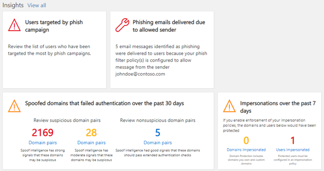

# Panel de seguridad

[!INCLUDE [Microsoft 365 Defender rebranding](../includes/microsoft-defender-for-office.md)]

## Funciones básicas y cómo abrir el panel de seguridad

El [centro de seguridad & cumplimiento](../../compliance/go-to-the-securitycompliance-center.md) permite que su organización administre el cumplimiento y la protección de datos. Suponiendo que tiene los permisos necesarios, el panel de seguridad le permite revisar el estado de la protección contra amenazas, así como ver y actuar en alertas de seguridad.

Vea el vídeo para obtener información general y lea este artículo para obtener más información.

> [!VIDEO https://www.microsoft.com/videoplayer/embed/RE1VV3o]

Dependiendo de lo que incluya la suscripción de su organización, el panel de seguridad incluye varios widgets, como Resumen de administración de amenazas, estado de la protección contra amenazas, detecciones de amenazas semanales globales, malware y más, tal y como se describe en las secciones siguientes.

Para ver el panel de seguridad, en el [centro de seguridad & cumplimiento](../../compliance/go-to-the-securitycompliance-center.md), vaya a panel de **Administración de amenazas** \> **Dashboard**.

> [!NOTE]
> Debe ser un administrador global, un administrador de seguridad o un lector de seguridad para ver el panel de seguridad. Algunos widgets requieren permisos adicionales para ver. Para obtener más información, consulte [permisos en el centro de seguridad & cumplimiento](permissions-in-the-security-and-compliance-center.md).

## Resumen de administración de amenazas

El widget de Resumen de administración de amenazas le indica de un vistazo cómo su organización estuvo protegida contra amenazas durante los últimos siete (7) días.

La información que verá en el Resumen de administración de amenazas depende de lo que incluya la suscripción. En la tabla siguiente se describe la información que se incluye para Office 365 E3 y Office 365 E5.

|Office 365 E3|Office 365 E5|
|---|---|
|Mensajes de malware bloqueados Mensajes de suplantación bloqueados Mensajes notificados por los usuarios    |Mensajes de malware bloqueados Mensajes de suplantación bloqueados Mensajes notificados por los usuarios Malware de cero días bloqueado Mensajes de suplantación de identidad avanzada detectados URL malintencionadas bloqueadas|

Para ver o acceder al widget de Resumen de administración de amenazas, debe tener permisos para ver los informes de defender para Office 365. Para obtener más información, vea [¿Qué permisos se necesitan para ver los informes de defender para Office 365?](view-reports-for-atp.md#what-permissions-are-needed-to-view-the-defender-for-office-365-reports).

## Estado de la protección contra amenazas

El widget de estado de protección contra amenazas muestra la efectividad de la protección contra amenazas con una vista de tendencias y detalles de phish y malware.

Los detalles dependen de si su suscripción a Microsoft 365 incluye [Exchange Online Protection](exchange-online-protection-overview.md) (EOP) con o sin [Microsoft Defender para Office 365](office-365-atp.md).

|Si su suscripción incluye...|Verá estos detalles|
|---|---|
|EOP pero no Microsoft defender para Office 365|Correo electrónico malintencionado detectado y bloqueado por EOP.   Consulte [Informe de estado de protección contra amenazas (EOP)](view-email-security-reports.md#threat-protection-status-report).|
|Microsoft defender para Office 365|Contenido malintencionado y correo electrónico malintencionado detectados y bloqueados por EOP y defender para Office 365  Recuento agregado de mensajes de correo electrónico únicos con contenido malintencionado bloqueado por las características motor antimalware, [purga automática de cero horas](zero-hour-auto-purge.md)y defender para Office 365 (incluidos [vínculos seguros](atp-safe-links.md), [datos adjuntos seguros](atp-safe-attachments.md)y [anti-phishing en defender para Office 365](set-up-anti-phishing-policies.md#exclusive-settings-in-anti-phishing-policies-in-microsoft-defender-for-office-365)).  Consulte [Informe de estado de protección contra amenazas](view-reports-for-atp.md#threat-protection-status-report).|

Para ver o acceder al widget de estado de protección contra amenazas, debe tener permisos para ver los informes de defender para Office 365. Para obtener más información, vea [¿Qué permisos se necesitan para ver los informes de defender para Office 365?](view-reports-for-atp.md#what-permissions-are-needed-to-view-the-defender-for-office-365-reports)

## Detecciones de amenazas semanales globales

El widget global Week Threat DETECTIONS muestra el número de amenazas que se detectaron en los mensajes de correo electrónico en los últimos siete (7) días.

Las métricas se calculan como se describe en la siguiente tabla:

|Métrica|Cómo se calcula|
|---|---|
|Mensajes examinados|Número de mensajes de correo electrónico examinados multiplicado por el número de destinatarios|
|Amenazas detenidas|Número de mensajes de correo electrónico identificados como que contienen malware multiplicado por el número de destinatarios|
|Bloqueado por [defender para Office 365 ](office-365-atp.md)|Número de mensajes de correo electrónico bloqueados por defender para Office 365 multiplicados por el número de destinatarios|
|Eliminado tras la entrega|Número de mensajes eliminados por [purga automática de cero horas](zero-hour-auto-purge.md) multiplicado por el número de destinatarios|

## Malware

Los widgets de malware muestran detalles sobre las tendencias de malware y los tipos de familia de malware en los últimos siete (7) días.

## Información

Información no solo aspectos clave de la superficie que debe revisar también incluyen recomendaciones y acciones a tener en cuenta.

Por ejemplo, es posible que vea que se están entregando mensajes de correo electrónico de suplantación de identidad porque algunos usuarios han deshabilitado las opciones de correo no deseado. Para obtener más información sobre cómo funcionan las perspectivas, consulte [informes y información en el centro de seguridad & cumplimiento](reports-and-insights-in-security-and-compliance.md).

## Investigación y respuesta de amenazas

Si la suscripción de su organización incluye  [Microsoft defender para Office 365 plan 2](office-365-ti.md), el panel de seguridad tiene una sección que incluye herramientas avanzadas de investigación y respuesta de amenazas. Estas herramientas incluyen [capacidades automatizadas de investigación y respuesta](automated-investigation-response-office.md). La investigación y la respuesta automatizadas pueden ser útiles en escenarios como el [direccionamiento rápido de cuentas de usuario en peligro](address-compromised-users-quickly.md).

Para obtener más información, vea Introducción al [uso de investigación y respuesta automatizadas (Air) en Office 365](office-365-air.md).

## Tendencias

Cerca de la parte inferior del panel de seguridad hay una sección **tendencias** que resume las tendencias del flujo de correo electrónico para su organización. Los informes proporcionan información sobre el correo electrónico clasificado como correo no deseado, malware, intentos de phishing y buen correo electrónico. Haga clic en un icono para ver información más detallada en el informe.

Además, si la suscripción de su organización incluye [defender para Office 365 plan 2](office-365-ti.md), también tendrá un informe de **alertas de administración de amenazas reciente** en esta sección que permite al equipo de seguridad ver y realizar acciones en alertas de seguridad de alta prioridad.

Para ver o tener acceso al widget de correo electrónico enviado y recibido, debe tener permisos para ver los informes de defender para Office 365. Para obtener más información, vea [¿Qué permisos se necesitan para ver los informes de defender para Office 365?](view-reports-for-atp.md#what-permissions-are-needed-to-view-the-defender-for-office-365-reports).

Para ver o acceder al widget de alertas de administración de amenazas reciente, debe tener permisos para ver las alertas. Para obtener más información, consulte [permisos de RBAC necesarios para ver las alertas](../../compliance/alert-policies.md#rbac-permissions-required-to-view-alerts).

## Temas relacionados

[Ver informes de seguridad de correo electrónico en el Centro de seguridad y cumplimiento](view-email-security-reports.md)

[Ver informes de Microsoft defender para Office 365](view-reports-for-atp.md)

[Microsoft Defender para Office 365](office-365-atp.md)

[Respuesta y investigación de amenazas de Office 365](office-365-ti.md)
