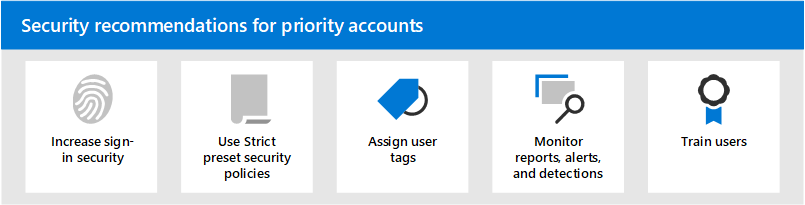

# Recomendaciones de seguridad para cuentas prioritarias en Microsoft 365

¿Qué haría si recibe un mensaje urgente de un ejecutivo en su organización que le pide que haga algo? ¿Lo haría? La mayoría de las personas cumpliría con la solicitud.

Para los atacantes, los ataques de suplantación de identidad ordinarios que convierten una red aleatoria para obtener las credenciales de los usuarios aleatorios o desconocidos son ineficientes. Por otra parte, los ataques de _"Spear phishing" o "_ _Whaling_ " destinados a usuarios en puestos de energía o de autoridad son mucho más gratificantes para los atacantes. Si estas cuentas de prioridad están en peligro, el atacante puede obtener acceso a cuentas con capacidades de administración, financieras, de producto o incluso de acceso físico dentro de la organización.

Microsoft 365 y Microsoft defender para Office 365 contienen muchas características diferentes que pueden ayudarle a proporcionar niveles adicionales de seguridad para sus cuentas prioritarias. Las características disponibles y cómo usarlas se describen en este artículo.

## Aumentar la seguridad de inicio de sesión para cuentas prioritarias

Las cuentas prioritarias requieren una mayor seguridad de inicio de sesión. Puede aumentar la seguridad de inicio de sesión requiriendo la autenticación multifactor (MFA) y deshabilitar los protocolos de autenticación heredados.

Para obtener instrucciones, consulte el [paso 1. Aumentar la seguridad de inicio de sesión para los trabajadores remotos con MFA](https://docs.microsoft.com/microsoft-365/solutions/empower-people-to-work-remotely-secure-sign-in). Aunque este artículo se refiere a los trabajadores remotos, los mismos conceptos se aplican a los usuarios con prioridad.

**Notas**:

- La autenticación básica está en desuso en Exchange Online para los servicios web Exchange (EWS), Exchange ActiveSync, POP3, IMAP4 y PowerShell remoto. Para obtener más información, vea esta [entrada de blog](https://developer.microsoft.com/office/blogs/deferred-end-of-support-date-for-basic-authentication-in-exchange-online/).

- Puede usar [directivas de autenticación](https://docs.microsoft.com/exchange/clients-and-mobile-in-exchange-online/disable-basic-authentication-in-exchange-online) y [reglas de acceso de cliente](https://docs.microsoft.com/exchange/clients-and-mobile-in-exchange-online/client-access-rules/client-access-rules) en Exchange Online para bloquear la autenticación básica y los protocolos de autenticación heredados, como POP3, IMAP4 y SMTP autenticado.

- Puede deshabilitar el acceso POP3 e IMAP4 en buzones individuales. Puede deshabilitar SMTP autenticado en el nivel de organización y habilitarlo en buzones específicos que aún lo necesiten. Para obtener instrucciones, consulte los temas siguientes:
  - [Habilitar o deshabilitar el acceso a POP3 o IMAP4 para un usuario](https://docs.microsoft.com/exchange/clients-and-mobile-in-exchange-online/pop3-and-imap4/enable-or-disable-pop3-or-imap4-access)
  - [Habilitar o deshabilitar el envío SMTP de cliente autenticado (autenticación SMTP)](https://docs.microsoft.com/exchange/clients-and-mobile-in-exchange-online/authenticated-client-smtp-submission)

## Usar directivas estrictas de seguridad preestablecidas para cuentas prioritarias

Los usuarios con prioridad requieren acciones más rigurosas para las distintas protecciones que están disponibles en Exchange Online Protection (EOP) y defender para Office 365.

Por ejemplo, en lugar de entregar mensajes que se han clasificado como correo no deseado en la carpeta de correo electrónico no deseado, debe poner en cuarentena los mismos mensajes si están destinados a cuentas prioritarias.

Puede implementar este enfoque riguroso para las cuentas prioritarias mediante el uso del perfil estricto en las directivas de seguridad preestablecidas.

Las directivas de seguridad preestablecidas son una ubicación central y cómoda para aplicar nuestra configuración de directivas estricta recomendada para todas las protecciones de EOP y defender para Office 365. Para obtener más información, vea [directivas de seguridad preestablecidas en EOP y Microsoft defender para Office 365](preset-security-policies.md).

Para obtener información detallada sobre cómo difieren las opciones de configuración estrictas de la configuración de directiva predeterminada y estándar, vea [configuración recomendada para EOP y Microsoft defender para Office 365 Security](recommended-settings-for-eop-and-office365-atp.md).

## Aplicar etiquetas de usuario a cuentas de prioridad

Las etiquetas de usuario de Microsoft defender para Office 365 plan 2 (como parte de Microsoft 365 E5 o una suscripción de complemento) son una forma de identificar y clasificar rápidamente usuarios o grupos de usuarios en informes e investigaciones de incidentes.

**Cuentas de prioridad** es un tipo de etiqueta de usuario integrada (conocida como una _etiqueta de sistema_) que puede usar para identificar incidentes y alertas que impliquen cuentas prioritarias. Para obtener más información acerca de **las cuentas prioritarias**, consulte [Manage and monitor Priority accounts](https://docs.microsoft.com/microsoft-365/admin/setup/priority-accounts).

También puede crear etiquetas personalizadas para identificar y clasificar las cuentas prioritarias. Para obtener más información, vea [etiquetas de usuario](user-tags.md). Tenga en cuenta que puede administrar **cuentas de prioridad** (etiquetas del sistema) en la misma interfaz que las etiquetas de usuario personalizadas.

## Supervisión de cuentas prioritarias en alertas, informes y detecciones

Después de proteger y etiquetar a los usuarios con prioridad, puede usar los informes, alertas e investigaciones disponibles en EOP y defender para Office 365 para identificar rápidamente los incidentes o las detecciones que implican cuentas prioritarias. En la tabla siguiente se describen las características que admiten las etiquetas de usuario.

 

****

|Característica|Descripción|
|---|---|
|Alertas|Las etiquetas de usuario de los usuarios afectados son visibles y están disponibles como filtros en la página **Ver alertas** del centro de seguridad & cumplimiento. Para obtener más información, consulte [Ver alertas](https://docs.microsoft.com/microsoft-365/compliance/alert-policies#viewing-alerts).|
|Explorador de amenazas 
 Detecciones en tiempo real|En el **Explorador de amenazas** (Microsoft defender para Office 365 plan 2) o en detección en **tiempo real** (microsoft defender para Office 365 plan 1), las etiquetas de usuario están visibles en la vista de cuadrícula del correo electrónico y en el control flotante de detalles del correo electrónico. Las etiquetas de usuario también están disponibles como una propiedad que se puede filtrar. Para obtener más información, consulte  [Tags en el explorador de amenazas](threat-explorer.md#tags-in-threat-explorer).|
|Vistas de campañas|Las etiquetas de usuario son una de las muchas propiedades que se pueden filtrar en las vistas de campañas de Microsoft defender para Office 365 plan 2. Para obtener más información, consulte [vistas de campañas](campaigns.md).|
|Informe de estado de protección contra amenazas|En virtualmente todas las vistas y tablas de detalle en el **Informe de estado de protección contra amenazas**, puede filtrar los resultados por **cuentas de prioridad**. Para obtener más información, consulte [Informe de estado de protección contra amenazas](view-email-security-reports.md#threat-protection-status-report).|
|Informe de problemas de correo electrónico para cuentas prioritarias|El informe **problemas de correo electrónico para cuentas prioritarias** del centro de administración de Exchange (EAC) contiene información sobre mensajes no entregados y retrasados para **las cuentas prioritarias**. Para obtener más información, vea [problemas de correo electrónico para el informe de cuentas prioritarias](https://docs.microsoft.com/exchange/monitoring/mail-flow-reports/mfr-email-issues-for-priority-accounts-report).|
|

## Consulte también

[Anuncio de la protección de cuentas prioritarias en Microsoft defender para Office 365](https://techcommunity.microsoft.com/t5/microsoft-defender-for-office/announcing-priority-account-protection-in-microsoft-defender-for/ba-p/1696385)
